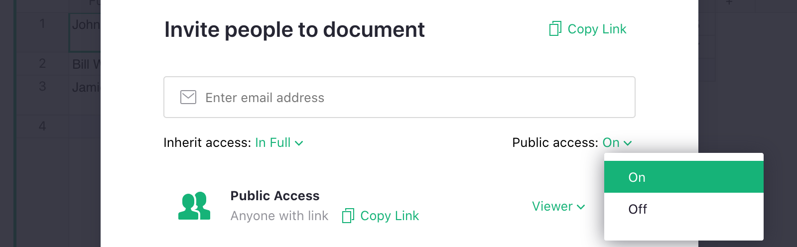

FAQ
=========

Why do I have multiple sites?
-------------------------------

All Grist accounts have access to a free personal account. The site name of the personal account begins with @ and is always located at [docs.getgrist.com](https://docs.getgrist.com/). This account may have up to 10 documents. Each one of those documents may be shared with up to two collaborators for free. Learn more about free plans on our [pricing page](https://www.getgrist.com/pricing/).

Documents shared with you will be saved in your personal site and do not count against the 10 document limit.

You may navigate between your personal site and [team sites](teams.md) by clicking in the top-left corner to open a drop-down menu of sites to which you have access.

**
{: .screenshot-half }

What does Team (+2 Per Doc) mean? 
-------------------------------

Team members all have access to a [team site](teams.md), which is located at a url with a custom subdomain, such as your-company.getgrist.com. The team plan costs $8/month/team member. Team site owners may open the [Billing Account](teams.md#billing-account) page to management payment and edit plan managers.

By default, documents within a team site may be accessed by all team members. This default can be modified to only share certain [documents](team-sharing.md) or certain [workspaces](workspaces.md) with specific team members. 

At the document level, you may choose to [share a document](sharing.md) with up to 2 outside collaborators (non-team members) at no additional cost.

For example, say Wiley Co. has a team site with 5 team members. They pay $40 per month to collaborate in Grist on an unlimited number of documents.

Wiley Co. sometimes works with a contractor on a project, a company called Roadrunner. Wiley Co. shares one of their documents with 2 Roadrunner employees at no additional cost. Those two document-level shares are considered outside collaborators, or guests.

Wiley Co. sometimes works with a second contractor, a company called ACME. Wiley Co. shares one of their documents with 2 ACME employees at no additional cost. Wiley Co. has four outside collaborators, or guests, but since there are at most 2 per document, there is no additional cost.

## Can I only share Grist documents with my team members?

There are many ways to share Grist data with non-team members. 

1. **Outside collaborators.** Each document may be shared with 2 outside collaborators (non-team members) at no additional cost.
2. **Link Sharing.** In share settings, there is an option to turn on [public access](sharing.md#public-access). The public access role can be set to viewer or editor. Anyone with a link can view (or edit) your data. Those views would not count towards your plan's user count. The document is visible to anyone with the link, however, so use caution when working with sensitive data.

**

3. *Restricted View-only link sharing.* With view-only link sharing, there is a way to further restrict what people can see by using Grist's access rules to set specific URL parameters that determine which tables, columns, or rows are shown when a specific link is shared. Learn more about Link Keys in our help center. (https://support.getgrist.com/access-rules/#link-keys) 
2. *View-only Embed.* Grist pages (https://support.getgrist.com/page-widgets/#pages) can be embedded into websites in an iframe. Learn how to embed a Grist page. (https://support.getgrist.com/embedding/)

Can I move documents from one site to another?

Yes! Follow these steps to move documents between sites.

1. Click on the share icon, then duplicate document. 
2. Select the site (organization) to which you want to transfer the document.

This will create a copy, so you'll still have the original document in your originals site. You can always delete it.

Learn more about copying documents. (https://support.getgrist.com/copying-docs/)

Can I add multiple teams to the same Grist account? 

Yes!

1. *New team site.* If you’re looking to create a new team site that does not exist, open the user menu by clicking on the profile icon in the top-right of Grist. Click on “Upgrade Plan.”
2. *Adding account to team site.* You may own or be a member of multiple teams. If you have multiple Grist login accounts, you may also add your second account as a team member. While in the team site you own, open the user menu and click on Manager Users. 

*Did you know?* You can add multiple accounts to Grist. Open the user menu and click on “Add Account.” You can now easily switch between all your accounts, and all your teams, from the user menu.

Can I add multiple login accounts to Grist?

Yes! To add multiple account to Grist, open the user menu by clicking on the profile icon in the top-right of Grist, then click on “Add Account.” 

You can now easily switch between all your accounts, and all your teams, from the user menu.

How can I add a second owner or transfer ownership of my team site?

*Add a second owner*

1. Open the team site to which you want add a second owner.
2. Click "Manage Users" under the user menu by clicking on the profile icon in the top-right of Grist. 
3. Add the new account as Owner, and click Confirm. 
4. You may also wish to go to “Billing Account” (also under the user menu) and add the new owner as a Billing Manager.
    

*Transfer ownership*

1. Open the team site you wish to transfer.
2. Click “Manage Users” under the user menu. 
3. Add the new account as Owner, and click Confirm. 
4. Go to “Billing Account” (also under the user menu) and add the new Owner as a Billing Manager.
5. The new Owner should log in, open the team site, and visit “Manage Users” and “Billing Account” pages again to remove the original owner. This will essentially transfer the ownership of the team site to the new account.

It is not possible to add a second owner to, or transfer ownership of, a personal account.

*Did you know?* If you’re transferring team site ownership between two Grist accounts that you own, you can more easily transfer ownership by adding multiple accounts to Grist. To add multiple accounts, open the user menu and click on “Add Account.” You can now easily switch between all your accounts, and all your teams, from the user menu. Follow the steps above to transfer ownership from one account to the other.

How can I change the email address I use for Grist?

It is not possible to change your Grist email. 

It is possible to manage multiple accounts in Grist. To add another account, open the user menu by clicking on the profile icon in the top-right of Grist, then click on “Add Account.” 

You can now easily switch between all your accounts, and all your teams, from the user menu.

How can I edit my team’s subdomain and site name?

You may edit your site name and subdomain from the billing page. Open the user menu by clicking on the profile icon in the top-right of Grist, then click on “Billing Account.”

[Image: edit subdomain and team name.png]

How many rows can I have?

As a rule of thumb, Grist works best for documents under 100,000 rows. The actual limit depends also on the number of tables, columns, and the average size of data in each cell. One way to estimate it is to measure the size of the data when it is in CSV format: the limit is around 20MB in this format. For example, a document with 200,000 rows and 12 numeric columns would reach that.

Attachments are counted separately. Attachments plus data in a single document are limited to 1GB.

Learn more about limits. (https://support.getgrist.com/limits/)

Can I embed Grist into my website?

Yes, it is possible to embed Grist pages (https://support.getgrist.com/page-widgets/#pages) as view-only data in a website in an iframe. 

<iframe src="https://templates.getgrist.com/6D8E2h2DQNwS/Task-Management/p/6?embed=true></iframe>

Replace the url written in red in the code above with the URL of the Grist page you wish to embed. Be sure to include ?embed=true at the end of the url.

Learn more about embedding Grist. (https://support.getgrist.com/embedding/)

Can I use Grist as the backend of my website or app?

Using Grist as a backend solution directly to a website or web app is not yet supported. We don't yet have an authentication method for this use case. The API key method isn't generally appropriate for web use, because the key would end up accessible to any viewer of the webpage, which is usually undesirable. We are interested in supporting this in the future and welcome ideas and feedback in our community forum (https://community.getgrist.com/).

Can I create apps using Grist, then sell those apps to customers?

White labeling is not yet supported in Grist. We are interested in supporting white labeling, and welcome ideas and feedback in our community forum (https://community.getgrist.com/).

Does Grist accept non-English characters?

Non-English characters are supported in column labels, but not column ids, which are the column’s Python name used in formulas. When importing a file into Grist, non-English characters xxx

To edit column labels and ids separately, open the creator panel and select the column menu. Click the link icon that joins label to id to enable column id editing. While non-English characters are not supported, it is possible to edit the ids into something more clear and friendly to use in formulas. 
[Image: label v id.png]