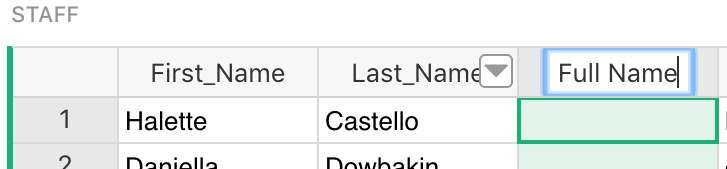
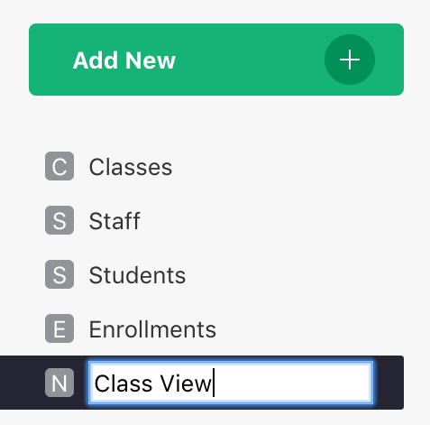

# How to manage business data {: data-toc-label='Intro' }

Grist shines when your business data has some complexity. In this example, we’ll look at an
organization that runs after-school activities for children.

Feel free to refer to the [Class Enrollment](https://templates.getgrist.com/doc/afterschool-program) document, found on our [Examples & Templates](https://public.getgrist.com/p/templates) page.

In this exercise we will show how to go about planning, designing, and creating such document.

## Planning

A little planning ahead will help you get a solution faster. Think about what kinds of data you
are working with, and what kinds of workflows you will need. You don't need to anticipate
everything when you start. You can easily add complexity later, as you'll see below.

Our organization runs a number of classes for children. Each class has an instructor and multiple
students. Students may enroll in multiple classes, and may return year after year. For each class,
we'll want to see the list of enrolled students, and if there are spots available. When a parent
calls, we want a convenient way to enroll a new student, or to change or cancel a student's
enrollment.

If this sounds like building an application, that's exactly what we are doing. As you'll see,
however, it is no harder than building a spreadsheet.

## Data Modeling

The better you model your business data, the easier your work will be. In a way, you are doing
database design as well as building a custom application. Grist just makes it easier.

Let's start with the classes and their instructors.

We need a list of classes and instructors. The same instructor can teach different classes, so
instructors and classes will live in different tables. Let’s call them "Classes" and "Staff". Each
class has a single instructor, so one of the properties of a class will be that class’s
instructor.

## Classes and Instructors

When starting from scratch, you'll create a new empty document (see [Creating a
document](creating-doc.md)), rename the initial empty table "Table1" to "Classes", add the columns
you need, and type in some classes. To follow the steps of this tutorial, you can instead import
[Classes.csv](/afterschool-program/Classes.csv){: data-wm-adjusted=1 }
(or simply refer to the "Afterschool Program" example document).

For the Staff table, click the "Add New" button and select "Add Empty Table". Rename it to
"Staff", create some columns, and enter some data about instructors. Or import
[Staff.csv](/afterschool-program/Staff.csv) to use sample data and save a few steps.

We want the *Instructor* column in the `Classes` table to be a reference to the `Staff` table.
Currently, the `Staff` table doesn't have any column that uniquely identifies each record. For
setting up references, it's a good idea to add one. In this case, we'll add a "Full Name" column
to the `Staff` table.

## Formulas

Click on the "Staff" page, and add a "Full Name" column using the column menu or the
<code class="keys">*Alt* + **=**</code> shortcut, and type "Full Name" in the new column's
header.

**
{: .screenshot-half }

Create a formula by typing in a value into any cell in the new column, starting with the equal
sign (“=”). Enter the formula as `$Last_Name + ", " + $First_Name`{: .formula }. You may use Excel-like syntax
to the same effect: `CONCAT($Last_Name, ", ", $First_Name)`{: .formula }.

**
{: .screenshot-half }

  - In Grist, a formula always applies to every record in the table.
  - Grist supports Python in formulas, and most Excel functions, which have uppercase names.

Because formulas apply to every row, you should see the *Full Name* column automatically filled.

## References

Click on the "Classes" page again, and open “Column Options” for the *Instructor* column. We'll
turn it into a reference to `Staff`.

In the right-side panel, set the column type to “Reference” (in database terms, this is known as a
“foreign key”), and set the referenced table to “Staff”. For the "SHOW COLUMN" dropdown, select
"Full Name", which is the new column we just added.

**
{: .screenshot-half }

Click the "Apply" button to complete this change of the column's type (if the column is empty,
there is no confirmation step).

You can now assign an instructor to any class. Click on a cell in the *Instructor* column. You
can hit <code class="keys">*Enter*</code> and choose from among the available
instructors in the `Staff` table, or start typing to use auto-complete.

**
{: .screenshot-half }

Next, we will continue with students and their enrollments.

## Students

Each class has a number of students. So, we’ll need a table of students. Again, add a new empty
table, rename it to "Students", and fill it with the students’ names, grade levels, etc. Or
import [Students.csv](/afterschool-program/Students.csv) to use sample data and save a few steps.

Let's add here a "Full Name" formula column, just like in the `Staff` table. It will come in handy.

**
{: .screenshot-half }

## Many-to-Many Relationships

A student can take more than one class. Let's remember also that there are classes in the past and in the
future, and keeping this historical data is valuable. So, for each student, there may be multiple
classes, and in each class, there are multiple students.

A good way to model such a relation is by adding the concept of an “enrollment” and a new
`Enrollments` table. An “enrollment” represents one student being enrolled in one class. It has some
useful properties of its own: the enrollment status (Confirmed, Waitlisted, or Cancelled), whether
they have paid for the class, and perhaps more.

In database design, this is known as a “many-to-many” relationship. The extra table is known as a
“join” table. Essentially, it adds a record for each student-class connection, and turns the
“many-to-many” relationship into two “one-to-many” relationships.

This relationship:

**
{: .screenshot-half }

becomes this:

**
{: .screenshot-half }

So, let’s add a new table, name it "Enrollments", and add the columns we need. Here too, to follow
along, you may import sample data from [Enrollments.csv](/afterschool-program/Enrollments.csv).

In Column Options for the column *Student*, set the Column Type to "Reference", set the referenced table to `Students`, and select "Full Name" as the column to show.

**
{: .screenshot-half }

For the column *Class*, set the Column Type to "Reference", the referenced table to `Classes`, and
select "Class Code" as the column to show.

**
{: .screenshot-half }

It's possible to enter enrollment data by adding records to this table and using auto-complete in
the *Student* and *Class* column. Below, we will set up a much more convenient way to enroll
students.

## Class View

One of our goals in the Planning stage was to see a list of enrolled students for each class.
Now that the data tables are in place, we can create a page that does this.

Click "Add New", then "Add Page" to open the widget picker. Select to show a table of `Classes`,
and click "Add Page".

**
{: .screenshot-half }

The new page shows a list of classes. Let's rename this page "Class View".

**
{: .screenshot-half }

Next, add the `Enrollments` table linked to the table of classes. Click "Add New"
again, then "Add Widget to Page". In the widget picker, select to show a table of `Enrollments`.
For "SELECT BY", choose "CLASSES", and click "Add to Page".

**
{: .screenshot-half }

We get two tables side-by-side. Selecting a class shows all enrollments in that class, each of
which references a particular student and includes some other enrollment info.

We can go a step further to make this view convenient for us. Let's add a Class card to this view.
Click "Add New" and "Add Widget to Page". In the widget picker, select widget "Card" for the
`Classes` data. For "SELECT BY", choose "CLASSES" again, and click "Add to Page".

**
{: .screenshot-half }

We can similarly add a card for the instructor leading this class. Again, click "Add New" > "Add
Widget to Page", and select "Card" for the `Staff` data. For "SELECT BY", you can now pick
"CLASSES • Instructor".

**
{: .screenshot-half }

You can change the look of the new cards. Click the three-dot menu on the top right of the Card
you'd like to change, and choose "Widget options". Find the "Theme" dropdown in the right panel,
and select "Compact".

Here is what we now have in Class View page:

It's a good time to clean up this page by hiding columns and fields that are duplicated or
distracting. Check out [Configuring field lists](page-widgets.md#configuring-field-lists) for an
efficient way to select which fields to show, and [Custom Layouts](custom-layouts.md) for
rearranging widgets on the page.

## Enrollment View

Our other stated goal was a convenient way to enroll a student, and to see or adjust a given
student's enrollments.

Let's add a page for this. Click "Add New" > "Add Page", and select a table of `Students`. We'll
rename the new page to "Enrollment View".

When we select a student here, we'd like to see all enrollments for this student. So click "Add
New" > "Add Widget to Page", and add a table of `Enrollments`. To link the new widget to the
Students widget in the page, set the "SELECT BY" dropdown to "STUDENTS", and click "Add to Page".

**
{: .screenshot-half }

Now you can click on a student’s name on the left and see the classes that student is enrolled in
on the right. You can enroll the selected student into a class by simply entering a class code
in the special blank row at the bottom of the enrollments list. As usual, the *Class* reference
column offers auto-complete.

You can hide the "Student" column in "ENROLLMENTS" table, since it will always show the selected
student anyway.

If you'd like to include more info about the classes in the Enrollments table, select Column
Options for the *Class* column, and click "+ Add Column" in the side panel.

**
{: .screenshot-half }

Any of the fields associated with a class are available. If you examine the columns you add this
way, you'll see that they are simply formulas of the form `$Class.Times`{: .formula }.

## Adding Layers

If you are working with children, you are talking to their parents. You’ll need to have the
parents’ names and contact info, which you can add as columns to the students table.

You’re likely to find that some parents have multiple children that enroll in classes together.
Recognizing the parent-child relationship in your database may seem like a complex step, but it
will likely simplify your daily workflow.

So, let’s add one more table: `Families`. We’ll include the parent name and contact info, and link
each child to a record here. You can import sample data from
[Families.csv](/afterschool-program/Families.csv).

Note that we added a *Full Name* column here as for other tables that list people.

In the Students table, we’ll add a column named "Family", and make it a Reference to `Families`.

The example data already has families filled in, and conversion to reference looks up the text to
set correct references. If you were entering new data, you could link students to families using
auto-complete as with other reference columms.

Let’s change our “Enrollment View” to list families first. This way, when a parent calls, you can
pick the right record and see all of their children and enrollments for each child.

In the “Enrollment View” page, click “Add New” > "Add Widget to Page". Select to show a table of
`Families`.

**
{: .screenshot-half }

Rearrange the widgets to have Families on the left, and Students and Enrollments to the right of
it.

Now link students to Families: click the three-dot menu on the top right of the STUDENTS table,
and choose "Data Selection".

**
{: .screenshot-half }

In the side panel, you can set “SELECT BY” widget to "FAMILIES".

**
{: .screenshot-half }

Finally, you can add Card widgets for details of the selected family, and of the selected student,
and rearrange the widgets on the page to create a layout that’s perfect for talking to a parent.

You select a parent, see their children, and then select a child to see their enrollments. It’s
easy to add an enrollment record for a new class, or to change a record (e.g. mark it as
“cancelled”), to add another child, or to add a new family.

## Example Document

The “Afterschool Program” example includes everything described above and a bit more.

In particular, it adds a *Count* field to Classes to calculate the number of enrolled students, and a *Spots Left* field to show the number of spots remaining, by comparing *Count* to *Max_Students*:

  - The formula for *Count* is `len(Enrollments.lookupRecords(Class=$id, Status="Confirmed"))`{: .formula }.
  - The formula for *Spots Left* is `max($Max_Students - $Count, 0) or "Full"`{: .formula}.

**
{: .screenshot-half }

These make for a more useful Class View page, where it's now easy to see at a glance which classes
have spots remaining.
