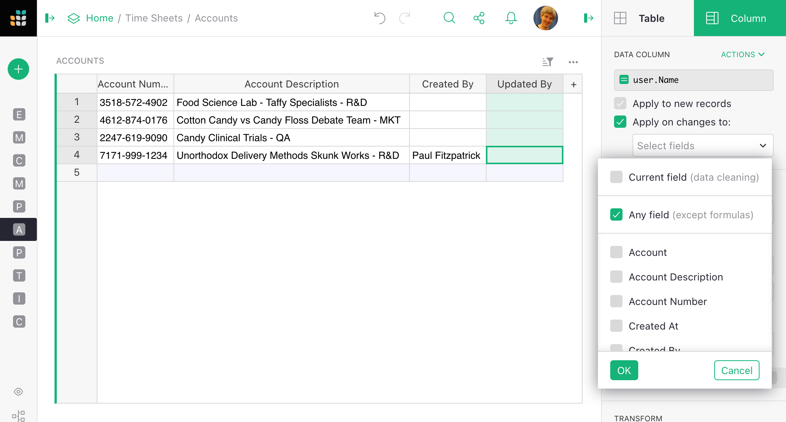

Authorship columns
===================

Sometimes it is useful to have columns that record who created individual records, and
who last updated them.  Grist lets you create such columns easily.  It also automatically
tracks document changes in the Activity tab of Document History, but nevertheless it is
convenient to have that information in tabular form available to formulas and filters,
and authorship columns let you do that.

## A "Created By" column

Suppose we want to fill a column automatically with the name of the creator
of each record as they are added.  As a first step, add a column called 
(for example) `Created By`.  In the column options in the side panel
(see [Columns](col-types.md) for a refresher), click
`Set trigger formula` action.

Set `user.Name`{: .formula} as the column's formula.  There are other possibilities,
such as  `user.Email`{: .formula}, a unique `user.UserID`{: .formula}, and so on.  The
user information available is the same as that in [Access rule conditions](access-rules.md#access-rule-conditions).
Time information is available as well (see [Timestamp columns](timestamps.md)).
But let's stick with `user.Name`{: .formula} for now.

Now, to set the column whenever a record is created, make sure that `Apply to new records`
option is checked. And that's it!  Now whenever a record is created, the `Created At`
column will be set to the name of the user creating it:

## An "Updated By" column

If we want a column that stores who last edited a record (as opposed to its creator),
the procedure is similar to that for [a "Created By" column](authorship.md#a-created-by-column),
but instead of `Apply to new records`,
select `Apply on record changes`.  Then select `Any field` (assuming you want any
change in a record to count as an update) and press `OK`.  You can alternatively
pick and choose which columns, when updated, will trigger the formula.

Here is an example the the new column at work - when `Cotton Candy v Candy Floss`
is updated,a user name appears for that record:

!!! note "It is still possible for a user to manually edit cells in the `Created By` and `Updated By` columns. If you don't want that to be allowed, use [access rules](access-rules.md) to forbid it."

