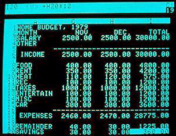
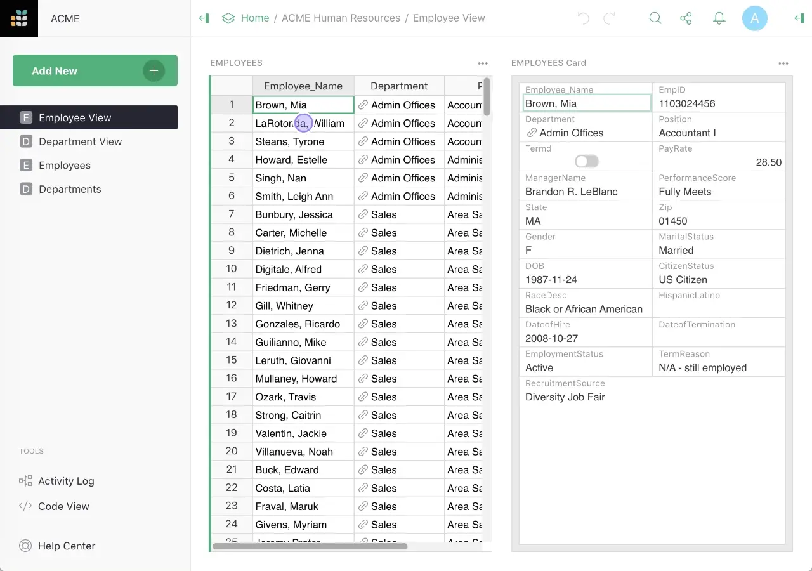
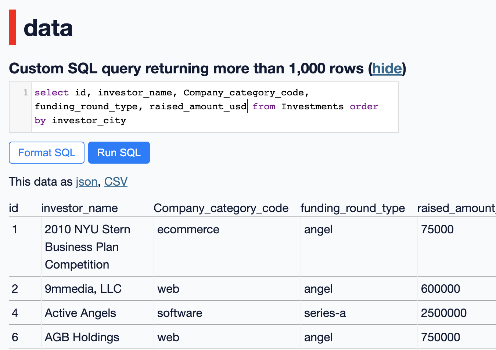
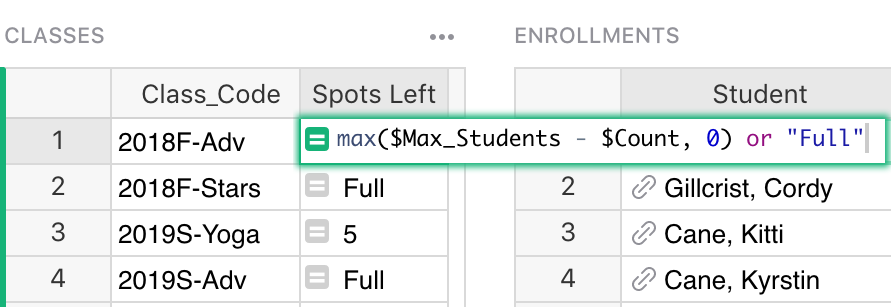
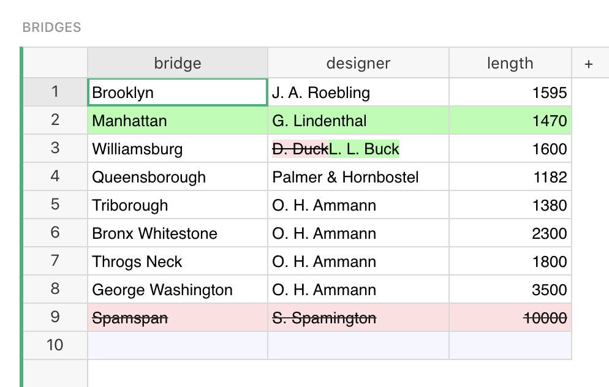
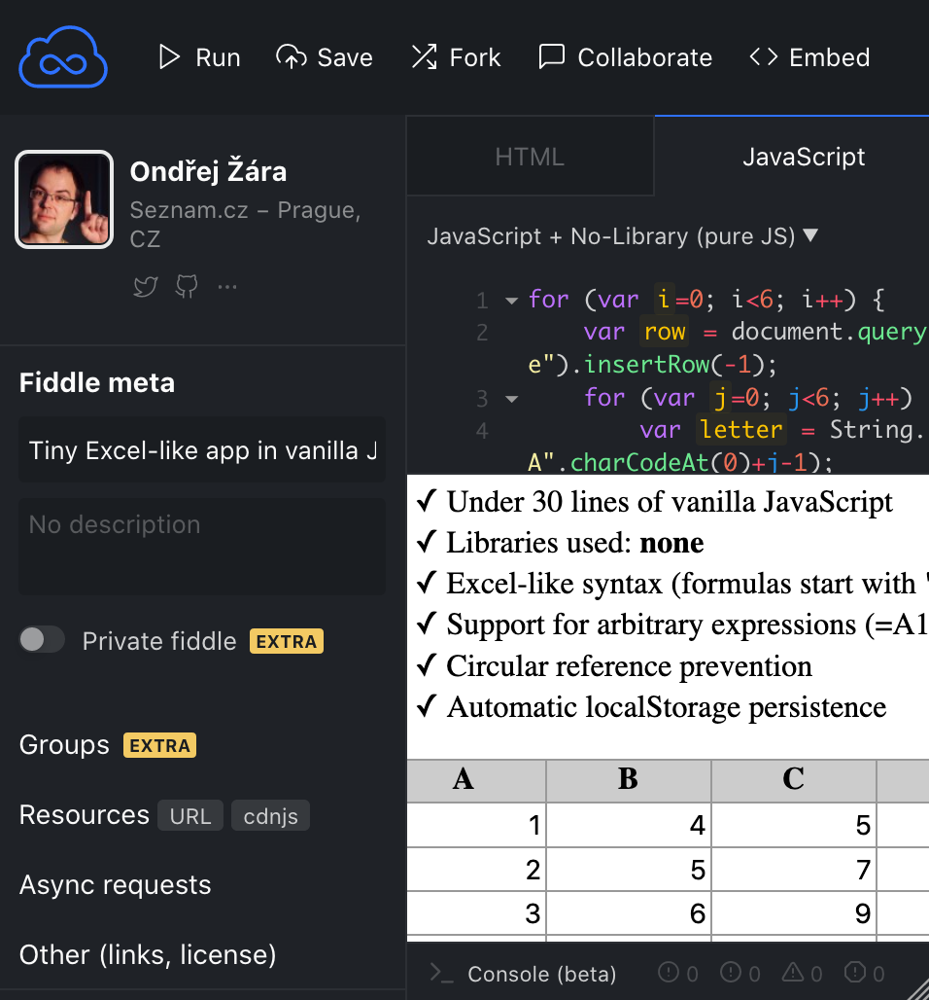
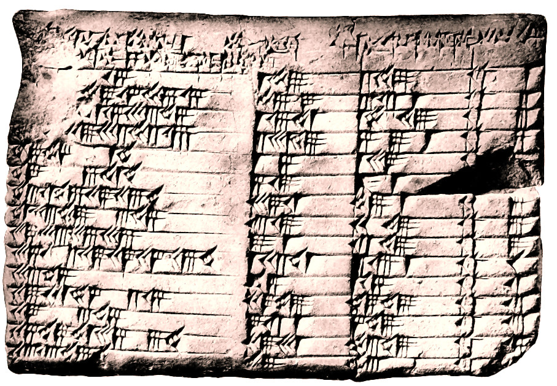

# Grist, a hacker friendly spreadsheet

Spreadsheets attract people with a hacker mindset, since they reward a
little technical curiosity with a big jump in capability. Despite
that, while there are some open source spreadsheet projects, most of
the action is closed source (Excel, Airtable, Honeycode, etc). Grist is a solid,
modern, powerful spreadsheet that fits well into the open-source
ecology, and is as friendly to hacker-developers as it is to
hacker-users. Here are some reasons why.

Grist borrows visually from classic spreadsheets and modern
dashboards, with every view backed by relational data, filtered and
linked with other views as needed. Grist takes care of the data, and keeping
it live, so custom views are easy to add if you need something new,
using [standard HTML/JS/CSS](../widget-custom.md#minimal-example). For example, live-updating
[invoices](../examples/2020-08-invoices.md),
[mailing labels](../examples/2020-10-print-labels.md),
[goat pedigrees](https://docs.getgrist.com/iqhzhQM66qg7/Pedigree-Example/m/fork/p/2#a1.s3.r11.c2),
 [exoplanet birthday card](https://public.getgrist.com/doc/exoplanets/m/fork),
 or [morse code quizzer](https://docs.getgrist.com/qctFijX9HUZu/Morse-Code/m/fork/p/2) that look just how you want them.

Grist is a [self-contained format](../exports.md#backing-up-an-entire-document), based on SQLite. Grist tables
are literally SQLite tables, which opens up all sorts of possibilities.
For example, I can take a Grist 
[example investment spreadsheet](https://docs.getgrist.com/doc/investment-research)
and publish it using Simon Willison’s [datasette](https://github.com/simonw/datasette) 
as a [Glitch remix](https://candy-tourmaline-efraasia.glitch.me/data/Investments)
without any conversion steps needed. This is a step up from exporting CSV.

Grist uses [python as its formula language](../functions.md). Python has a good standard
library, nice syntax for working with lists, and is a favorite of data
scientists. Grist itself is written in typescript, with formula
evaluation isolated in a sandbox.

The Grist format makes it easy to find the most recent common ancestor
of two versions of a document, facilitating three-way comparisons and
git-style revision control. When working on a Grist spreadsheet with someone,
you can use real-time collaborative editing -
or you may sometimes prefer to
["fork" your spreadsheet](https://support.getgrist.com/copying-docs/#trying-out-changes),
make a set of changes, 
[compare them with the original](https://docs.getgrist.com/syx4YUwXdDyP/NYC-Bridges?compare=syx4YUwXdDyPELJUEqShA9~o4CKdSVuVQfGbyHCXctpqV~4)
and then land them back.  We're excited to flesh this workflow
out, and I think any programmer can see where we're going with it.

[{: style="border: 0; max-width: 200px;"}](https://github.com/gristlabs/grist-core) 
 <!-- Place this tag where you want the button to render. -->
 <a class="github-button" href="https://github.com/gristlabs/grist-core" data-icon="octicon-star" data-size="large" aria-label="Star gristlabs/grist-core on GitHub">Star</a>
 <a class="github-button" href="https://github.com/gristlabs/grist-core/subscription" data-icon="octicon-eye" data-size="large" aria-label="Watch gristlabs/grist-core on GitHub">Watch</a>

Grist code is available at [github.com/gristlabs/grist-core](https://github.com/gristlabs/grist-core)
under a standard free and open source licence (Apache 2.0).
Grist software is developed by Grist Labs, which offers [free and paid
hosting plans](https://www.getgrist.com/pricing). Whether you choose us to host your spreadsheets,
or to run Grist yourself, you have the comfort of knowing the developers have revenue
(so they won’t one day vanish in the morning sun like an elusive gleam of dew on a flower),
and you have the code and your data (ditto).

    

"Fiddle" sites are very handy for communicating and learning about a
technology. I know I learned a lot about javascript by playing
with this 30-line implemention of a spreadsheet:
<https://jsfiddle.net/ondras/hYfN3/>. Grist supports fiddles almost by
accident, because you can [use Grist without logging in](https://docs.getgrist.com/),
and you can quickly edit a "fork" of a spreadsheet without changing your original.
Here, try [fiddling with one of our examples](https://docs.getgrist.com/doc/afterschool-program/m/fork). You won't break it.

Grist supports [attachments](../col-types.md#attachment-columns), and those attachments can be downloaded as part of a
single Grist file format.
Grist has solid undo/redo support.
Hosted Grist makes [automatic backups](../automatic-backups.md) at hourly, daily, monthly, and yearly intervals.
Grist has [an API](../rest-api.md) and a [Zapier integration](https://zapier.com/apps/grist/integrations).
Grist supports real time collaboration.
Grist supports many [Excel functions](../functions.md).
We publish a Grist docker image (see the [README](https://github.com/gristlabs/grist-core#grist)),
and have an unreleased standalone app for Windows/Mac/Linux that we'll be bringing
up to date.

Spreadsheets have a long tail of features that are "must haves" for someone out there.
We think a quality, open code base is a big help for realizing those features, and having
peace of mind in relying on them. We're here to help you create what you need as a
spreadsheet [user](https://getgrist.com) or a [developer](https://github.com/gristlabs/grist-core). Come play with us!

Spreadsheets have evolved a lot since [Babylonian times](https://en.wikipedia.org/wiki/Plimpton_322).
In open-source, [Gnumeric](http://www.gnumeric.org/) and [Calc](https://en.m.wikipedia.org/wiki/LibreOffice_Calc) are venerable standalone
Excel replacements.
[LuckySheet](https://github.com/mengshukeji/Luckysheet) is a shot at a clone of that standalone experience in the browser.
[Ethercalc](https://github.com/audreyt/ethercalc/) is a real-time collaborative spreadsheet, developed by
Audrey Tang, now Taiwan's Digital Minister, extending work they did with Dan Bricklin on SocialCalc.
There's so much Excel-inspired work that we've been really pleased to see closed-source hosts like Airtable
proving the value of hybrid spreadsheet/database models
(like Grist's own). Just as Babylonian clay tablets were, we hope that Grist will prove a
sturdy data storage and presentation infrastructure that
can survive for years (and centuries?) to come.

 * VisiCalc screenshot from [history-computer.com](https://history-computer.com/ModernComputer/Software/Visicalc.html).
 * VisiCalc emulator from [pcjs.org](https://www.pcjs.org/software/pcx86/app/other/visicalc/1981/).
 * Plimpton 322 tablet image from [wikipedia.org](https://en.wikipedia.org/wiki/Plimpton_322).

<!-- Place this tag in your head or just before your close body tag. -->

