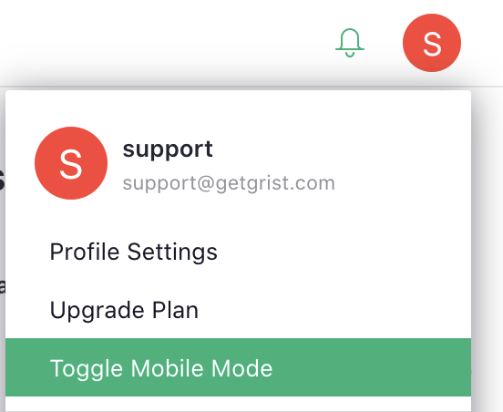

# Browser Support

Grist is officially supported and regularly tested on modern Firefox and Google Chrome browsers on
all desktop platforms. These are available here:

- <a href="https://www.mozilla.org/en-US/firefox/new/">Get Firefox</a>
- <a href="https://www.google.com/chrome/">Get Chrome</a>

Other modern browsers will work to the degree they are standards compliant. In particular, Grist
is reported to work on modern Safari and Microsoft Edge. If you encounter errors or unexpected
behavior on these browsers, we encourage you to report them to us (at <support@getgrist.com> or
using  Give feedback link in the app).

## Mobile Support

Grist mobile support is improving, but is not yet complete. You can expect Grist to work on mobile
Safari, Google Chrome, and Firefox. If you encounter errors, please report them.

On a mobile device, you may switch between mobile and desktop version of the app by opening the
account menu, and selecting "Toggle Mobile Mode" option:

  **
  {: .screenshot-half }
