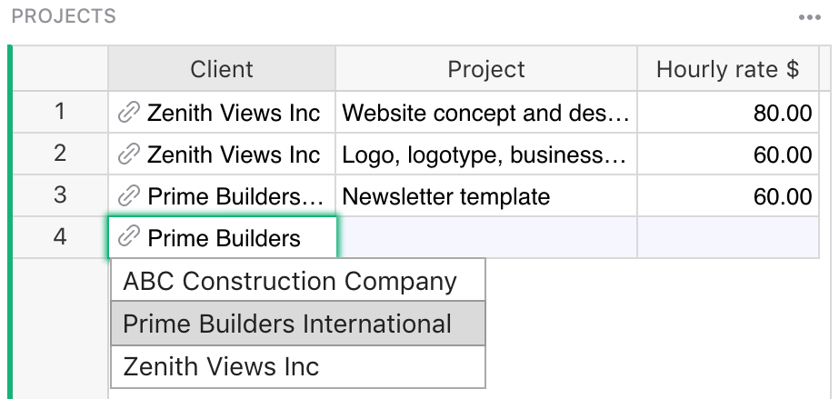
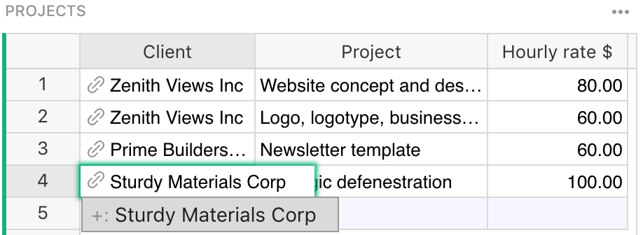
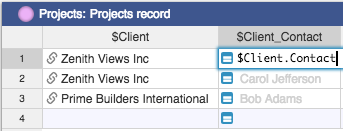

<iframe width="560" height="315" src="https://www.youtube.com/embed/fkn2YCxEvTc?rel=0" frameborder="0" allow="accelerometer; autoplay; encrypted-media; gyroscope; picture-in-picture" allowfullscreen></iframe>

Reference columns
=================

Overview
--------
Reference columns in Grist allow one table to create an explicit reference to another. In the
database world this is similar to a foreign key. In the spreadsheet world this is similar to a
`VLOOKUP`, but much more powerful and easier to use.

In this guide we'll use the term **underlying table** for the table that lists all available values,
and **referencing table** for the table that uses those values.

Creating a new reference column
-------------------------------

Suppose we have a document with two tables, Clients and Projects.  The Clients table lists
our clients - names, contacts, signing dates - and the Projects table lists projects we do for
clients.

There are all sorts of things Grist can do for us if we let it know that the Client column
in the Projects table is referring to clients listed in the Clients table.  We can do this
by converting the Client column to a "reference column".  Open the Column Options side
panel (see [Specifying a type](col-types#specifying-a-type)) and set the "Column Type"
to "Reference".  Adjust the "Data from Table" option to be the correct table you want
to cross-reference, and the "Show Column" option to match which column of that table
you'd like to show.  Then hit "Apply" when you're happy with the result.

!!! note "Understanding the reference"
    The column value always references the entire **record** in the underlying table. The displayed
    value can be any column from that record, as selected in `Show Column`. You can also include
    additional columns to display as explained later.

In our example, you can see little link icons appearing in the Client
column cells, showing that they have been successfully cross-referenced with the Clients table.
Once the column type is set, you can start typing into it or double-click it to see a dropdown
list of all available values.

**
{: .screenshot-half }

!!! note "Spotting reference columns"
    You can tell that the values in a column represent a reference by the link icon that appears
    next to the values.

If you accidentally type in a value that is not present in the `Clients` table, its value will be
highlighted as invalid:

**
{: .screenshot-half }

Adding values to a reference column
-----------------------------------
Sometimes it's useful to add a new value to the dropdown list without having to switch to the
underlying table. Reference columns make it easy! Just type in the value you want add and select the
`+` value in the dropdown list. Grist will automatically add a new record containing this value to
the underlying table and insert the proper reference:

**
{: .screenshot-half }

Converting text column to reference
-----------------------------------
When working with existing data, it's common to have existing text values that should really be
reference values. Don't worry, conversion is simple! Just change the column type to `Reference` and
Grist will automatically find and substitute matching values for references. If some values are not
found, they'll be shown as invalid. You can then either add them to the underlying table or select
the proper values for them.

In this example, the first three values match perfectly, but `Forest Labs` is invalid because it
doesn't exist in the `Clients` table:

Including multiple fields from a reference
------------------------------------------
A big benefit of reference columns is that they allow you to easily bring in multiple columns from
the underlying table. In our example, if you wanted to bring in `$Client.Contact` to the `Projects`
table, you can just select the `Contact` column from the `Add Reference Columns` section and it will be
automatically added to the `Projects` table:

If you're comfortable using formulas, you can see that the added column is just the formula
`=$Client.Contact`. If you were so inclined, you could achieve the same result by manually adding
the formula column. You can also use any other fields from `Clients` table by referencing `$Client`
in formulas in the `Projects` table.

**
{: .screenshot-half }

!!! note "Using references in formulas"
    You may have noticed that the underlying table is `Clients` (plural) but the formula is
    `$Client.Contact` (singular). That's because the formula refers to the referencing column,
    **not** the underlying table. In our example, the referencing column is `Client`.
