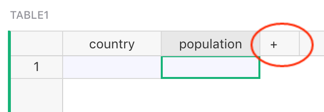
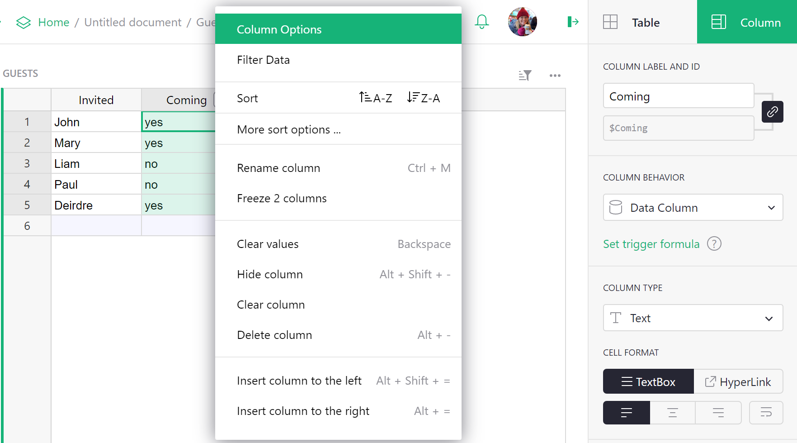
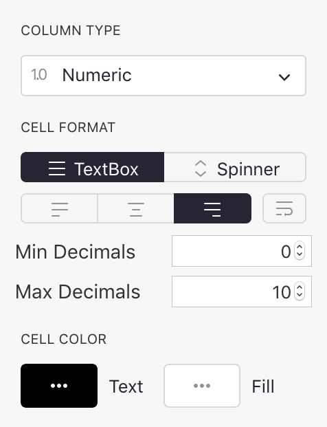
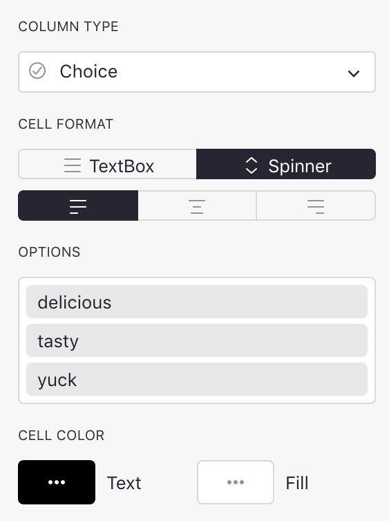

<iframe width="560" height="315" src="https://www.youtube.com/embed/kEKYcW3h4V8?rel=0" frameborder="0" allow="accelerometer; autoplay; encrypted-media; gyroscope; picture-in-picture" allowfullscreen></iframe>

Columns and data types
======================

Adding and removing columns
-------------------------------

Every Grist table, when first created, has three columns called A, B, and C.
To rename a column, hover on the column header, click on the drop-down, then
select "Rename column" (you can also just click on the column header twice).

To delete a column, hover on the column header, click on the drop-down, then
select "Delete column".

To add a column, click on the "+" symbol in the header row, then type in
the column name.

**
{: .screenshot-half }

To reorder a column, first select the column if it isn't already selected,
by clicking on the column header.  Next, click and hold on the column header.
After a second or two, you'll be able to drag the entire column to its new
location.

Another way to reorder columns is via the widget options:

In the visible columns section, the columns can be dragged around freely to
reorder them.  You can also hide columns here.

**
{: .screenshot-half }

Renaming columns
------------------

You can rename columns in several ways.  One way is to
click on the column header when the column is already selected.
Another is to hover on the column
header, click on the drop-down, then select "Rename Column".
Another is by selecting "Column Options" in the same drop-down, and editing the "Field"
name shown at the top.  A bonus with this method is that you can also control
the identifier given to the column
in formulas.  By default this is based on the field name, with any
characters Python doesn't like replaced with "\_", and a number added if needed
to keep the name unique within your table.  If you don't like this identifier, you
can change it, though it will still need to be Python-friendly.  To change
the name, deselect "Use Name as ID" if it is selected, and edit the "ID" entry now
shown.

Specifying a type
-----------------

Grist columns have types, similar to other spreadsheets or databases.  The type of a column
controls its appearance and the help Grist will offer you when editing cells.

When you create a new column, it initially has the `Any` type.  When you enter the column's
first cell, Grist tries to narrow this type.  If you enter a number, the column will
be changed to `Numeric` type, which is right-aligned by default.  If you enter something
that doesn't look like a number, the column will be changed to `Text` type, which is left-aligned
by default.

To inspect the type of a column, hover over the column header, then click on the drop-down,
then select "Column Options".  The "Column Type" section is what you are looking for.

You will often want to control the column type manually.  You can change it in the "Column Type"
section.  For example, here we set a column full of "yes" and "no" responses to be of type
`Toggle`:

One advantage of doing so is that Grist can now offer you ways to visualize the column that
are specialized to on/off style values.  Each column type has different options in the
"Cell Format" section of the side panel:

Regardless of the column type, you can enter **any value** in cells. If a value entered is
incompatible with the defined type, the cell will be highlighted with an error (and columns
referencing the invalid value will also display an error):

Supported types
---------------
Grist supports the following types:

 <!-- For css styling via css/extra.css -->

Type           | Description
-------------- | -----------
Text           | (**Default**) Any string of text.
Numeric        | Floating point numbers.
Integer        | Integers (whole numbers).
Toggle         | Boolean (True / False)
Date           | Valid date (without a time component).
DateTime       | Valid date + time.
Choice         | Single value from a list of pre-defined valid values.
Choice List    | Multiple values from a list of pre-defined valid values.
Reference      | A reference column to another table.
Reference List | A list of references to another table.
Attachment     | Cells where you can place files or images.

Text columns
--------------

You can put any text you like in this type of column.  For formatting,
you can control alignment and word-wrap, text color and background color.

If the column is used for storing web links, you can turn on "HyperLink"
formatting to make links prettier and to include a clickable link icon.

**
{: .screenshot-half }

### Hyperlinks

When a Text column uses "HyperLink" formatting, values get formatted like so:

- `https://getgrist.com` will show <https://getgrist.com>.
- `Grist Labs https://getgrist.com` will show [Grist Labs](https://getgrist.com) (linking to
  "https://getgrist.com" with “Grist Labs” as the text).
- `Email Help mailto:support@getgrist.com` will show <a href="mailto:support@getgrist.com">Email
  Help</a>, a link which would open an email program to compose an email to support@getgrist.com.

In general, the value until the last space is used as the link text, while the last word is used as the link destination.

Link formatting is particularly useful when links are generated using a formula such as:  
`$Company + " " + $Website`{: .formula}

Numeric columns
-----------------

This type is for numbers, including floating-point numbers. In addition to controlling alignment
and color, you can choose the number format, and the minimum and maximum number of digits to
show after the decimal point.

**
{: .screenshot-half }

Choosing the "Spinner" option for CELL FORMAT will show arrows in each cell for
increasing/decreasing the number.

The options under NUMBER FORMAT include:

- `$`: Format for currency amounts, such as dollars or euro. Selecting the `$` will add a currency prefix, thousands separators, and default to 2 digits after the decimal point. It will also open a currency selector for international currencies.

  **
  {: .screenshot-half }
  
  Tip: You can set a document's default timezone, locale, and currency in Document Settings.
  
- `,`: Turn on the display of thousands separators.
- `%`: Show numbers as percentages. E.g. "0.5" would show as "50%".
- `Exp`: Show numbers in exponential (or scientific) notation. E.g. "1234" would be shown as
  "1.234E3".
- `(-)`: Show negative numbers in parentheses, without a leading minus sign. This is commonly used
  in accounting, and usually combined with `$` or `,` formats.

Integer columns
-----------------

This is strictly for whole numbers.  It has the same options as
the numeric type.

Toggle columns
----------------

This type is for storing true/false values.  The values can be shown
as text, checkboxes, or switches.

**
{: .screenshot-half }

See also example in [Specifying a type](col-types.md#specifying-a-type).

Date columns
----

This type is for storing calendar dates (without a time of day component).
More details in [Working with dates](dates.md).  You can choose the
format for dates, see the [date formatting reference](https://momentjs.com/docs/#/displaying/format/).

**
{: .screenshot-half }

DateTime columns
---------

This type is for storing calendar dates plus time of day.
More details in [Working with dates](dates.md).  You can choose the
format for dates, see the [date and time formatting reference](https://momentjs.com/docs/#/displaying/format/).  You can also specify the timezone to display for.

**
{: .screenshot-half }

Choice columns
-------

This type is for storing one of a set of valid values, where you get to
specify the available values.

**
{: .screenshot-half }

There's an example of using this type of column in
the [Lightweight CRM example](lightweight-crm.md#setting-other-types).

If you start off with a populated text column, Grist will take all unique
values from that column as the valid choices.

You can add or remove choices by either clicking `Edit` or on the Choices box.
To add a choice, type its value in the text field below the other
choices and press `Enter`. To remove a choice, click the delete icon to the
right of the choice or select the choice by clicking on it, and then press
`Backspace`/`Delete`. To apply/save your changes, you can either click the
`Save` button or press `Enter`. To discard your changes, you can either
click the `Cancel` button or press `Escape`.

Clicking the color dropdown to the left of a choice will open a color picker
for customizing the fill and text color of a choice. Changes to colors are
reflected inside cells and throughout the rest of your document once you save
your changes.

Choices can be re-arranged by clicking and dragging them, which determines the
order in which they appear when typing into a cell.

The configuration editor supports many convenient keyboard shortcuts. You can
press the `Up Arrow` and `Down Arrow` keys to navigate between selected choices;
hold the `Shift` key to bulk select adjacent choices while clicking or using the
arrow keys; and hold the `Command`/`Control` key to multi-select choices while
clicking. To select all choices, you can press `Command`/`Control` + `A`.

Undo and redo are also supported in the configuration editor. While your cursor
has focus on the editor text field, you can press `Command`/`Control` + `Z` to
undo your last change, and `Command`/`Control` + `Shift` + `Z` to redo it.

The configuration editor also supports copy and paste. To copy, select
the choices you want copied and press `Command`/`Control` + `C`. To paste,
focus on the text field and press `Command`/`Control` + `V`. Choices are pasted
in bulk if the clipboard contains multiple lines of text. Choices can also be
copied from one column's configuration editor and pasted into another, which
will copy over both the values and their configured colors.

When typing into a Choice column cell, your configured choices will be shown
in an autocomplete menu. You can either click on a choice, or use the arrow keys
and `Enter` to add a choice to a cell. If your input is not one of the
valid choices, Grist will display a menu option for conveniently adding it as a
valid choice and into the cell in one step.

**
{: .screenshot-half }

Choice List columns
------------

This type is for storing multiple values from a set of valid values, where you
get to specify the available values.

**
{: .screenshot-half }

If you start off with a populated text column, Grist will take all unique
values from that column as the valid choices.

Choice List columns are configured the same way [Choice](#choice-columns) columns are, and
support the same level of customization and keyboard shortcuts. They differ in
the number of choices they allow to be entered in each cell. While Choice
columns only allow at most one value in a cell, Choice List columns allow
many.

Like with Choice columns, when typing into a Choice List column cell, the
valid choices will be shown in an autocomplete menu. Once you've selected
a value, you can continue adding choices to the same cell.

**
{: .screenshot-half }

Choices can be re-arranged inside their cells by clicking and dragging them
while the cell is being edited. You can also use the arrow keys and the
`Delete` key to navigate and delete choices, or simply click the delete icon
when hovering your cursor over a choice.

Reference columns
----------

This sets up a cross-reference to another table.  You can specify the
table to reference, and a column within that table to show.
There's a lot you can do with this kind of column, see [Reference columns](col-refs.md) for
details.

**
{: .screenshot-half }

Reference List columns
----------

Like [Reference columns](#reference-columns), but can store multiple
references in a single cell.
There's a lot you can do with this kind of column, see
[Reference columns](col-refs.md#creating-a-new-reference-list-column) for details.

**
{: .screenshot-half }

Attachment columns
-----------

This column type lets you insert entire files and images in cells.
When images are added in cells, a preview thumbnail is shown in the
cell.  The "Size" bar gives control of the scale of this thumbnail.

**
{: .screenshot-half }

When you create an attachment column, cells of that column will
have a paperclip icon:

When you click on a paperclip icon, you can select a file to attach.
If it is an image, you'll see a thumbnail of it in the cell.

<!-- Source: https://en.wikipedia.org/wiki/File:Red_eyed_tree_frog_edit2.jpg -->

If you hover over the image, you'll see a paperclip icon again,
which you can use to add more files to the same cell.  You'll
also see an "open-eye" icon, which when clicked brings up a
larger view of all of the cell's attachments, and gives you
a way to rename them, download them, or remove them.

