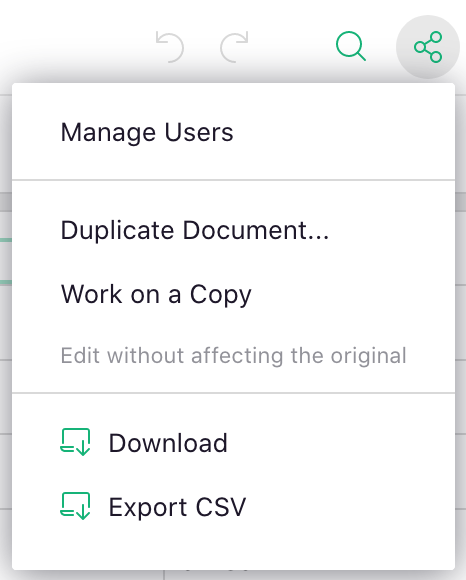
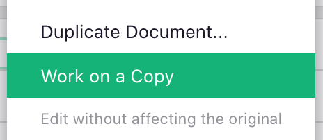
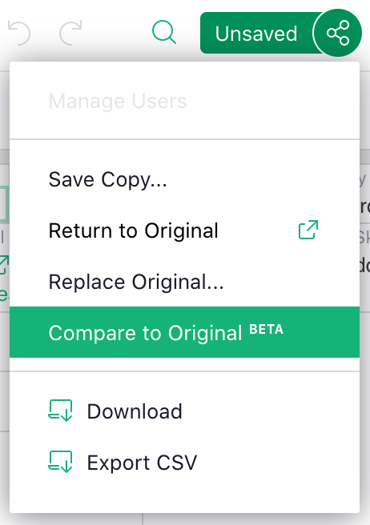
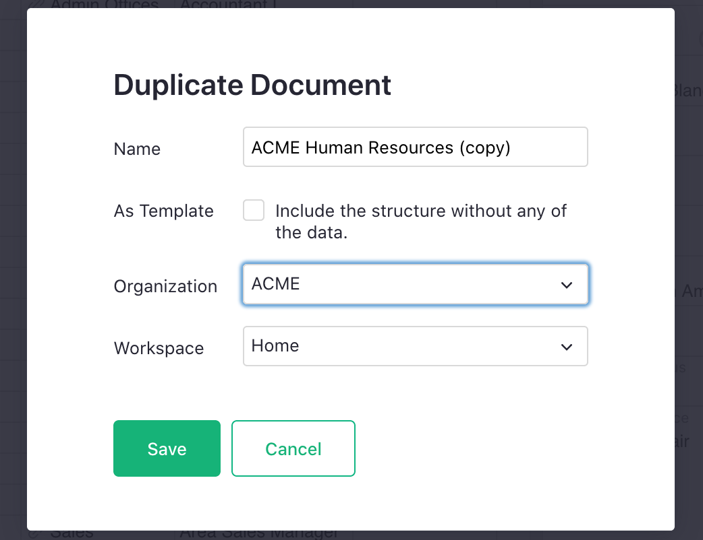

# Copying Documents

It is sometimes useful to make a copy, or clone, of a Grist document. A few scenarios are described below. In
all cases, you would start with the "Share" menu available from the top bar of an open document:

**
{: .screenshot-half }

## Trying Out Changes

As your document grows in importance, it becomes riskier to make changes to its structure or
logic. That's a good reason to work out such changes on a copy of the document, without fear of
affecting the original.

Open the Share menu and click the option "Work on a Copy".

**
{: .screenshot-half }

You'll get an unsaved copy of your document. This copy is special in that it knows which original
document it came from (you can see the original document ID included in its URL).
You can experiment on this copy, making changes big or small, one or many.

For those familiar with software development, this option is
similar to a [branch](https://en.wikipedia.org/wiki/Branching_%28version_control%29){:target="\_blank"} or a
[fork](https://docs.github.com/en/github/getting-started-with-github/fork-a-repo){:target="\_blank"}
as used in version control systems like [Git](https://git-scm.com/){:target="\_blank"}.

When working on a copy, the Share menu has some new options. For example,
you can view differences between the document copy and the original,
using the "Compare to Original" menu item:

**
{: .screenshot-half }

New material will be highlighted in green, and old material in red.

Once satisfied with your changes, click the option "Replace Original". Your copy will replace the
original document. Grist will warn you if the replacement risks overwriting any recent changes in
the original.

To discard your changes, simply go back to the original document using the "Return to Original"
option (or the Back button in your browser). Don't worry about cleaning up your copy. It does not
count against any document limits, and will get cleaned up automatically if it has been unused for
a while.

You can also save your copy under a new name using the "Save Copy" option.

### Access to Unsaved Copies

When you create an experimental copy as described above, it gets a unique link. The copy isn't
listed anywhere, so others will not find it unless you share this link.

Anyone with a link to your copy and with access to the original document is allowed to view the
copy, but you are the only user allowed to edit it.

This means that you can share a link to your copy with others, who can review your changes.

It also means that you can try out changes even if you cannot edit the original! You can then
share a link to your copy with a collaborator who has edit access, who would be able to review
your changes and apply them to the original document.

## Duplicating Documents

You can save your document under a new name using the "Duplicate Document" option in the Share
menu. Clicking it opens a dialog:

**
{: .screenshot-half }

Type in the new name. If you have access to one or more team accounts, you may have a choice of a
destination team and a destination workspace where to save the copy. Note that on a team
site, you would not be able to save the document outside of the team site unless you have
owner-level access to the document.

### Copying as a Template

If you mark the "As Template" checkbox when saving a copy, you'll get a document which has all the
structure, formulas, and layouts of the original, but none of the data. It makes it easy to use
the existing structure for a new set of data.

### Copying for Backup Purposes

You can use the "Duplicate Document" option to save the current version of the document as a
backup, perhaps appending today's date to the name of the copy. That said, Grist already makes
automatic backups regularly, which may be sufficient for most backup needs. See [Automatic
Backups](automatic-backups.md).

## Copying Public Examples

When you open a public example from the [Examples & Templates page](https://docs.getgrist.com/p/templates),
it will open the example in [fiddle mode](glossary.md#fiddle-mode).

**
{: .screenshot-half }

Fiddle mode is similar to working on a copy, as described above in [Trying Out Changes](#trying-out-changes).
You may make changes, but they remain private to you. You can save a copy of the example under
a new name using the "Save Copy" button or menu option.

You can use the "As Template" checkbox to discard the data of the example, keeping only its
structure. This makes it easy to start using it for your own data.
