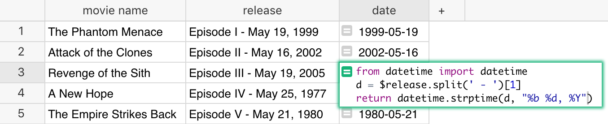
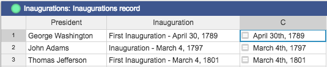
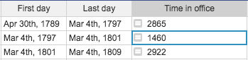
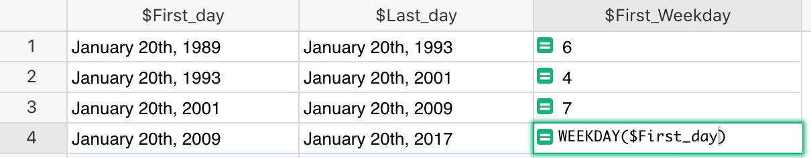

Overview
--------
Grist supports both Date and DateTime column types. Both support different formatting options, and
DateTime can also specify the timezone. When a column is set to be a Date or a DateTime, a
datepicker widget allows you to select the date with a UI.

When working with dates in formulas, the dates are Python [datetime
objects](https://docs.python.org/2/library/datetime.html). That allows you to do some powerful
things, but can be unexpected if you're not familiar with them.

Parsing dates from strings and back
-----------------------------------
The [DATEVALUE](functions/#datevalue) function converts a string that represents a date into a `datetime`
object. It's simple to use and it will auto-detect different date formats:

You can also use Python's `datetime` library, which provides two helpful functions:
[strptime() and strftime()](https://docs.python.org/2/library/datetime.html#strftime-strptime-behavior).

For example, let's say you have a table of United States Presidents and their inauguration dates (as
strings). You'd like to parse out the actual date to be able to sort the table properly. Here's how
you would do that:

1. First line imports the datetime library
2. The second line splits the string into two parts and returns the second part (Python arrays are
   zero-based).
3. The third line uses Python's [strptime
   function](https://docs.python.org/2/library/datetime.html#datetime.datetime.strptime) to parse
   the date (e.g. "March 4, 1861") into a datetime object. The first parameter to the function is
   the string to parse, the second parameter is the date format that the string is in. Take a look
   at the [format
   options](https://docs.python.org/2/library/datetime.html#strftime-strptime-behavior) to see if
   the example format string `%B %d, %Y` makes sense. (Note: You could've also used `DATEVALUE(d)` to
   achieve the same result.)

The result looks to have proper date formats and can now be properly sorted, with George Washington
at the top:

And, because the column type is selected as a date, you can use the "Date Format" in "Field Options"
to select the format in which to display the date.

Date arithmetic
---------------
Once you have a proper date column, often you'll want to do date arithmetic such as calculating the
difference between two dates. The simplest way to do this is to use the [DATEDIF](formulas/#datedif)
function which takes two dates and the unit of information to return (Days, Months, or Years).

You could also use the minus sign to subtract two dates, but you might be surprised at the result:

This happens because subtracting two dateime objects as we did in the example above, results in a
[datetime.timedelta](https://docs.python.org/2/library/datetime.html#datetime.timedelta) object
which represents, "A duration expressing the difference between two date, time, or datetime
instances to microsecond resolution."

In Grist (and Python) you have to be more specific above how you want to display the date
difference. For example, to get the number of days from the returned timedelta object, use its
`.days` property:

If you want weeks or years, just divide by 7 or by 365. If you want hours, multiply by 24.

You can also use specific functions to get what you want. For example, `DAYS` is a common function
in spreadsheet apps that returns the difference between two dates:

!!! note "Excel/Sheets formulas"
    Grist supports many other common functions from other spreadsheet apps, including
    `DATEADD`, `DATEDIF`, `DATEVALUE`, `MONTH`, `HOUR`, and [many more](functions/#date).

Getting a part of the date
--------------------------
You've seen how to parse the date, display it in different formats, and do date arithmetic. But what
if you want to get more information about a specific date, such as getting its day of the week?

### Option A

The best option is to use the [WEEKDAY](functions/#weekday) function, which behaves as it does in
Excel:

Because [WEEKDAY](functions/#weekday) function returns 1–7 for Sunday–Saturday, George Washington
started his term on Thursday, John Adams on Saturday, and Thomas Jefferson on Wednesday.

### Option B

Another option is to simply reformat the date using Date Format in Field options. First, set the
"Day of week" column to be equal to "First day" column:

Then set a custom Date Format in Field options. Consulting the [date formatting
reference](https://momentjs.com/docs/#/displaying/format/) we can see `dddd` returns the long form
of the weekday (i.e. Monday, Tuesday, …):

!!! warning "Value versus display"
    These two options are not equivalent, even though they produce a seemingly similar result. In
    Option A, the column value is the weekday. In Option B, however, the column value is the actual
    date (e.g. April 30th, 1789) and the weekday displayed is only the formatting. If you wanted to
    summarize by the "Day of week" column to find the most popular day to begin a presidency, only
    Option A would work.

Additional resources
--------------------
* [Python cheatsheet for strftime](http://strftime.org)
* [Date formatting cheatsheet](https://momentjs.com/docs/#/displaying/format/)
