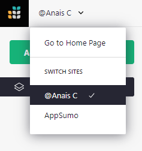
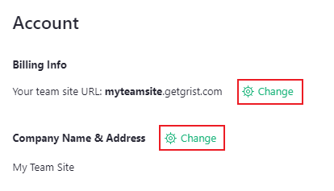
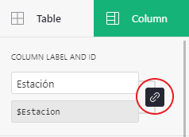
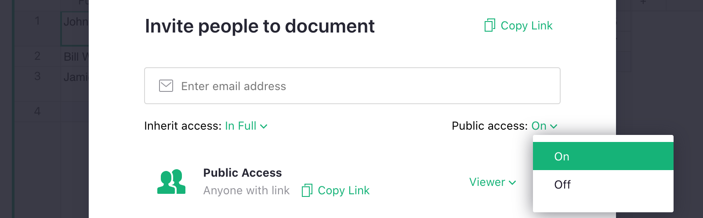

# Frequently Asked Questions

[TOC]

 
 
---
 
 

## Accounts

### Can I add multiple teams to the same Grist login account?

Yes! You may create multiple team sites. Each team site may be on the free or a paid plan. Each
team site on a paid plan is associated with its own subscription, and is billed separately.

1. **New team site.** If you’re looking to create a new team site, navigate to your personal site at [docs.getgrist.com](https://docs.getgrist.com/), then click on top-left site name (@your-name) to open a list of sites. Click on the '+ Create new team site'. In the pop-up, select the plan to use.

2. **Adding account to team site.** You may own or be a member of multiple teams sites. If you have multiple Grist login accounts, you may also add your second account as a team member. While in the team site you own, open the user menu and click on 'Manage Users'.

**Did you know?** 

A single team site can work well for an organization with multiple teams (or subteams). You can use workspaces
within a team site, and [manage access to them](workspaces.md#managing-access) to create separate
areas for different teams.

### Can I add multiple login accounts to Grist?

Yes! To add multiple accounts to Grist, open the [user menu](glossary.md#user-menu) by clicking on the profile icon in the top-right of Grist, then click on 'Add Account'.

You can now easily switch between all your accounts, and all your teams, from the user menu.

### How do I update my profile settings?

Open the [user menu](glossary.md#user-menu) by clicking on the profile icon in the top-right of Grist, then select 'Profile Settings'.

From here, you can manage the name associated with your account, update Grist's theme to light or dark mode, set a language and create and manage an API key. To learn more about our API, check out [Grist API](rest-api.md#grist-api).

**Would you like to help translate Grist?**

We use [Weblate](https://hosted.weblate.org/engage/grist/) to manage translations and welcome volunteer translators! If you’d like to translate Grist into a new language (thank you!) let us know which language in this [Community thread](https://community.getgrist.com/t/translating-grist/2086), and we’ll add the language on Weblate.

### How can I change the email address I use for Grist?

It is not possible to change the email associated with your Grist account. However, it it possible to transfer ownership of documents and team sites between two Grist email accounts that you own. This would effectively change your Grist email. [Learn how](FAQ.md#how-to-manage-ownership-of-my-team-site). 

It is possible to manage multiple accounts in Grist. To add another account, open the [user menu](glossary.md#user-menu) by clicking on the profile icon in the top-right of Grist, then click on 'Add Account'.

You can now easily switch between all your accounts, and all your teams, from the user menu.

### How do I delete my account?

You can delete your account in 'Profile Settings' by selecting 'Delete Account' under 'Privacy & Data'. Please note that this action is permanent. 

Need to delete a team site? Learn more [here](teams.md#billing-account). 

---

## Plans

### Why do I have multiple sites?

All Grist users have access to a free personal site. The personal site is always named beginning with '@' and is always located at [docs.getgrist.com](https://docs.getgrist.com/). Each document in this site may be shared with up to two guests for free. Learn more about free plans on our [pricing page](https://www.getgrist.com/pricing/).

Documents shared with you from other personal accounts will be shown in your personal site in workspaces named with '@Name' to indicate the owner of that document.

You may navigate between your [personal site](teams.md#understanding-personal-sites) and [team sites](teams.md) by clicking in the top-left corner to open a drop-down menu of sites to which you have access.

**

### How to manage ownership of my team site?

**Add a second owner**

1. Open the team site to which you want add a second owner.

2. Click 'Manage Users' under the [user menu](glossary.md#user-menu) by clicking on the profile icon in the top-right of Grist.

3. Add the new email address as Owner, and click Confirm. 

4. You may also wish to go to 'Billing Account' (also under the user menu) and add the new owner as a Billing Manager.

**Transfer ownership**

1. Follow steps 1-3 above to add a second owner.

4. Go to 'Billing Account' (also under the user menu) and add the new Owner as a [Billing Manager](team-sharing.md#billing-permissions).

5. The new Owner should log in, open the team site, and visit 'Manage Users' and 'Billing Account' pages again to remove the original owner. This will essentially transfer the ownership of the team site to the new account.

It is not possible to add a second owner to, or transfer ownership of, a [personal account](teams.md#understanding-personal-sites).

**Did you know?** 

If you’re transferring team site ownership between two Grist email accounts that you own, you can more easily transfer ownership by signing in with multiple accounts. To sign in with another account, open the user menu and click on 'Add Account'. You can now easily switch between all your accounts, and all your teams, from the user menu. Follow the steps above to transfer ownership from one account to the other.

### Can I edit my team’s name and subdomain?

You may edit your site name and subdomain from the billing page. Open the [user menu](glossary.md#user-menu) by clicking on the profile icon in the top-right of Grist, then click on ['Billing Account'](teams.md#billing-account).

**

---

## Documents and data

### Can I move documents between sites?

Yes! Follow these steps to move documents between sites.

1. Open the document you wish to move and click on the share icon (), then click 'Duplicate Document' in the menu. 

2. Select the site (organization) to which you want to transfer the document.

This will create a copy, so you'll still have the original document in your original site. You can always delete it.

Learn more about [copying documents](copying-docs.md).

### How many rows can I have?

As a rule of thumb, Grist works best for documents under 100,000 rows. The actual limit depends also on the number of tables, columns, and the average size of data in each cell. One way to estimate it is to measure the size of the data when it is in CSV format: the limit is around 20MB in this format. For example, a document with 200,000 rows and 12 numeric columns would reach that.

Attachments are counted separately. Attachments plus data in a single document are limited to 1GB.

[Learn more about limits](limits.md).

### Does Grist accept non-English characters?

Non-English characters are supported in column labels, but not column ids, which are the column’s Python name used in formulas. When importing a file into Grist, non-English characters do import as values in cells, but do not import into column labels (aka headers). The column labels are approximated with English characters. You may rename the column labels to include non-English characters after import.

To [edit column labels and ids](col-types.md#renaming-columns) separately, open the creator panel and select the column menu. Click the link icon that joins label to id to enable column id editing. While non-English characters are not supported, it is possible to edit the ids into something more clear and friendly to use in formulas. 

**

### How do I sum the total of a column?

To summarize multiple records, you need [summary tables](summary-tables.md).

The major difference between Grist and spreadsheets like Excel or Google Sheets is that Grist is a database, so each row in a grid represents a record (e.g. a person, a bank transaction, etc.) Since a sum across multiple records isn't the same kind of record, Grist offers summarizing data as a separate widget, which can be modified to calculate even more powerful summary data.

For example, suppose you have a table of webstore orders called `Orders` and you want to sum sales revenue from all orders. At the top of the left-side menu, click 'Add New' button and select 'Add Page' or 'Add Widget to Page'. In the widget picker, select the `Orders` table then click the summation icon () next to it. Add the page or widget to your document. Done! You've now created a summary table that by default counts all the records in the `Orders` table, and sums all [numeric](col-types.md#numeric-columns) and [integer](col-types.md#integer-columns) columns, such as the amount sold in each order.

Summary tables can do more than a sum of a tables' columns. With just a few clicks you can summarize orders *by month* to calculate the number of orders and total sales revenue in each month for which you have data. 

Take it a step further and suppose you have multiple webstores. With Grist, you can record all sales orders across all stores and months in the same table. Then, you can summarize by month *and* webstore. 

When you add more months (or stores!) to the orders table, the summary table will automatically update, which is another key difference with spreadsheets. In Excel, you would need to expand your formula's range, or add more sheets and modify formulas everytime you added more sales orders, months, or stores. In Grist, you create the summary table once, and let Grist do the future work for you.

In addition to our [summary tables](summary-tables.md) article, we have a [video tutorial and follow-along guide](examples/2021-06-timesheets.md) that provides an example in building a dashboard with summary tables.

---

## Sharing 

### What's the difference between a team member and a guest? 

Team members all have access to a [team site](teams.md), which is located at a url with a custom subdomain, such as `your-team.getgrist.com`. On paid plans, the number of team members determines the price.

By default, documents within a team site may be accessed by all team members. This default can be modified to only share certain [documents](team-sharing.md) or certain [workspaces](workspaces.md) with specific team members. 

Guests, on the other hand, are invited to particular documents, but are not added to your team. All documents in Grist, including those on personal sites, are allowed up to 2 free guests, and do not affect the plan price. 

### Can I only share Grist documents with my team?

There are many ways to share Grist data with non-team members. 

1. **Guests.** Each document may be shared with 2 guests (non-team members) at no additional cost.
2. **Link sharing.** In share settings, there is an option to turn on [public access](sharing.md#public-access-and-link-sharing). The public access role can be set to viewer or editor. Anyone with a link can view (or edit) your data. Those views would not count towards your plan's user count. The document is visible to anyone with the link, however, so use caution when working with sensitive data.

**

3. **Restricted view-only link sharing.** With view-only link sharing, there is a way to further restrict what people can see by using Grist's access rules to set specific URL parameters called [link keys](access-rules.md#link-keys) that determine which tables, columns, or rows are shown when a specific link is shared. 

4. **View-only embed.** Grist [pages](page-widgets.md#pages) can be embedded into websites in an iframe. [Learn how](embedding.md).

---

## Grist and your website/app

### Can I embed Grist into my website?

Yes, it is possible to embed Grist [pages](page-widgets.md#pages) as view-only data in a website in an iframe. 

`<iframe src="https://templates.getgrist.com/6D8E2h2DQNwS/Task-Management/p/6?embed=true"></iframe>`

Replace the url written in the code above with the URL of the Grist page you wish to embed, follow by `?embed=true` at the end of the url.

Learn more about [embedding Grist](embedding.md).

### Can I use Grist as the backend of my web app?

Using Grist as a backend solution directly to a website or web app is not yet supported. We don't yet have an authentication method for this use case. The API key method isn't generally appropriate for web use, because the key would end up accessible to any viewer of the webpage, which is usually undesirable. We are interested in supporting this in the future and welcome ideas and feedback in our [community forum](https://community.getgrist.com/).
