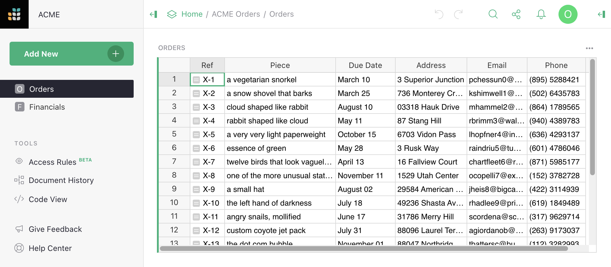
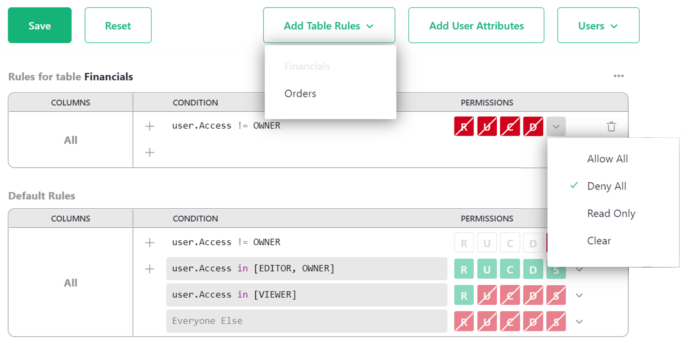

Access rules
==============

Every Grist document can be [shared with others](sharing.md) 
using the `Manage Users` option in the sharing
menu (<span class="grist-icon" style="--icon: var(--icon-Share)"></span>).
Users can be invited as Viewers, Editors, or Owners (see 
 [Sharing a document](sharing.md) for a refresher on those roles), or a document can be [shared publicly](sharing.md#public-access-and-link-sharing) with view or edit permissions.
Sometimes, you need more nuance about who can see or edit individual
parts of a document.  Access rules give us that power.

Only the owners of a document can edit its access rules.
When a document is loaded, owners see a tool called 
<span class="app-menu-item"><span class="grist-icon" style="--icon: var(--icon-EyeShow)"></span> Access Rules</span>
in the left side bar.  Click on that to view and edit
access rules.  The rules are also accessible via the `Manage Users` option
of the sharing menu <span class="grist-icon" style="--icon: var(--icon-Share)"></span>
with the `Open Access Rules` button (available only to document Owners).

Suppose we run a small business sourcing and delivering unusual objects,
organized using a document with two tables, `Orders` and `Financials`.
Now we are taking on more employees, and want to share the document with them while
limiting their access to just what they need.



## Default rules

To see the access rules for a document, visit its access rules page by
clicking
<span class="app-menu-item"><span class="grist-icon" style="--icon: var(--icon-EyeShow)"></span> Access Rules</span>
in the left sidebar. When no custom rules have been created yet,
the access rules page contains the `Default Rules` for our document:


These rules say, in summary, that Owners and Editors can do anything within
the document, that Viewers can only read the document, and everyone
else is forbidden all access.  These rules cannot be modified, but they
can be overridden.  To understand whether a group of rules allows a
certain permission ([Read, Update, Create, Delete, or Structure](access-rules.md#access-rule-permissions)), read
the rules from top to bottom, and find the first applicable rule
that allows (green) or denies (red) that permission.
We'll see plenty of examples as we go.

## Lock down structure

By default Owners and Editors are equally powerful within a document, with the ability to create
or delete tables or columns, write formulas, reorganize pages, and so on.

Suppose we want only the original Owners of the document to be allowed to change
its structure, as we plan to invite other specialized collaborators as Editors.
To do this, uncheck the box for the first rule listed under 'Special Rules' to 
disallow editors from editing structure. 


Once we've made changes, the `SAVE` button becomes an inviting green.  We
click `SAVE` for the rule to take effect. 

**Important.** This is an important first step for any document where you intend to block any access to Editors.
Without denying them the structure permission (`S`), anyone with edit access will be able to
create or change formulas. Since formula calculations are not limited by access control rules,
a determined user could use them to retrieve any data from a document. To protect against
that, deny structure permission to users whose access should be limited.

## Make a private table

To ensure that only Owners can access a table, such as the `Financials` table in our example,
we click `Add Table Rules` and select the table name, `Financials`.  This creates a new empty
group of rules called `Rules for table Financials`.
Then we add a condition for any user who is not an Owner (`user.Access != OWNER`), with all
permissions denied.  Selecting `Deny All` from the drop-down beside `R` `U` `C` `D` is a fast
way to set all permissions to denied, or you can click each permission individually to turn
them red.  `R` is Read, `U` is Update, `C` is Create, and `D` is Delete
(see [Access rule permissions](access-rules.md#access-rule-permissions)).
Structure (`S`) permissions are not available at the table level.
Once you are done, click `SAVE`.



Now we could go ahead and share the document with a team member
specialized in deliveries, for example.  We [share the
document](sharing.md) with them as an Editor so that the restrictions
we've set up apply to them.  They won't see the `Financials` table in the
left side bar, and attempts to open it will be denied:


## Seed Rules

When writing access rules for specific tables, it is fairly common to repeat the same rule across many tables — 
for example, always grant owners full read and write permissions. To automatically add a set of rules to all 
new table rules, you can write "seed rules." There is a checkbox above default rules that makes the common 
case easier with one click. Click it to write a seed rule that will automatically grant owners full access 
whenever table rules are added. Click the `>` icon to uncollapse the seed rules table to modify seed rules.


## Restrict access to columns

We can restrict a collaborator's access to columns.  In our eample, we might
wish to give a delivery specialist more limited access to
the `Orders` table.  Perhaps they don't need to see an `Email` column,
or a `Piece` column with details of what is in the parcel.

Click `Add Table Rules` and select `Orders` to create a rule group for the `Orders` table.
Now, in the `Rules for table Orders` group, click the three-dot icon (...), and
select `Add Column Rule`:


In the `Columns` area we have a new `[Add Column]` dropdown to add all the columns
to which we want the rule to apply (in our case `Email` and `Piece`).
For the condition, we could use `user.Email == 'kiwi@getgrist.com'`.  This checks
for the email address of Kimberly, our fictional delivery specialist; we
could also check by name or a numeric ID.  We turn all available permissions off for
this user on these columns:


Now that the rules are ready, click `Save`.

If we have another employee who specializes in sourcing objects, and who needs to
see a different set of columns, we can do that.  For example here we add a
rule to withhold `Address` and `Phone` columns from user `Charon`:


## View as another user

A convenient way to check if access rules work as expected is with the `View As` feature, 
available in the `View As` dropdown.  This allows an Owner
to open the document as if they were one of the people it is shared
with, to see what their colleague would see.  The Owner does not
"become" that colleague - any changes they make will be recorded as
coming from themselves and not the colleague - but they do see the
document from the colleague's perspective.


In our example, we could select Kiwi, and the
document reopens, with a large banner stating that we are viewing it
as Kiwi.  The `Piece` and `Email` columns are missing,
and the `Financials` table is surpressed:


You can also check in Raw Data to confirm only the expected tables, columns, and rows are exposed.


When satisfied that everything looks as expected, we click the green `View as Yourself` 
button to close this preview, and the document will reload.

## User attribute tables

If we are successful and hire many sourcing and delivery people,
then adding them one by one to rules would be tedious.  One solution
is to use "user attribute tables."  You can add a table to your document
that classifies users as you like, and then use those classes in your
access rules.  For example, we can make a table called `Team`, and give it two
columns, `Email` and `Role`, where `Role` is a choice between
`Sourcing` and `Delivery`.


Now we can tell Grist to make information from this table available
for access rules, by clicking on `Add User Attributes`.
Give the attribute any name you like (this will be how we refer to it
in formulas), such as `Team`.  Pick the table to read (`Team` also in
this case).  Give a user property to match against
rows in this table - in our case we'll use `user.Email`.  And the
column to match against, `Email`.


Save that. Now we can update our rules to be more general.  We find with
autocomplete that we have a new `user.Team` variable available in
condtions.  It makes columns from the `Team` available, such as `user.Team.Role`.
Now we can check if the user has a particular role, and apply the permissions
that go with that:


Great!  Doing a spot check, Charon sees the expected columns for someone in
Sourcing.  And if we recruit someone else to work with them, we can just add
them in the `Team` table, no rule changes needed.


## Row-level access control

In our example, as orders are processed, they move from sourcing to delivery phases.
So there's really no need for the two groups to see all the orders at once.  Let's add a
column called `Stage` that can be set to `Sourcing` or `Delivery`, so that we
can update access rules to show only the relevant orders.


In the `Rules for table Orders` group, click the three-dot icon (...), and
select `Add Default Rule` to add a rule that isn't limited to specific columns.
Let's deny access to all rows for non-Owners as a starting point, then add back in the 
ones we want. We can do that with the condition `user.Access != OWNER` with
`Deny All` permissions.  Then, we add another default rule by clicking `+`, and 
add the condition `user.Team.Role == rec.Stage`.  The `rec` variable allows
us to express rules that depend on the content within a particular record.
Here, we check if the `Stage` column of a record matches the user's role.
If it is, we allow `R` Read access:


Here's how the table looks now as Kimberly (doing deliveries):


And here's how the table looks as Charon (doing sourcing):


Kimberly and Charon now have read-only access to the table.  Owners still have full
write access to all rows and columns.

!!! note "Understanding reference columns in access rules" 
    You can limit the data team members access to just those rows pertinent to their work. One way to do so is to relate all records in all tables to their respective team members. For example, leads and sales records can reference the sales rep responsible for those records. This quick video explains how. 
    
    <iframe width="560" height="315" src="https://www.youtube.com/embed/ZL3rHdAZzfY?rel=0" frameborder="0" allow="accelerometer; autoplay; encrypted-media; gyroscope; picture-in-picture" allowfullscreen></iframe>

## Checking new values

Access rules can be used to permit only certain changes to the document.
Suppose we want `Delivery` people
to be able to change `Stage` from `Delivery` to `Done`, without giving them the
arbitrary rights to edit that column.  We can grant them that exceptional right
as follows.
In the `Rules for table Orders` group, click the three-dot icon (...), and
select `Add Column Rule`.  Set `[Add Column]` to `Stage`, and mark the U/Update
permission to be granted. For the condition, use this:

```
(user.Team.Role == 'Delivery' and
  rec.Stage == 'Delivery' and
  newRec.Stage == 'Done')
```

This checks if the user has the Delivery role, and the record is in the Delivery stage,
and that the user is trying to change the Stage to `Done`. The `newRec` variable is a
variant of `rec` available when the user is proposing to change a record, with `rec`
containing its state before the change, and `newRec` its state after the proposed change.


Now, if we view the table as Kiwi, and try to change a `Stage` to `Sourcing`, we are
denied:


If we change a `Stage` to `Done`, it works, and the record disappears from view since
it is no longer in the `Delivery` stage:


## Link keys

Sometimes it is useful to give access to a specific small
slice of the document, for example a single row of a table.  Grist offers
a feature called "link keys" that can help with that.  Any parameters in
a Grist document URL that end in an underscore are made available to
access rules in a `user.LinkKey` variable.  So for example if a document
URL ends in `....?Token_=xx-xx-xx-xx&Flavor_=vanilla`, then `user.LinkKey.Token`
will be set to `xx-xx-xx-xx` and `user.LinkKey.Flavor` to `vanilla`.
Let's work through an example to see how that can be helpful.

Suppose we have a table of `Orders` and we'd like to occasionally
share information about a single order with someone.  To do that with
link keys, we need some kind of hard-to-guess code for each order,
which can be used to access it.  Grist has a [`UUID()`](functions.md#uuid) function that
gives a unique, random, and hard-to-guess identifier, so let's add a `UUID` column with
formula `=UUID()`:


In fact we want `UUID()` to be called just once per order, when we create
it, and never recomputed (because then it would change).  So in the right sidebar
we convert the formula column to a data column, freezing its values:


This converts our formula to a trigger formula. We set the formula to apply to new records:


At this point we have a solid hard-to-guess code for each order in the
`UUID` column, that will be created as we add new orders.  It can
be handy at this point to construct links to the document with that
code embedded in them.  Grist has a helper for this called
[`SELF_HYPERLINK`](functions.md#self_hyperlink).  To add a
link key called `<NAME>`, just use this function with a
`LinkKey_<NAME>` argument.  In our case, we pass `LinkKey_UUID=$UUID` to
embed the value of the `UUID` column into the URL.  We also set `label=$Ref`
to control the text label of the link in the spreadsheet.  To show the link,
we set the column type to `Text` and set the `HyperLink` option:


Once we have these links, we can tidy up a little by hiding the
`UUID` and `Ref` columns (see [Column operations](widget-table.md#column-operations) for a refresher on how
to do this):


The links don't do anything special yet, but we have everything we
need to make that happen now.  Here is an example of access rules to
allow anyone with a UUID in their URL to read any order with a
matching UUID (otherwise only owners can read orders in this case):


And here is what a non-owner now sees, with the UUID of the first order in their
URL:


This is just the beginning of the possibilities.  Link keys can give access to
multiple rows across many tables.  They can be used in
[User attribute tables](#user-attribute-tables).  And the data they give access to
can be within tables, cards, card lists, charts, and custom widgets.

Check out [another example](https://support.getgrist.com/examples/2021-04-link-keys/) to deepen your understanding of link keys even more.

## Access rule conditions

Accress rule conditions contain a formula expressing when the rule
should apply.  A blank condition will always apply.  When a condition
applies for an action, the permissions associated with the condition are
set to allowed or denied for that action if no earlier rule in the same
group has yet set them.  When a condition does not apply, no
permissions are set by that rule, but other rules could set them.

Formulas are written in a restricted subset of Python.
Variables that may be available in access rules are `user`, `rec`, and `newRec`.

The `user` variable contains the following members:

 * `user.Access`: one of `owners`, `editors`, or `viewers`, giving how the
   document was shared with the user (see [Sharing a document](sharing.md)).
 * `user.Email`: the email address of the user (or `anon@getgrist.com` for users who are not logged in).
 * `user.UserID`: a numeric ID that is associated with the user.
 * `user.Name`: the user's name (or `Anonymous` if unavailable).
 * `user.LinkKey`: an object with any access control URL parameters.  Access control URL
   parameters end in an underscore (which is then stripped).  Only available in the
   web client, not the API.
 * `user.Origin`: The content of the Origin request header.  Only available in the API,
   not the web client.
 * `user.SessionID`: a unique string assigned to anonymous users for the duration of that user's session. For logged in users, `user.SessionID` is always `"u"` + the user's numeric id. 

For an example of using the `user` variable, read [Default rules](access-rules.md#default-rules).

The `rec` variable contains the state of an individual record/row, for
conditions that need to take that into account.  When it is used, that
rule becomes row-specific.  That allows, for example, to make certain
rows visible only to certain users, or to prohibit modification of
certain rows by certain users.
For an example of using the `rec` variable, read [Row-level access control](access-rules.md#row-level-access-control).

The `newRec` variable is available for record/row creation and
updating, and contains the state of a row after a proposed change,
allowing you to selectively allow or deny certain changes.
For an example of using the `newRec` variable, read [Checking new values](access-rules.md#checking-new-values).

Supported operations in condition formalas are currently: `and`, `or`,
`+`, `-`, `*`, `/`, `%`, `==`, `!=`, `<`, `<=`, `>`, `>=`, `is`, `is
not`, `in`, `not in`.  Supported variables are: `user`, `rec`,
`newRec` with their members accessed with `.`.  Strings, numbers, and
lists are also supported.  If an operation you need is not available,
consider whether you can do part of the work in a formula in the table
itself (see [Access rule memos](access-rules.md#access-rule-memos) for an example).

Comments are allowed, using `#` or `"""`.  If there is a comment in a
rule, then the first comment in a rule that results in a denial of an
action will be reported to the user as a tip for why the action was not
permitted. See [Access rule memos](access-rules.md#access-rule-memos) for an example.

## Access rule permissions

A permission controls whether a user can perform a particalar kind of action.
Grist access rules currently deal with 5 kinds of action, which are given
single letter acronyms for convenience:

 * `R` - permission to read cells.
 * `U` - permission to update cells.
 * `C` - permission to create rows.
 * `D` - permission to delete rows.
 * `S` - permission to change table structure.

The `S` structure permission is available in the default access rule
group.  Column rules lack the `C` create and `D` delete permissions,
which should be handled in default table rules.

**Note:** The `S` permission is very powerful. It allows writing formulas, which can access
any data in the document regardless of rules. Since the `S` permission is on by default for
Editors and Owners, any such user would be able to edit a formula and so retrieve any data.

In other words, having the `S` permission makes it possible to circumvent other rules that prevent
access to data. For this reason, turning it off -- as described above in [Locking down
structure](#lock-down-structure) -- is an important first step in limiting data access.


## Access rule memos

When a user receives an error message denying them access because of a
rule, it can be helpful to give specific details that will help them understand
the problem.  You can do this by adding a memo for the condition. First, click 
the memo icon to the right of your condition.


Type the error message you wish to display into the entry box. Be sure to save your changes.


When the rule blocks a user from performing an action, the memo will appear as a notification.


For an explanation of how this particular Access Rule works, see [Access Rules to Restrict Duplicate Records](examples/2023-01-acl-memo.md)

## Access rule examples

Along with the extended example of using access rules in this section, we will
collect complete examples of access rule templates and guides here.

 - [Lead lists](examples/2021-03-leads.md): A very simple list of leads, assigned to individuals to follow up, with control of assignments reserved for document owners.
- [Account-based Sales Team](https://templates.getgrist.com/38Dz6nMtzvwC/Account-based-Sales-Team): Sales CRM with deals and contacts assigned to sales reps. Reps can only see their own contacts and deals, but managers can see everything. 
- [Public Giveaway](https://templates.getgrist.com/vP7WpQp89hLi/Public-Giveaway): A public giveaway organizer that uses access rules to enforce giveaway rules without requiring claimants to log into Grist.
- [Simple Poll](https://templates.getgrist.com/jd234iH1zDsL/Simple-Poll): A simple poll managed in Grist with access rules to limit one response per visitor.
- [Crowdsourced List](https://templates.getgrist.com/dKztiPYamcCp/Crowdsourced-List): Publicly crowdsourced list with access rules to empower moderators to edit almost anything, but limit visitors to only making and editing their own contributions. 
- [Time Sheets](https://templates.getgrist.com/oGxD8EnzeVs6/Time-Sheets): Template to capture contractor timesheets. Access rules permit contractors to view only their historical time sheets, and edit only the active month.
- [Project Management](https://templates.getgrist.com/hifkng53AxyQ/Project-Management/): Track tasks by event and flag tasks at risk. Access rules limit permissions by department, and expand managers' permissions. 
