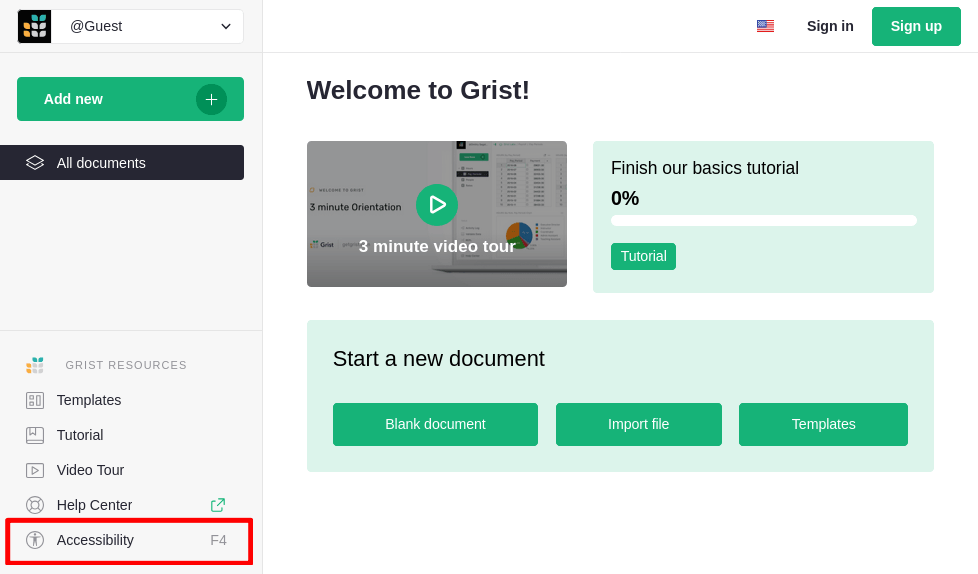

This page is about how to use Grist if you have disabilities. If you are interested in how to author accessible Grist documents, see the [creating accessible Grist documents](accessible-content.md) page.

Our goal is to make Grist usable by everyone, which means:

- if you have visual impairments,
- if you are not able to use a mouse, and rely exclusively on the keyboard to navigate the interface,
- if you are not able to read, and rely on specific tools to navigate, like screen readers,
- more globally: _everyone!_

But Grist is a relatively complex web application, so there are a few specific things to know in order to use it in those cases.

## The accessibility modal dialog

First things first: right in Grist, you can find information about accessibility by opening the accessibility modal dialog. It briefly mentions most of what is explained in this page, right in Grist.

You can open the dialog by pressing `F4`, or by clicking on the "Accessibility" menu item in the left-hand navigation panel:

## High contrast theme

Through the accessibility dialog, or in your profile settings, you can activate the "Light (high contrast)" theme. This theme makes the Grist green color shade more pronounced and generally makes some visual elements easier to read.

  

    <figure>
      
      <figcaption>Default theme</figcaption>
    </figure>
    <figure>
      
      <figcaption>High contrast theme</figcaption>
    </figure>
  

  <button class="glider-prev" aria-label="Previous theme slide">«</button>
  <button class="glider-next" aria-label="Next theme slide">»</button>
  

## Keyboard navigation

By default, keyboard navigation is "stuck" in the current widget (a table, for example). You navigate with the keyboard like in any other spreadsheet application, with arrow keys, <code class="keys">*Tab*</code>, <code class="keys">*Enter*</code>, etc.

There are specific keyboard navigation shortcuts that you can discover in Grist by pressing <code class="keys">*F1*</code>. They are also listed on the [keyboard shortcuts page](keyboard-shortcuts.md).

The few specific keyboard shortcuts that are especially useful if you need to use Grist _exclusively_ with the keyboard are the ones described below.

### Navigate through panels and widgets

<code class="keys">*Ctrl* + *O*</code> (or <code class="keys">*⌃* *O*</code> on Mac) and <code class="keys">*Ctrl* + *Shift* + *O*</code> (<code class="keys">*⌃* *⇧* *O*</code>) allow you to tab through panels and widgets.

When you are on a Grist document page, this is the **only way** to reach UI elements inside panels with the keyboard. Until you use these shortcuts, pressing <code class="keys">*Tab*</code> or an arrow key moves the cursor inside the current widget.

That means, to reach the following with the keyboard:

- The site dropdown, located in the top left corner of the interface,
- The "Access Rules" button, located in the bottom left corner of the interface,
- The document name input, located in the header,
- The sharing menu button, located in the header,

you must first use this "panel switching" shortcut to enable keyboard navigation in the desired panel.

Here is a quick demo showing keyboard presses in real time:

<video src="../images/accessibility/grist-control-o-shortcut.mp4" controls></video>

As soon as you focus on panel, you can press <code class="keys">*Tab*</code> and <code class="keys">*Shift* + *Tab*</code> to navigate through interactive elements inside the panel, as in any other website.

When focused inside a panel, you can press <code class="keys">*Escape*</code> to focus back the panel itself, and <code class="keys">*Escape*</code> again to switch focus back to the current widget.

#### Creator panel

The creator panel, which is the panel on the right that allows you to configure widgets and columns, can be focused with a specific keyboard shortcut. <code class="keys">*Ctrl* + *Alt* + *O*</code> (or <code class="keys">*⌃* *⌥* *O*</code> on Mac) toggles focus between the current widget and the creator panel, opening the panel if necessary.

### Open next or previous page

<code class="keys">*Alt* + *↓*</code> (or <code class="keys">*⌥* *↓*</code> on Mac) and <code class="keys">*Alt* + *↑*</code> (or <code class="keys">*⌥* *↑*</code> on Mac) allow you to open the next or previous page directly, without having to "tab your way through" the left panel's interactive elements every time.

## Screen readers

!!! warning "Note"
    Screen reader compatibility in Grist is currently a work-in-progress as of 2026. "Beta" support will be available soon. The documentation below will be relevant once beta support is available.

### Browser and screen reader support

We expect to support these browser and screen reader pairs:

- Firefox with NVDA or VoiceOver
- Chrome with NVDA, VoiceOver or JAWS
- Edge with NVDA or JAWS

Safari support is not planned at the moment, due to technical limitations.

### Things to know

- If you use VoiceOver on a Grist document page, it is advised to disable Quick Nav mode.
- If you use NVDA or JAWS, on a Grist document page, it is advised to stay in focus mode.
- After loading a Grist document page, it is advised to stop the automatic vocalization once, for example by pressing <code class="keys">*Control*</code> with NVDA. This is to avoid "noise" produced by the screen reader when the document is loading, that gets in the way of grid navigation vocalization.

### "Screen reader improvements" mode

By pressing <code class="keys">*Shift* + *F4*</code>, or through the accessibility dialog or profile settings, you can toggle the "Screen reader improvements" mode. This mode is not required for Grist to work with screen readers, but rather changes behaviour when we think it would be useful for screen reader users.

When the "Screen reader improvements" mode is enabled:

- Pressing <code class="keys">*Enter*</code> to edit a cell doesn't move the cursor below the cell.