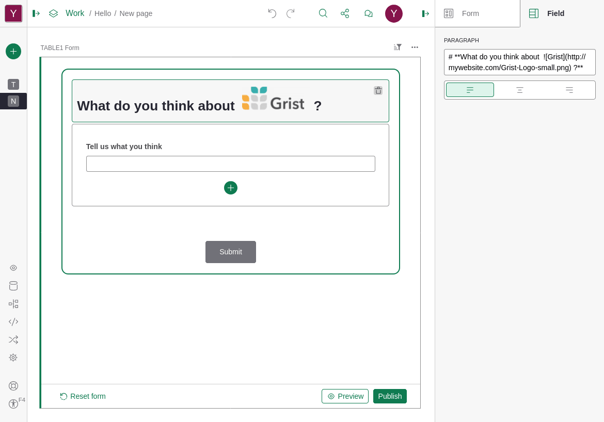
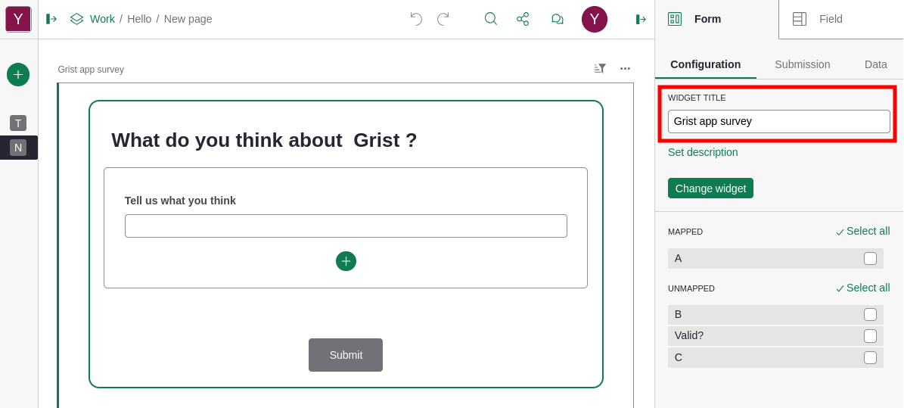
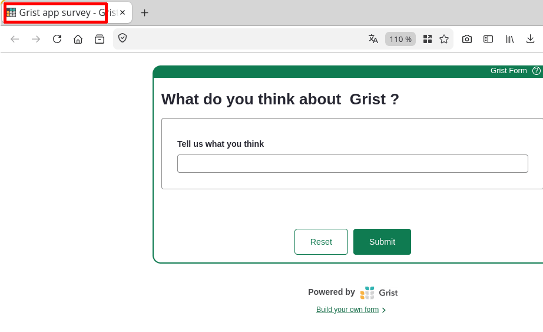

This page is about how to author accessible Grist documents. If you are interested in how to use Grist if you have disabilities, see the [Accessibility: using Grist](accessibility.md) page.

## Accessible documents?

A good practice to keep in mind when authoring content online is to make sure _everyone_ can perceive and understand it, whatever their disabilities.

For example, that means thinking of deaf people and writing a text transcription or subtitles when making a video. Or thinking of blind people and providing text descriptions of your images that can be read by speech synthesis tools.

That is what we mean when we talk about _accessibility_.

In Grist, we can think of a few things to create accessible documents.

## Colors

You can apply any color you want to column headers and cells, each time choosing a specific background color and a specific text color.

Here are examples of how colors can be perceived by people with different color blindnesses or low contrast sensitivity:

  

    <figure>
      
      <figcaption>1. True colors</figcaption>
    </figure>
    <figure>
      
      <figcaption>2. With protanopia (lack of red)</figcaption>
    </figure>
    <figure>
      
      <figcaption>3. With tritanopia (lack of blue)</figcaption>
    </figure>
    <figure>
      
      <figcaption>4. With achromatopsia (lack of all colors)</figcaption>
    </figure>
    <figure>
      
      <figcaption>5. With low contrast sensitivity</figcaption>
    </figure>
  

  <button class="glider-prev" aria-label="Previous theme slide">«</button>
  <button class="glider-next" aria-label="Next theme slide">»</button>
  

With these examples, we realize that:

- **high contrast** between colors is important. In multiple pictures, the first column content is hard or very hard to read. When in doubt, use a [color contrast checker](https://coolors.co/contrast-checker/),
- **avoid using color alone to convey information**. The third column, which just has green cells or red cells to show if the line is "valid" for us or not, is not enough. In multiple pictures, we cannot understand whether the color means "valid" or "invalid". The fourth column adds a _check_ icon in the cell in addition to the color, making it accessible: even if I can't perceive the color, I can see the checkmark.

One additional tip:

- when specifying column header colors or cell colors, we advise on always choosing a pair of background + text color, and not only a background color or only a text color. This makes sure your choices are always applied, whatever the theme people use to read your document (light theme, dark theme or high contrast theme).

## Images

As soon as you insert images in your content, you should think of blind people and people with low vision. If I'm blind, I use an additional tool to understand content, like a _screen reader_: it vocalizes, with speech synthesis, the content of the page. Tools like that can read text without issue, but can't guess what your images mean.

In Grist, you can include images thanks to Markdown support in forms or text cells. Be sure to use the `` syntax. The "alt text" is what screen readers read aloud for people to understand the image.

To choose a good alt text, try to remove the image: what visible text would you write instead? In the example below, "Grist" is the correct alt to use. Not "Blue, yellow and gray logo with Grist next to it", not "Grist logo". It's "Grist", because without the image, you would say "What do you think about Grist?".

## Forms

### Page title

When publishing a form, watch out for the form page title. You can edit it by changing the _widget title_ in the form configuration:

This title is used as the form page title in the browser. This title is very important for people using assistive technologies like screen readers to understand on what page they are.

