# Admin Controls

Grist Admin Controls provide a comprehensive view of users and resources in a Grist
installation. It is available on Enterprise plans, whether managed by Grist Labs or hosted on your
own servers.

## Accessing Admin Controls

Admin Controls are only available to the Grist [installation
administrator](self-managed.md#what-is-the-administrative-account). When signed in as the
administrator account on your site, open the Admin Panel either from the "Grist Resources" section
in the bottom-left of the screen, or from your user dropdown menu.

*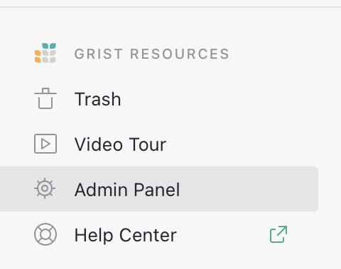*
{: .screenshot-half }

*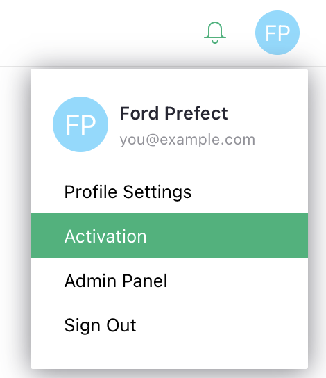*
{: .screenshot-half }

The Admin Panel opens to the "Installation" page with configuration options for the installation.
Below that, the left-side panel lists "Admin Controls", with pages for Users, Orgs, Workspaces,
and Documents.

*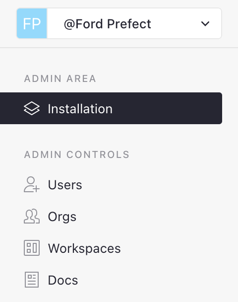*
{: .screenshot-half }

## Users Page

The "Users" page lists all users in your installation. Details include:

- `Name`
- `Email`
- `First Login`: when the user signed in for the first time.
- `Last Connection`: the last time the user connected.
- `API Key`: whether the user created an API key (the actual API key is not shown).
- `Orgs` / `Workspaces` / `Docs`: how many of each type of resource this user has access to.

Click on the link in the Name column, or use the "Show details" button to expand details for the
selected user. You can also open details by pressing <code class="keys">*Space*</code> key. Details
include a card with the user information, and listings of organizations, workspaces, and
documents which this user can access. Each row shows the access level the user has to that
resource, and details for the resource.

*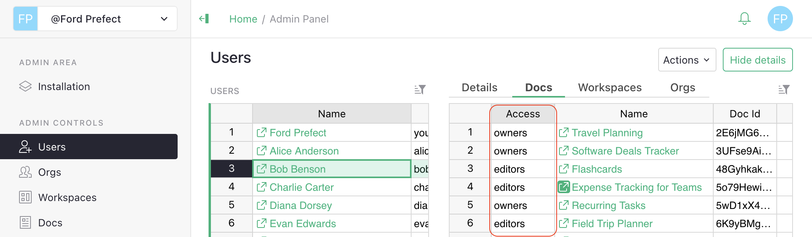*

### Removing a user

A special action available on the Users page is "Remove user". You can access it from the
"Actions" button when details are expanded, or from the row menu or cell context menu on a user's
row as an "Actions > Remove user" item.

*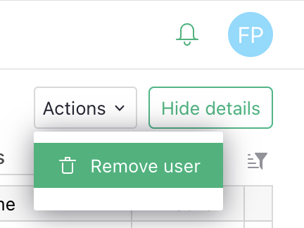*
{: .screenshot-half }

*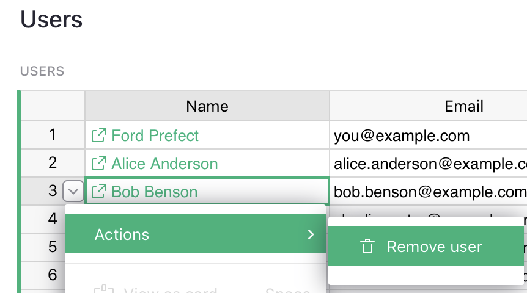*
{: .screenshot-half }

Removing a user deletes that user entirely from everywhere on your site. This operation cannot be
reverted. You have to confirm the deletion by typing in the user's email address.

*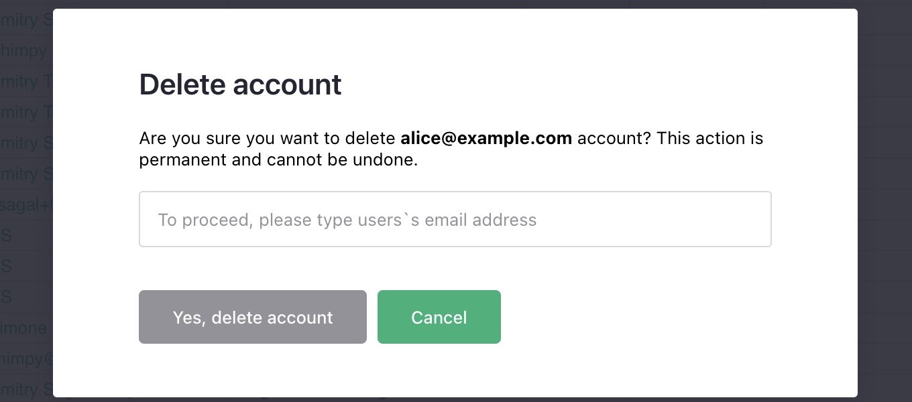*
{: .screenshot-half }

If that user owns team-site resources, you'll be offered an option to pick a different user who
will replace the deleted user on any resources that they had owner-level access to. By default,
you (the installation administrator) will become an owner on all such resources.

*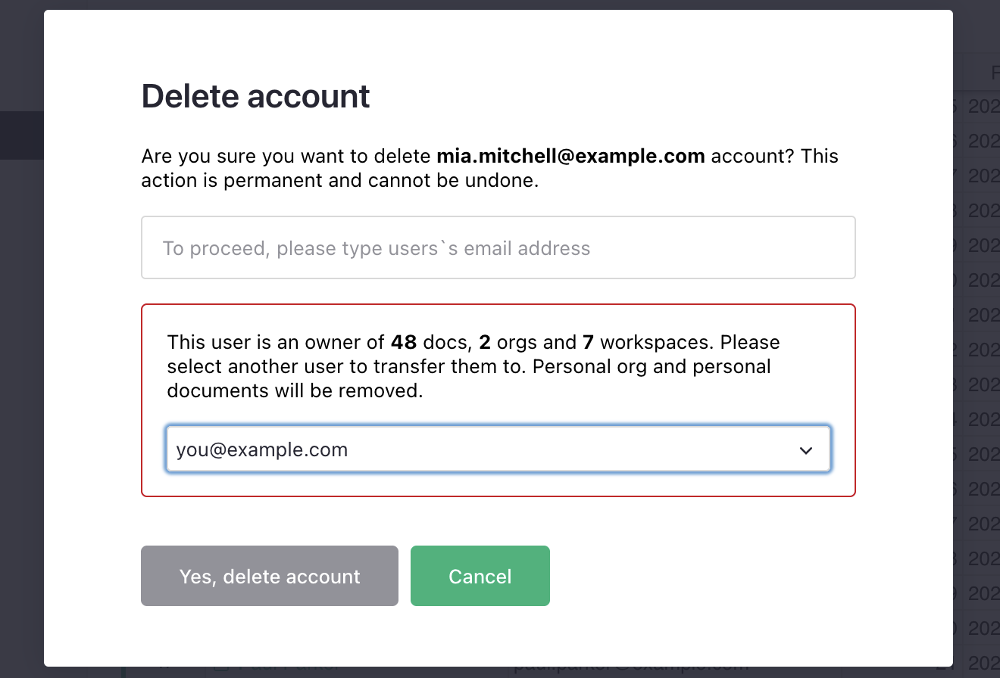*
{: .screenshot-half }

Note that the user's personal site (supported on some configurations), including all workspaces
and documents in it, will be deleted entirely when a user is removed. There is no option to
preserve personal site materials when removing a user.

## Resources

The remaining three pages list the three types of resources that users may access:
organizations, workspaces, and documents.

### Organizations

Grist allows a single installation to host multiple "organizations", also called "team sites",
each with its own set of team members, workspaces, and documents. It is most common for an
Enterprise account to have just a single team site, but Admin Controls includes a listing of
organizations whether there is one or several.

In addition, every user by default has an associated "personal site", which is just another
organization with a single member.

The "Orgs" page lists all organizations in your installation. In addition to basic info, it shows
the number of workspaces, documents, and users in the organization. The "Guests" column shows
the count of users who are not members of the organization but have been given access to one of
the documents inside it.

### Workspaces

An organization contains workspaces, which contain Grist documents. The "Workspaces" page lists
all workspaces across all organizations (including personal sites). In addition to basic info, it
shows the number of documents in the workspaces, and users who have access.

The "Guests" column shows the count of users who are not members of the organization but have been
given access to one of the documents inside this workspace.

In addition, the column "Extra Doc Users" shows the count of organization members who have not been
given access to this workspace but have been given access to at least one of the documents in it.

### Documents

A document is the main workhorse of Grist. The "Documents" page lists all documents across all
organizations (including personal sites). In addition to basic info, it shows various other fields
of interest:

- `Users`: how many organization members have access to this document.
- `Guests`: how many users outside the organization have access to this document.
- `Public`: is this document publicly link-shared (can be opened by anyone who has the link).
- `Usage Rows`, `Usage Data Bytes`, `Usage Attachment Bytes`: document
  usage data, as shown in the Raw Data page (see [Usage](raw-data.md#usage)). It is not real-time,
  but is updated periodically while a document is open.

*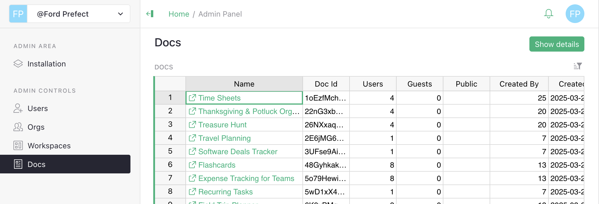*

### Shared functionality for all resources

The pages for all three types of resources share common functionality.

Click on the link in the "Name" column, use the "Show details" button, or press the <code
class="keys">*Space*</code> shortcut to expand details for the selected resource.

Details include a card with the resource information, listings of contained material, and listing
of users with access. For an organization, details will include listings
of workspaces and documents. For a workspaces, details will include the contained documents.

The "Users" tab shows all users who have access to the selected resource, with their access level
in the first column.

*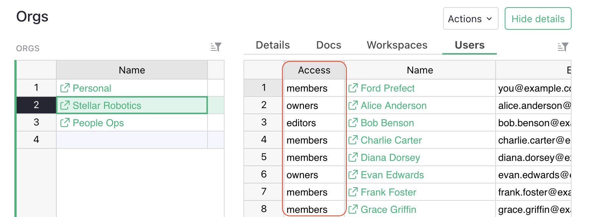*

Note that all tables support the usual Grist functionality of sorting and filtering. You can also
resize and reorder columns, but note that view changes do not persist.

Two actions are available for each resource. These may be accessed from the "Actions" button when
details are shown, or from the row menu or cell context menu in the main resource list.

*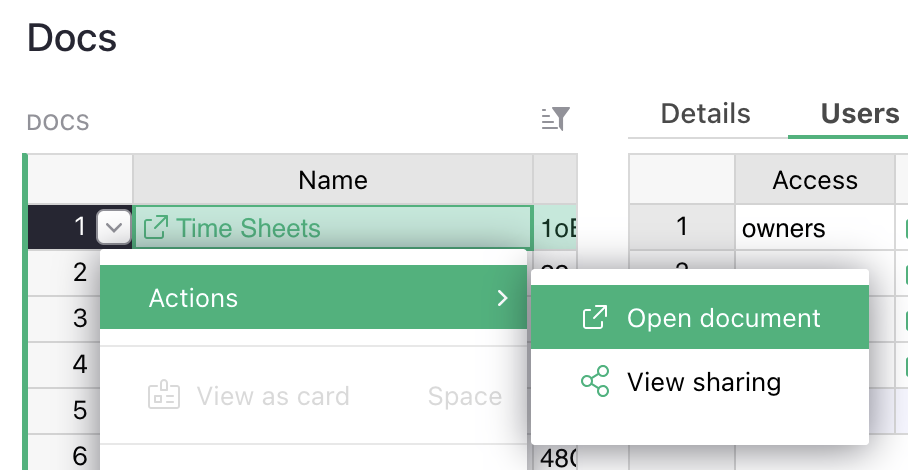*
{: .screenshot-half }

The action `Open organization` / `Open workspace` / `Open document` opens the given resource in a new
page. Note that normal permissions apply. If you, signed in as the administrator, have not been
added to this resource, you will see an "Access denied" or "Not found" page.

*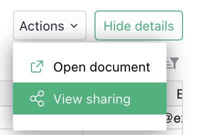*
{: .screenshot-half }

The action `View sharing` opens the sharing dialog for that resource in view-only mode. It does
not allow changing access. It offers data similar to that available in the "Users" tab for the
resource, in in an interface similar to the usual Grist sharing dialog.
