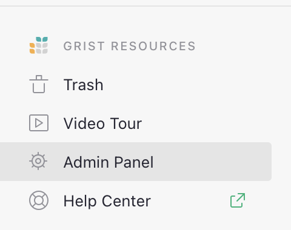
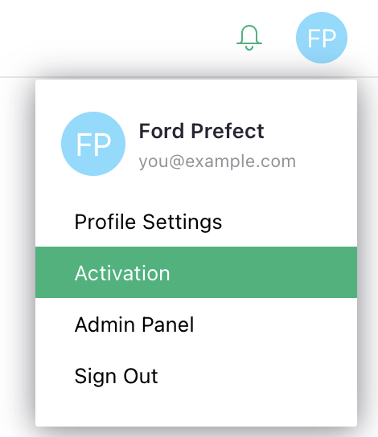

# Admin Panel

Your Grist installation can be managed from the Admin Panel. It is available for all self-hosted instances of Grist as well as all Enterprise plans, whether managed by Grist Labs or hosted on your own servers. The Admin Panel is only available to the Grist [installation administrator](self-managed.md#what-is-the-administrative-account).

When signed in as the administrator of your site, open the Admin Panel from either the 'Grist Resources' menu at the bottom-left of the screen, or from the user dropdown menu.

**
{: .screenshot-half }

**
{: .screenshot-half }

## Settings

The Installation page is where you can configure installation settings including [Telemetry](telemetry.md), Security Settings and Versioning. If you are on an Enterprise plan, you'll also have access to [Audit Logs](install/audit-log-overview.md).

## Admin Controls

Grist Admin Controls provide a comprehensive view of users and resources in a Grist installation. It is available on all Enterprise plans, whether managed by Grist Labs or hosted on your own servers. Learn more about [Admin Controls](admin-controls.md).

