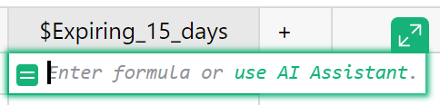
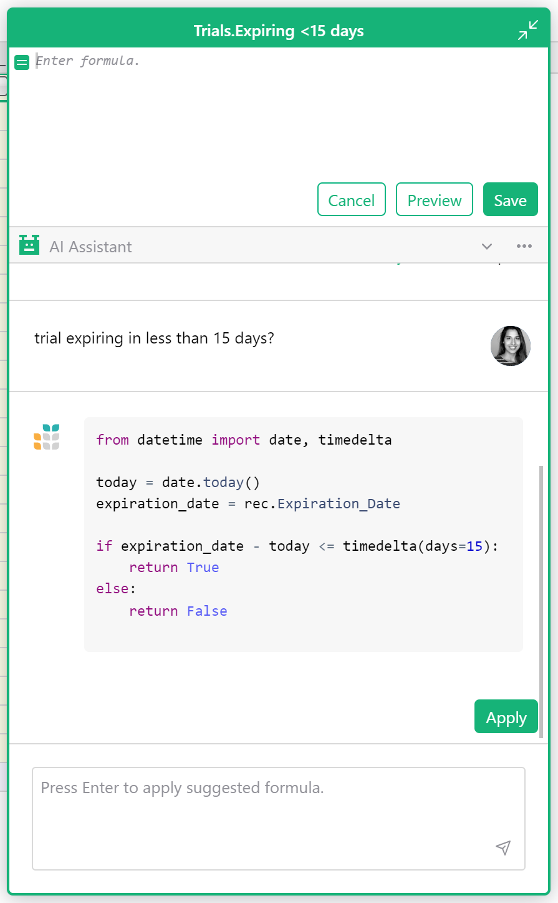
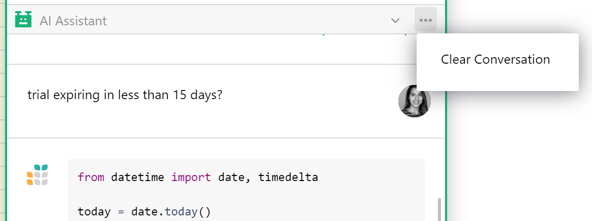

AI Formula Assistant
==============

Grist’s AI Formula Assistant simplifies the hardest part of spreadsheets — formulas. The assistant only does one thing, write formulas in response to plain language queries. 

When asking the assistant a question there’s no need to specify column IDs or explain the structure of your data. When you submit a question to the assistant, Grist sends your question and your data’s schema (in part or whole) to [OpenAI](https://openai.com/){:target="\_blank"} so that the assistant may better understand your document. You can view your data’s schema in [code view.](formulas.md#code-viewer) 

No data is shared with OpenAI unless a user submits a question to the assistant. Learn more about [how data is used](ai-assistant.md#data-use-policy).

## How To Use the AI Assistant

Create a [formula column](formulas.md) and click either the expand icon or the “use AI Assistant” link text in the cell. 

**
{: .screenshot-half }

This will open an expanded formula editor with the AI Assistant chat below it. Simply describe what you want the formula to do. [Here are some tips.](ai-assistant.md#best-practices)

When you apply a suggested formula, you will see the formula previewed in the column. If you are happy with the formula, click “Save”. Otherwise click “Cancel” to discard changes to the formula.

**
{: .screenshot-half }

## AI Assistant for Self-hosters

For self-hosters looking to connect their Grist instance, set the [AI Assistant-related environment variables](https://github.com/gristlabs/grist-core#ai-formula-assistant-related-variables-all-optional){:target="\_blank"}. 

The above variables also enable the use of the LLaMA family of self-hostable models via [llama2-cpp-python](https://github.com/abetlen/llama-cpp-python){:target="\_blank"}.

Learn more about [self-managing Grist](self-managed.md). 

## Pricing for AI Assistant

Free personal and free team plans have 100 AI Assistant credits (or requests). For free team sites, that applies to the whole team. 

[Pro plans](https://www.getgrist.com/pricing/){:target="\_blank"} include 100 AI Assistant credits per month. The credits automatically top up to 100 every billing cycle. Credits apply to the whole team. It costs one credit per chat message sent. If you need more credits, there are two upgrade options:

* 500 monthly credits for $10 per month (per team, not per person)
* 2,000 monthly credits for $29 per month (per team, not per person)

## Best Practices

* It helps to understand how [formulas](formulas.md) work in Grist, especially when compared to traditional spreadsheets. In Grist, a single formula applies to a whole column.  If you’ve worked with spreadsheets before, you may be surprised that you don’t need to specify row numbers, like `B1 * C1`. If you’re new to Grist, you might want to try something simple without the assistant to see how formulas behave, e.g. `$Price * $Tax`.  

* Setting a column header before submitting a question improves results. For example, “Net Profit” provides more context than a column labeled “D”.

* Set the [column type](col-types.md) of the formula column before asking the assistant for help. This helps the assistant guess what type of values you’d like returned.

* Think about the type of value you expect to see in the formula, and frame the question with that in mind. For example, if you want a formula that returns True or False in a [Toggle column](col-types.md#toggle-columns), ask a yes-or-no question. Otherwise, the assistant may suggest a formula that lists all rows where something is true (and is technically correct), but you were hoping for a simple true or false per row.

* The assistant is conversational. If you are not satisfied with a suggested formula, explain to the assistant where the formula fell short and ask it to make a change.

* Sometimes the assistant gets stuck on a bad idea. If it keeps insisting on a particular formula method, consider clearing the conversation and starting over. Click the three dot menu in the AI Assistant header to clear a conversation. 

**
{: .screenshot-half }

* Remember that Grist formulas apply to the whole column. If you want sums of rows, you need a [summary table](summary-tables.md). You may add more formulas to summary tables, and ask the assistant to help you.

## Data Use Policy

Your query and document schema are sent to [OpenAI](https://openai.com/){:target="\_blank"}. Grist’s AI Formula Assistant uses the gpt-3.5-turbo model, aka ChatGPT. OpenAI’s [Privacy Policy](https://openai.com/api-data-privacy){:target="\_blank"} describes how OpenAI handles your data. OpenAI’s [Content Policy](https://labs.openai.com/policies/content-policy){:target="\_blank"}, [Usage Policies](https://openai.com/policies/usage-policies){:target="\_blank"} and [Sharing and Publication Policy](https://openai.com/api/policies/sharing-publication/){:target="\_blank"} describe how the Grist AI Assistant and its results may be used and shared. Those who violate OpenAI's policies may lose access to Grist's AI assistant.

Certain Grist Labs employees may also examine logs of assistant requests (questions and document schema) to learn what is working and what is not, in order to provide a better service.