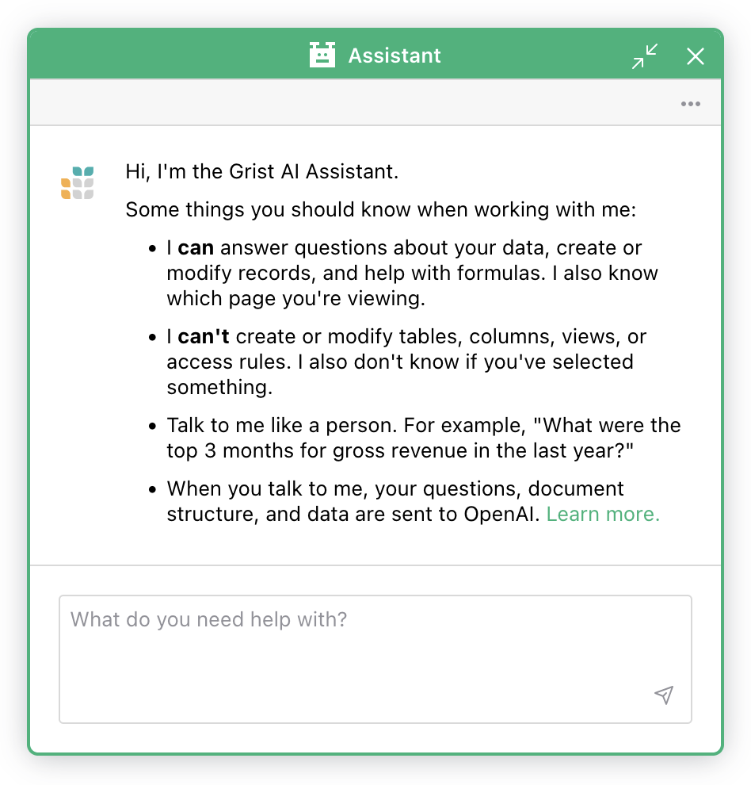

Assistant
==============

Grist’s AI Assistant can answer questions about your data, create or modify records, and help with formulas!

When asking the Assistant a question, there’s no need to specify column IDs or explain the structure of your data. When you submit a question to the assistant, Grist sends your question, your data’s schema and the data itself to [OpenAI](https://openai.com/){:target="\_blank"} so that the assistant may better understand your document.

The Assistant:

* **Can** answer questions about your data, create or modify records, and help with formulas. It also knows which page you're viewing.
* **Can't** create or modify tables, columns, views, or access rules. It also doesn't know if you've selected something.

No data is shared with OpenAI unless a user submits a question to the assistant. Learn more about [how data is used](assistant.md#data-use-policy).

## How to use the Assistant

The Assistant is available under the 'Tools' menu in the left-hand navigation panel.

**
{: .screenshot-half }

This opens the Assistant panel — a chat-style interface where you can ask for help with formulas, data transformation, data analysis, and more. Simply describe what you're trying to do, and the assistant will guide you through it.

**
{: .screenshot-half }

## Pricing for the Assistant

Free personal and free team plans have 200 Assistant credits (or requests). For free team sites, that applies to the whole team. 

[Pro plans](https://www.getgrist.com/pricing/){:target="\_blank"} include 100 Assistant credits per month, [Business plans](https://www.getgrist.com/pricing/){:target="\_blank"} include 2,000 credits per month and Enterprise plans offer customizable credit limits. Credits reset to the plan's monthly amount at the start of each billing cycle and are shared across the team. Each chat message costs one credit. If you need more credits, there are two upgrade options:

* 500 monthly credits for $10 per month (per team, not per person)
* 2,000 monthly credits for $29 per month (per team, not per person)

## Data use policy

When you use the Assistant, your query, document schema, and data are sent to [OpenAI](https://openai.com/){:target="\_blank"}. The Assistant uses the gpt-4o model, aka ChatGPT. OpenAI's [Privacy Policy](https://openai.com/api-data-privacy){:target="\_blank"} describes how OpenAI handles your data. OpenAI's [Content Policy](https://labs.openai.com/policies/content-policy){:target="\_blank"}, [Usage Policies](https://openai.com/policies/usage-policies){:target="\_blank"} and [Sharing and Publication Policy](https://openai.com/api/policies/sharing-publication/){:target="\_blank"} describe how the Assistant and its results may be used and shared. Those who violate OpenAI's policies may lose access to the Assistant.

Certain Grist Labs employees may also examine logs of assistant requests (questions, document schema, and data) to learn what is working and what is not, in order to provide a better service.

## Assistant for self-hosters

For self-hosters, the Assistant is available on [Enterprise](https://www.getgrist.com/pricing/) plans. Learn how to [enable Grist Enterprise](https://support.getgrist.com/self-managed/#how-do-i-enable-grist-enterprise). Our [Legacy Formula AI Assistant](ai-assistant-legacy.md) remains available to self-hosters on the [Community edition](https://github.com/gristlabs/grist-core){:target="\_blank"}.

For self-hosters looking to connect their Grist instance, set the [AI Assistant-related environment variables](https://github.com/gristlabs/grist-core#ai-formula-assistant-related-variables-all-optional){:target="\_blank"}. 

The above variables also enable the use of other models (including self-hostable ones). See [these instructions](https://github.com/gristlabs/grist-core?tab=readme-ov-file#using-grist-with-openrouter-for-model-agnostic-and-claude-support){:target="\_blank"} for more information.

Learn more about [self-hosting Grist](self-managed.md). 