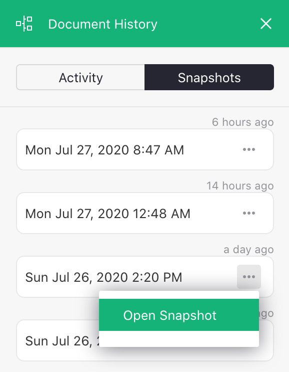
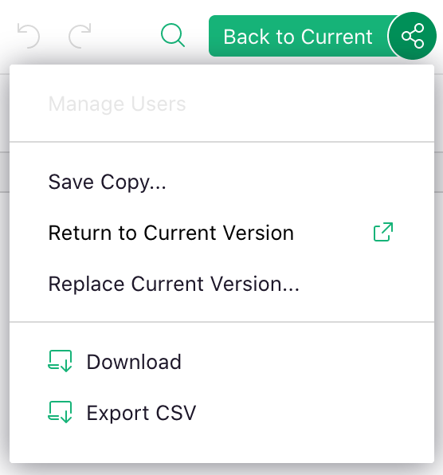

# Automatic Backups

Grist automatically saves backups of your documents as you work on them. These backups -- or
snapshots -- of the document can be examined at any time.

Grist retains more frequent snapshots of recent changes, and less frequent ones as you go back in
time. For example, hourly snapshots are retained for about a day, but monthly snapshots are
retained for more than a year.

## Examining Backups

To see the list of backups, click "Document History" in the left panel, then click the "Snapshots"
tab in the panel that opens on the right:

**
{: .screenshot-half }

You can open any of the listed snapshots to see the document as it existed at that time.

## Restoring an Older Version

While examining a snapshot, the "Share" menu has additional options;

**
{: .screenshot-half }

Use the "Replace Current Version" option to revert your document to the version you are looking at.

You can also save the snapshot as a new document using the "Save Copy" option.

## Deleted Documents

When you delete a document, its history of backups is deleted with it. While the document is in
Trash, you can still restore it for 30 days. If you do, you will find all the historical snapshots
still there.

If you choose "Delete Forever" for a document in Trash, or when a document in Trash is
automatically purged after 30 days, the backups will be deleted forever with it.
