Automations
==============

Automations in Grist let you drive workflows triggered by changes in your data – without manual intervention. Starting with a conditional trigger, you can assign actions that send dynamic emails to collaborators, or connect to external services that power larger workflows. These automations run in the background, keeping teams notified and eliminating redundant tasks.

Document owners can access automations from the 'Tools' menu in the left-hand navigation panel.

*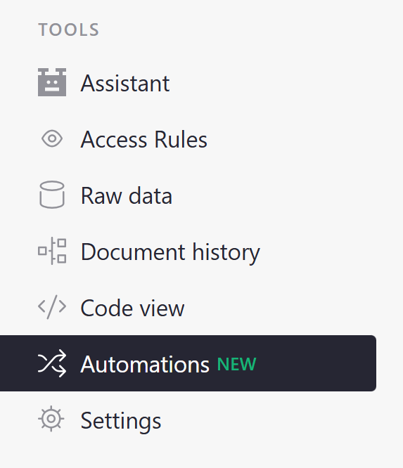*
{: .screenshot-half }

## Creating triggers

To create an automation, click the green 'Create new trigger' button.

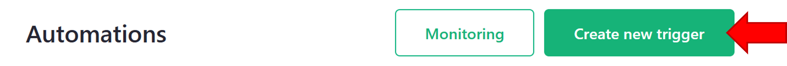

In the popup, give the trigger a name and select the table where it should check for updates.

*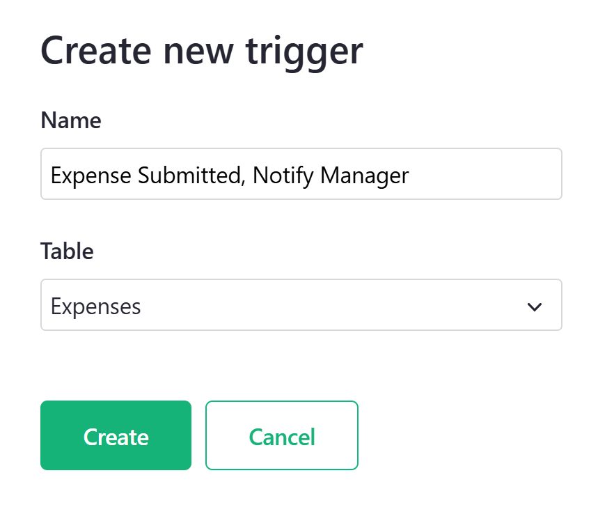*
{: .screenshot-half }

There are three sections for customizing your trigger: General, Condition and Actions.

### General

You can modify the name of the trigger, add a description and update the table where the trigger is checking for changes.

*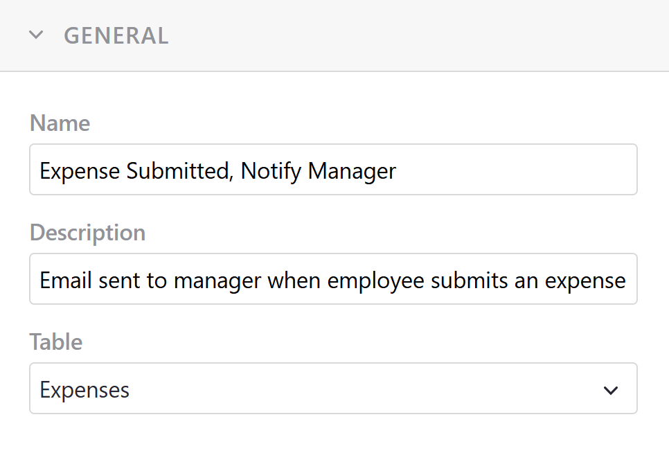*
{: .screenshot-half }

### Condition

This is where you will specify which conditions need to be met in order for the automation to trigger.

For example, we have a document where employees submit expense records to their manager for review. Let's set up an automation that emails the manager when the value in the **Status** column is "Submitted for review".

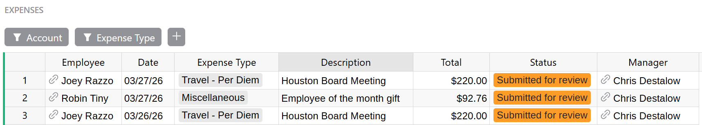

Because we only want this to trigger when the **Status** column is "Submitted for review", we add a filter for the **Status** column and uncheck all other values.

*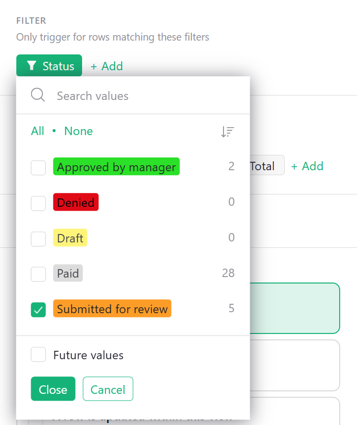*
{: .screenshot-half }

Notice that the [Raw Data](raw-data.md) view highlights all rows that are included in the applied filter(s).

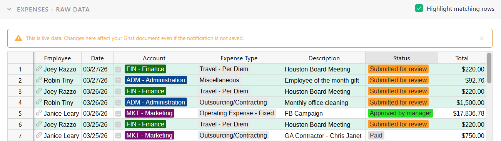

You have the option to set required columns. A row won't trigger until these columns are filled in.

You can also add a custom filter using Python.

*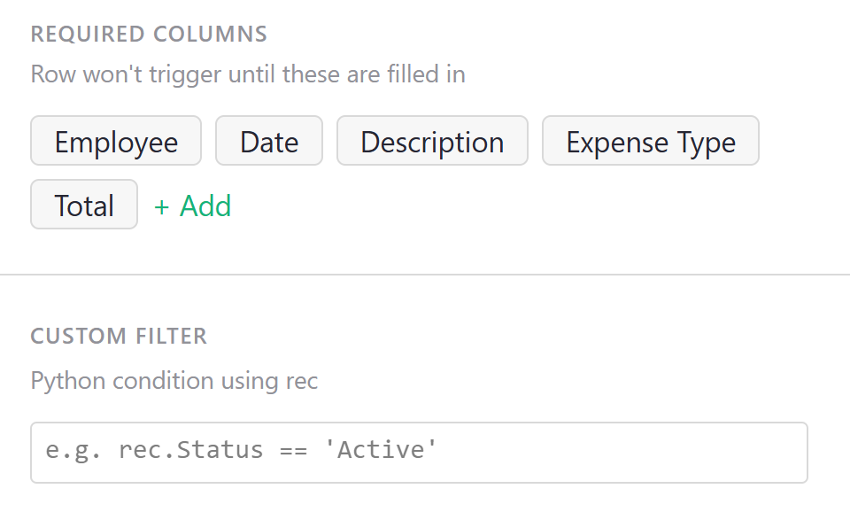*
{: .screenshot-half }

Finally, we specify when to be notified about a row in this view. For our example, we want to notify the manager when a row's **Status** changes to "Submitted for review", meaning "A row enters this view".

*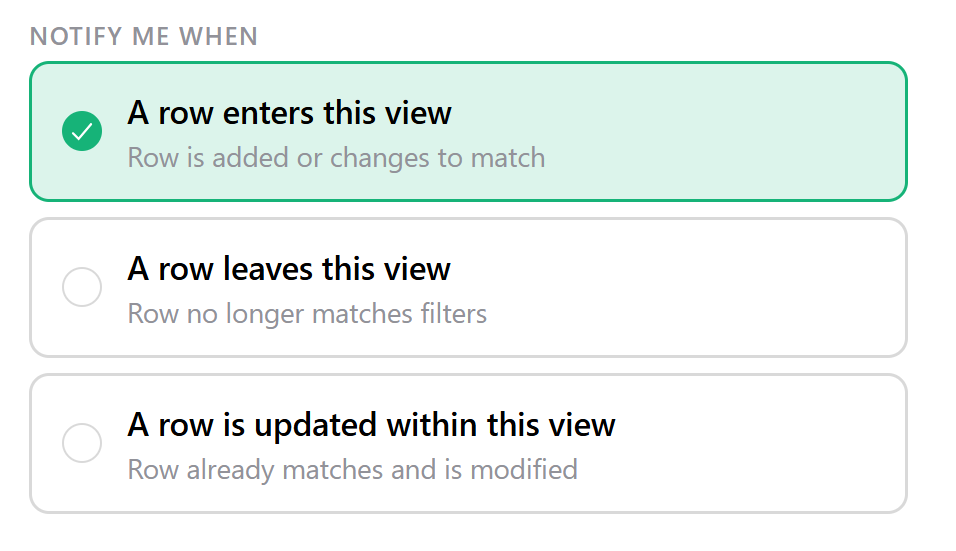*
{: .screenshot-half }

### Actions

Next, we specify what action should occur when the conditions above are met. When you click '+ Add Action', you'll have two options: 'Send an email' or 'Create a webhook'.

*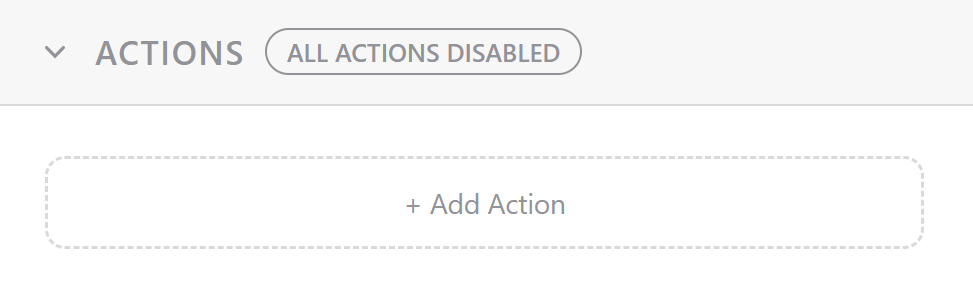*
{: .screenshot-half }

#### Send an email

!!! warning "Only users with access to a document will receive emails."

Continuing with our example from above, we want to send an email to an employee's manager when an expense is submitted for review. This utilizes the 'Dynamic recipient' option.

*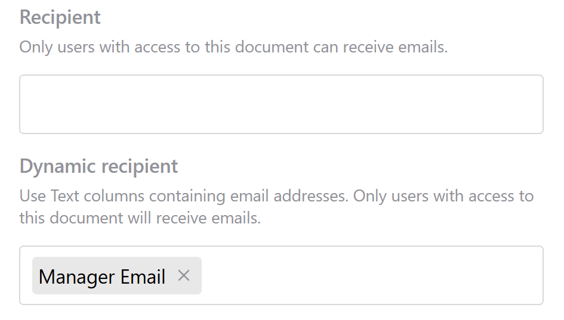*
{: .screenshot-half }

**Manager Email** is a column in the *Expenses* table that captures the email address of the Employee's manager. An email will be sent to the email in this column when the condition for the trigger is met, when the **Status** changes to 'Submitted for review'.

*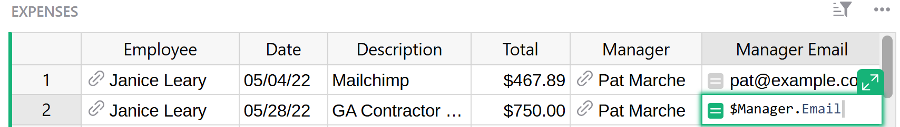*

Enter a subject and body for your email. Both support variable placeholders. The email body also supports [Markdown](https://www.markdownguide.org/basic-syntax/) formatting. 

*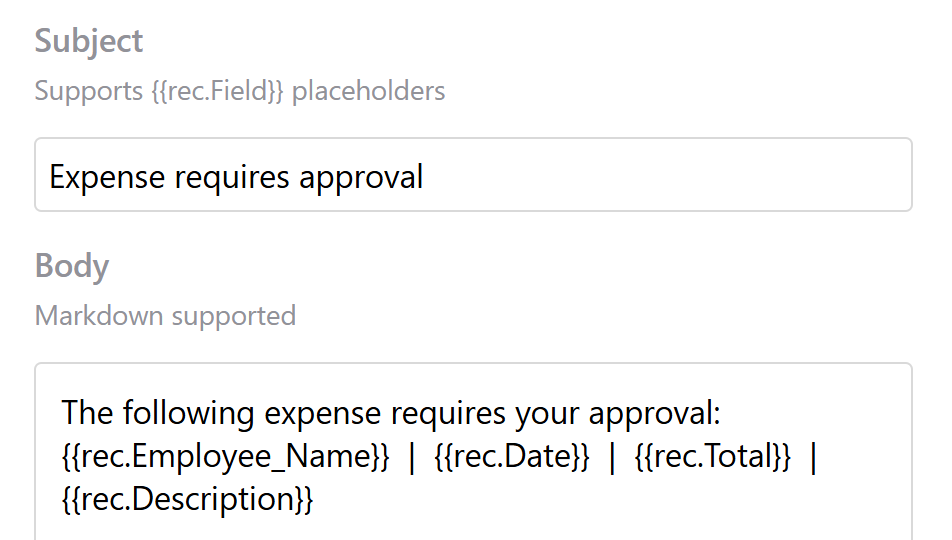*
{: .screenshot-half }

It is important to reiterate that only users with access to the document will receive emails.

#### Create a webhook

Learn more about [Webhooks](webhooks.md).

## Monitoring automations

Automations can be monitored in two places; on an individual trigger or on the Monitoring page.

To monitor all automations, click the 'Monitoring' button at the top of the 'Automations' page.

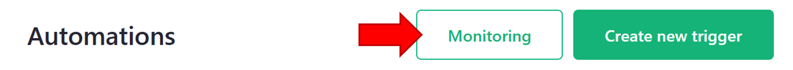

The 'Delivery log' includes details for any actions including if the action was successful or rejected as well as any errors. Any actions that are queued will appear in the 'Pending' view.

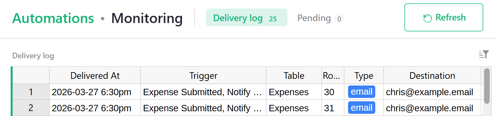

You can also monitor at the trigger level. Changes to data can be made in the Raw Data view when modifying a trigger. **This is a live view of your data. Any changes here will affect your data, even when the trigger is disabled**.

*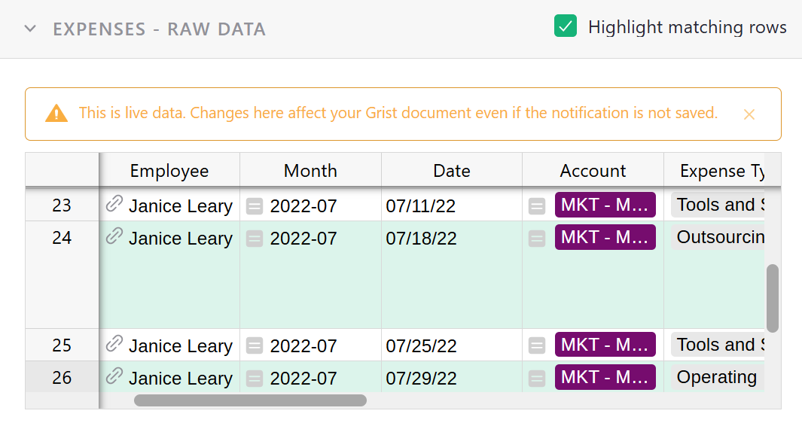*
{: .screenshot-half }

When you make a change to the Raw Data view and your automation is triggered, you'll see details appear in the 'Action Monitor' window. When the trigger is disabled, you will see that any Send Email action shows a 'BLOCKED - TRIGGER DISABLED' tag.

*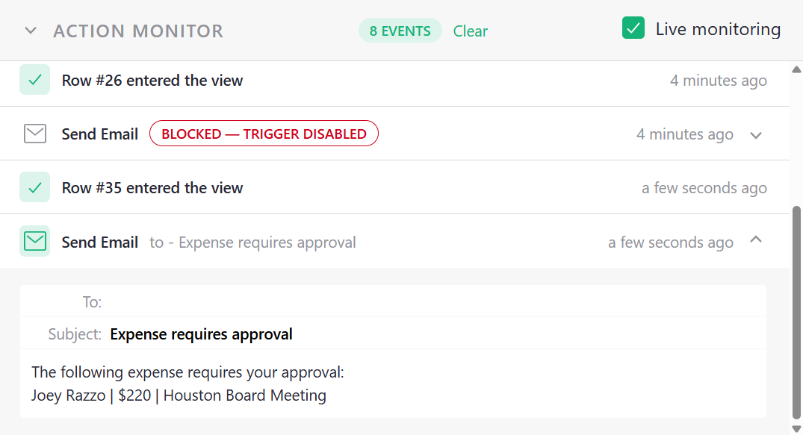*
{: .screenshot-half }