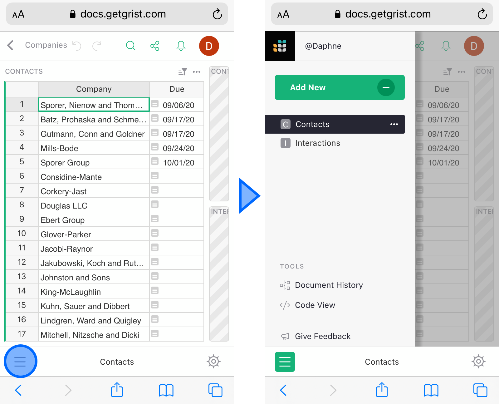
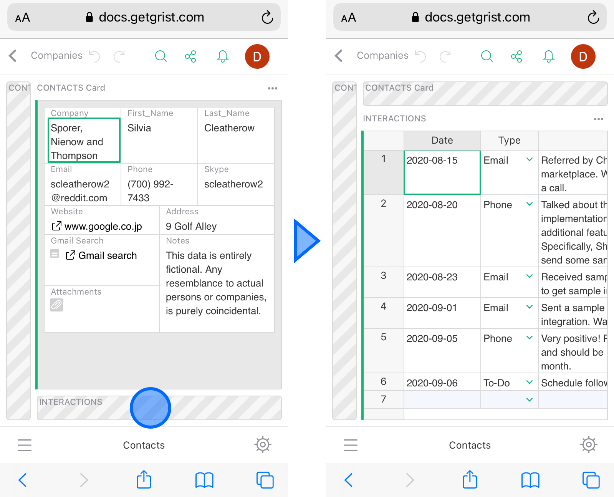

# Browser Support

Grist is officially supported and regularly tested on modern Firefox and Google Chrome browsers on
all desktop platforms. These are available here:

- <a href="https://www.mozilla.org/en-US/firefox/new/">Get Firefox</a>
- <a href="https://www.google.com/chrome/">Get Chrome</a>

Other modern browsers will work to the degree they are standards compliant. In particular, Grist
is reported to work on modern Safari and Microsoft Edge. If you encounter errors or unexpected
behavior on these browsers, we encourage you to report them to us by emailing us at <support@getgrist.com>.

## Mobile Support

You can use Grist quite comfortably in mobile browsers such as Chrome, Safari, and Firefox.

On small screens, you can find the list of pages from the button in the bottom bar.

**

For pages with multiple widgets, only the active widget is expanded. Other widgets are collapsed until you touch to expand them.

**

To edit a cell, simply double-tap it.

Mobile support is still a work in progress. To get back to the desktop version on a mobile device, open your account menu, and select “Toggle Mobile Mode” option:

**
{: .screenshot-half }
