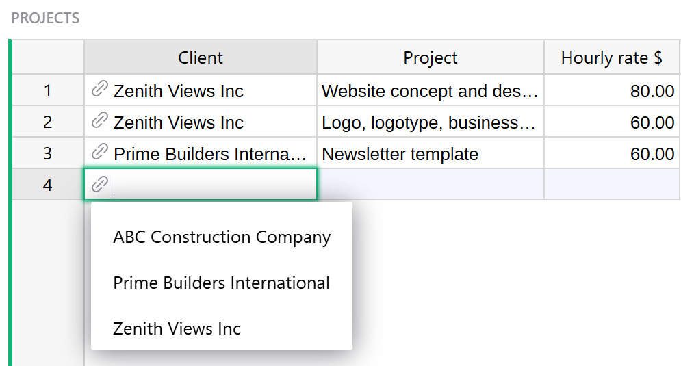

<iframe width="560" height="315" src="https://www.youtube.com/embed/fkn2YCxEvTc?rel=0" frameborder="0" allow="accelerometer; autoplay; encrypted-media; gyroscope; picture-in-picture" allowfullscreen></iframe>

# Reference and Reference Lists

## Overview

Reference and Reference List columns in Grist allow one table to create an explicit reference
to another. In the database world this is similar to a foreign key. In the spreadsheet world
this is similar to a `VLOOKUP`, but much more powerful and easier to use.

In this guide we'll use the term **underlying table** for the table that lists all available values,
and **referencing table** for the table that uses those values.

## Creating a new Reference column

Suppose we have a document with two tables, Clients and Projects.  The Clients table lists
our clients - names, contacts, signing dates - and the Projects table lists projects we do for
clients.

There are all sorts of things Grist can do for us if we let it know that the Client column
in the Projects table is referring to clients listed in the Clients table.  We can do this
by converting the Client column to a "reference column".  Open the Column Options side
panel (see [Specifying a type](col-types.md#specifying-a-type)) and set the "Column Type"
to "Reference".  Adjust the "Data from Table" option to be the correct table you want
to cross-reference, and the "Show Column" option to match which column of that table
you'd like to show.  Then hit "Apply" when you're happy with the result.

!!! note "Understanding the reference"
    The column value always references the entire **record** in the underlying table. The displayed
    value can be any column from that record, as selected in `Show Column`. You can also include
    additional columns to display as explained later.

In our example, you can see little link icons appearing in the Client
column cells, showing that they have been successfully cross-referenced with the Clients table.
Once the column type is set, you can start typing into it or double-click it to see a dropdown
list of all available values.

**
{: .screenshot-half }

Note that the table `Clients` and the column `Client` are related by the column type rather than
by name. They can be named anything.

!!! note "Spotting reference columns"
    You can tell that the values in a column represent a reference by the link icon that appears
    next to the values.

If you accidentally type in a value that is not present in the `Clients` table, its value will be
highlighted as invalid:

**
{: .screenshot-half }

## Adding values to a Reference column

Sometimes it's useful to add a new value to the dropdown list without having to switch to the
underlying table. Reference columns make it easy! Just type in the value you want add and select the
`+` value in the dropdown list. Grist will automatically add a new record containing this value to
the underlying table and insert the proper reference:

**
{: .screenshot-half }

## Converting Text column to Reference

When working with existing data, it's common to have existing text values that should really be
reference values. Don't worry, conversion is simple! Just change the column type to `Reference` and
Grist will automatically find and substitute matching values for references. If some values are not
found, they'll be shown as invalid. You can then either add them to the underlying table or select
the proper values for them.

In this example, the first three values match perfectly, but `Forest Labs` is invalid because it
doesn't exist in the `Clients` table:

## Including multiple fields from a reference

A big benefit of reference columns is that they allow you to easily bring in multiple columns from
the underlying table. In our example, if you wanted to bring in `$Client.Contact` to the `Projects`
table, you can just select the `Contact` column from the `Add Referenced Columns` section and it will be
automatically added to the `Projects` table:

If you're comfortable using formulas, you can see that the added column is just the formula
`=$Client.Contact`. If you were so inclined, you could achieve the same result by manually adding
the formula column. You can also use any other fields from `Clients` table by referencing `$Client`
in formulas in the `Projects` table.

Note that in formulas, we use the name of the reference *column* (`$Client`) to refer to a linked
record, not the name of the table (which is `Clients` here). Don't let the similarity of the names
in this example confuse you.

**
{: .screenshot-half }

!!! note "Using references in formulas"
    You may have noticed that the underlying table is `Clients` (plural) but the formula is
    `$Client.Contact` (singular). That's because the formula refers to the referencing column,
    **not** the underlying table. In our example, the referencing column is `Client`.

## Creating a new Reference List column

So far our example has only dealt with projects that have a single client. Suppose that
we also have projects with multiple clients, and we'd like to maintain references to
them all from the `Client` column of the `Projects` table.

We can let Grist know that the `Client` column contains multiple references by changing its
type to "Reference List". This column type can reference multiple records, and can also be
thought of as a multi-select.

Open the Column Options side panel (see [Specifying a type](col-types.md#specifying-a-type))
and set the "Column Type" of `Client` to "Reference List". Grist will automatically convert
any of your existing references to reference lists. Once you're happy with the result, just
hit "Apply" and the `Client` column will be ready to accept as many clients as your projects need.

## Editing values in a Reference List column

To make changes to a Reference List cell, simply double-click the cell or press the
<code class="keys">*Enter*</code> key after you have selected the cell you want to
edit. You can also start typing after selecting a cell if you'd like to write over
any existing contents. Doing so will open an editor like the one in the example below.

**
{: .screenshot-half }

Like with Reference columns, the autocomplete menu will populate with suggestions
as you type. If you type in a value that's not present in the referenced table, you
can select the `+` value to add a new row to the referenced table with your value.

To delete existing references, simply press the <code class="keys">*Backspace*</code>
key, or move your cursor over a reference and click the `X` icon.

You can also rearrange references in the editor by dragging them with your mouse.

To save your changes and close the editor, either press <code class="keys">*Enter*</code>
or <code class="keys">*Tab*</code> , or click anywhere outside the editor.
To close the editor and discard any changes you've made, press
<code class="keys">*Escape*</code>.

## Understanding reference columns

Cells in a reference column always identify an *entire* record in the referenced table. For convenience, you may select which column from that record to show by setting the "SHOW COLUMN". However, the cell's value is *always* a record's unique ID. Similarly, Reference Lists store a list of record ids. What does that really mean?

Let's take a look at the [Class Enrollment](https://templates.getgrist.com/doc/afterschool-program/p/2/m/fork) template.

In the Classes table, the Instructor column is a reference column that references data from the Staff table. Full Name is selected under 'Show Column' and is used as a label to represent the record from the Staff table that is being referenced here.

**

We can change that label to any other value contained within the record. Let's change it to 'Row ID'. 

**
{: .screenshot-half }

The row ID is what is actually being stored within the Reference or Reference List column. With this ID, we can fetch any data associated with this record. 

**

In the first row of the Classes table, we see `Staff[2]` as the value in the Instructor column. This represents the record in the Staff table with Row ID = `2`.

We can navigate to the Staff table and see which record is assigned Row ID = `2`.

To view a record's unique ID, add a new column with the formula = [`$id`](formula-cheat-sheet.md#using-a-records-unique-identifier-in-formulas). 

**

We can see that the value in the Full Name column for the record with Row ID =`2` is `Dowbakin, Daniella`. If we revert back to our original settings for the Instructor column of the Classes table, where `Full Name` was selected under Show Column, we see that the Full Name value associated with `Staff[2]` is `Dowbakin, Daniella`.

**

## Filtering Reference choices in dropdown 

When entering data into a reference column you will see a dropdown list of all available values to choose from. Sometimes the list can get long, and in some cases confusing. For example, say you’re tracking population changes in the 1,000 most populous world cities. When entering a city into the reference column for city selection, the dropdown lists all 1,000 cities. 

**
{: .screenshot-half } 

It would be useful if the dropdown list of city choices were filtered based on the country selected in the `Country` column.

To filter a reference column’s dropdown list, select the reference column then set a “Dropdown Condition“ in the Creator Panel under the "Column" tab. 

**
{: .screenshot-half } 

You can filter a dropdown’s choice by writing a condition as a formula. The attribute `choice` refers to choices in the dropdown. In this case the formula is `choice.Country == $Country`. 

**
{: .screenshot-half } 

**
{: .screenshot-half } 

Why did that work? The city column is a reference column pointing to a `Cities` table that matches countries and cities. That table looks like this.

**
{: .screenshot-half } 

The formula condition `choice.Country == $Country` is looking up each choice’s country in the `Cities` table using a [reference lookup](https://support.getgrist.com/references-lookups/#reference-columns-and-dot-notation), then it compares those countries to the value entered in the `Country` column of the `Population Rankings` table. 

**
{: .screenshot-half } 

The dropdown now lists only choices (aka cities) whose country equals the country entered in `Country` column. 

The `choice` attribute can also be used when setting dropdown filter conditions for [Choice](col-types.md#choice-columns) and [Choice List](col-types.md#choice-list-columns) columns.

Note that because reference dropdown filtering is written as formulas, filtering can be very flexible and granular. Users experienced with [access rules](https://support.getgrist.com/access-rules/) may notice similarities in how to think about writing these formulas.
