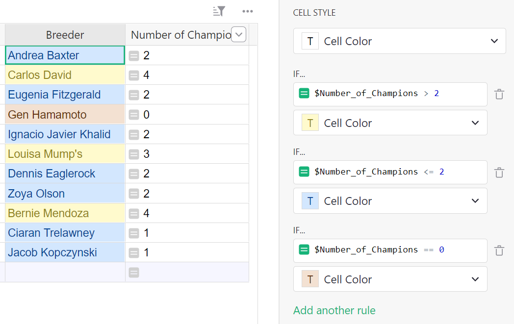

Conditional Styling
======================

Cell style can change based on conditional rules. Conditional rules are written as formulas. Conditional formatting can apply to an entire row or cells in a column. 

To add conditional formatting to a particular column, select the column, go to the `CELL STYLE` section of the [creator panel](glossary.md#creator-panel) under the `Column` tab, and click on `Add conditional style`.

**
{: .screenshot-half}

In this example, we have a list of dog breeders who have raised champion thoroughbreds. Let's apply conditional formatting to the Breeder column based on the number of champion dogs. We would like to highlight in gold any breeders with more than 2 champions.

Here the conditional formula is `$Number_of_Champions > 2`{: .formula}.

We would also like to highlight breeders with 1 or 2 champion dogs in blue, and 0 champion dogs in brown. Click `Add another rule` to add more conditional styles.

To add conditional formatting to rows, go to the `ROW STYLE` section of the [creator panel](glossary.md#creator-panel) under the `Table > Widget` tab, and click on `Add conditional style`.

Order of Rules
--------------

Note that Grist applies the rules in order. Styles applied by later rules will override those applied by earlier rules.

What would happen if we swapped the last two rules in the example above?

Notice that Gen Hamamoto, who has 0 champion dogs, is not highlighted in brown. This is because after applying the second conditional style, `$Number_of_Champions == 0`{: .formula}, Grist applied the third, `$Number_of_Champions <= 2`{: .formula}, which applies to Gen Hamamoto as well and shades him blue.
