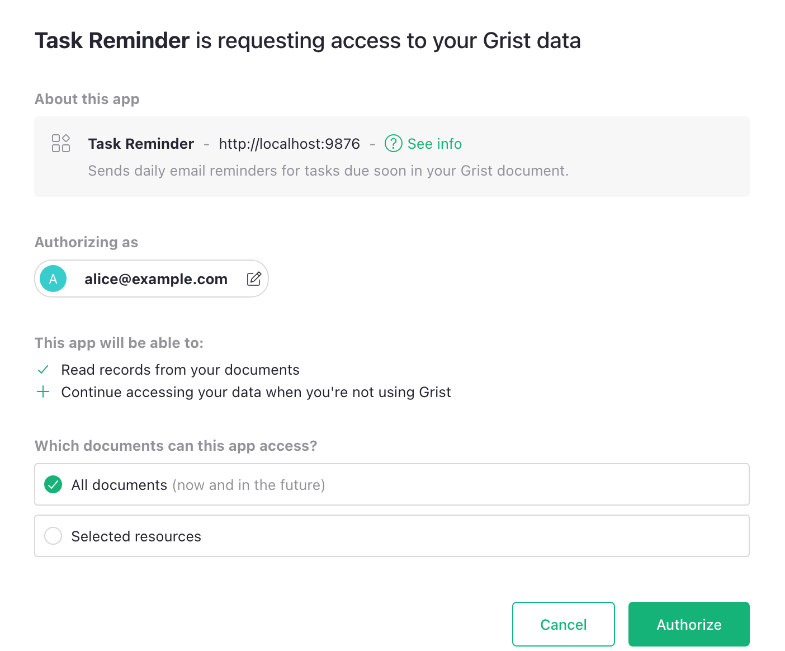
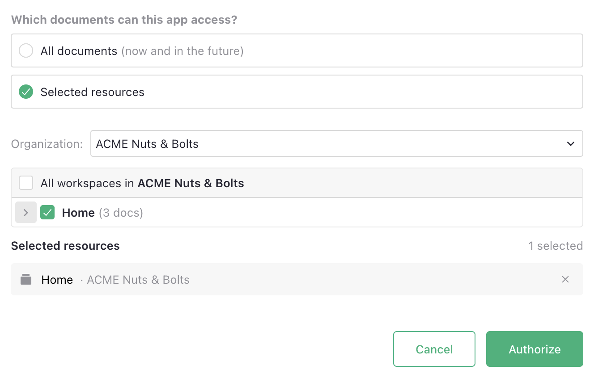
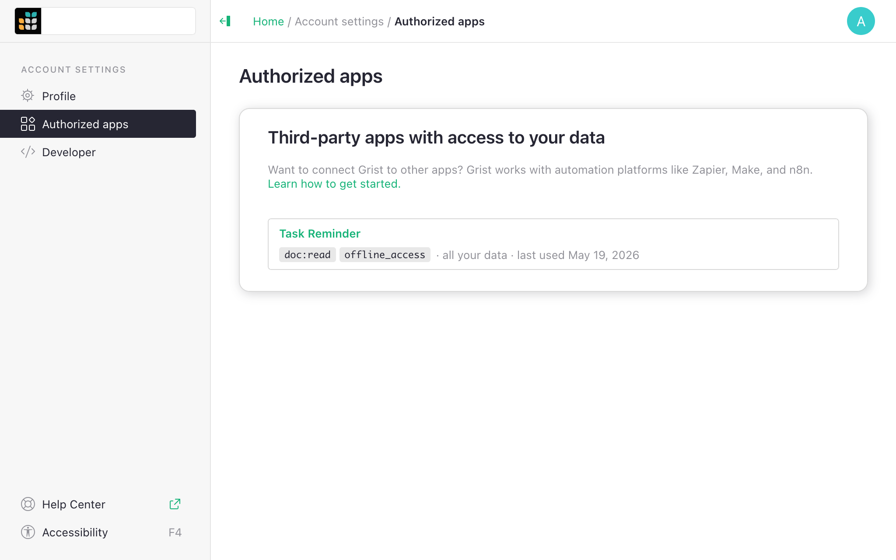
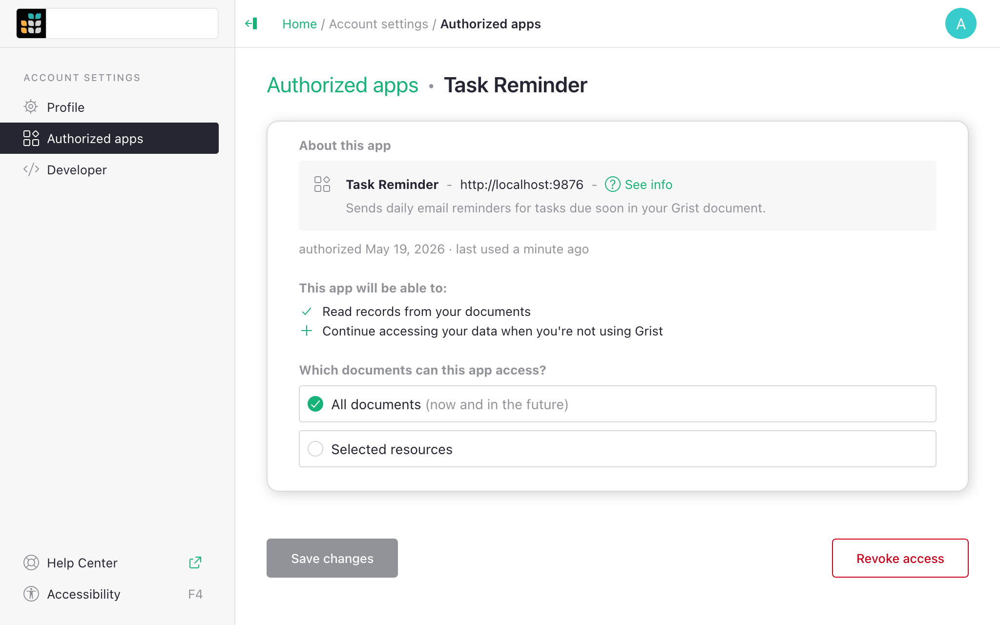

# Connected apps

Allowing an integration, a script, or an AI agent to access your Grist data has typically meant
sharing an [API key](rest-api.md). An API key provides complete access to everything you can
access, and so carries the same risk as handing out your password.

Connected apps -- based on the OAuth framework -- provide a more secure alternative. When a tool
needs to access your Grist data or act on it, it asks for permission. You can see what permissions
it's asking for, and choose which documents to grant access to. You can also see which apps have
what access, and revoke their access at any time.

## Authorizing an app

When a third-party tool, AI agent, or partner application asks to connect to
your Grist account, you'll see a consent screen like this:

This is where you get to review and approve what the app is requesting. You'll see:

- The app's name, URL, who registered it, and optionally description and contact info.
- The permissions it's requesting, like "Read records from your documents".
- Whether the app wants to continue accessing your data when you are not using Grist (for
  automations that can run when you are not at the browser).
- A choice between 'All documents' and 'Selected resources'. This lets you restrict the app's
  access to specific documents, workspaces, or orgs (team sites or personal sites).

Authorize only the apps you intend by reviewing the app info, especially the shown
URL. It's best to follow the principle of least privilege to grant access only to the resources
the app needs. You can come back later to change that selection.

!!! note "Permission limits"
    Connected apps can only do at most what you, the authorizing user, can do. Their access is limited
    by the same permissions and access rules. The app-specific permissions and the resources you
    select can restrict this access, but never expand it.

## Managing authorized apps

You can find 'Authorized apps' in 'Account settings' available under your [user menu](glossary.md#user-menu). This page lists every connected app you've granted access to.

For each one, you can see:

- When you authorized it, and when it was last used.
- What the app has permission to do.
- Which documents or workspaces the app can reach.

Here you change which documents it can access, or use the 'Revoke' button to revoke its access.

## API keys vs connected apps

| | API key | Connected app |
|---|---|---|
| What can it access? | Everything you can | Documents you choose |
| What can it do? | Anything you can do | Only what it asked for |
| Tied to | Your account | A specific app and grant |
| Can revoke individually? | No (one key per account) | Yes (revoke any one app) |

For any integration that supports it, we recommend using the connected app rather than an API key,
for better security, convenience, and visibility. Each connection is scoped to specific documents,
is visible in the list of authorized apps, and can be revoked individually.

## On self-hosted Grist {: .tag-ee }

When you run Grist on your own infrastructure, the OAuth server runs there too, and
enables the same type of connections with enhanced security properties and convenience.
Authorization and validation all happen on the self-hosted server you control.

In particular, it means that you can create internal integrations or connect existing services to
your self-hosted instance without sharing API keys.

Connected apps require the full edition of Grist. See [OAuth apps](oauth-apps.md)
for how to build apps that connect this way.
