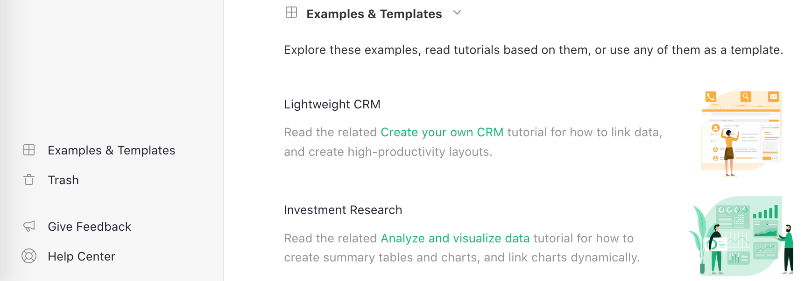
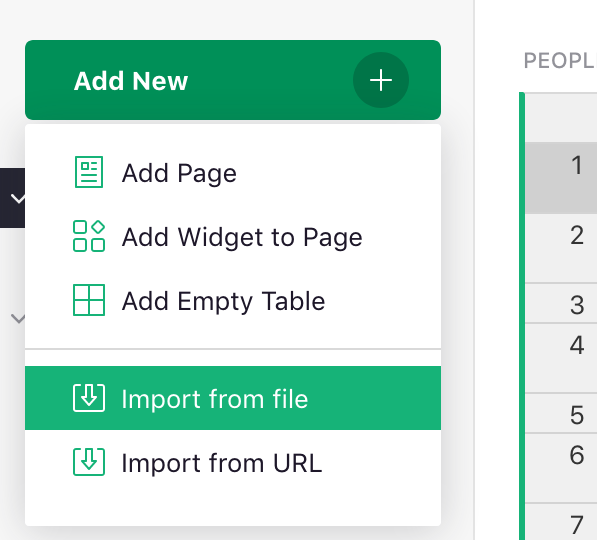

<iframe width="560" height="315" src="https://www.youtube.com/embed/eL0EU_Fv_TI?rel=0" frameborder="0" allow="accelerometer; autoplay; encrypted-media; gyroscope; picture-in-picture" allowFullScreen></iframe>

## Creating a document

To get started with Grist you'll first need to create a document.
Each document can store different kinds of data, so think of it as a
collection of *related* data.

You can start from scratch or import existing data. Click the "Add New" button on
the home screen and choose either "Create empty document" or "Import document".

**
{: .screenshot-half }

You can import spreadsheets in Excel format, as well as comma-separated value
files or CSVs. If you import a spreadsheet that has multiple tabs, each tab
will become a separate table in Grist.

## Examples and templates

The "Examples &amp; Templates" list on the Grist homepage includes a number of
Grist documents that demonstrate Grist features and use cases. These are always
accessible via a link on the bottom left of the home page.

For each example, there is a corresponding How-To Tutorial in the Grist Help Center,
which describes how to use it or how to build such a document
from scratch.

When you open an example, you can make changes to it. You are editing a copy, and your changes are
private to you. You can save your changes by clicking the "Save Copy" button on the top of the
page.

You can also use any of the examples as a template for a new document, whch
will include the structure, layout, and formulas of the example, but none of
the sample data. Simply use the "Save Copy" button and check the "As Template" checkbox in the
dialog that opens.

## Importing more data

Once you've created a document, you can import more data into it by opening the
document and selecting "Add New" and then one of the Import options.

*{: .screenshot4}*
{: .screenshot-half }

You can read more about importing data at [Importing more data](imports.md).

## Document settings

While a document is open, you can access the document's settings from the user menu or from the Tools menu in the left-hand navigation panel.

*{: .screenshot4}*
{: .screenshot-half }

There you can find the document's ID for API use, as well as set the default timezone, locale, and currency for the document.

**
{: .screenshot-half }