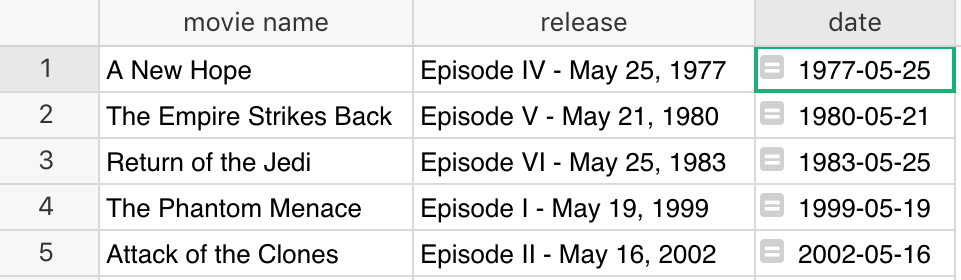

Overview
--------

Grist expresses dates and times in two ways.  The first is the
`Date` column type, which represents a calendar date, with no time of day, and
not associated with any particular timezone.  The second is the `DateTime`
column type, which represents a calendar date with a time of day which
can be linked with a timezone.
The `Date` and `DateTime` column types support different formatting
options. When a column
is set to be a `Date` or a `DateTime`, a date-picker widget will let
you select the date on a calendar when editing a cell.

When working with dates in formulas, the dates are Python [datetime
objects](https://docs.python.org/3/library/datetime.html). That allows
you to do some powerful things, but can be unexpected if you're not
familiar with them.

## Making a date/time column

For a general introduction to setting the type of columns,
see [Columns and data types](col-types.md).
To tell Grist that you intend to enter only date/times in a column,
over on the header for the column, find the drop-down, and select "Column Options".


Then in the side panel that opens on the right, pick "Date" from the
"Column Type" drop-down.  Or, if you want dates with times, pick
"DateTime".


Then you can choose your preferred date/time format. For the "DateTime" type, you can also choose
the timezone. When you convert a column from another type, such as "Text", you'll see a preview of
the conversion results, and will need to click "Apply" to complete conversion. You can come back and
change settings at any time.

**
{: .screenshot-half }

Now when you edit a cell in this column, you will have help for selecting dates
and times.

**
{: .screenshot-half }

## Inserting the current date

You can insert the current date in a cell using
<code class="keys">*⌘* + **;** (semicolon)</code> (Mac) or <code class="keys">*Ctrl* + **;**</code> (Windows).

You can insert the current date and time using
<code class="keys">*⌘* + *Shift* + **;**</code> (Mac) or <code class="keys">*Ctrl* + *Shift* + **;**</code> (Windows).

When editing a date cell, the date entry widget has a "today" button for today's date.

## Parsing dates from strings

The [DATEVALUE](functions.md#datevalue) function converts a string that represents a date into a `datetime`
object. It's simple to use and it will auto-detect different date formats:

**
{: .screenshot-half }

You can also use Python's `datetime` library, which provides two helpful functions:
[strptime() and strftime()](https://docs.python.org/3/library/datetime.html#strftime-strptime-behavior).

For example, let's say you have a table of movie sequels and their release dates (as
strings). You'd like to parse out the actual date to be able to sort the table properly. Here's how
you would do that:


1. First line imports the datetime library
2. The second line splits the string into two parts and returns the second part (Python arrays are
   zero-based).
3. The third line uses Python's [strptime
   function](https://docs.python.org/3/library/datetime.html#datetime.datetime.strptime) to parse
   the date (e.g. "May 19, 1999") into a datetime object. The first parameter to the function is
   the string to parse, the second parameter is the date format that the string is in. Take a look
   at the [format
   options](https://docs.python.org/3/library/datetime.html#strftime-strptime-behavior) to see if
   the example format string `%B %d, %Y` makes sense. (Note: You could've also used `DATEVALUE(d)` to
   achieve the same result.)

The result has a true date column and can now be properly sorted chronologically, with
"A New Hope" at the top.  For historical reasons, the first Star Wars movie is considered
to be Episode 4.

**
{: .screenshot-half }

And, because the column type is selected as a date, you can use the "Date Format" in "Column Options"
to select the format in which to display the date.


For some situations, you may wish to use the
[dateutil](https://dateutil.readthedocs.io/en/latest/parser.html#dateutil.parser.parse)
python library.  For example, if you live in an area where dates typically start with the day
and then the month, you could use this formula:

```py
import dateutil
dateutil.parser.parse($date_text, dayfirst=True)
```


## Date arithmetic

Once you have a proper date column, often you'll want to do date arithmetic such as calculating the
difference between two dates. The simplest way to do this is to use the [DATEDIF](functions.md#datedif)
function which takes two dates and the unit of information to return (Days, Months, or Years).

You could also use the minus sign to subtract two dates, but you might be surprised at the result:


This happens because subtracting two `datetime` objects as we did in the example above, results in a
[datetime.timedelta](https://docs.python.org/3/library/datetime.html#datetime.timedelta) object
which represents, "A duration expressing the difference between two date, time, or datetime
instances to microsecond resolution."

In Grist (and Python) you have to be more specific above how you want to display the date
difference. For example, to get the number of days from the returned timedelta object, use its
`.days` property:


If you want weeks or years, just divide by 7 or by 365. (Divide by 7.0 or 365.0 to include a
fractional part in the result.) If you want hours, multiply by 24.

You can also use specific functions to get what you want. For example, `DAYS` is a common function
in spreadsheet apps that returns the difference between two dates:

```py
DAYS($Last_day, $First_day)
```

!!! note "Excel/Sheets formulas"
    Grist supports many other common functions from other spreadsheet apps, including
    [`DATEADD`](functions.md#dateadd), [`DATEDIF`](functions.md#datedif), [`DATEVALUE`](functions.md#datevalue),
    [`MONTH`](functions.md#month), [`HOUR`](functions.md#hour),
    and [many more](functions.md#date).

## Getting a part of the date

You've seen how to parse the date, display it in different formats, and do date arithmetic. But what
if you want to get more information about a specific date, such as getting its day of the week?

One option is to use the [WEEKDAY](functions.md#weekday) function, which behaves as it does in
Excel, returning  1-7 for Sunday-Saturday.


Alternatively, we can use the [strftime](https://docs.python.org/3/library/datetime.html#strftime-strptime-behavior) function:


Yet another option would be to reformat the date using Date Format in Column Options
(see the [date formatting reference](https://momentjs.com/docs/#/displaying/format/)).


## Time zones

Values in `DateTime` columns represent moments in time. The same moment will look different in
different timezones. In Grist, the timezone is set on each `DateTime` column. For instance, if the
timezone is set to "America/New\_York", it will show the values in New York timezone to
collaborators anywhere in the world.

A Grist document has a global timezone setting, which serves as the default timezone for when you
create a new column of type `DateTime`. This global timezone is set to your local timezone when
you first create a document. You can see or change it by
clicking on your profile picture or icon, and selecting "Document Settings".

If you insert the current date and time using
<code class="keys">*⌘* + *Shift* + **;**</code> (Mac) or <code class="keys">*Ctrl* + *Shift* + **;**</code> (Windows)
into a `DateTime` column, it will be inserted as a true timezone-aware timestamp, and shown with
the timezone set for that column.
If you do the same in a `Text` column, the date/time will be inserted as the text appropriate for
the document's global timezone setting. Similarly, inserting the current date into a `Date` column
will produce the current date according to the document's timezone.

## Additional resources

* [Python cheatsheet for strftime](http://strftime.org), for using with `strftime()` and
  `strptime()` in formulas.
* [Date formatting cheatsheet](https://momentjs.com/docs/#/displaying/format/), for specifying the
  date/time format in column settings.
* [dateutil library](https://dateutil.readthedocs.io/en/latest/index.html), extensions to the
  Python standard `datetime` module.
