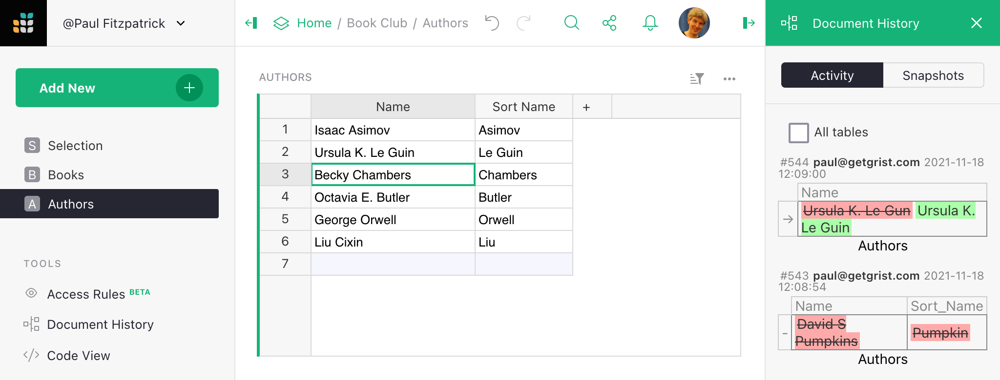

Document history
------------------

To access information about a document's history, click "Document History" in the left panel.
The right panel will then offer two tabs, "Activity" and "Snapshots".

**
{: .screenshot-half }

## Snapshots

Grist automatically saves complete backups of your documents as you work on them,
making them available on the Snapshots tab. Read [Automatic Backups](automatic-backups.md)
for details on using this tab to examine, compare, and restore from older versions
of a document.

## Activity

The Activity tab lists all recent changes for the table associated with the
widget you're currently looking at. Select the "All tables" checkbox to see
recent changes in the document regardless of table. Changes are shown
as small table extracts. The cells are clickable, and bring you to the
current version of the cell (if it still exists) in the "primary" widget
for the table containing it (this is typically the first widget created showing
the table).

