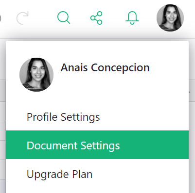

## Document settings

While a document is open, you can access the document's settings from the user menu or from the 'Tools' menu in the left-hand navigation panel.

*{: .screenshot4}*
{: .screenshot-half }

The Document Settings page allows you to configure key defaults for your document, including:

- **Timezone:** Sets the default timezone, affecting date and datetime calculations.
- **Locale:** Determines regional formatting for dates and numbers.
- **Currency:** Defines the default currency symbol and format used in the document.

**

You can also change how the document opens for users:

- **Regular:** Standard document behavior. All users access and edit the same shared document.
- **Template:** Document automatically opens in [fiddle mode](glossary.md#fiddle-mode), allowing users to make temporary edits without saving changes to the original. If they want to keep changes, they must save a copy.
- **Tutorial:** Document automatically opens as a user-specific copy, which they can edit freely without affecting others.

### Notifications

You can enable email notifications for document changes by toggling the 'Changes' option.

If you enable notifications for changes, you will receive an email when someone adds, deletes, or
updates any data in the document. If a document includes a form, form submissions also count as changes.
For creators (i.e. owners or editors who can [edit structure](access-rules.md#lock-down-structure)),
notifications also include changes to the document's structure or logic (such as adding columns or
editing formulas), layouts, formatting, access rules, and other settings.

Notifications for [comments](sharing.md#comments) can be enabled by selecting from the following options:

- **All comments**: Receive a notification for every new comment.
- **Replies and mentions**: Only receive a notification when someone replies to your comment or mentions you.
  (This is the default setting.)
- **None**: Turn off comment notifications entirely.

**

### Data Engine

The Data Engine section provides tools to monitor and optimize document performance:

- **Formula Timer:** Grist’s built-in [formula timer](formula-timer.md) measures how long each formula takes to evaluate. This helps identify slow-performing formulas that may impact how quickly a document opens or responds to changes.
- **Reload Data Engine:** Performs a hard reset of the data engine, forcing the document to reload. This can help resolve certain performance issues.
- **Python Version:** Allows you to switch the Python version used for formulas. We recommend using Python 3, but be aware that changing this setting may affect existing formulas.

**

### API

The API section provides tools for integrating your document with external services and automating tasks. It includes:

- **Document ID:** A unique identifier for API use, referred to as `docId` within our [API documentation](api.md).
- **API Console:** A built-in web interface for testing API calls directly.
- **Webhooks:** Allow you to notify external services when rows are added or modified in a table. See our [Webhooks documentation](webhooks.md) for setup details.

**

### External Attachments

Grist can store attachments either within a document, or externally in another location (for self-hosted installations, this is determined by the administrator).

Storing attachments externally can:

- Help keep the Grist document small.
- Allow large files to be used as attachments, without impacting performance.
- Allow significantly more files to be attached, without impacting performance.
- Speed up saving and restoring document snapshots by reducing their size.

However, there are additional limitations placed on documents that use external attachments:

- Any downloaded documents will have broken attachments. These will remain broken even if the document is re-uploaded.
- Duplicating a document will be disabled. However, you will still be able to work on a copy of the document, and save the changes back to the original document.

Therefore, it's advised you only use external attachments if your document is experiencing slowness due to attachments.

!!! note "Attachment Limits"
    Attachment limits for all plans can be found [here](limits.md#attachments). You can check your document's usage under [Raw Data](raw-data.md).

You can switch a document between internal and external attachments at any time without restriction, however it may take some time for all attachments to be transferred from their existing location to the new one.

External attachments can be enabled from the Document Settings page. If external attachments are not available on your Grist installation, the dropdown will be disabled. Consult the instructions for [self-managed installations](self-managed.md#how-do-i-enable-external-attachments) if needed.

**

A transfer process can be started to move attachments between external and internal storage. This transfer may be paused due to document inactivity. If a transfer is paused due to document inactivity, you can safely resume it anytime from the document settings page.

The transfer process may take some time, depending on the size and number of attachments. 

**
