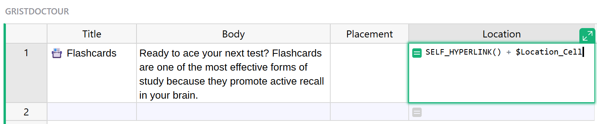
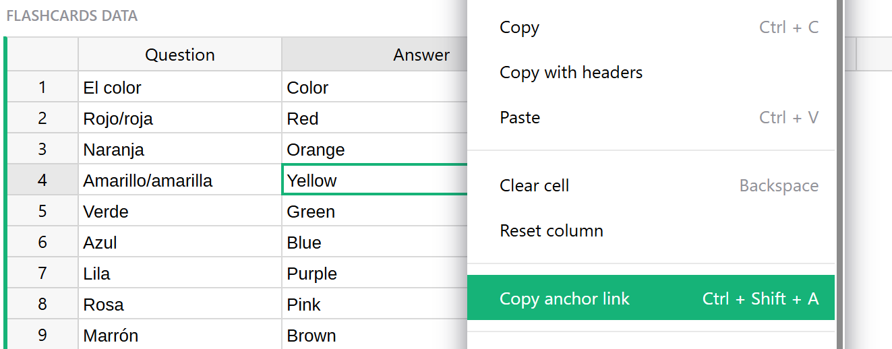
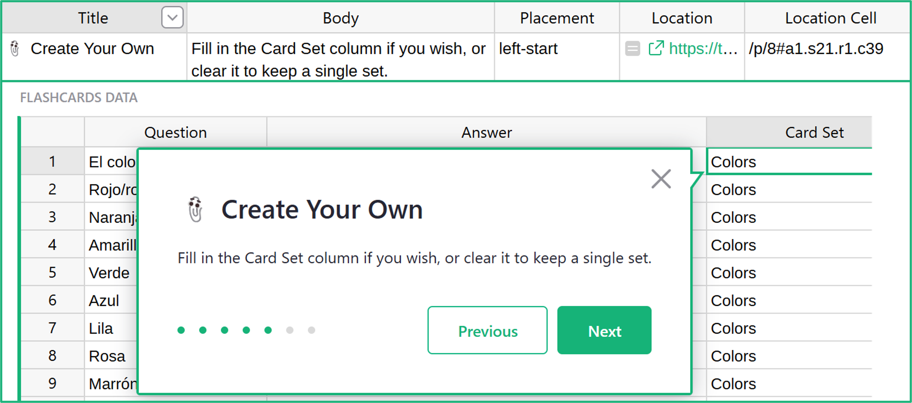
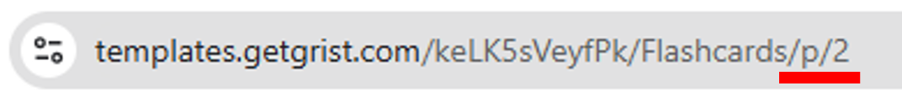
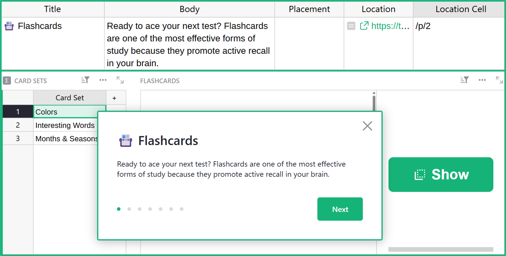

## Creating document tours in Grist

Document tours in Grist can provide a step-by-step guide to help users navigate and understand how to use your document. While not a built-in feature, you can create document tours by adding a specially configured table named `GristDocTour` to your document.

### What is a document tour?

A document tour displays tooltips on specific pages or cells in your document, helping guide users through its layout and purpose. This can be especially helpful for onboarding new users or explaining more complex workflows. Many of the templates in our [Template Gallery](https://public.getgrist.com/p/templates) have document tours. We'll use our [Flashcards](https://templates.getgrist.com/keLK5sVeyfPk/Flashcards) template as our example as we go through the steps to build a document tour below.

## How to create a document tour

### **Step One:** Add the `GristDocTour` table

Create a new table to your document by clicking the green 'Add New' button then 'Add Empty Table'. Name the new table `GristDocTour`.

**

Add the following columns to the table:

1. **Title:** Text column for the tooltip header.
2. **Body:** Text column for the tooltip content.
3. **Placement:** Text column indicating tooltip position relative to the target (e.g., top, right).  [https://popper.js.org/](https://popper.js.org/){:target="\_blank"} has an interactive tool that shows how this works.
- **Location:** Formula column with the formula `SELF_HYPERLINK() + $Location_Cell`.
**
- **Location Cell:** Text column containing the [anchor link](#anchor-links) of the target cell (e.g., /p/3#a1.s3.r3.c3).
- **Link URL (optional):** Text column for an additional link in the tooltip.
- **Link Text (optional):** Text column for the display text of the link.
- **Link Icon (optional):** Text column specifying an icon to display before the link. Available icons are listed [here](https://github.com/gristlabs/grist-core/blob/main/app/client/ui2018/IconList.ts).

### Anchor links

Your document tour can point to specific cells and pages using anchor links.

You can copy an anchor link to a cell by pressing <code class="keys">*⌘* *⇧* *A*</code> (Mac) or <code class="keys">*Ctrl* + *Shift* + *A*</code> (Windows) while the cell is selected. This option is also available via the [row menu](widget-table.md#row-operations) as "Copy anchor link." The link will be placed in your clipboard, ready to paste into the **Location Cell** column.

**
{: .screenshot-half }

Use <code class="keys">*⌘* + *V*</code> (Mac) or <code class="keys">*Ctrl* + *V*</code> (Windows) to paste the anchor link into the **Location Cell** column of your `GristDocTour` table. You'll want to delete everything prior to `/p/`. For example, if your anchor link is `https://templates.getgrist.com/keLK5sVeyfPk/Flashcards/p/8#a1.s21.r1.c39`, then delete everything except `/p/8#a1.s21.r1.c39`

**

To place the document tour popup on a specific page, you can simply copy the end of the URL that contains the page number, `/p/#`, and paste this into the **Location Cell** column of your `GristDocTour` table.

**
{: .screenshot-half }

**
