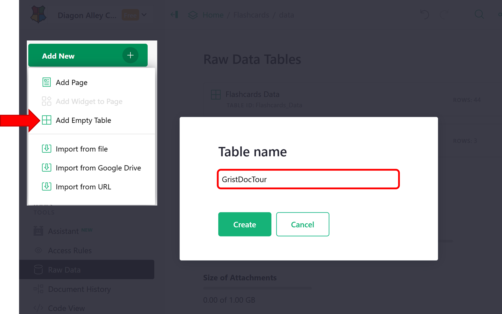
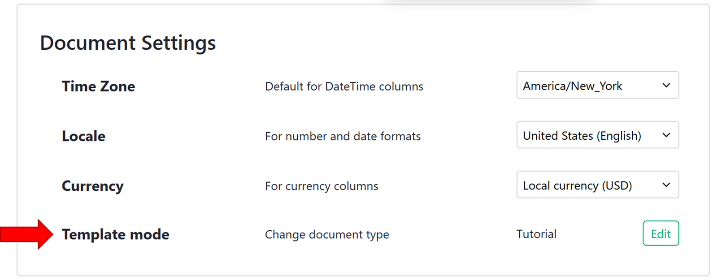
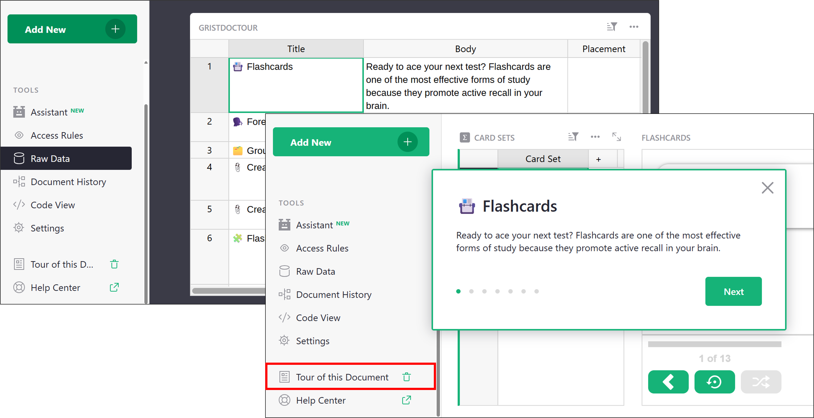

## Creating document tutorials in Grist

Document tutorials allow you to create step-by-step guides that walk users through how to use features within your Grist document.

You can convert any Grist document to become a tutorial by setting the document type to 'Tutorial' under [Document Settings](document-settings.md). Then, add a specially configured table named `GristDocTutorial`.

It is important to note that documents of type 'Tutorial' are treated differently when opened. When a user first opens a tutorial, a new copy of the document will be made, specific to that user, allowing them to follow along and make changes without affecting the main document.

### What is a document tutorial?

A document tutorial displays as a sidebar-style popup within your document. You can customize it to teach anything—from the basics of Grist to a complex workflow in your own template. For example, the [Grist Basics Tutorial](https://templates.getgrist.com/doc/woXtXUBmiN5TGhoXCBGSBf)l shows new users how to create references, link widgets and more!

## How to create a document tutorial

### Adding the `GristDocTutorial` table

Create a new table in your document by clicking the green 'Add New' button then 'Add Empty Table'. Name the new table `GristDocTutorial`.

<span class="screenshot-large">**</span>

Add the following columns to the `GristDocTutorial` table;

1. **slide_content:** A text column that holds the Markdown content for each slide. You can embed images, videos, and links hosted externally.
2. **box_content:** An optional text column that supports additional Markdown. If filled in, this content appears in a shaded box below the slide, useful for tips or extra context.

### Setting document type to 'Tutorial'

Under 'Document Settings', update 'Template mode' to 'Tutorial'.

<span class="screenshot-large">**</span>

After updating, your page will refresh and your document will open as a fork of the original. Meaning, any changes you make won't be saved to the original. You can easily override the original document by clicking the 'Share' icon then 'Replace original...'. 

### Original vs forked document: understanding the URLs

When working with document tutorials, there are three types of URLs you’ll encounter. Each serves a different purpose depending on whether you're editing the original document or accessing a user-specific fork.

1. **Direct URL:** This is the main link to your document. Because the document is marked as a tutorial, visiting this URL automatically redirects users to their own fork. The format is `https://<teamsite>.getgrist.com/doc/<docID>`.
2. **Default Mode:** This link opens the original version of the document, letting the owner edit the tutorial directly, useful for updating tutorial content. To access default mode, append the Direct URL with `/m/default`. The format is `https://<teamsite>.getgrist.com/doc/<docID>/m/default`.
3. **Fork URL:** - This is user's unique copy of the tutorial, automatically created when they open the Direct URL for the first time. Changes made here won't affect the original. The format is `https://<teamsite>.getgrist.com/doc/<docID>~<forkID>~<userID>`

**Example**
If your forked tutorial URL is:
```
https://docs.getgrist.com/doc/woXtXUBmiN5T~1eYN9joCXkuVokCD1p3EYt~12345
```
Then:

- The **Direct URL** is:
```
https://docs.getgrist.com/doc/woXtXUBmiN5T
```

- The **Default Mode URL** is:
```
https://docs.getgrist.com/doc/woXtXUBmiN5T/m/default
```

If you close out of your fork of the document, you can always return to your fork by visiting the Direct URL — Grist will redirect you to your saved fork automatically.

!!! note "Why is the `GristDocTutorial` visible?"
    The `GristDocTutorial` table is visible to you, the document owner, by default. It is automatically hidden from all other users when they view the tutorial.

### Reviewing your document tour

While building your document tutorial, it’s helpful to preview the slides and make edits quickly. There are two ways to do this.

**Option 1: Review and Edit in the Same Window**
You can edit your fork and push changes back to the original document without opening a second window:

1. If you're in default mode, remove `/m/default` from the URL to return to your fork of the document.
2. Make any edits (e.g., update steps in the `GristDocTutorial` table).
3. Click the Share icon and choose Replace original… to save your changes to the main document.
4. Click Restart Tutorial to reload the tutorial with your updates.

**⚠️ Important:** Always replace the original before restarting the tutorial. If you click Restart Tutorial first, any unsaved changes will be lost.

**Option 2: Work in Two Windows**

This approach prevents accidental loss of changes:

1. Open two browser windows.
2. In one window, open the document in default mode (to edit the original).
3. In the second window, open your fork by removing `/m/default` from the URL of the first window.
4. After making any changes, be sure to click 'Restart Tutorial' in the tutorial window to see updates.

This setup allows you to make changes in one window and test the live tutorial in the other—without switching back and forth or risking unsaved changes.

<span class="screenshot-large">**</span>

### Sharing your document tour

To share your document tour, simply share your document. The document tutorial will start automatically when a user accesses the document. Because the fork is user-specific, their progress will be saved so they can close it and come back to it at another time. Unsaved forks are automatically deleted after 3o days if not accessed again. Only users with access to the original document can access the document tutorial. Learn more about [sharing](sharing.md) a document.

<span class="screenshot-large">**</span>
{: .screenshot-half }

