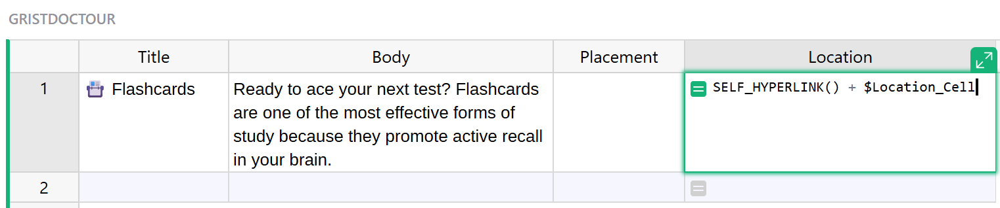
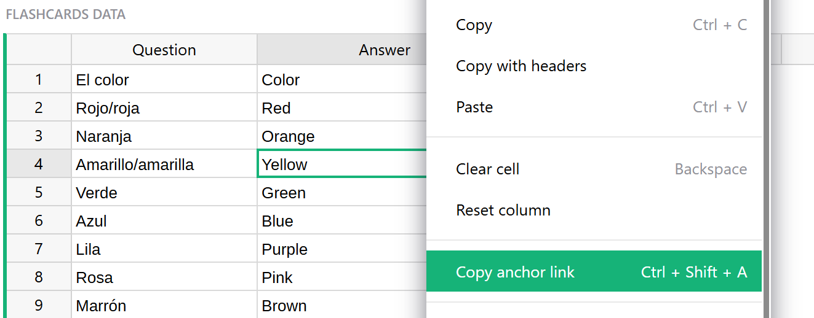
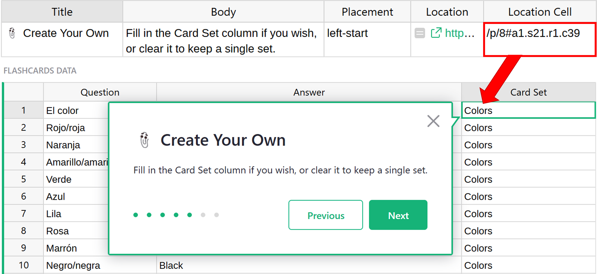
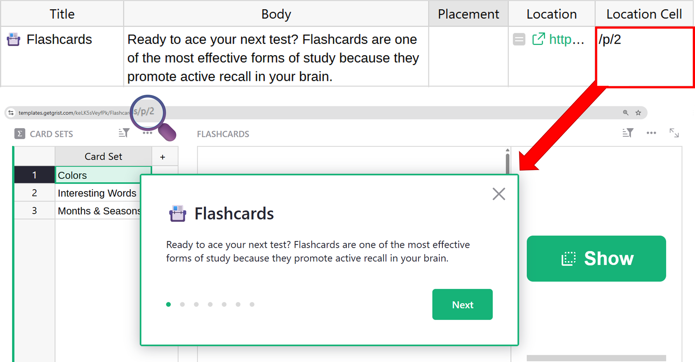
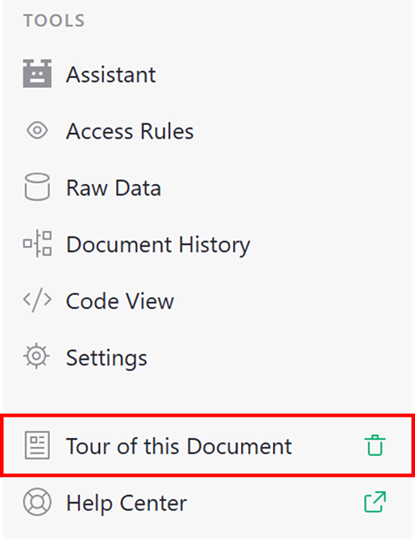

## Creating document tutorials in Grist

Document tutorials allow you to create step-by-step guides that walk users through how to use features within a Grist document. You can add a tutorial to any Grist document by creating a specially configured table named `GristTutorial` and setting the document type to 'Tutorial' under [Document Settings](document-settings.md). Documents of type 'Tutorial' are treated differently when opened. Specifically, Grist will check to see if a fork exists for this tutorial document for the user, and open the fork if so. Otherwise, a new fork will be created, starting the tutorial from the beginning.

### What is a document tutorial?

A document tutorial displays tooltips on specific pages or cells in your document, helping guide users through its layout and purpose. This can be especially helpful for onboarding new users or explaining more complex workflows. Many of the templates in our [Template Gallery](https://public.getgrist.com/p/templates) have document tours. We'll use the [Flashcards](https://templates.getgrist.com/keLK5sVeyfPk/Flashcards) template as an example as we go through the steps to build a document tour below.

## How to create a document tutorial

### Setting document type to 'Tutorial'

### Adding the `GristTutorial` table

Create a new table in your document by clicking the green 'Add New' button then 'Add Empty Table'. Name the new table `GristTutorial`.

**

Add the following columns to the `GristTutorial` table;

1. **slide_title:** Text column for the title of the slide.
2. **slide_body:** Text column containing Markdown for the slide content. Videos and images are hosted externally and linked to via the Markdown text.
3. **try_it_out_body:** Optional text column containing Markdown. If not blank, text here will be rendered within a shaded 'Try It Out' section below the slide body.
4. **Location:** Formula column with the formula `SELF_HYPERLINK() + $Location_Cell`.
**
5. **Location Cell:** Text column containing the [anchor link](#step-three-add-your-anchor-links) of the target cell (e.g., `/p/8#a1.s21.r1.c7`).
**
6. **Link URL (optional):** Text column for an additional link in the tooltip.
- **Link Text (optional):** Text column for the display text of the link.
- **Link Icon (optional):** Text column specifying an icon to display before the link. Available icons are listed [here](https://github.com/gristlabs/grist-core/blob/main/app/client/ui2018/IconList.ts).
**

!!! note "Where did my `GristTutorial` table go?"
    The `GristTutorial` table is hidden by default to keep the focus on your document's actual data. Since it only controls the display of tooltips, it’s treated more like metadata. You can always access it under [Raw Data](raw-data.md).

### Adding anchor links

Your document tour can point to specific cells and pages using anchor links.

You can copy an anchor link to a cell by pressing <code class="keys">*⌘* *⇧* *A*</code> (Mac) or <code class="keys">*Ctrl* + *Shift* + *A*</code> (Windows) while the cell is selected. This option is also available via the [row menu](widget-table.md#row-operations) as "Copy anchor link." The link will be placed in your clipboard, ready to paste into the **Location Cell** column.

**
{: .screenshot-half }

Use <code class="keys">*⌘* + *V*</code> (Mac) or <code class="keys">*Ctrl* + *V*</code> (Windows) to paste the anchor link into the **Location Cell** column of your `GristTutorial` table. You'll want to delete everything prior to `/p/`.

For example, if your anchor link is:

`https://templates.getgrist.com/keLK5sVeyfPk/Flashcards/p/8#a1.s21.r1.c39`

...delete everything except

`/p/8#a1.s21.r1.c39`

**

To place the document tour popup on a specific page, you can simply copy the end of the URL that contains the page number, `/p/#`, and paste this into the **Location Cell** column of your `GristTutorial` table.

**
{: .screenshot-half }

**

### Reviewing your document tour

When initially creating your document tour, it is useful to see the popups and quickly make any changes. In a single window, that requires a lot of clicking back and forth. Open your document in two browser windows. In one window, pull up the `GristTutorial` table under [Raw Data](raw-data.md). In the other window, view your document tour on demand by clicking 'Tour of this Document' at the bottom of the left-hand navigation panel.

**

### Sharing your document tour

To share your document tour, simply share your document. The document tour will start automatically the first time a user accesses the document. After that, they can access the tour at anytime by clicking 'Tour of this Document' at the bottom of the left-hand navigation panel.

**
{: .screenshot-half }

!!! note "💡 Tip:"
    When sharing a URL to your document, you can force the document tour to appear—regardless of whether the user has seen it before—by appending `#repeat-doc-tour` to the end of the URL.

