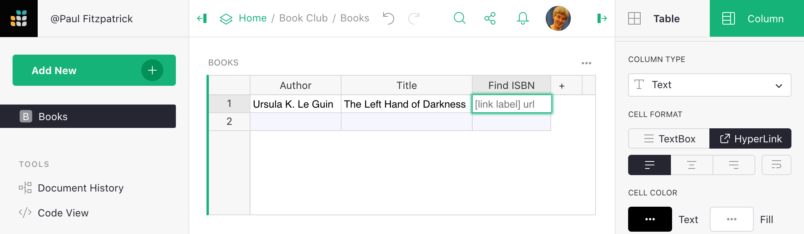
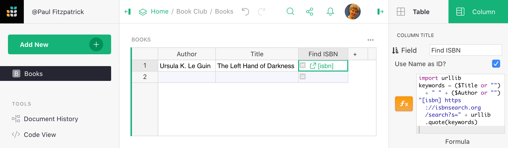
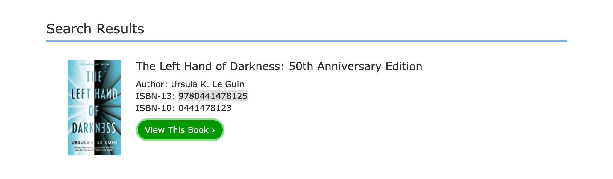
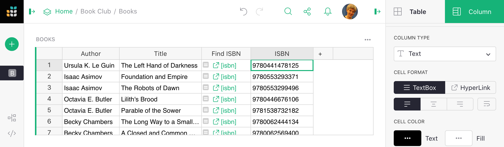
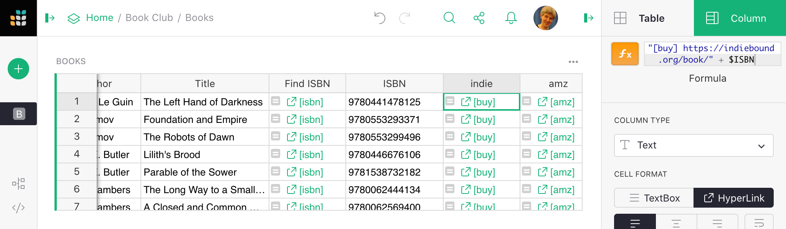
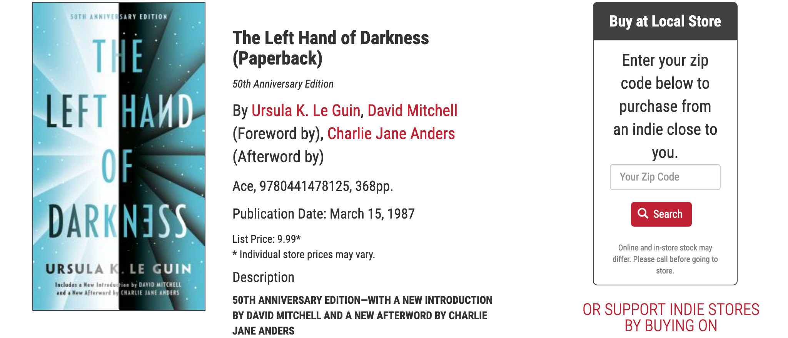
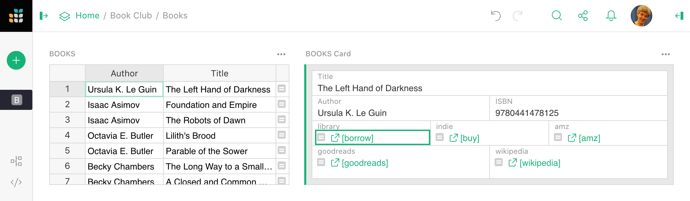

# Book Lists with Library and Store Look-ups

If there's one thing better than reading a book, it is reading with friends.
To organize a book club is pretty simple.  The club will work best if everyone
actually gets the book, and has opinions for what to read next time.  Grist can help
with all that.

To nudge the book into everyone's hands, it helps to have links to
borrow the book at your local library, and to buy the book from your
local (or not-so-local) store.  And for ideas about what to read next
time, it helps to be able to easily suggest books, and to
learn about books others suggest via sites like GoodReads, Wikipedia, and
Amazon.

Suppose we start with a simple table of books, with book titles and author names.
To borrow or buy the book, it is best to have its unique ISBN code, so there's no ambiguity or
mix-ups. One thing we can do is add a link to search for a book
on [isbnsearch.org](https://isbnsearch.org)
by its title and author. To do this, add a new column, and then set it to be a
[HyperLink column](../col-types.md#text-columns):



What we're going to do is fill this column using a formula that takes the
book title and the author's name, and uses them as a keyword to search on
the [isbnsearch.org](https://isbnsearch.org) site.  Here's the formula:

```py
import urllib
keywords = ($Title or "") + " " + ($Author or "")
"[isbn] https://isbnsearch.org/search?s=" + urllib.quote(keywords)
```

URLs with spaces or apostrophes or other odd letters you might find in
names need special encoding, so we've used the python `urllib` module to make sure
everything gets encoded correctly.  Now we've got a handy `[isbn]` link beside each book:



We can click the arrow by `[isbn]`, locate the book, and make note of its ISBN code
in a new column:



Then we can add it into our book list. Now that we have a helping hand for finding ISBNs,
let's add a few more books too:



## Library and store lookups

Once we have the ISBN, adding a link to buy the book is easy.  Here's a formula
for the [indiebound.org](https://indiebound.org) site, which in the U.S. is likely
to have an independent book store near you as a member:

```py
"[buy] https://indiebound.org/book/" + $ISBN
```

If you don't have a local bookstore, there's Amazon, or pretty much any site
you like (just find a search page on their site, and match the pattern).

```
import urllib
keywords = ($Title or "") + " " + ($Author or "") + " " + ($ISBN or "")
"[amazon] https://www.amazon.com/s?i=stripbooks&k=" + urllib.quote($keywords)
```

The new links look like this:



Clicking on the `[buy]` link near a book now brings us to that book on
[indiebound.org](https://indiebound.org).



For your local library, the same idea is very likely to work.  For example, in
northern New Jersey, in the US, here's what you want:

```py
import urllib
prefix = "[borrow] https://catalog.bccls.org/polaris/search/searchresults.aspx?ctx=placeholder&type=Keyword&by=ISBN&term="
prefix + urllib.quote($ISBN)
```

And here's how to look up Goodreads to see what people think of a book:

```py
"[opinion] https://www.goodreads.com/search?q=" + $ISBN
```

And Wikipedia to start a deep dive:

```py
import urllib
keywords = ($Title or "") + " " + ($Author.Name or "")
"[wikipedia] https://en.wikipedia.org/wiki/Special:Search/" + urllib.quote(keywords)
```

Once we have all these links, it makes sense to add a [Card View](../linking-widgets.md#same-record-linking) so we can lay them out:



## Ready-made template

Here is an
[example book list](https://templates.getgrist.com/hdXy57qLiyNf/Book-Club){:target="\_blank"}
that you can play with. The actual books listed may not be your thing, of course!  Adjust to taste.
