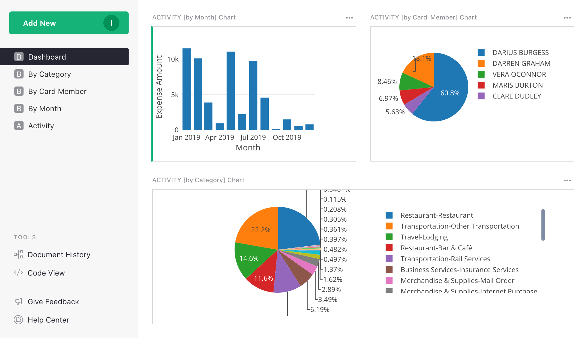
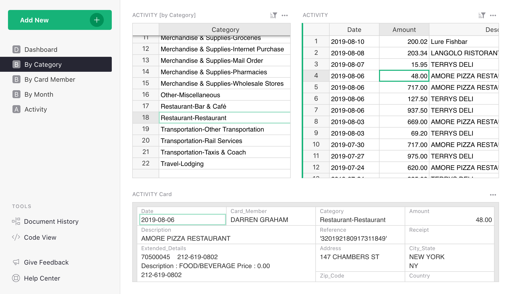
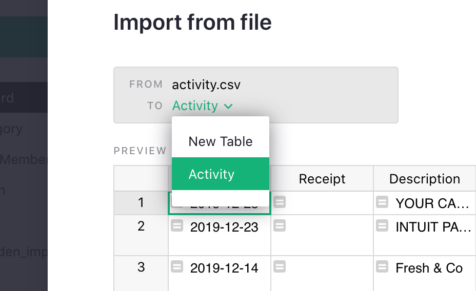

# Slicing and Dicing Expenses

Grist offers a handy way to explore your credit card transactions quickly, for example if you want to see transactions by:

- Category
- Card Member
- Month
- Combination of any of the above

Here is an example using data from American Express (redacted for privacy, of course). See below for using it as a template for your own data.

This first page is a dashboard: it shows a few summary charts — your expenses by month, and two pie
charts to let you quickly see which card member or which category has the most expenses.

The next three pages show breakdowns by Category, Card Member, and by Month. In addition to the
totals by Category, you can click on any Category to see all transactions in it, and then click on
any transaction to see its complete details.

Here is the
[example with sample data](https://templates.getgrist.com/2i9WoHs2oRzK/Credit-Card-Activity-Template-AmEx/){:target="\_blank"}
 that you can play with.

To use it for your own data, start by downloading your transactions. For American Express
credit cards:

1. Log in at <https://americanexpress.com>{:target="\_blank"}
2. Go to “Statements & Activity” tab, then select “View By Year” or “Custom Date Range”.
3. Click “Download your Transactions” icon.
4. When asked to choose the download format, select “CSV” and select the checkbox that
   says “Include all additional transaction details”.

To import this data into Grist:

1. Open the [template here](https://public.getgrist.com/mMbk6UEHoHYf/AmEx-Activity-Template/m/fork){:target="\_blank"}.
2. Click "Add New" button and choose "Import from file".
3. In the dialog that shows, change “To” table from “New Table” to “Activity”, like so:

**
{: .screenshot-half }

Click "Import", and you are done. Your data is ready to explore.

!!! tip "Note"
    When you start with a template link, your copy of the document is initially unsaved. To keep
    this data for later, click “Save Copy”, and give the document a name. You’ll see the document
    later on your Grist home page at <https://docs.getgrist.com>.

A template like this doesn’t take long to prepare. It uses a combination of
[summary tables](../summary-tables.md) and [widget linking](../linking-widgets.md).

Have feedback or improvements to contribute? Please share with us by emailing <support@getgrist.com>.

