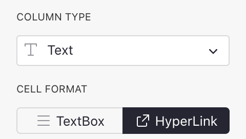

# Prepare Emails using Formulas

You may already know that you can add [hyperlink fields](../col-types.md#hyperlinks) in Grist. You
may also know about "mailto" links that open a mail program to create a new email message.

Less well-known is that "mailto" links allow pre-filling many parts of the email message. If you
use Grist to store contacts, you can essentially create email templates using Grist formulas.

## Simple Mailto Links

The simplest "mailto" link in Grist looks like `mailto:someone@example.com`. When the column is
set to Text, and its format is set to Hyperlink, it shows as <mailto:someone@example.com>.

If you have a table with columns `Full_Name` and `Email`, add another column with
this formula:
`"Compose Email mailto:%s" % ($Email)`{: .formula}.
Set its type to Text, and its cell format to Hyperlink:

<span class="screenshot-large">**</span>
{: .screenshot-half }

You'll get a link in each person's row, which you can click to start composing an email to that
person:

<span class="screenshot-large">**</span>
{: .screenshot-half }

See an example of this in action here:
[Simple Compose](https://templates.getgrist.com/3HfynRQwpHPy/Email-Contacts){:target="\_blank"}.

## Cc, Bcc, Subject, Body

In addition to opening your email program and filling in the "TO" field, a "mailto" link can
fill in other parts of the email, using this format:

```html
mailto:<to>?cc=<cc>&bcc=<bcc>&reply-to=<email>&subject=<subject>&body=<body>
```

All fields are optional. You can specify multiple email addresses for To/Cc/Bcc lists by
separating them with commas.

Values of each field should be [percent-encoded](https://en.wikipedia.org/wiki/Percent-encoding),
which in Python can be done using
[urllib.parse.quote](https://docs.python.org/3/library/urllib.parse.html#urllib.parse.quote).

To put this together, this formula will produce a hyperlink to create a pre-filled email:

```python
from urllib.parse import quote
return "Compose mailto:%s?cc=sales@example.com&subject=%s&body=%s" % (
  quote($Email), quote($Subject), quote($Body))
```

A live example of this is here:
[Advanced Compose](https://templates.getgrist.com/3HfynRQwpHPy/Email-Contacts/p/2){:target="\_blank"}.

## Emailing Multiple People

Email links are very handy when emailing a group of people, such as students in a class,
or people on a certain project.

For instance, if you have a [Reference column](../col-refs.md) "Project" that ties a person to a
project, then in the table of projects, you can look up all associated people using
[lookupRecords](../functions.md#lookuprecords). You can then build a link to email them as a
group:

```python
from urllib.parse import quote
people = People.lookupRecords(Project=$id)
return "Email Group mailto:%s" % quote(", ".join(people.Email))
```

You can see this formula at work in
[Group Compose](https://templates.getgrist.com/3HfynRQwpHPy/Email-Contacts/p/3){:target="\_blank"}.

Don't use this to replace an email marketing platform: since emails use your regular
email program, you shouldn't use it for emailing thousands of people. But for small groups, this
can be very convenient.

## Configuring Email Program

If your "mailto" links don't work, or don't open your preferred email program, here is an article
to help you configure it:

- [Changing the default email program](https://www.makeuseof.com/tag/how-to-change-the-default-email-program-for-mailto-links/).

If you need more details, here are some more links:

- To open a desktop program (such as Mail, Thunderbird, etc.) on a Mac: [Instructions](https://support.apple.com/en-us/HT201607).
- To open a desktop program (such as Outlook, etc. ) on Windows: [Instructions](https://kb.wisc.edu/helpdesk/page.php?id=170).
- To open Gmail in Chrome and other browsers: [Instructions](https://blog.hubspot.com/marketing/set-gmail-as-browser-default-email-client-ht).
- To open webmail (such as Gmail or Yahoo! Mail) or a desktop program in Firefox: [Instructions](https://support.mozilla.org/en-US/kb/change-program-used-open-email-links).
