# Preparing invoices

If you are keeping records of who is charged what in Grist, it can be convenient
to generate invoices right there and then beside those records.  This tutorial
shows you how to set up a document like this:

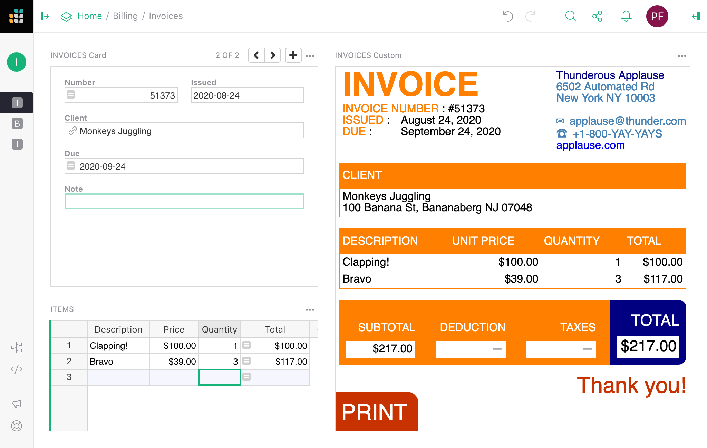


You can find a finished template at <https://templates.getgrist.com/9NH6D58FmxwP/Invoicing>{:target="\_blank"}.
If you'd like to add invoices to an existing document, making them work the
way you want, understanding this tutorial should get you there.

## Setting up an invoice table

First of all, make a table to record invoices by
[creating an empty document](../creating-doc.md) and renaming `Table1` to `Invoices`:


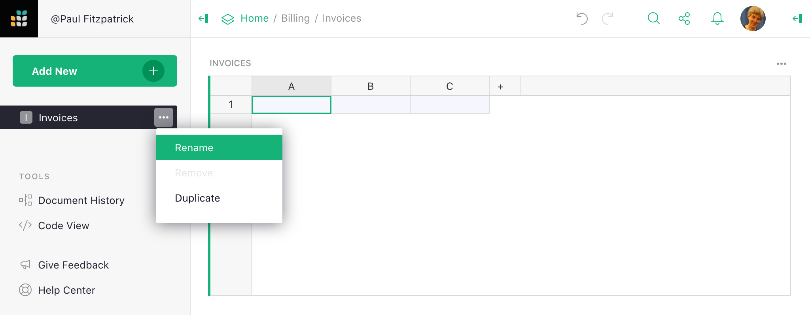

Now, let's add a widget beside the table to view the finished invoices.
There are all sorts of possible styles of invoice, so Grist lets web
developers create their own using Custom Widgets.  We'll use an example
invoice style published by Grist, but if it doesn't match your needs
any web developer could tweak it for you.

Click on `Add New`, then `Add Widget to Page`.  Then:

  * For `Select Widget` choose `Custom` since we'll be using a Custom Widget.
  * For `Select Data` choose `Invoices` since we'll be viewing data from the invoices table.
  * For `Select By` choose `INVOICES` so that the Custom Widget will show data from whatever
    invoice is currently selected by the user.

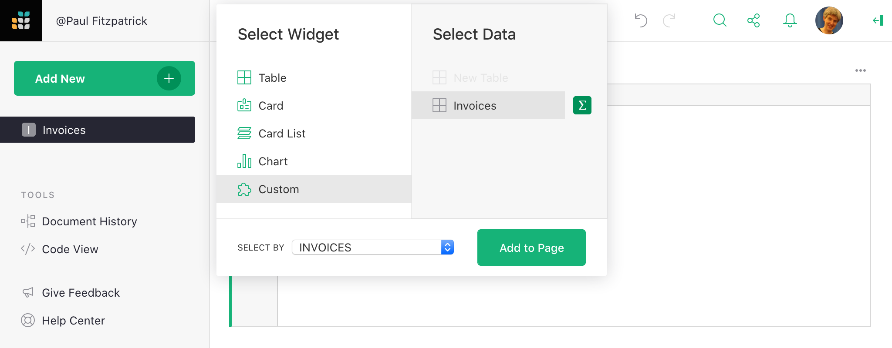

Great, now we have two widgets, a Table Widget that will have invoice data,
and a Custom Widget that will view that data as a nicely formatted, printable invoice.
The Custom Widget starts off blank; select `Widget options` to specify what we want in
it:

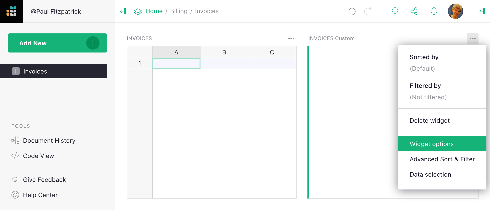

In the `CUSTOM` settings section where it says `Full URL of webpage to show`, put this
link:

> [https://gristlabs.github.io/grist-widget/invoices/](https://gristlabs.github.io/grist-widget/invoices/)

And set `Access` to `read table`.  This grants the Custom Widget access to read the
Invoices table.

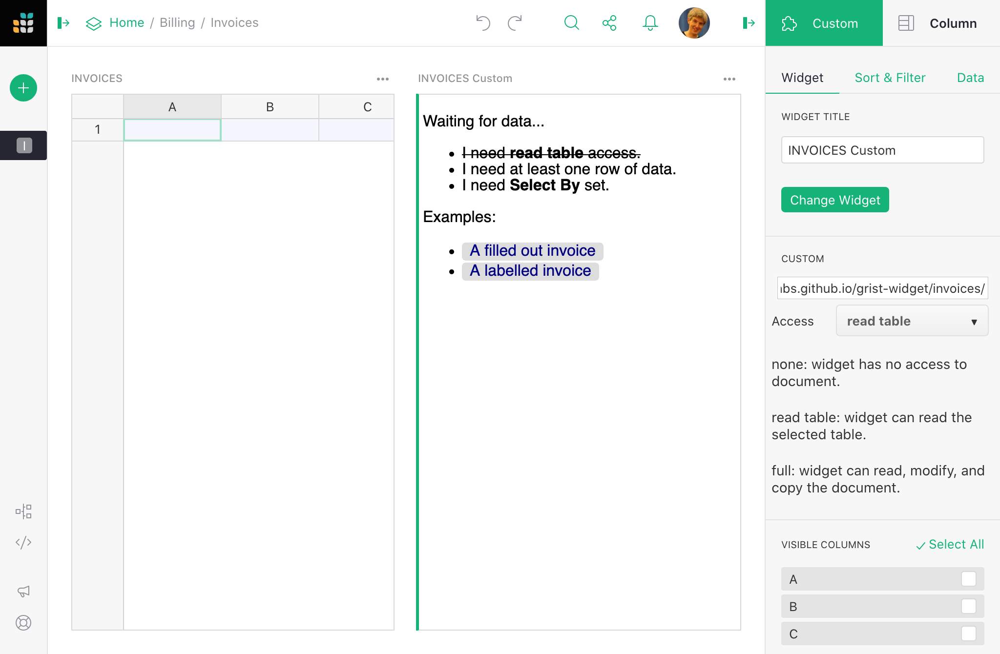

Now place anything you like in a row of the Invoices table (I just added the number `1`).
An incomplete invoice will immediately show up:

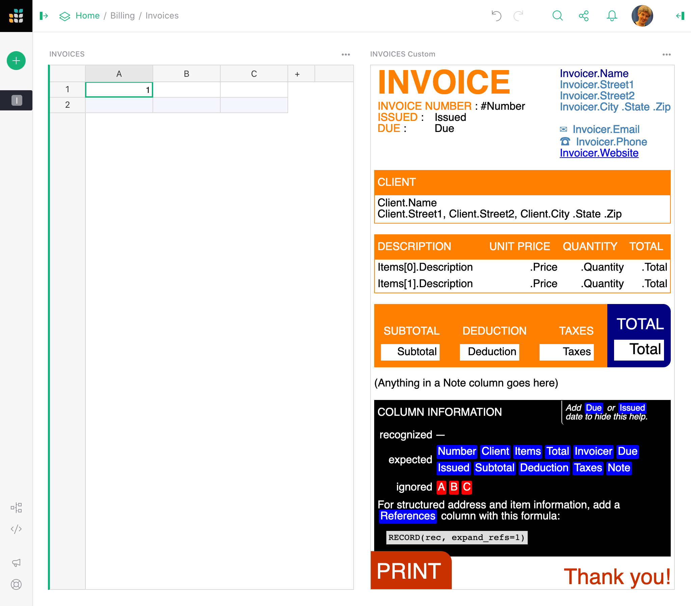

The incomplete invoice shows what column names to use to control what parts of the
invoice.  An extra black box shows what columns the widget understands, what columns
it is ignoring, and what extra columns the widget could make use of.
Currently it is saying that it doesn't recognize any of the columns present,
is expecting columns like `Number`, `Client`, `Items`, etc., and is ignoring
the default `A`, `B`, and `C` columns in the Invoices table.

Looking at the start of the invoice we see a space for an invoice number,
`INVOICE NUMBER: #Number`.  So let's rename the `A` column to `Number`,
we could leave the value as 1, but then it looks like we haven't done much
business yet.  I'm going to choose the set the invoice number to be `$id + 51371`{: .formula},
where `$id` is an auto-incrementing numeric identifier assigned to each row.
But you could set it manually or with a different formula.  As soon as it is
set, the invoice updates:

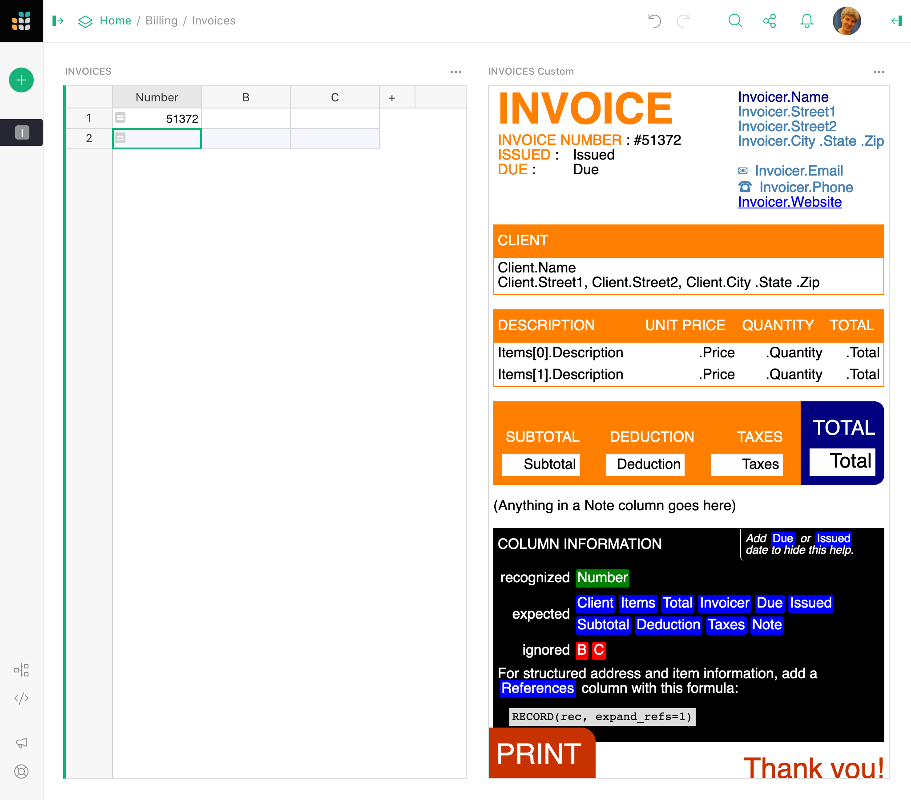

The next column the help box suggests is `Client`, so
let's rename the `B` column to `Client`.  Later we will give client
information in a structured way, but for now let's just put some text
here (use <code class="keys">*Shift* + *Enter*</code> to insert line breaks):

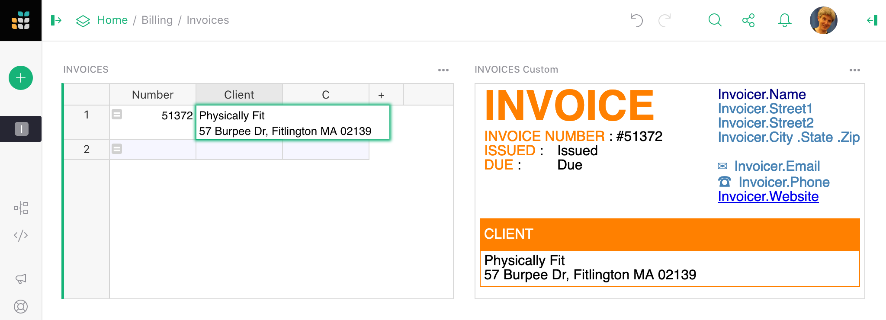

Great, now the Client box is filled out.  The next suggested column is `Items`,
so let's rename the `C` column to `Items`.  Later we will give item
information in a structured way, but for now let's just put some text here:

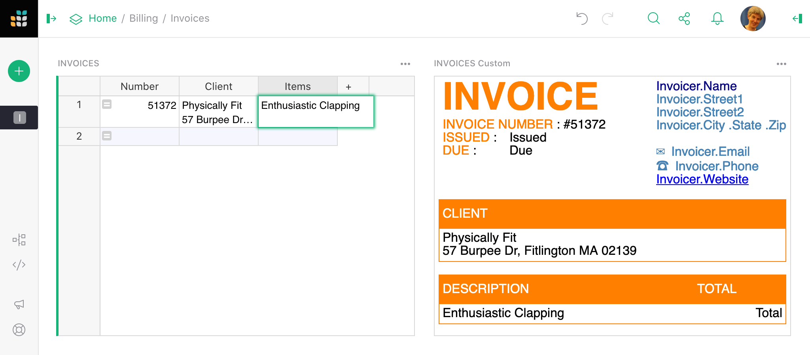

And now the Description is set.  We're missing a total, so let's add a
column called `Total` and set it to `100`:

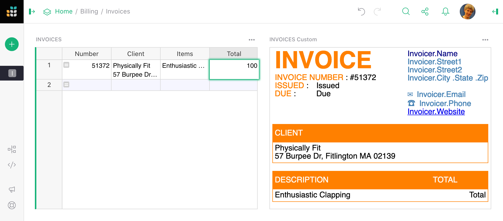

The invoice won't update immediately.  This is the first new column we've
added - until now we've been renaming them.  When we created the Custom Widget,
it was given access to the columns that existed at the time of creation.
To let the widget see the new column, open `Widget options` again and move
`Total` from `Hidden Columns` to `Visible Columns`:

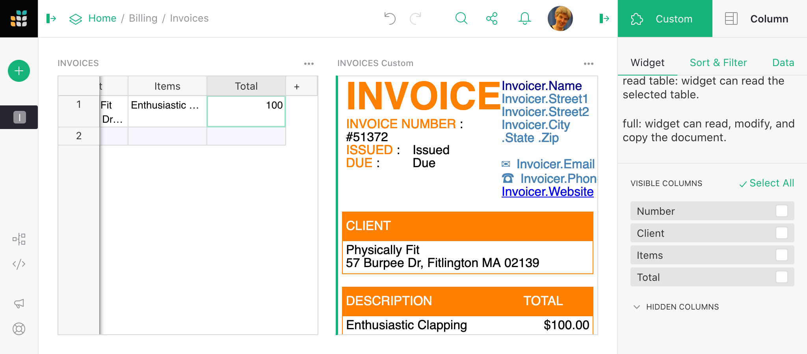

Great, the invoice updated.  Now let's set who the invoice is from, by
adding an `Invoicer` column (remember to make it visible to the widget
via `Widget options`).

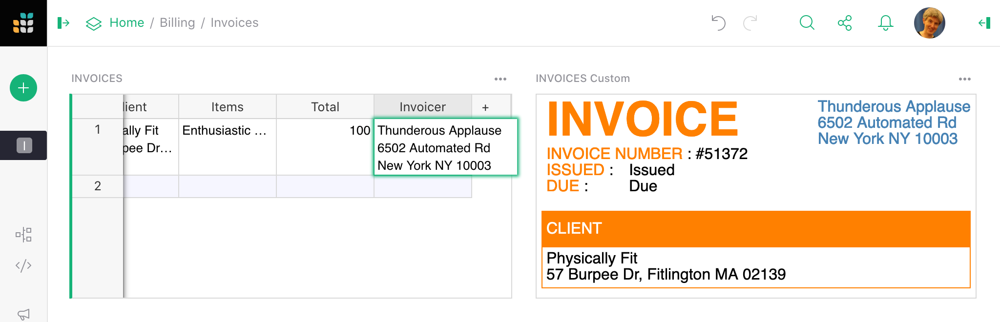

As a last step to creating a usable invoice, let's make an `Issued`
column and put today's date in it (remember to make it visible to the widget
via `Widget options`).  As soon as the invoice has a date, the black help
box will disappear:

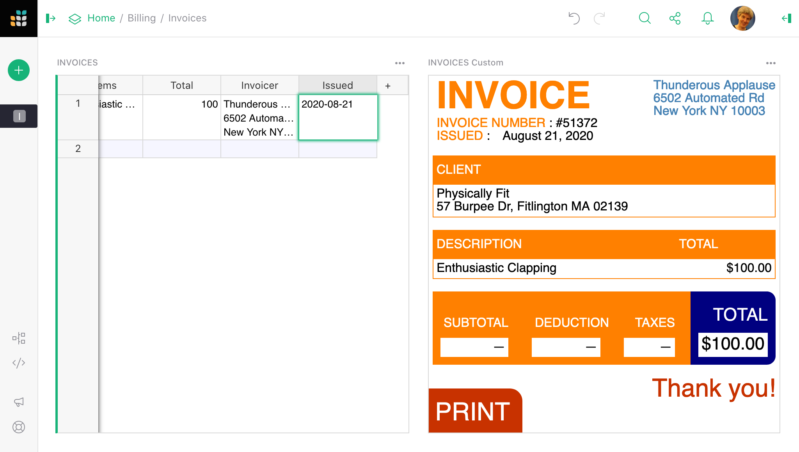

Okay!  If someone sent me that, I'd pay it.  You should nudge me by
giving it a due date though.  Let's make a `Due` column and set it to
a month from the `Issued` date.  Remember to make the `Due` column
visible to the widget via `Widget options`.  Also, be sure to
[set the Column Type](../col-types.md#specifying-a-type) for
`Issued` to `Date` or you won't be able to do date math on it (it will
just be a string).

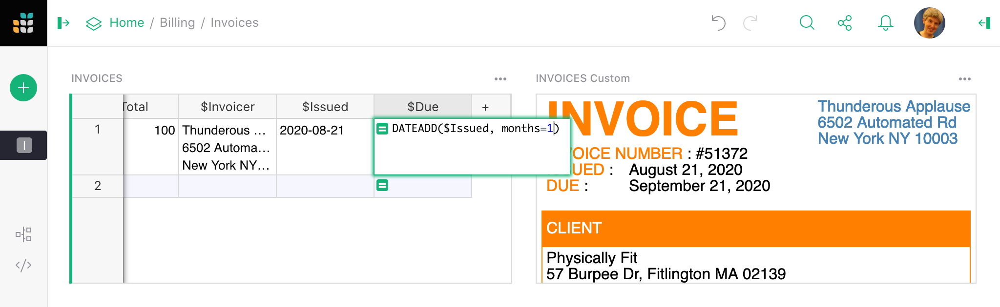

If there are special instructions to go with the invoice, we can add a `Note`
column.  Remember to make it visible to the widget via `Widget options`.

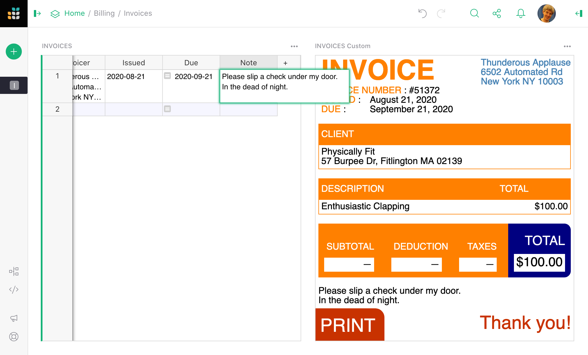

## Entering client information

Now, let's make two useful changes to the invoice set-up:

 * Put client information in a separate table, so we don't have to reenter their
   address every time we invoice them (and we can import the addresses in bulk).
 * Enter items and prices in a table, so multi-item invoices are easy to make
   (and we can use formulas and look-ups for pricing if we like).

Before doing so, we need to let Grist know that the content of the invoice
will depend on these other tables, so that it can update it when something
changes, and make sure the invoice gets access to everything it needs.
Make a column named `References` and give it this formula:

```
= RECORD(rec, expand_refs=1)
```

That says "take the current record, and package it up, including
everything it references directly".  Since Grist is a spreadsheet, it
also implies "update everything that depends on this column if
anything in the references changes".  Remember to make the
`References` column visible to the widget via `Widget options`, so
that the widget will get updated as we add and change referenced material.

When the invoice widget sees a column named "References", it fills out the invoice using the
"packaged" values in that column, rather than the individual invoice fields. The benefit will be
seen in the next step, since these packaged values can include data from related records.

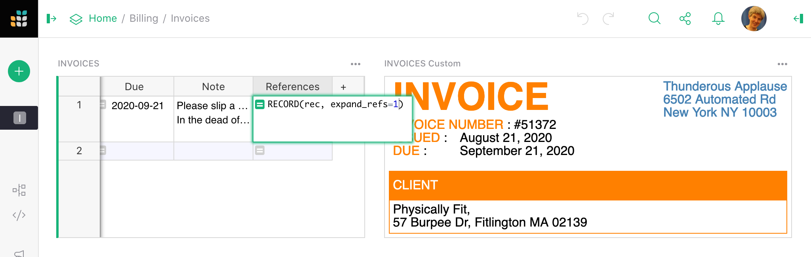

Next let's place client information in a separate table.  Add a new table
to the page for entering business information by clicking
on `Add New`, `Add Widget to Page`, then `Select Widget > Table` and
`Select Data > New Table`:

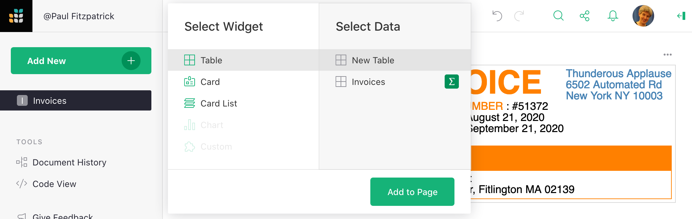

Then rename the table to `Businesses`. Let's also empty the `Client` column
so we can see help about what the widget expects there:

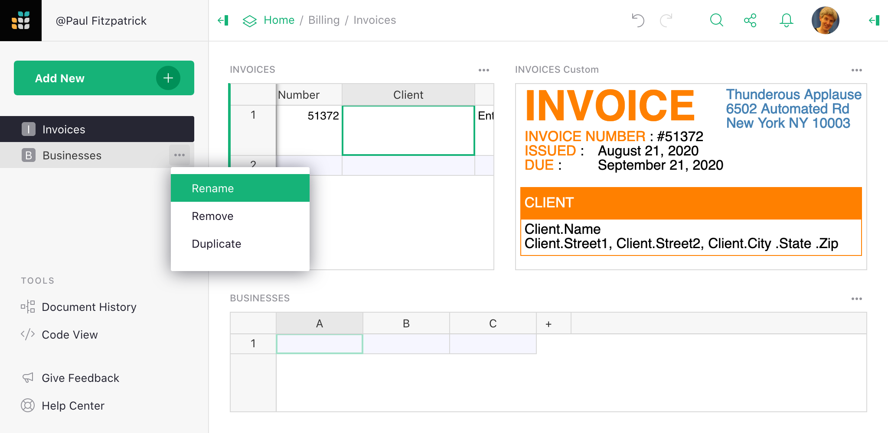

The widget suggests `Name`, `Street1`, `Street2`, `City`, `State`
and `Zip` columns.  So let's provide those columns in our `Businesses` table,
and fill them in for an example client.  Then place the same `Name` in
the `Client` column, and in `Column options` set the Column Type to
`Reference`.  Refer to `Businesses` `Name` if Grist doesn't automatically
guess that.

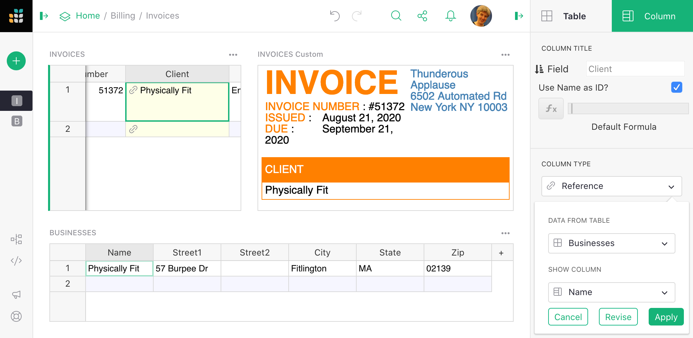

Once you hit `Apply`, you will see a nicely formatted Client
section.

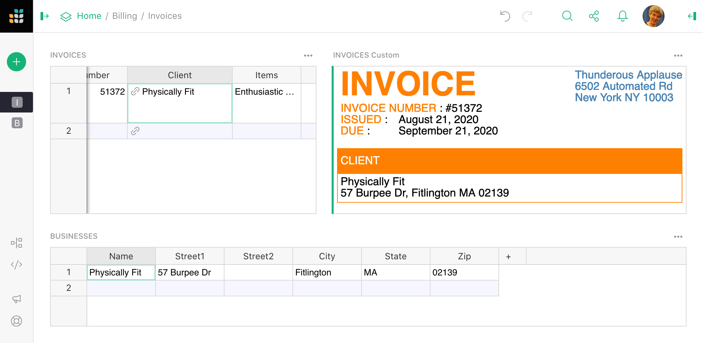

## Entering invoicer information

We could do the same thing for the `Invoicer` column as we did for the `Client`
column, and make it a reference to the `Businesses` table or a separate table.
However, if you will always be using the same name and address for
your business, you could skip setting up a reference by entering a formula like this into the
`Invoicer` column (start typing with <code class="keys">**=**</code> to make it a formula):

```python
{
  "Name": "Thunderous Applause",
  "Street1": "6502 Automated Rd",
  "City": "New York",
  "State": "NY",
  "Zip": "10003",
  "Email": "applause@thunder.com",
  "Phone": "+1-800-YAY-YAYS",
  "Website": "applause.com"
}
```

Then set the Column Type for `Invoicer` to `Any` in the right-side panel.

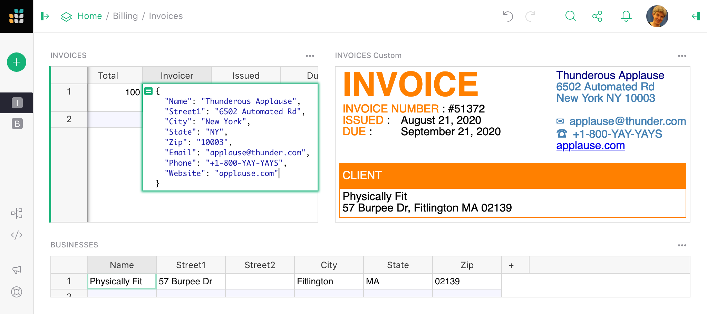

Notice how emails, phone numbers, and links are specially formatted by the
widget.

## Entering item information

Now, let's set up the list of items and prices
that is at the heart of an invoice.  Clear the `Items` column to
see what we can put there.  It will show that `Items` can be a list,
where each item has a `Description`, `Price`, `Quantity`, and `Total`.
So we go ahead and add an `Items` table like we added `Businesses`,
and give it those four columns.  We can set `Total` to be this simple formula:

`$Price * $Quantity`{: .formula}

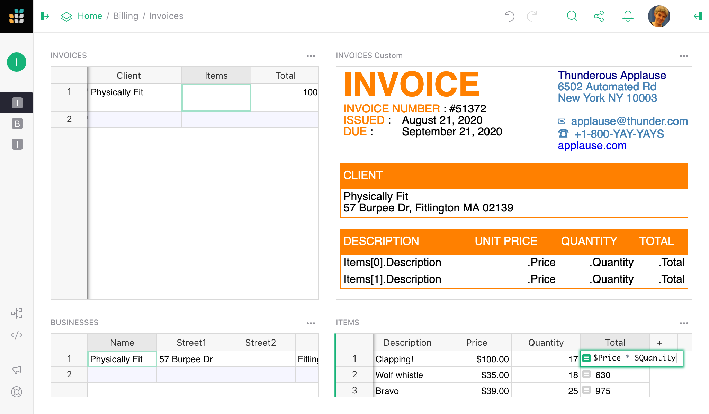

Now we need to pull these items into the `Invoices` table so that
the Custom Widget gets access to them. Set the `Items` column to
the formula `Items.lookupRecords()`{: .formula}, and then reset
its column type to be `Any`. This formula needs a little more work,
which we'll do soon, but let's just start with that.

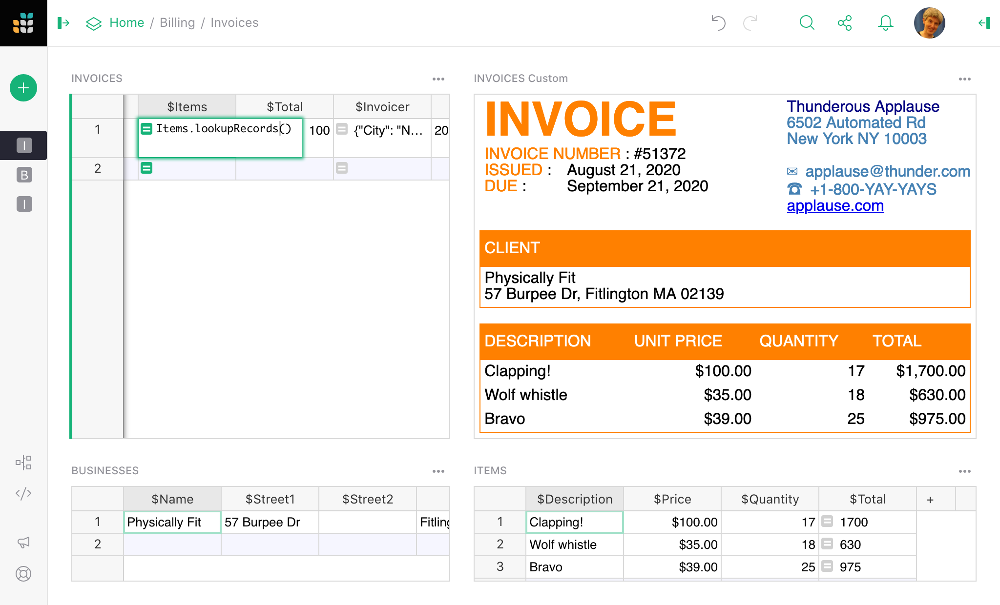

Great, our invoice is updating nicely!  Remove the `Total` column
to get an automatically calculated one:

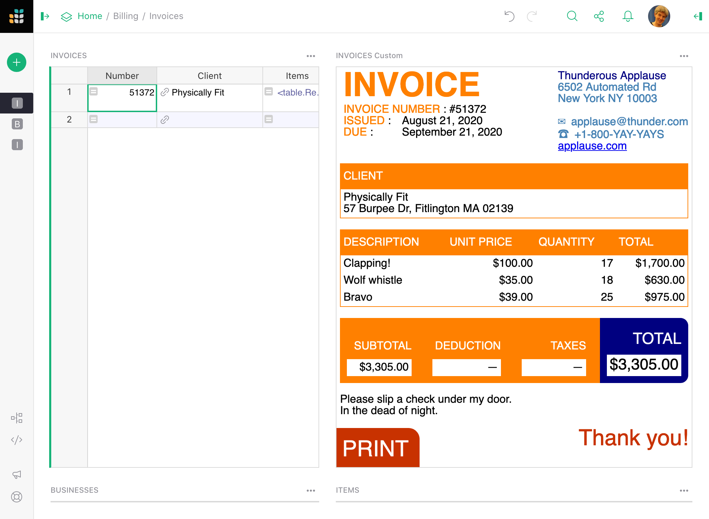

It is probably more comfortable to edit invoices
as a Card Widget than a Table Widget, so let's change that
using `Widget options`, `Table`, `Change Widget`, `Card`, `Save`.
You can [customize the card layout](../widget-card.md#editing-card-layout) to your taste.

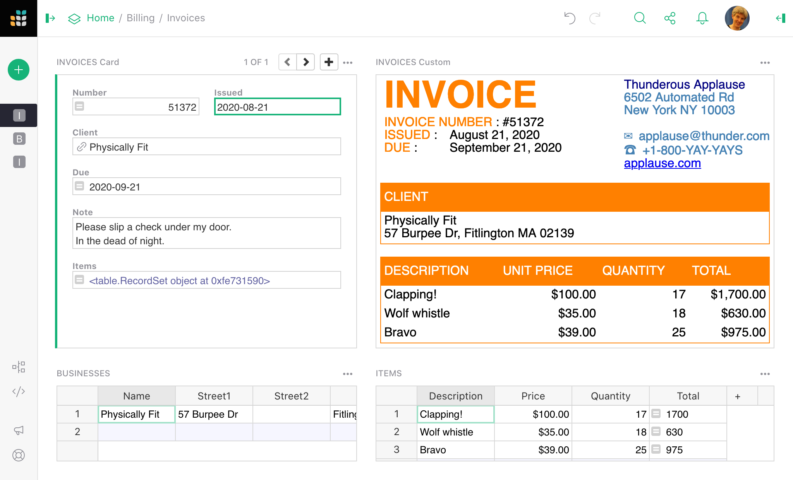

To add a new invoice, click the little `+` above the invoices card,
set an `Issued` date, and pick either the existing Client or add
a new one.

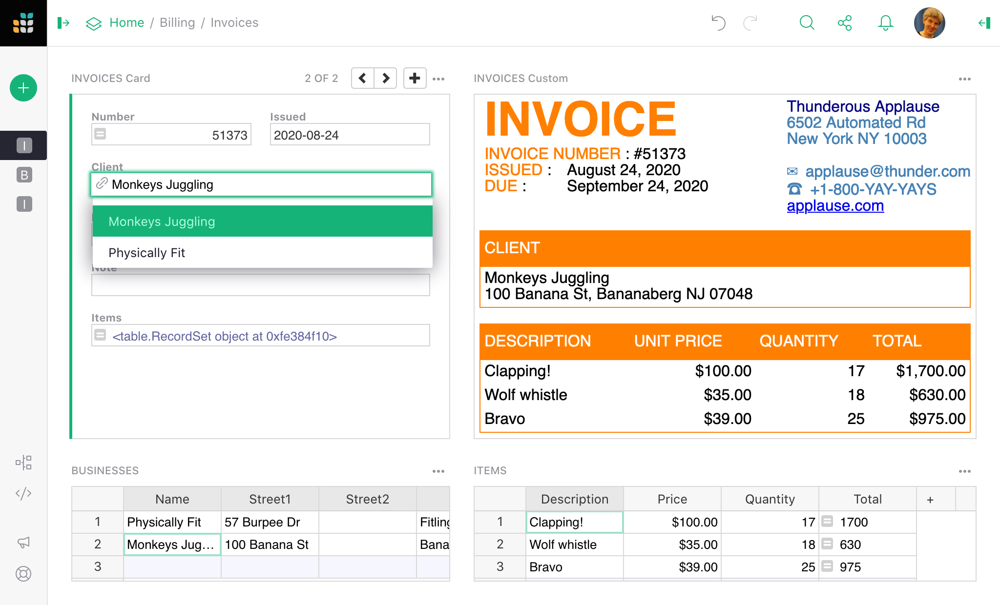

Once we have a second invoice, it becomes clear we skimped on the
formula for collecting invoice items - all the invoices contain
all the items.  No problem, we can get more specific by adding an `Invoice`
column to `Items` and setting it up to refer to specific `Invoices`:

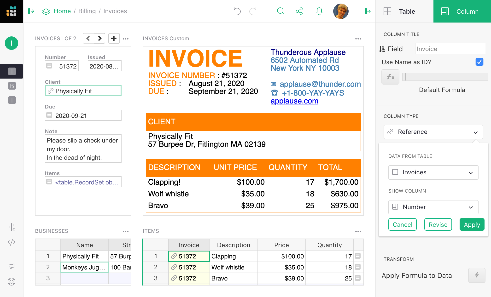

Once that is done we can sprinkle on some Grist fairy dust, and
go to `Widget options` for the `ITEMS` Table Widget, click
`Change Widget`, and set `SELECT BY` to `INVOICES Card`.  Once
that is saved, only the items for the currently selected invoice
are shown.  Even better, when you add new items, the `invoice`
column is automatically set to the invoice you are viewing.
So you can just hide the `invoice` column and forget about it.

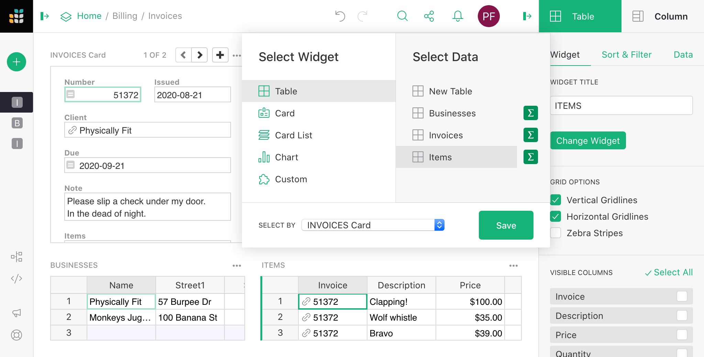

Now let the Custom Widget know what items to use by updating the
`Items` formula to be more picky:

```
Items.lookupRecords(Invoice=$id)
```

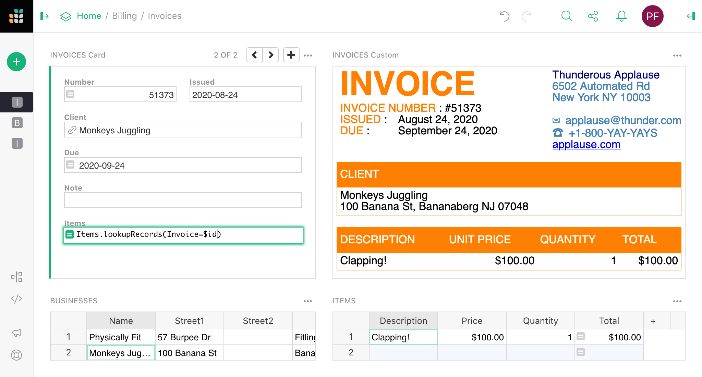

With that, entering new invoices is a breeze!

 * Click `+` to add a new invoice card.
 * Pick the client, set the issue date.
 * Add items.
 * Done!

## Final polish

You can adjust the set-up to taste.
For example, I would choose to add new clients on a separate page (`B` or `Businesses` on
the left panel) since that is relatively infrequent; you could choose
to keep that on the same page.  I don't need deductions or taxes, if you do
you could add columns and/or formulas for those.  The invoice custom widget works
for me as is, but if I needed to tweak anything I could copy the GitHub repository
it is in and change it a bit (or hire a web developer to do that for me - they
don't need to be Grist experts).

For interested developers, the GitHub code is here:
<https://github.com/gristlabs/grist-widget/tree/master/invoices>.


Enjoy, and good luck getting paid!
