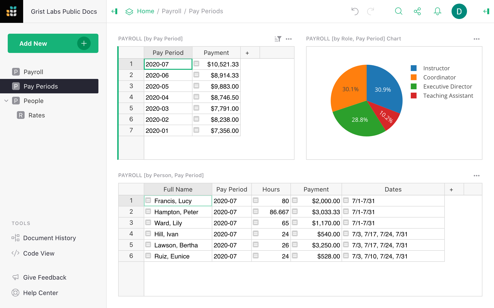

# Tracking Payroll

If you have employees, then you are keeping track of payroll. You may be using a payroll service,
and it probably asks you to enter hours for each employee once a month.

This is where Grist can help you keep track of things conveniently, and to reduce mistakes,
especially if you have part-time employees.



## The Payroll Template

The finished template is here: <https://templates.getgrist.com/5pHLanQNThxk/Payroll>{:target="\_blank"}.
Feel free to open it in a separate window, and try things yourself as you go along.

The template addresses a few needs:

1. We need to be able to add employees, and keep basic contact info for them.
2. We need to set rates at which people are paid, and these rates can change over time.
3. In our example, rates also vary by role: the same person could work as an Instructor in one
   program, and as a Coordinator in another, at different rates.
4. We need to enter hours for each person.
5. We need to get the monthly totals, both to enter data into our payroll service, and to verify
   that everything matches.

## The "People" Page

Let’s start with the "People" tab in the example. It addresses our needs (1), (2), and (3).


On top, we have a list of people, with contact info such as address and phone number. To add a new
person, click into the last row of the `PEOPLE` table, and type in the data.

Below that we have a card for the selected person -- a handy way to view or update the selected
person’s record.

Next to that are the rates for this person. We keep track of all rates, not only the latest one,
along with each rate’s effective date.

To add a new rate, select a person, click into the last row of the `RATES` table, and enter the
effective date into the `Rate Start` column (perhaps using the shortcut for today's date: <code
class="keys">*⌘* + **;** (semicolon)</code> on Mac or <code class="keys">*Ctrl* + **;**</code> on
Windows). Set the `Role` that it applies to, and the `Hourly Rate`. The `Comment` field is for
your own notes.

<span class="screenshot-large">**</span>
{: .screenshot-half }

Don’t modify values for existing rates, or past payroll computations will be affected. When you
give someone a raise, add it as a new row. This way, full history is preserved, and is available
for reference.

## The "Payroll" Page

To enter payroll hours, switch to the "Payroll" page. It is the most common task, so we placed this
page first in the list of pages to have it open by default when you open the document. Scroll to the
bottom (you can use these handy shortcuts: <code class="keys">*⌘* *↓*</code> on Mac, <code
class="keys">*Ctrl* + *↓*</code> on Windows).


To add a payroll entry, type in the date (or use the date picker), select the person using
auto-complete, select their role, and type in their hours. The next few columns automatically look
up the relevant rate, and calculate the payment.

If you'd like to enter hours for a range of dates, e.g. for a particular week, or for someone
working full-time this month, you can use `Date` as the start date, and enter also an `End Date`.

The interesting bit about this page is how the `Per Hour` rate is looked up. You don’t need to
care if you are just using the template, but if you enjoy looking under the hood, or if you need
to customize this further to your needs, I’ll explain it in detail below.

## The "Pay Periods" Page

Here the totals for each period are automatically tallied up to address our need (5) — to see an
overview, to enter data into a payroll system, and to check that everything matches.


The latest pay period (in our case, a month) is on top of the top-left table. You can select any
pay period there to see a pie chart with an overview of pay broken down by role, and a table of
how much each person earned that month.

The names and hours in the last table are typically all that a payroll service needs. In addition,
we included a `Dates` column summarizing dates worked that month: for people working part time, it
helps remember when the income was earned. It could be a handy note to include into a pay stub if
your payroll service allows it.

That’s it!

We now have a convenient and simple payroll tracker.

## Under the hood

I promised to show how rates are looked up. Open up the "Payroll" page, click on
any cell in the `Per Hour` column, and hit <code class="keys">*Enter*</code>.

<span class="screenshot-large">**</span>
{: .screenshot-half }

The formula you see is a multi-step Python function. It is intentionally broken up into bits,
with comments explaining what each line does:

```python
# Get all the rates for the Person and Role in this row, sorted by Rate_Start.
rates = Rates.lookupRecords(Person=$Person, Role=$Role, order_by="Rate_Start")

# Select the most recent rate that started on or before this row's Date.
current_rate = rates.find.le($Date)

# Return the Hourly_Rate from the relevant Rates record.
return current_rate.Hourly_Rate
```

Read the comments in that code to understand the steps. The second step uses the `find.le` method,
one of several available for [ordered lookups](../functions.md#find_).
It is simpler and more efficient than other ways to find the correct rate.

This same formula could be written without comments and more concisely:

```python
rates = Rates.lookupRecords(Person=$Person, Role=$Role, order_by="Rate_Start")
rates.find.le($Date).Hourly_Rate
```

To learn more about the parts of this formula, here are the relevant documentation links:

- [lookupRecords](../functions.md#lookuprecords):
  how we look up all rates for the given person and role, and sort them.
- [.find.le](../functions.md#find_):
  how we find look up the closest rate that applies to the current date.
- [.Field](../functions.md#_field): how we get the `Hourly_Rate` field
  from the rate record.

This formula is also a good illustration of how helpful it is to have Python available, along with
multi-line formulas, variables, and comments.

## Using the Payroll template

To start using this example for your own payroll, start with the template:

[GO TO TEMPLATE](https://templates.getgrist.com/5pHLanQNThxk/Payroll){:target="\_blank"}
{: .grist-button }

then click "Save Copy":

<span class="screenshot-large">**</span>
{: .screenshot-half }

Then mark the "As Template" checkbox.

<span class="screenshot-large">**</span>
{: .screenshot-half }

Your copy will then include all the structure, logic, and layouts of the Payroll document with
none of the sample data.
