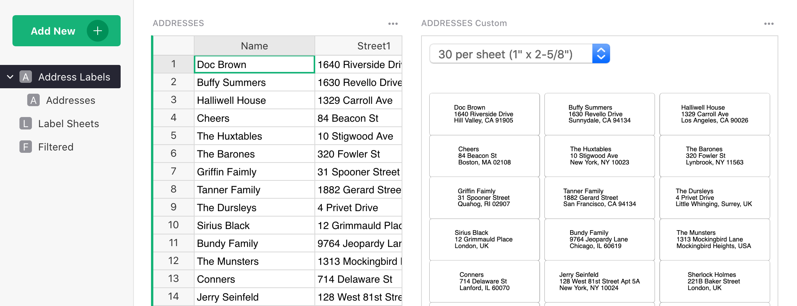
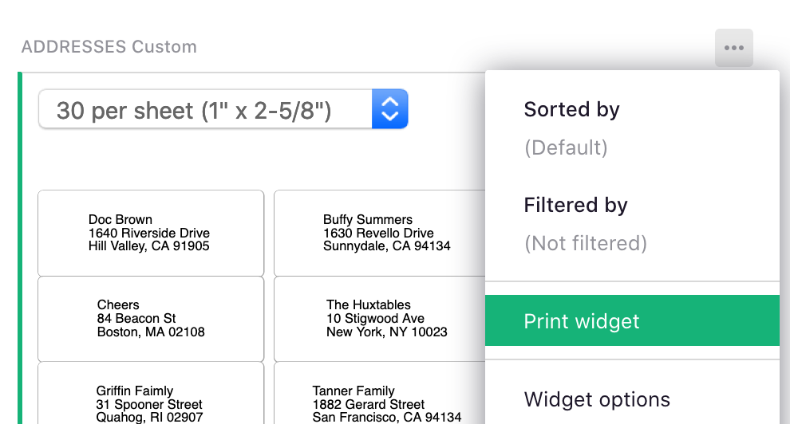
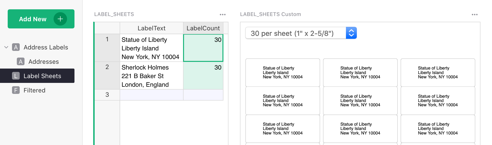
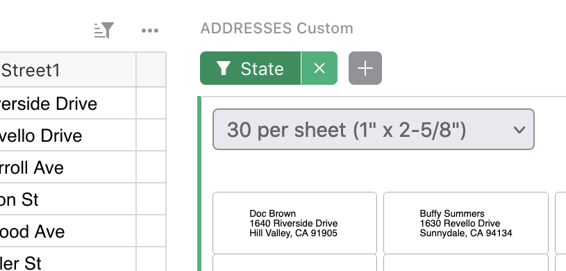
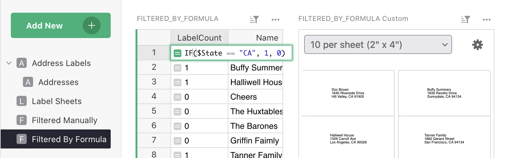
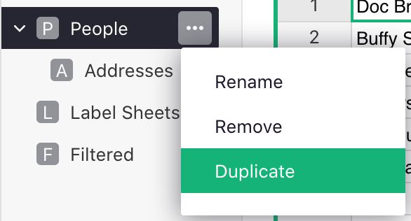
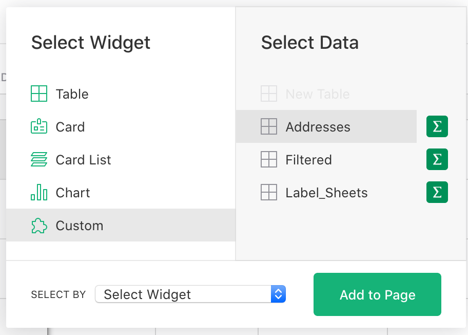
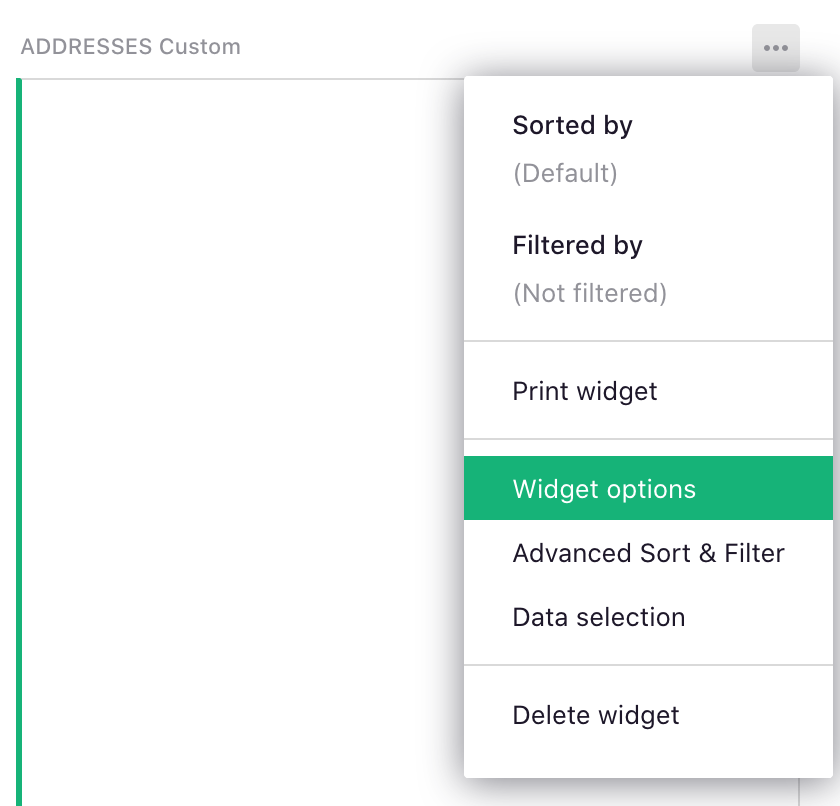
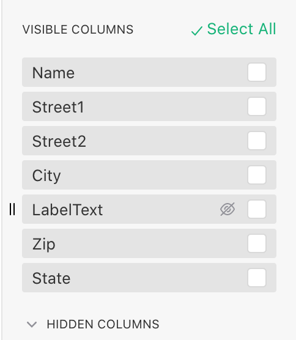
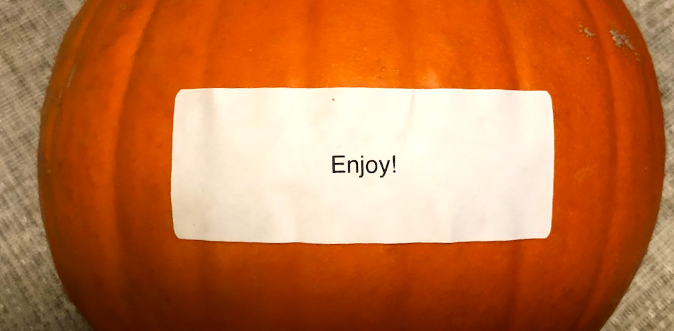

# Printing Mailing Labels

Do you ever print mailing labels? Typically, it involves a few steps, first exporting
addresses, then importing them into Word or other software that can lay them out for a particular
type of label.

<center>

</center>

If you maintain addresses in Grist -- or use labels for name tags, storage containers, child
belongings, or [other creative uses](https://www.shutterfly.com/designs/7-creative-uses-for-address-labels)
-- you can add a custom widget to have your printable labels available
at the click of a button.

## Ready-made Template

Let me first share a template. Later I'll describe how to add the same functionality to an
existing document, e.g. to add mailing labels alongside [CRM](../lightweight-crm.md) or
[Payroll](2020-09-payroll.md) data.

The template is at: <https://templates.getgrist.com/9nNr9uQwoXWA/Print-Mailing-Labels>{:target="\_blank"}.

You can use it right away. Simply type in your own addresses.

The template shows a few variations of what you can do.

### Labels for a table of addresses

That's what you see in the first page:



You can use the dropdown on top of the labels widget to select the size of the labels, depending
on what actual label paper you are planning to print on.

What's actually printed is a hidden column named `LabelText`. If you show this column, or find it
in the "Addresses" page (where it's visible), you'll see that it's a formula that stitches
together all the parts of an address. (We get into the
[details of this formula](#add-the-labeltext-formula) below.)

To print the labels, select "Print widget" from the menu above the labels widget (see also
[Printing Notes](#printing-notes) below):

<span class="screenshot-large">**</span>
{: .screenshot-half }

### A sheet of labels for the same address

If you need many identical labels, e.g. for a return address, add another column named
`LabelCount`. This is illustrated in the page "Label Sheets".



If you have multiple addresses in the table, and want to print just one, simply set the count to
zero for the addresses you don't want to include.

### A filtered list of labels

There are a few ways in which you can print out only a few labels out of a larger table, and these
are illustrated in the linked template:

1. The "Address Labels" page includes a filter button for `State`, which allows simple filtering
   by state. You can click `+` button to easily create additional filters like this:

    <span class="screenshot-large">**</span>
    {: .screenshot-half }

2. To print out only a few labels out of a larger table, you can use the
   `LabelCount` column with a formula. This formula can produce 1 for a label that should be
   included, or 0 for a label that should not. The page "Filtered By Formula" shows an example,
   with the simple formula that includes only California addresses:
   `IF($State == "CA", 1, 0)`{: .formula}:

    

3. The "Filtered Manually" page includes a `Select for Print` column. Click any toggle to include
   the corresponding row into the label sheet.

[GO TO TEMPLATE](https://templates.getgrist.com/9nNr9uQwoXWA/Print-Mailing-Labels){:target="\_blank"}
{: .grist-button }

<br/>


## Adding Labels to Your Document

If you have a document with addresses, you can add a page with mailing labels, and the
labels will be there -- up-to-date and waiting for you -- any time you open it.

I'll assume that you already have a page that shows a table with addresses. Perhaps it's called
"People", "Clients", or "Employees". Open the menu next to the page name in the left
panel, and click "Duplicate":

<span class="screenshot-large">**</span>
{: .screenshot-half }

This gives you a new page. We'll add the labels here, to avoid taking up screen space in the page
you used for other purposes.

### Add the LabelText formula

Next, add a column to the table with addresses, and name it `LabelText`. Type a formula into
it that produces an address formatted into multiple lines. Here is an example, but you may need to
rename, add, or remove fields depending on the names of your columns:

```python
"%s\n%s %s\n%s, %s %s" % ($Name, $Street1, $Street2, $City, $State, $Zip)
```

Note that this is Python syntax for formatting strings. Here is a brief guide to decode this:

- Each `%s` gets replaced with the next value from the parenthesized list after `%`.
- `\n` inserts a newline.
- `$Name` etc. are Grist variables corresponding to fields of the current record.

### Add the Custom Widget

Click `Add New` button and select `Add Widget to Page`. In the dialog that appears select widget `Custom`
and the table that contains the addresses:

<span class="screenshot-large">**</span>
{: .screenshot-half }

Click `Add to Page`.

Open the menu above the widget and select "Widget Options":

<span class="screenshot-large">**</span>
{: .screenshot-half }

In the right-side panel that opens, in the "Custom" section, enter the URL of the widget that
implements the mailing labels functionality:

`https://gristlabs.github.io/grist-widget/printlabels/`

Then change the "Access" dropdown from `none` to `read table`.

You should now see your labels! If not, check that `LabelText` is listed below under "Visible
Columns". (If it's under "Hidden Columns", click the "eye" icon to make it visible to the widget.)

<span class="screenshot-large">**</span>
{: .screenshot-half }

You can add another column named `LabelCount` for printing multiple labels or omitting some
labels. If you do, just be sure to add it to "Visible Columns" of the Custom Widget, as those are
the only columns available to it.

### Set Preferred Label Size

The labels widget remembers the last label size you picked. If you'd like it instead to open to a
fixed size every time, you can add the preferred size in the widget URL (in the right-side panel),
e.g.:

`https://gristlabs.github.io/grist-widget/printlabels/#labels10`

The available sizes are `labels8`, `labels10`, `labels20`, `labels30`, `labels60`, and `labels80`,
each of which corresponds to a standard type of label paper (all based on US Letter paper size).

In the example document, this is illustrated in the widget on the "Filtered" page.

## Printing Notes

The widget uses the browser for printing. To match the exact sizes of the label paper,
double-check that you don't have any settings that would change the scaling, and check Print
Preview before printing. If there is a scale set, it should be "100%", and options such as "Ignore
Scaling and Shrink to Fit Page Width" should be off.

## Further Customization

This feature is built using [Custom Widgets](../widget-custom.md). It allows you, or a third-party
developer, to customize it further using HTML, CSS, and Javascript. For interested developers, the
code for this widget is available at <https://github.com/gristlabs/grist-widget/tree/master/printlabels>.

<span class="screenshot-large">**</span>
{: .screenshot-half }
