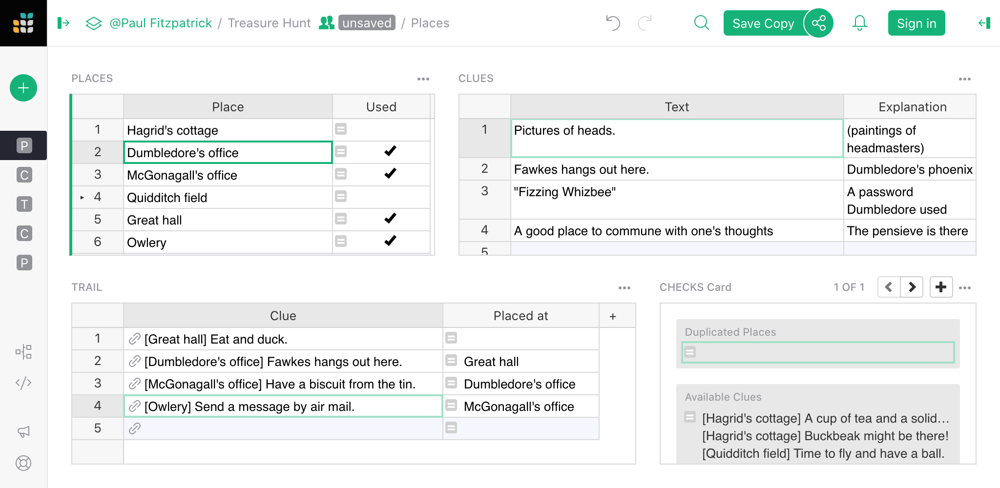
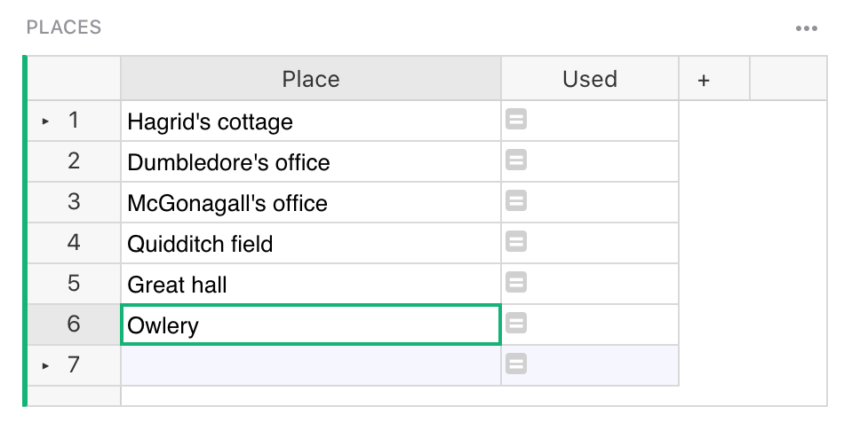
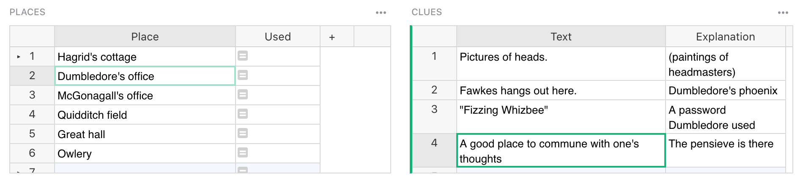
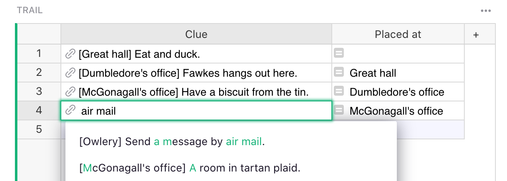
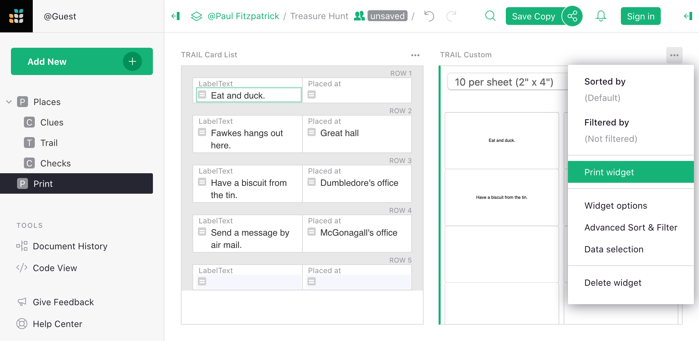

# Planning a Treasure Hunt

A treasure hunt is a fun party diversion that goes like this:

 * All the players (the "seekers") listen to a clue for a location, then
   set out to find it.
 * When seekers find the location, they discover another clue there to read.
 * Each clue leads to a new location, until finally instead of a clue the seeker
   finds a treasure!

Seekers can be paired up in teams as needed, depending on their age.
The hunt really rewards preparation, and Grist can help with that.
Here's an example hunt:

You can play with the example yourself here:

> <https://templates.getgrist.com/ihsZTnKTF7Lr/Treasure-Hunt>

Once ready to start your own completely fresh hunt just do "Save Copy"
and select "As Template".

## Places

First, think of places to send the seekers.
You're looking for places which have some special character or usage,
and where there are some obvious nooks or crannies to hide a clue.
The set of places should cover as much space as possible within your
territory.  It is fine to pick places that are close together,
as long as someone searching for a clue around one of them wouldn't
stray to the other.  I personally take a certain sadistic pleasure in
making seekers retrace their steps across the longest distance as often
as possible.

For example, in an apartment, posters and paintings can be good to hide
clues behind, or visually distinctive books on a book shelf.  For other
spots like the kitchen sink or towel racks, you have to consider whether
the clues will survive long enough to be found!

Enter everywhere you think of in the "Places" widget in the Treasure Hunt document.
Don't worry about their order just yet.

**
{: .screenshot-half }

## Clues

Now that you've thought of some places, brainstorm clues for
them.  In the Treasure Hunt document, click on a place that you've
added, and then try to think of at least one clue for it.  Put those
clues in the "Clues" widget.  This can be a good time to share the
document around, since you never know who in your family is going to
have the twisted mind it takes to come up with the quirkiest clues.
Or maybe you do know.  There's no need to restrict yourself to people
who are going to be present.  Especially this COVID-hit year, it can
be a pleasure for people who know your space from the before-times
but cannot be physically present to at least visualize it and propose devious
hidey-holes to torture those who are.

## The Trail

Now that you've got places and clues, all that is left is to assemble
them into a sequential trail.  You can do this in the "Trail" widget.
Just start typing in the clue you want to start with, use the
autocomplete to confirm it.  Then move on to the next clue, in any
order you like.  Pick one clue per location.  Grist will show where
each clue needs to be hidden to make the sequence work, which is
definitely not rocket science but still surprisingly easy to lose
track of (especially for younger trail creators).  It will also warn
you if you've repeated the same location twice.

**
{: .screenshot-half }

## Printing

When your trail is ready, the document has a "Print" page where you
can print out the clues ready to hide, and the list of where to hide
them if delegating this task to enthusiastic helpers.  If the trail
is outdoors, and it may rain, it is a good idea to wrap clues in
aluminum foil or plastic.

Ideas for places and clues are good to hang onto for future events,
either as a Grist document or as a print-out.  Enjoy the hunt, and
if you come up with improvements to the spreadsheet please do let us know!
