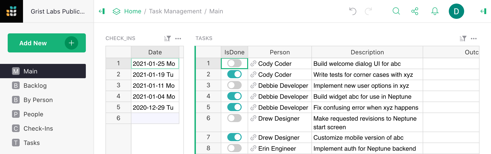
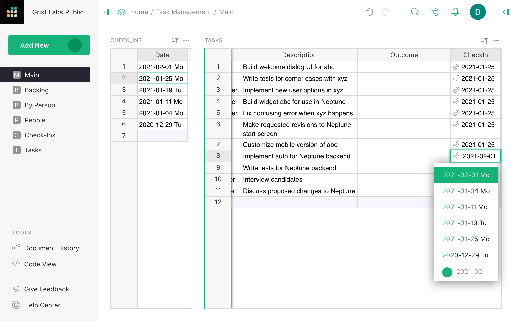
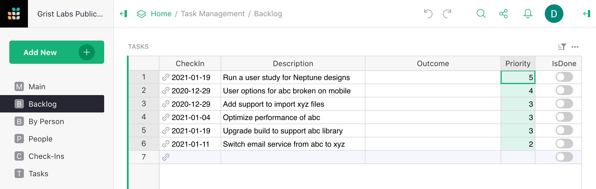
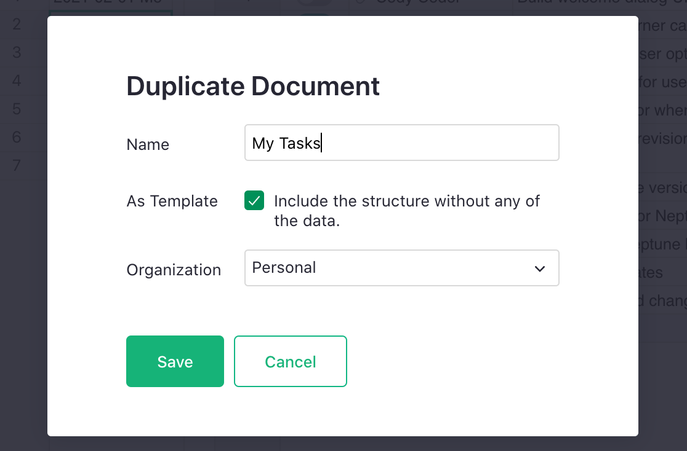

# Task Management for Teams

I used to be surprised to hear that many people prefer a spreadsheet over project management
software. Why? Because it's simpler. Well, I agree! For the last year, we've been
using Grist internally to manage projects and tasks within Grist Labs. It feels dead simple, and
it works great for us.

## Our Workflow

We have a small team, and regular scheduled check-ins. The goals for the check-ins are to go over
all the work that was assigned, and to end up with a list of new assignments. After the check-in,
everyone can see exactly what's expected of them for the next time.

  

You can explore the example at <https://public.getgrist.com/hik1whAV5snj/Task-Management/m/fork>{:target="\_blank"}.

### Structure

The structure is simple. There are three tables:

  - `People`, i.e. the team members,
  - `Check-Ins`, identified by date,
  - `Tasks`, each associated with a person and a check-in.

We have one special "person" named "Backlog". That's our way of recording tasks that
are not yet assigned to anyone.

### My Tasks

The page called `Main` shows all the check-ins, ordered with the latest one on top. When that one is
selected, the TASKS table shows all the currently assigned tasks, sorted by person. That's where I
look to remember what's next, and to have the pleasure of checking off a task as done whenever
I'm done with it.

### Check-ins

These days everyone is working remotely, so the check-ins are over Zoom. Everyone opens the
"Check-Ins" Grist document, and one person takes charge of making updates, and shares their screen
for others to follow.

First, create a record for today's check-in: click into the CHECK\_INS table, and hit <code
class="keys">*Ctrl* + *=*</code> (<code class="keys">*⌘* *=*</code> on Mac) to add a new record,
then <code class="keys">*Ctrl* + **;**</code> (<code class="keys">*⌘* + **;**</code> on Mac) to
insert today's date into it.

Then click the second date (previous check-in) to go over previously assigned work. This is where
we take turns going over the finished tasks. It's a chance to mark things as complete. If a task
wasn't started, change the associated date to today's date -- this will move the task.

  

There is a field to record optional notes about the outcome. If a task was only partly done, we
make a note of what got finished, mark it as complete, and make a new task in today's check-in for
the remaining work. Any follow-up tasks are also created for today's check-in.

By the end of it, all tasks still associated with the last check-in are marked as done. It's a
satisfying record of everyone's work!

Now, click the check-in for today. Any tasks that were moved, or follow-up tasks created will be
here. This is a chance to create and assign new tasks, and to revisit the backlog.

### Backlog

Whenever a new task comes up (say a bug that needs fixing), anyone can add it to the latest
check-in. It can be assigned to a person immediately, but if it's not urgent, it can be assigned
to "Backlog".

During check-in, we go over any new backlog items and assign priority for them: just a number.

There is a separate `Backlog` page to view all the backlog tasks, ordered by priority from highest to
lowest.

  

When assigning tasks during check-in, visit this page to see if there is anything high-priority
that should be assigned. If anyone has spare bandwidth, there are usually plenty of smaller
low-priority items that can be picked off as well.

That's about all. The last page we use is called `By Person`, and it's just a helpful way to
see all tasks completed and pending for any given person. It is a useful reference for quarterly
reviews.

## Task Management Document

The example document is at <https://public.getgrist.com/hik1whAV5snj/Task-Management/m/fork>. It
feels no more complicated than a To-Do list, and that's the point!

To start using it for your own tasks, open the Share menu (), and click "Duplicate Document...". Give
it a name and click the "As Template" checkbox.

  **
  {: .screenshot-half }

Your copy will then include the structure and layouts with none of the sample data.

Enjoy! May your tasks get done on time!
