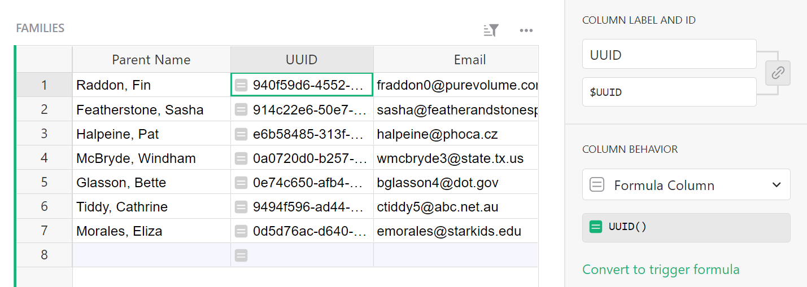
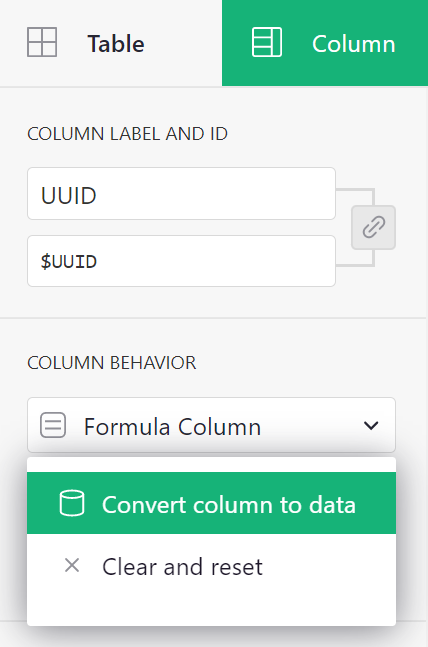
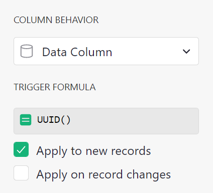
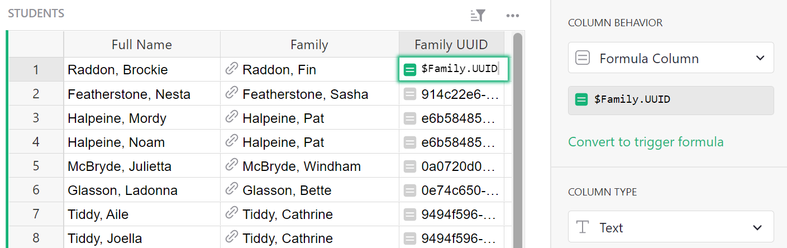
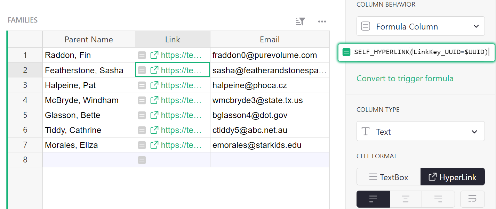
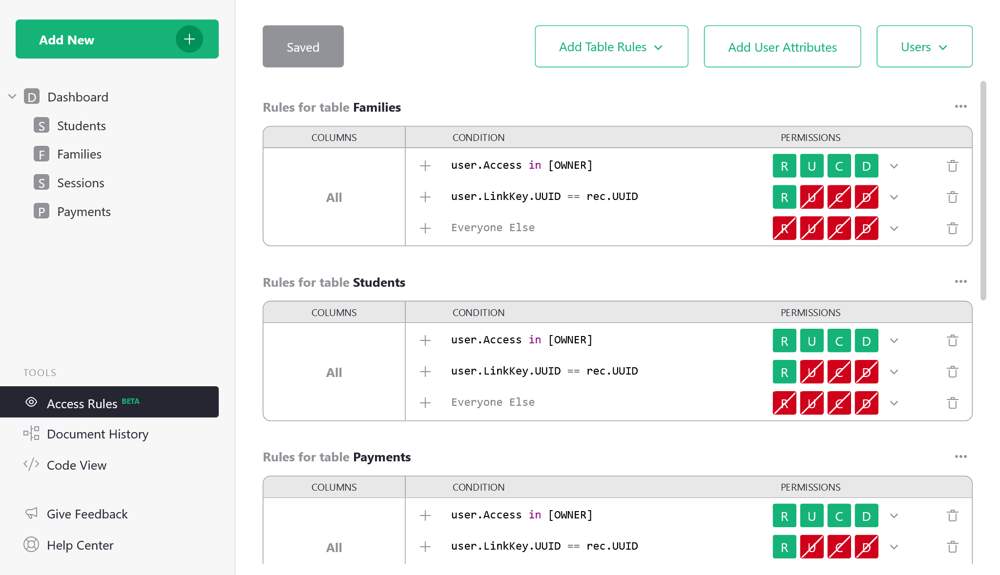
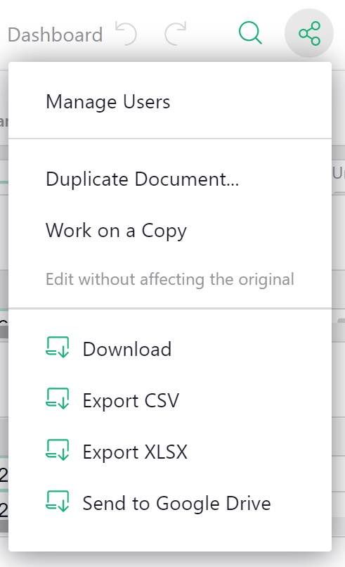

# Create Unique Links in 4 Steps

In Grist, “link keys” are URL parameters that when combined with the `user.LinkKey` variable in
[access rules](https://support.getgrist.com/access-rules/) will determine which data a link recipient is permitted to view.

You can learn to do this in four easy steps.
[We’ve created a simple template](https://public.getgrist.com/cBRGq2QKzTSC/Private-Tutor-LinkKey-Tutorial)
you can copy and edit as you follow along with this guide.

In our example, you are a private tutor who uses Grist to track hours, payments, and client data.
You would like to share session and payment history with parents via a link that only shows their
family's data. A simple way to do that would be to set access rules that limit a link recipient’s
view to just those records tied to their family.

Let's do that now.

*The private tutor can see all data, but a parent can only see their family's data.*
{: .wide-img-caption}

## Step 1: Create a unique identifier

In the families table, create a new column in which you will use Grist’s
[`UUID()`](../functions.md#uuid) function to generate and assign a unique key to
each family.

Convert the column to the data column to freeze its values.

**
{: .screenshot-half }

You'll notice our formula has changed to a trigger formula. Select 'Apply to new records'. 
This will ensure that new rows will also be assigned a unique identifier.

**
{: .screenshot-half }

## Step 2: Connect UUID to records in other tables

In the Students, Sessions, and Payments tables, add a column that ties each record to the
referenced family's UUID. Name these columns "UUID",
with the simple formula `$Family.UUID`{: .formula}.
Not sure how this works? Brush up on Grist's powerful [reference
columns](../col-refs.md#reference-and-reference-lists).

**Tip:** The formula `$Family.UUID`{: .formula} gets the UUID from the record
that is referenced in the Family column.

## Step 3: Create unique links

In the Families table, create a new column in which you will use Grist’s
[`SELF_HYPERLINK()`](../functions.md#self_hyperlink) function to generate hyperlinks.  Use the
formula `SELF_HYPERLINK(LinkKey_UUID=$UUID)`{: .formula}
to create a link key called "UUID" that sets the URL parameter to a specific `$UUID` within a record.
Convert the column type to Text > Hyperlink.

**How does this work?** The link generated for "Raddon, Fin" is
`.../Private-Tutor-recUUID/p/9?UUID_=6752c258-443d-4a2c-800d-1491da265b72`. The “link key” is the
part of the URL that reads `?UUID_=6752c258-443d-4a2c-800d-1491da265b72`.

## Step 4: Create access rules

Open the Access Rules page from the left panel, and create rules to give limited access to your
clients. Let’s think about who should access each table, and which parts of it should be
accessible.

 1. You, the owner of the document should have full access to Read (R), Update (U), Create (C) and
    Delete (D) records in each table. Add the rule `user.Access in [OWNER]` to _each table_
    to grant owners full access. Why `user.Access`?
    Review [access rule conditions](../access-rules.md#access-rule-conditions) to learn more.

 2. Parents viewing the document should have Read-Only access just to those records related to
    their family. In previous steps, we created a unique identifier (UUID) for each family,
    connected relevant records in all tables to a UUID, and generated URLs with link keys that
    include those UUIDs. Now we must create access rules that match UUIDs and URL link keys.

    To do so, add the rule `user.LinkKey.UUID == rec.UUID` to _each table_.
    This tells Grist to look at the URL’s link key (named UUID) and match it to records that include
    that same UUID. Set access to Read-Only by clicking on the drop-down menu next to "permissions".

 3. Make sure Public Access is turned on in the "Manage Users" panel (see [Sharing](../sharing.md)).

**Tip:** Do not edit the default rules. Row-level access is granted in the relevant tables.

You did it! This is just the beginning. There's a lot more you can do with link keys. Check out
[another example](../access-rules.md#link-keys) to deepen your
understanding of link keys even more.

**Still need help?** View the [tutorial solution
here](https://public.getgrist.com/9ZQvegsao3zT/Private-Tutor-LinkKey-Tutorial-Solution?UUID_=039170d0-c4d6-4a43-a357-3cb0fd10822f).
Make a copy to see all data:

**
{: .screenshot-half }
