Formula Cheat Sheet
=========

Grist has a powerful data engine to calculate the cells of your tables using formulas. Grist formulas are written
in [Python](https://docs.python.org/3/library/){:target="\_blank"}, the most popular language for data science. We also have a suite of Excel-like [functions](functions.md), with all-uppercase names. Here are some helpful notes:

- Formulas apply to the entire column
- Fields are included in formulas as `$ColumnID`.
- Python is case-sensitive, including for Grist table and column names. If your column ID is `title`, the formula will use `$title`, where both are lowercase.
- You may write multi-line Python in formulas (use <code class="keys">*Shift* + *Enter*</code> to
  add lines), including statements, variables, imports, etc.
- Grist code runs in a secure sandbox, with no access to anything outside your document.

If you don't see what you're looking for, post in the [Community Forum](https://community.getgrist.com/) and we'll be able to help you out!

## Math Functions

<span></span><section class="cheat-sheet">
#### Simple Math (add, subtract, multiply divide)

Uses `+` , `-` , `/` and `*` operators to complete calculations.

<span></span><details><summary>
#### Example of Simple Math
</summary>

Chestwood Art Studio ships art across the country and has the option of monthly payments over the course of 12 months.

We have the subtotal, the tax (based on the state it is shipping to) and Amount Due Monthly. This formula column uses addition, multiplication and division.

<span class="screenshot-large">*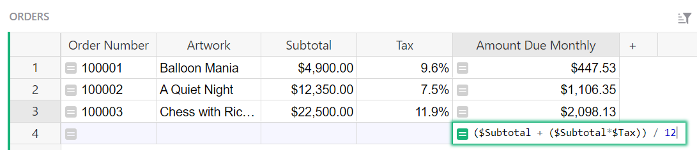*</span>

The formula used here is:
```
($Subtotal + ($Subtotal*$Tax)) / 12
```
We add the subtotal to the calculated tax then divide this by 12 months to get our Amount Due Monthly.
</details>

<span></span><details><summary>
#### Troubleshooting Errors
</summary>

`#TypeError`: Confirm all columns used in the formula are of [Numeric](col-types.md#numeric-columns) type.
</details>
</section>

<span></span><section class="cheat-sheet">
#### max and min

Allows you to find the [max](functions.md#max) or [min](functions.md#min) values in a list. 

<span></span><details><summary>
#### Examples using MAX() and MIN()
</summary>
*[MAX()](functions.md#max) and [MIN()](functions.md#min) when capitalized are spreadsheet functions which require a specific syntax. Spreadsheet formula syntax is summarized in our [functions reference](functions.md). max() and min() in lowercase are Python functions.*

**Max**: Classes table of the [Class Enrollment](https://templates.getgrist.com/doc/afterschool-program){:target="\_blank"} template.

<span class="screenshot-large">*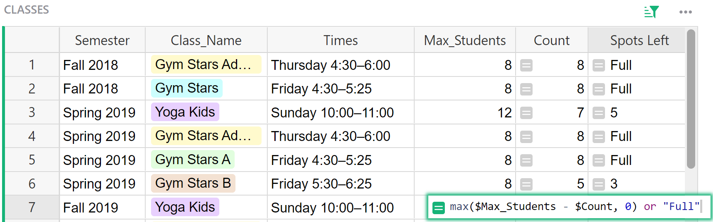*</span>

The formula used in the 'Spots Left' column of the Classes table is:
```
max($Max_Students - $Count, 0) or "Full"
```
This formula shows the number of spots remaining in a class, or the text 'Full' when the class is full or oversubscribed. 

We build a list between the parenthesis consisting of two items: `$Max_Students - $Count` and `0`. The formula returns whichever is greater.

When `$Count` is less than `$Max_Students`, the difference `$Max_Students - $Count` is positive and represents the spots left in the class. When `$Count` exceeds `$Max_Students`, then the class is full or oversubscribed, and `$Max_Students - $Count` is negative. The maximum of a negative number and 0 will be 0, so `max($Max_Students - $Count, 0)` is 0. This represents a full class. The addition of `or "Full"` is applied when the value is falsy, which means that a 0 is replaced with the text `"Full"`.

**Min**: Contacts table of the [Lightweight CRM](https://templates.getgrist.com/doc/lightweight-crm){:target="\_blank"} template.

<span class="screenshot-large">*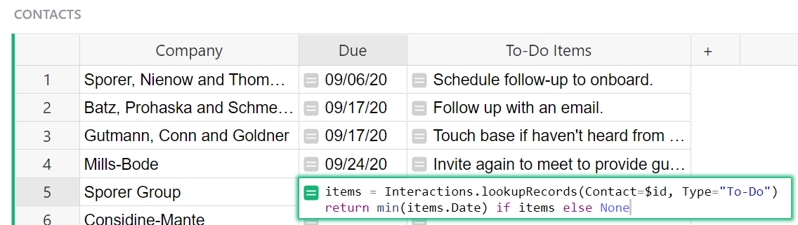*</span>

The formula used in the 'Due' column of the Contacts table is:
```
items = Interactions.lookupRecords(Contact=$id, Type="To-Do")
return min(items.Date) if items else None
```
Let's break this down. 

`Interactions.lookupRecords(Contact=$id, Type="To-Do")` finds all records in the Interactions table where 
the Contacts match and the Type is To-Do. This returns a list of records that we assign to the variable `items`. 

Next, we use [dot notation](references-lookups.md#reference-columns-and-dot-notation) to find all Dates assigned to the records in our `items` list. These dates are evaluated to find the minimum date. This is the value that is returned. So, we see the date of the task that is due the soonest. 

If there are no items in the list, nothing is returned and the field is left blank.

In the MAX() example, the list has two items: `$Max_Students - $Count` and `0`, and the formula returns whichever is greater. In the min() example, the variable `items` is pulling a list of records based on the [lookupRecords](references-lookups.md#lookuprecords) arguments, listing the dates, and returning the smallest date. Note that this is a Python function. If we had written the formula as MIN(), a spreadsheet function, the formula would not work because the spreadsheet formula requires a very [specific format](functions.md#min).


</details>
</section>

<span></span><section class="cheat-sheet">
#### Sum

Use the [SUM()](functions.md#sum) function when you want to sum a list of values available within a cell. If you want to sum values in a column, use [Summary Tables](summary-tables.md).

<span></span><details><summary>
#### Example of SUM()
</summary>

**[Custom Product Builder](https://templates.getgrist.com/gZmzYoGdS6b1/Custom-Product-Builder/p/6){:target="\_blank"} template**

<span class="screenshot-large">*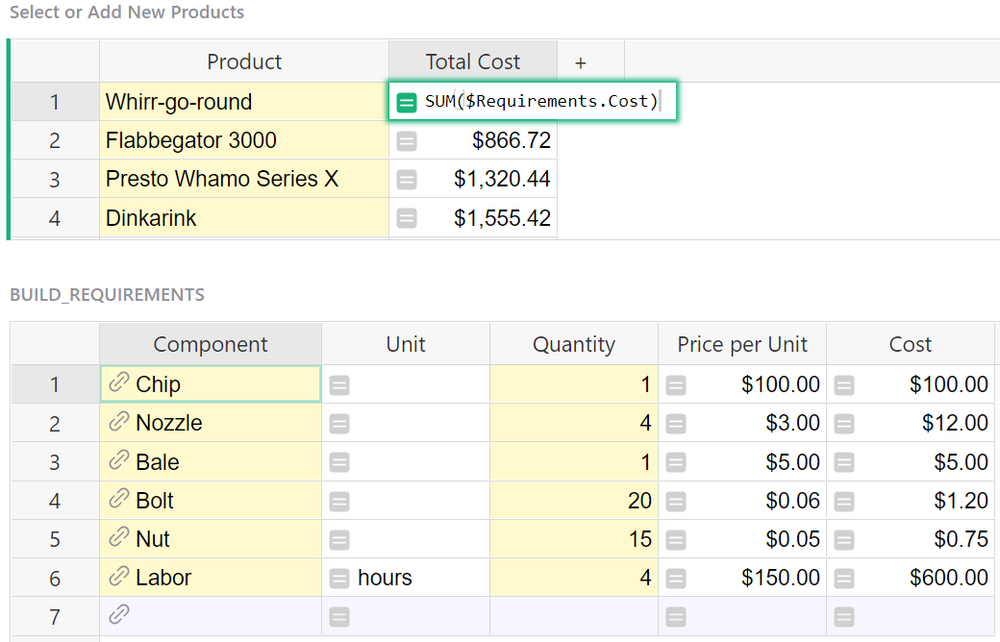*</span>

The formula used in the Total Cost column of the Select or Add New Products table is:
```
SUM($Requirements.Cost)
```
The Requirements column is a [hidden column](page-widgets.md#configuring-field-lists) in this table. It is a reference list column that pulls data from the Build Requirements table. 

Our formula uses the Requirements column to access the Build Requirements table then pulls the cost for each record in the table. 

We use SUM() to sum the costs from each record.

**[Inventory Manager](https://templates.getgrist.com/sXsBGDTKau1F/Inventory-Manager){:target="\_blank"} template**

<span class="screenshot-large">*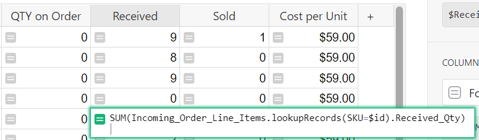*</span>

The formula used in the Received column of the All Products table is:
```
SUM(Incoming_Order_Line_Items.lookupRecords(SKU=$id).Received_Qty)
```
We use the [lookupRecords](functions.md#lookuprecords) function to find all records in the Incoming Order Line Items table where the SKU matches the SKU in this row then pull the value in the Received Qty column for each of those records. We use SUM() to find the sum of those values.

The Qty on Order and Sold columns of the [All Products](https://templates.getgrist.com/sXsBGDTKau1F/Inventory-Manager/p/1){:target="\_blank"} table are also great examples of the SUM() function.

**Check out another example in our Community Forum:** [Creating a Sum of Net and Gross profit from multiple tables](https://community.getgrist.com/t/creating-a-sum-of-net-and-gross-profit-from-multiple-tables/668){:target="\_blank"}
</details>
</section>

<span></span><section class="cheat-sheet">
#### Comparing for equality: == and !=

When comparing for equality in Python, we use `==` for 'equals' and `!=` for 'does not equal'. If `$A` is 2 and `$B` is 3, the formula `$A == $B` would return `False`, while the formula `$A != $B` would be `True`. 

<span></span><details><summary>
#### Examples using `==`
</summary>

**[Inventory Manager](https://templates.getgrist.com/sXsBGDTKau1F/Inventory-Manager/p/10){:target="\_blank"} template**

<span class="screenshot-large">*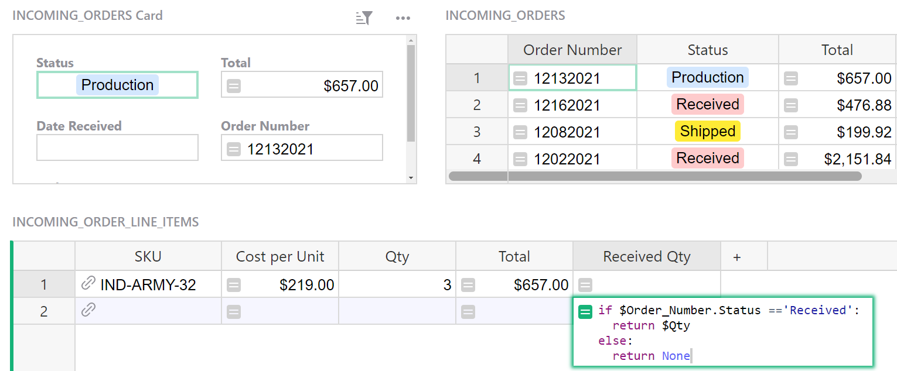*</span>

The formula used in the Received Qty column of the Incoming Order Line Items table is:
```
if $Order.Status =='Received':
  return $Qty
else:
  return None
```
The Order column of the Incoming Order Line Items Table is a reference column that points to the Order Number column of the Incoming Orders table. `$Order.Status` uses dot notation to pull the value from the Status column of the Incoming Orders table. If the value in this column is equal to `Received`, the value from the Qty column will be returned.  If the value is not equal to `Received`, nothing is returned.

<span class="screenshot-large">*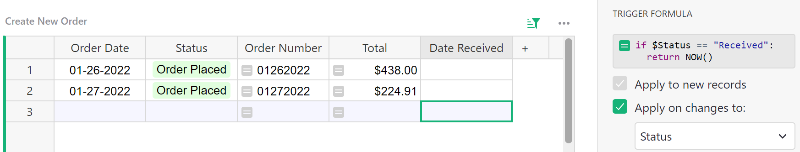*</span>

The formula used in the Date Received column of the [Create New Order](https://templates.getgrist.com/sXsBGDTKau1F/Inventory-Manager/p/16#a1.s35.r11.c82){:target="\_blank"} table is:
```
if $Status == "Received":
  return NOW()
```
This is a [trigger formula](formulas.md#trigger-formulas) that is triggered when a change is made to the Status column. If the value in the Status column is equal to `Received`, the current date is returned. If the values are not equal, nothing is returned.

</details>
<span></span><details><summary>
#### Examples using `!=`
</summary>

**[Project Management](https://templates.getgrist.com/hifkng53AxyQ/Project-Management/p/9){:target="\_blank"} template**

<span class="screenshot-large">*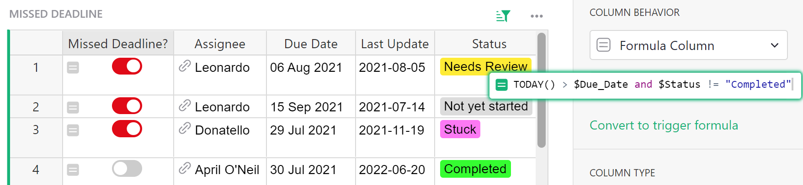*</span>

The formula used in the Missed Deadline column of the Missed Deadline table is:
```
TODAY()> $Due_Date and $Status != "Completed"
```
If the current date is greater than the date given in the Due Date column **and** the value in the Status column is not equal to `Completed`, the formula is `True`. If either of these statements is false, the formula is `False`.

</details>
</section>

<span></span><section class="cheat-sheet">
#### Comparing Values: < , > , <= , >=

Allows you to compare numerical values. If Sales is equal to `1200` and Running_Cost is equal to `1650`, `"Gains" if $Sales > $Running_Cost else "Loss"` would return `Loss`.

<span></span><details><summary>
#### Examples comparing values
</summary>

**[Inventory Manager](https://templates.getgrist.com/sXsBGDTKau1F/Inventory-Manager){:target="\_blank"} template**

<span class="screenshot-large">*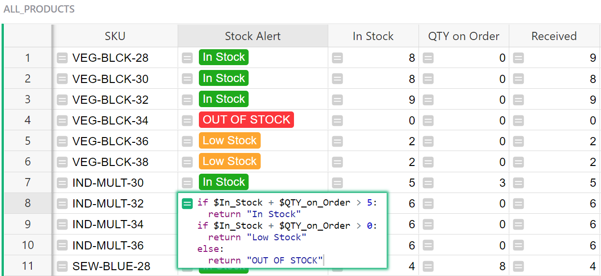*</span>

The formula used in the Stock Alert column of the All Products table is:
```
if $In_Stock + $QTY_on_Order > 5:
  return "In Stock"
if $In_Stock + $QTY_on_Order > 0:
  return "Low Stock"
else:
  return "OUT OF STOCK"
```
Here, we have two different **if-return** statements; if `x` is true, return `some_value`. Once a statement is true and a value is returned, the formula stops. If both are false, `OUT OF STOCK` is returned.

First, if the value in the In Stock column plus the value in the Qty On Order column are greater than 5, return "In Stock". 

Next, if the value in the In Stock column plus the value in the Qty On Order column are greater than 0, return "Low Stock". It's implied that the value is less than or equal to 5 because the first statement would have to be false for this to be evaluated. 

Last, if all statements are false, return "OUT OF STOCK".


**[Internal Links Tracker for SEO](https://templates.getgrist.com/j9ZH7rPGafbH/Internal-Links-Tracker-for-SEO){:target="\_blank"} template**

<span class="screenshot-large">*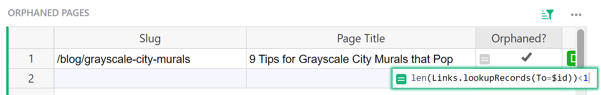*</span>

The formula used in the Orphaned? column of the Orphaned Pages table is:
```
len(Links.lookupRecords(To=$id))<1
```
We use the [lookupRecords](functions.md#lookuprecords) function to find all records in the Links table where the link in the To column matches the link listed in the Slug column of this row.

We use [len()](functions.md#len) to count the number of records found. If it's less than 1, the formula is evaluated to be true and the checkbox will be checked. If it's equal to or greater than 1, the formula is evaluated to be false.

</details>
</section>


<span></span><section class="cheat-sheet">
#### Converting from String to Float

**[String](https://www.w3schools.com/python/python_strings.asp){:target="\_blank"}**: A sequence of characters or snippets of text. In code, strings are quoted e.g. `'Hello'` or `"-12"` (those are three characters in quotes, as opposed to a negative number). See [Python str() Function](https://www.w3schools.com/python/ref_func_str.asp){:target="\_blank"} for converting a specified value to a string.

**[Float](https://www.w3schools.com/python/gloss_python_float.asp){:target="\_blank"}**: Real numbers that can store decimal values. Also called floating point number. See [Python float() Function](https://www.w3schools.com/python/ref_func_float.asp){:target="\_blank"} for converting a specified value into a floating point number.

**[Integer](https://www.w3schools.com/python/python_numbers.asp){:target="\_blank"}**: A whole number, without decimals. See [Python int() Function](https://www.w3schools.com/python/ref_func_int.asp){:target="\_blank"} for converting a specified value to an integer number.

<span></span><details><summary>
#### Example converting a string to a float
</summary>

**[Artwork Orders](https://public.getgrist.com/fR4erkJzSpBd/Artwork-Orders/m/fork){:target="\_blank"}**

<span class="screenshot-large">*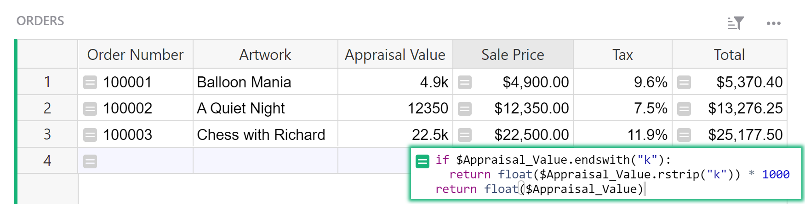*</span>

The formula used in the Sale Price column is:
```
if $Appraisal_Value.endswith("k"):
  return float($Appraisal_Value.rstrip("k")) * 1000
return float($Appraisal_Value)
```
In this example, the Appraisal Value column is a text column that contains alpha-numeric characters. In order to use this value in mathematical formulas, we need to convert from string to float.

If the value in the Appraisal Value column ends with "k", we first use [rstrip()](https://docs.python.org/3/library/stdtypes.html#str.rstrip){:target="\_blank"} to strip "k" from the string in the Appraisal Value column. 

Now that we only have numeric characters, we use [float()](https://docs.python.org/3/library/functions.html?highlight=float#float){:target="\_blank"} to convert our string to a float. 

Because K represents 1000 and we have removed this from the value, we multiply our float by 1000.

If the value in the Appraisal Value column ***does not*** end with "k", and only contains numeric characters, we can simply use [float()](https://docs.python.org/3/library/functions.html?highlight=float#float){:target="\_blank"} to convert our string to a float. 

</details>

<span></span><details><summary>
#### Troubleshooting
</summary>
if you are trying to use different columns with *numeric* values in a mathematical formula but seeing an error, check the column types for each of the columns used in the formula. All need to be of type [Numeric](col-types.md#numeric-columns).

<span class="screenshot-large">*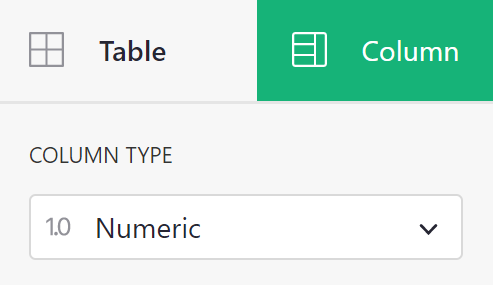*</span>
{: .screenshot-half }

[float()](https://docs.python.org/3/library/functions.html#float){:target="\_blank"} is only needed when dealing with alpha-numeric values like we see in the [example](#example-converting-a-string-to-a-float).

**TypeError: can't multiply sequence by non-int of type 'float'**
<span class="screenshot-large">*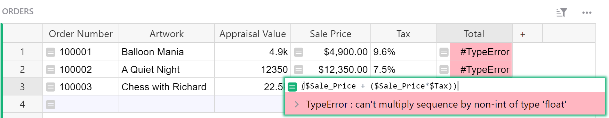*</span>
This error occurs when a formula attempts to **multiply** values from multiple columns, at least one of which is not a [Numeric](col-types.md#numeric-columns) type column. In the screenshot below, the Tax column is a [Text](col-types.md#text-columns) column. 
<span class="screenshot-large">*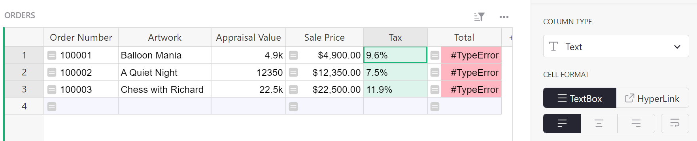*</span>
When we change the column type to [Numeric](col-types.md#numeric-columns), the error is resolved.
<span class="screenshot-large">*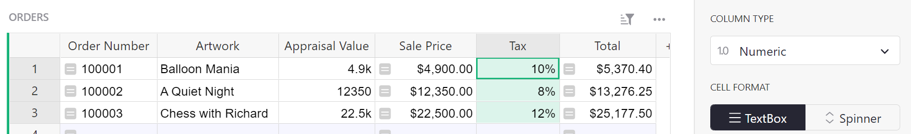*</span>

**TypeError: unsupported operand type(s) for /: 'float' and 'str'**
<span class="screenshot-large">*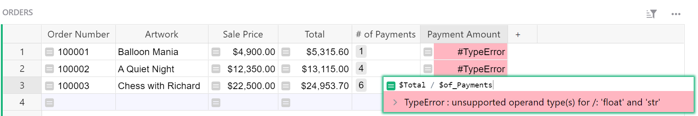*</span>
This error occurs when a formula attempts to **divide** values from multiple columns, at least one of which is not a [Numeric](col-types.md#numeric-columns) type column. In the example seen above, the '# of Payments' column is a [Choice](col-types.md#choice-columns) column. 

When we change the column type to [Numeric](col-types.md#numeric-columns), the error is resolved.

**TypeError: unsupported operand type(s) for +: 'float' and 'str'**
<span class="screenshot-large">*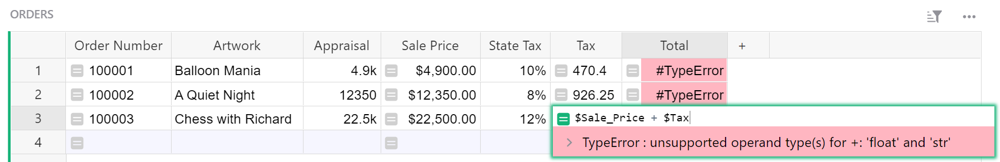*</span>
This error occurs when a formula attempts to **add** values from multiple columns, at least one of which is not a [Numeric](col-types.md#numeric-columns) type column. In the example seen above, the Tax column is a [Text](col-types.md#text-columns) column. 

When we change the column type to [Numeric](col-types.md#numeric-columns), the error is resolved.

**TypeError: unsupported operand type(s) for -: 'float' and 'str'**
<span class="screenshot-large">*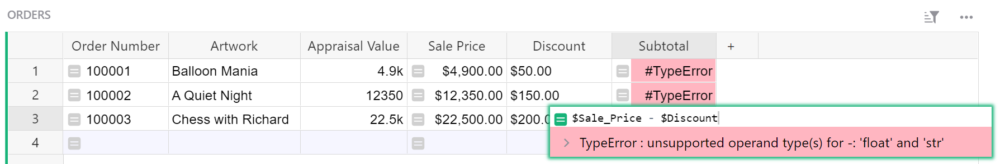*</span>
This error occurs when a formula attempts to **subtract** values from multiple columns, at least one of which is not a [Numeric](col-types.md#numeric-columns) type column. In the example seen above, the Discount column is a [Text](col-types.md#text-columns) column. 

When we change the column type to [Numeric](col-types.md#numeric-columns), the error is resolved.

</details>
</section>

<span></span><section class="cheat-sheet">
#### Rounding Numbers

Specify the number of decimal places to give in a result using the [ROUND()](functions.md#round) function. If Average Temperature is equal to `46.5`, `ROUND($Average_Temperature)` would return `47`

<span></span><details><summary>
#### Example of rounding numbers
</summary>
**[Payroll](https://templates.getgrist.com/5pHLanQNThxk/Payroll/p/2){:target="\_blank"} template**

<span class="screenshot-large">*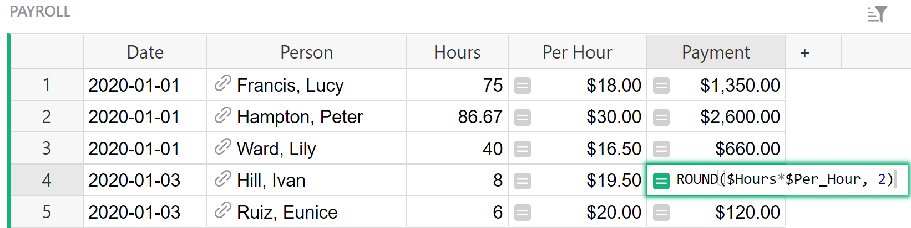*</span>

The formula used in the Payment column is:
```
ROUND($Hours*$Per_Hour, 2)
```
The [ROUND()](functions.md#round) function follows the format `ROUND(value, places)` which will round the given value to the number of places specified. Our formula finds the value for `$Hours*$Per_Hour` then rounds this value to `2` decimal places.

**[Mixing Products](https://public.getgrist.com/v4vj2PDZS4jf/Community-665/m/fork){:target="\_blank"}**

<span class="screenshot-large">*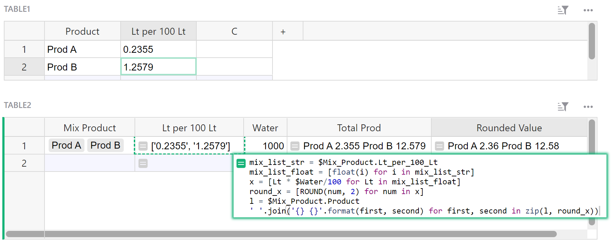*</span>

The formula used in the Rounded Value column is:
```
mix_list_str = $Mix_Product.Lt_per_100_Lt
mix_list_float = [float(i) for i in mix_list_str]
x = [Lt * $Water/100 for Lt in mix_list_float]
round_x = [ROUND(num, 2) for num in x]
l = $Mix_Product.Product
' '.join('{} {}'.format(first, second) for first, second in zip(l, round_x))
```
Let's break this down.

`$Mix_Product` represents the Mix Product column, a reference list column that pulls data from the Product column of Table1. We can use this column as a link to Table1 to pull other data. `$Mix_Product.Lt_per_100_Lt` uses the reference list column, Mix Product, to pull values from the Lt per 100 Lt column of Table1 for the products listed in the Mix Product column of Table2 then assigns this list of values to the variable `mix_list_str`. This is the same formula used in the Lt per 100 Lt column of Table2 so you can see the value it returns in row 1 of Table2. It returns a list: `['0.2355', '1.2579']`. This list is evaluated as a string rather than numerical values. We need to convert each value in this list to a float.

In our next formula, `[float(i) for i in mix_list_str]`, we iterate through the list that was assigned in the first equation to `mix_list_str` and convert each value to a floating-point number. We want to convert to a float rather than integer because not all values are whole numbers and contain decimals. `i` is a variable representing each value. So each value in `mix_list_str` is evaluated in the equation `float(i)`. `float(0.2355)` converts `0.2355` to a float and `float(1.2579)` converts `1.2579` to a float. Now, we assign our list of floats to the variable `mix_list_float`.

We can now use our float values in a mathematical equation. Once again, we iterate through the list that was assigned to the variable `mix_list_float`. In our equation `[Lt * $Water/100 for Lt in mix_list_float]`, `Lt` represents each value in `mix_list_float` and `$Water` represents the value found in the Water column which is `1000`. We evaluate the equation `Lt * 1000/100` when `Lt = 0.2355` and `Lt = 1.2579` which returns the list `[2.355, 12.579]`. We assign this list to the variable `x`.

To round the values in `x` to two decimal places, we need to evaluate the equation `ROUND(num, 2)` where num represents each value in our list and 2 specifies the number of decimal places we want to round to. This returns the list `[2.36, 12.58]` which we assign to the variable round_x.

In the first equation, we used our reference list column, Mix Product, as our link to Table1 in order to pull data from Table1 into Table2. We use this method again in `$Mix_Product.Product` to pull data from the Product column of Table1. This returns a list of products; `[Prod A, Prod B]`. We assign this list to the variable `l`.

Finally, we use the [join()](https://www.w3schools.com/python/ref_string_join.asp){:target="\_blank"} method to combine our two lists. `' '` is our starting (empty) string. We use Python's [format method](https://www.w3schools.com/python/ref_string_format.asp){:target="\_blank"} to format our string. `{}` is a placeholder for each variable listed in `.format()`. Last, we use Python's [zip() function](https://www.w3schools.com/python/ref_func_zip.asp){:target="\_blank"} to pair the first values from each list together and then pair the second values in each list together. `l` is assigned as our `first` list and `round_x` is assigned as our `second` list. `l = [Prod A, Prod B]` and `round_x = [2.36, 12.58]`. Zipping our lists into `'{} {}'.format(first, second)` gives us `Prod A 2.36` in our first iteration and `Prod B 12.58` in our second iteration. Our final return value is `Prod A 2.36 Prod B 12.58`.
</details>
</section>


<span></span><section class="cheat-sheet">
#### Formatting numbers with leading zeros

Allows you to specify the minimum number of digits returned in a numerical column by adding leading zeros. If x = 5, `str(x).zfill(3)` or `'{:0>3}'.format(x)` would return `005`.

<span></span><details><summary>
#### Formatting numbers with leading zeros
</summary>

**Community Example: [Using Row ID](https://public.getgrist.com/p4zvsX9asVCc/2179-Using-id/p/1){:target="\_blank"}**

<span class="screenshot-large">*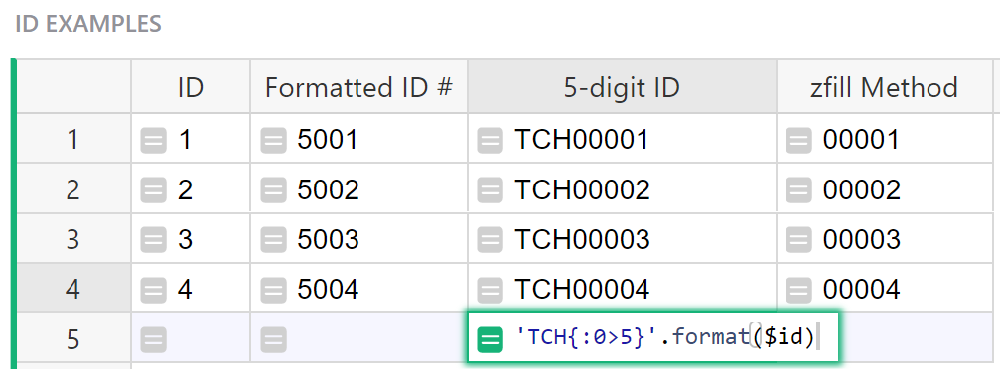*</span>

The formula used in the 5-digit ID column of the ID Examples table is:
```
'TCH{:0>5}'.format($id)
```

`'{:0>5}'.format($id)` takes the unique row ID and formats it to be a minimum of 5 digits. We then add this to our string `"TCH"` to get our final value. If the `$id` is longer than 5 digits, the formula returns the string unmodified.

We can do the same thing using the [`str.zfill()`](https://docs.python.org/3/library/stdtypes.html#str.zfill){:target="\_blank"} method.

<span class="screenshot-large">*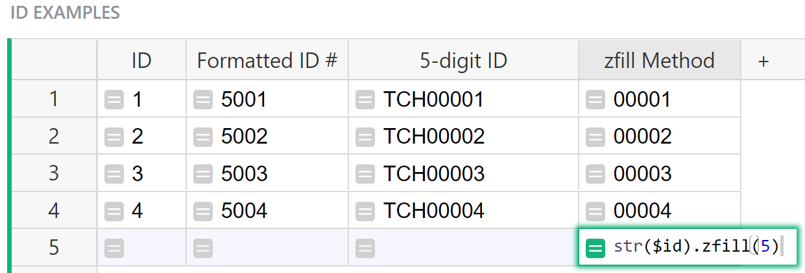*</span>

The formula used in the zfill Method column of the ID Examples table is:
```
str($id).zfill(5)
```
`str($id)` converts the row ID to a string. `.zfill(x)` returns a copy of the string with leading zeros to make a string of length `x`. In our example, it adds leading zeros to make the string 5 characters in length. Again, if the `$id` is longer than 5 digits, the formula returns the string unmodified. 

</details>

<span></span><details><summary>
#### Troubleshooting Errors
</summary>
`#TypeError`: can only concatenate str (not "int") to str

If you mean to combine a string and a numerical value, be sure to convert it to string using `str()`.


<span class="screenshot-large">*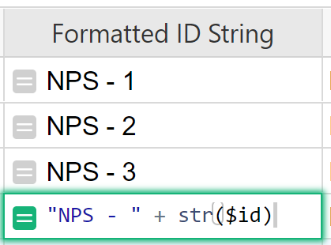*</span>
{: .screenshot-half }

</details>
</section>

## Working with Strings

<span></span><section class="cheat-sheet">
#### Combining Text From Multiple Columns

**Method 1:** If you have a First Name column and a Last Name column, you can combine these columns to have a Full Name column. If First Name is `George` and Last Name is `Washington`, `$First_Name + " " + $Last_Name` would return `George Washington`.

**Method 2:** If you have additional formatting, an easier way to do this would be using Python's [String format() method](https://www.w3schools.com/python/ref_string_format.asp){:target="\_blank"}. The `format()` method formats the specified value(s) and inserts them in place of the placeholder, `{}`. Using the same example as above, our formula would be `"{} {}".format($First_Name, $Last_Name)`.

Note: You can click on columns to insert them into your formulas, rather than typing them in.

<span></span><details><summary>
#### Examples using Method 1
</summary>
**[Class Enrollment](https://templates.getgrist.com/doc/afterschool-program) template{:target="\_blank"}**

<span class="screenshot-large">*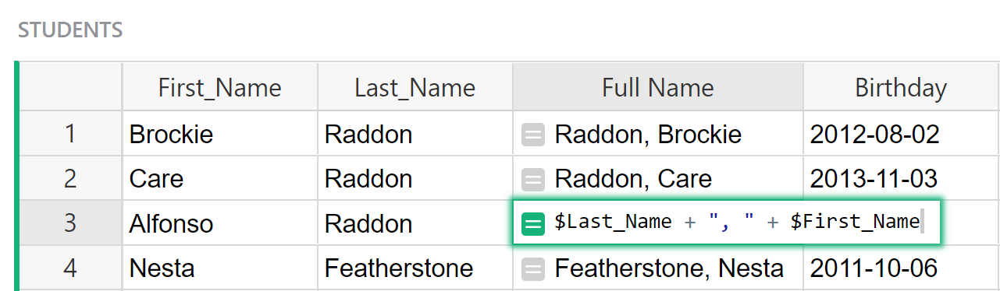*</span>

The formula used in the Full Name column of the Students table is:
```
$Last_Name + ", " + $First_Name
```
Here, we are combining the value found in the Last Name column with a comma followed by a space followed by the value from the First Name column. When adding any extra characters or spaces, place these between double quotes, as we did in the example with `", "`. 

An alternative combination of these columns for Full Name could be `$First_Name + " " + $Last_Name`. For the example in row 1, First Name is `Brockie` and Last Name is `Raddon` so the value returned would be `Brockie Raddon`.

**[Inventory Manager](https://templates.getgrist.com/sXsBGDTKau1F/Inventory-Manager){:target="\_blank"} template**

<span class="screenshot-large">*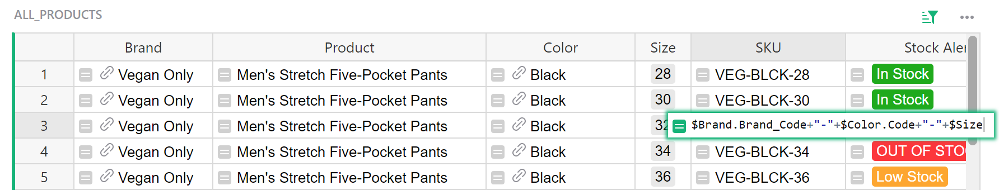*</span>

The formula used in the SKU column of the All Products table is:
```
$Brand.Brand_Code+"-"+$Color.Code+"-"+$Size
```
Brand is a reference column that pulls data from the Name Brand column of the Add Products table. We use this reference column in `$Brand.Brand_Code` to pull data from the Brand Code column of the Add Products table. 

Color is a reference column that pulls data from the Color column of the Color table. We use this reference column in `$Color.Code` to pull data from the Code column of the Color table. 

Each of the values found in `$Brand.Brand_Code` and `$Color.Code`are combined with the value in the Size column with a `-` between each of the three values to make up the SKU.
</details>

<span></span><details><summary>
#### Examples using Method 2
</summary>
**[Tracking Time + Invoicing](https://templates.getgrist.com/bReAxyLmzmEQ/Tracking-Time-Invoicing){:target="\_blank"} template**

<span class="screenshot-large">*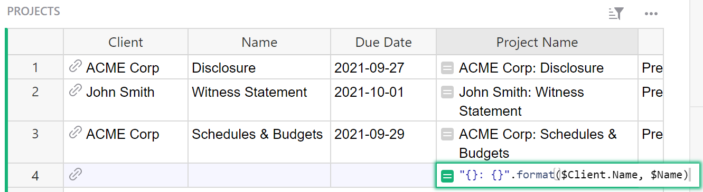*</span>

The formula used in the Project Name column of the Projects table is:
```
"{}: {}".format($Client.Name, $Name)
```
Let's break this down. 

Everything between double quotes `"` is our string. The curly brackets `{}` are placeholders for the values found using `.format()` which is Python's string format() method. 

The first set of curly brackets are replaced with the value found in `$Client.Name`. Client is a reference column that pulls data for a specific record from the Clients table. `$Client.Name` is using our reference column, Client to pull data from the Name column of the Clients table. 

The second set of curly brackets are replaced with the value found in the Name column of this table.

Although the Client column shows the value that we want, we can't use `$Client` like we did `$Name`. This is because the Client column is a reference column. It is referencing the <em>entire</em> record but uses the value from the Name column of the Clients table as a visual representation of that record. Under the column configuration panel on the right hand side, we can change what column value we see for the record. In the screenshot below, 'Show Column' was changed from Name to Email.

<span class="screenshot-large">*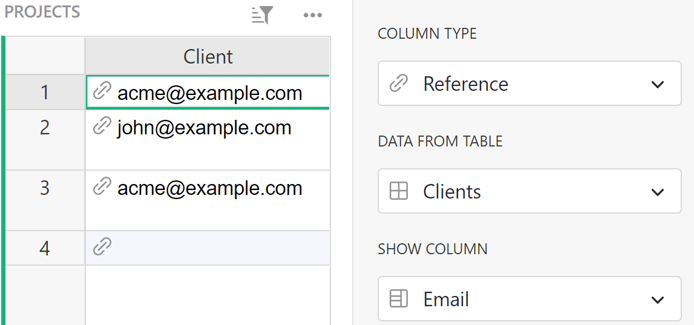*</span>
{: .screenshot-half }

It doesn't change the data, it just changes the label on that data in the Client column. It's still pointing to the same record but now shows a different label. `$Client.Name` pulls the Name for the record that is referenced in the Client column, regardless of the label we see.

**[Custom Product Builder](https://templates.getgrist.com/gZmzYoGdS6b1/Custom-Product-Builder){:target="\_blank"} template**

<span class="screenshot-large">*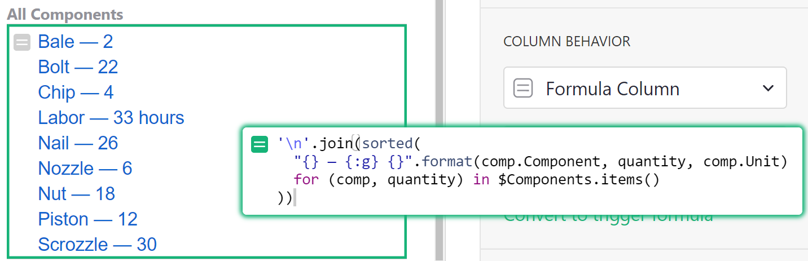*</span>

The formula used in the All Components column of the CONTRACT_BUILDER Card is:
```
'\n'.join(sorted(
  "{} — {:g} {}".format(comp.Component, quantity, comp.Unit)
  for (comp, quantity) in $Components.items()
))
```
We are using the [join() method](https://www.w3schools.com/python/ref_string_join.asp){:target="\_blank"}, [sorted() function](https://www.w3schools.com/python/ref_func_sorted.asp){:target="\_blank"} and [format() method](https://www.w3schools.com/python/ref_string_format.asp){:target="\_blank"} method all in one!

`'\n'.join()` adds a new line between each item in the list.

`sorted()` sorts the items in the list alphabetically.

This leaves us with the following:

```
"{} — {:g} {}".format(comp.Component, quantity, comp.Unit)
  for (comp, quantity) in $Components.items()
```
We'll work through this backwards. First, we need to take a look at the Components column which is a [hidden column](page-widgets.md#configuring-field-lists) in the All Contracts table. 

<span class="screenshot-large">**</span>

This column is a list of components and their associated quantities for the contract. In the `for` loop, we assign each item in the list of components two variables, comp and quantity. For `Components[3]: 6.0`, comp = `Components[3]` and quantity = `6.0`. `Components[#]` specifies a Component in the Components table by Row ID. `Components[3]` is the component assigned `3` as it's row id.

<span class="screenshot-large">*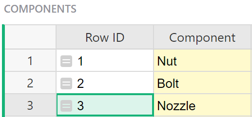*</span>
{: .screenshot-half }

Now, we run each item from the list above through the equation `"{} — {:g} {}".format(comp.Component, quantity, comp.Unit)`.

`comp.Component` replaces the first set of `{}`. `comp` is the variable with our component ID so `comp.Component` finds the value in the Component column associated with that row ID. For `Components[3]`, `comp.Component` is Nozzle. 

`quantity` replaces the second set of `{}`. Again, the quantity is the second variable in our list. For `Components[3]: 6.0`, quantity is `6.0`. Our second set of `{}` are not empty. They include `:g`*. This converts the value to a floating-point number. 

`comp.Unit` replaces the last set of `{}`. `comp` is the variable with our component ID so `comp.Unit` finds the value in the Unit column associated with that row ID. For `Components[3]`, `comp.Unit` is `None`.

*Note that `{:g}` formats floating point numbers in a particular way that omit decimals when they aren't needed. There are many options available within placeholders for formatting numbers, dates, etc. Learn more about placeholders [here](https://www.w3schools.com/python/ref_string_format.asp){:target="\_blank"}.

**[Email Contacts](https://templates.getgrist.com/3HfynRQwpHPy/Email-Contacts){:target="\_blank"} template**

<span class="screenshot-large">*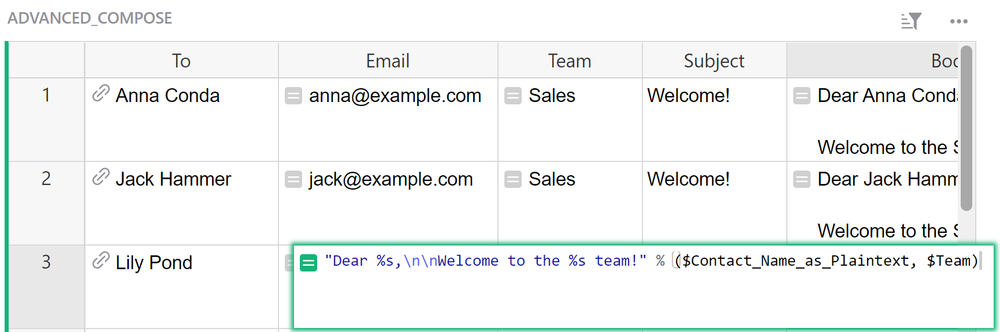*</span>

The formula used in the Body column of the Advanced Compose table is:
```
"Dear %s,\n\nWelcome to the %s team!" % ($Contact_Name_as_Plaintext, $Team)
```
This technique uses the `%` operator instead of the `format()` method. Format specifiers begin with `%` followed by a character that represents the data type. `%s` is a placeholder for a string. The first `%s` is replaced with the value found in the "Contact Name as Plaintext" column which is a [hidden column](page-widgets.md#configuring-field-lists) and the second `%s` is replaced by the value in the Team column.

`\n` adds a new line.

</details>
</section>


<span></span><section class="cheat-sheet">
#### Splitting Strings of Text

Split a string using Python's [split()](https://docs.python.org/3/library/stdtypes.html#str.split){:target="\_blank"} method. If Full Name is `George Washington`, `$Full_Name.split(" ")` would return `[George, Washington]`.

<span></span><details><summary>
#### Example of Splitting Strings of Text
</summary>

**Community Example: [Colors](https://public.getgrist.com/2tv3e8qxpNFP/Community-715/p/2){:target="\_blank"}**

<span class="screenshot-large">*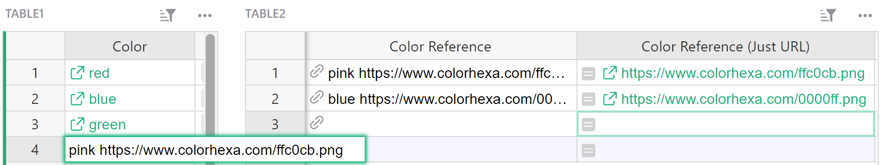*</span>

The formula in the "Color Reference (Just URL)" column of Table 2 is:
```
split = $Color_Reference.Color.split(" ")
return split[-1]
```
`$Color_Reference.Color` uses the reference column, "Color Reference" to pull data from the table it is referencing, Table 1. Specifically, it pulls the value from the Color column of Table 1. 

Color is a text column that contains a hyperlink with a label. We only see the label in Table 1 but as you can see in the screenshot above, the value in the 'pink' cell is expanded to show the entire string which contains "pink" followed by the URL. You can also see this in the "Color Reference" column of Table 2. We want to get the link by itself in "Color Reference (Just URL)". We can do this using Python's [split()](https://docs.python.org/3/library/stdtypes.html#str.split){:target="\_blank"} method.

`.split(" ")` allows us to split the string anywhere there is a space `(" ")`. In the Color column, there is a label followed by a space followed by the URL. The value from the Color column is split into a list containing two items `Label` and `URL`. This list is assigned to the variable `split`. 

We want to return the last item in the list `split` in order to get our `URL`. The last item in a list always has index `[-1]`. `return split[-1]` returns the last item in the list `split`. 

</details>
</section>


<span></span><section class="cheat-sheet">
#### Direct Link to Gmail History for a Contact

If you store contacts in Grist, and use Gmail to email them, you can create a formula that will open Gmail to a list of conversations with that contact. 

**Read about it in the Community:** [Pull up Gmail history for a particular contact](https://community.getgrist.com/t/pull-up-gmail-history-for-a-particular-contact/517){:target="\_blank"}

<span></span><details><summary>
#### Troubleshooting
</summary>
Is your URL still showing after you added a label? Make sure your Column Type is Text and Cell Format is Hyperlink.

<span class="screenshot-large">*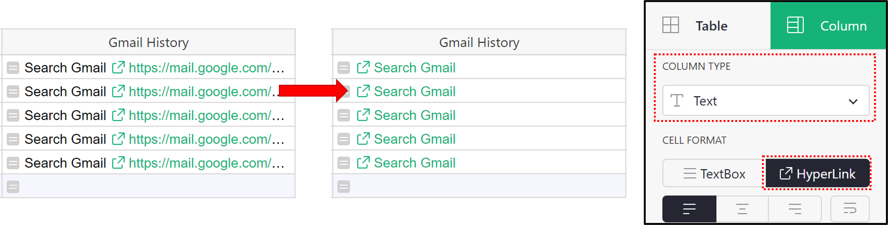*</span>

</details>
</section>


<span></span><section class="cheat-sheet">
#### Joining a List of Strings

When you want to join a list of strings, you can use Python's [join() method](https://www.w3schools.com/python/ref_string_join.asp){:target="\_blank"}.

<span></span><details><summary>
#### Example of Joining a List
</summary>
**Community Example: [.join() Example](https://public.getgrist.com/2L3J99j7zW23/join-Example/m/fork){:target="\_blank"}**

<span class="screenshot-large">**</span>

The formula used in the Advertisement column of the 2022 Grand Openings table is:
```
"Coming soon to a city near you!\n" + " : ".join($New_Location_s_in_2022)
```
Here, we are joining multiple strings to create our advertisement.

`"Coming soon to a city near you!\n"` is returned almost exactly as we see it, minus the quotes `""` and `\n` at the end of the string. 

The quotes `""` specify that this is a string and `\n` is actually a newline character that can be used to specify a new line within a string.

`" : ".join($New_Location_s_in_2022)` is also a string but uses Python's [join() method](https://www.w3schools.com/python/ref_string_join.asp){:target="\_blank"} to join values from our [choice list](col-types.md#choice-list-columns) column, "New Locations in 2022". What we see in quotes before `.join` is what will separate each value in our list. 

In this example, each value is separated by a space, `:` and another space.

</details>
</section>


<span></span><section class="cheat-sheet">
#### Finding Duplicates

You can find duplicates in a column using either conditional formatting or a helper column.

**Read about it in the Community:** [Ensure unique values or detect duplicates](https://community.getgrist.com/t/ensure-unique-values-or-detect-duplicates/76){:target="\_blank"}

<span></span><details><summary>
#### Example of Finding Duplicates
</summary>
**Community Example: [Finding Duplicates](https://public.getgrist.com/3CJkcpF7wu9Q/-1790/p/4){:target="\_blank"}**

<span class="screenshot-large">*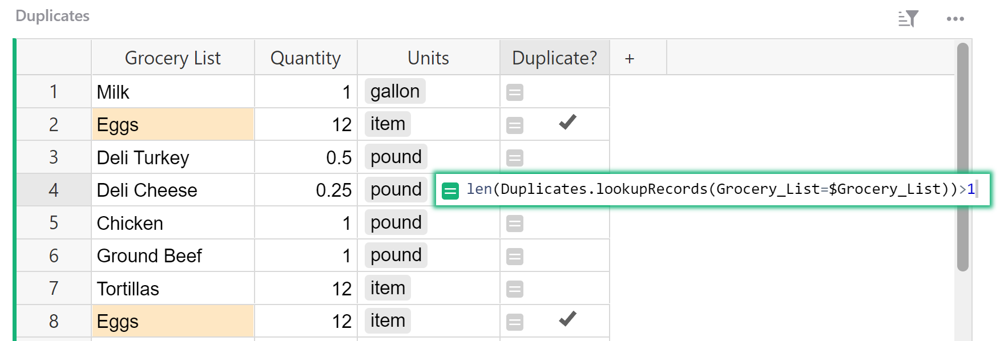*</span>

The formula used in the Duplicate? column of the Duplicates table is:
```
len(Duplicates.lookupRecords(Grocery_List=$Grocery_List))>1
```

Let's break this down, working from the inside > out.
```
Duplicates.lookupRecords(Grocery_List=$Grocery_List)
```
This is a [lookupRecords](functions.md#lookuprecords) function that follows the format of: 
```
[Table_Name].lookupRecords([A]=$[B])
``` 
Where `[Table_Name]` is the name of the table you want to lookup data in. `[A]` is the column in the table being looked up (named at the beginning of the formula) and `[B]` is the column in the current table / the table you are entering the formula in.

This formula looks up records in the Duplicates table where a record in the Grocery List column matches another record in the same column.

`len()` counts the number of records in our list. Since each duplicate will match with the other, it should appear twice in our list. This is why `len() > 1`.

if `len() > 1`, the formula is true. If `len() <= 1`, the formula is false.

This same formula can be used in conditional formatting. This can be seen in the 'Grocery List' column of the Duplicates table.

<span class="screenshot-large">*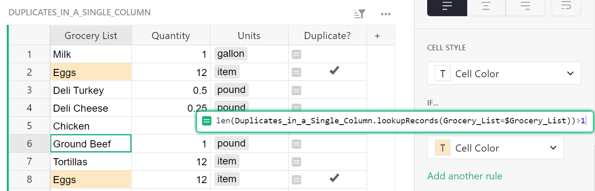*</span>

If `len() > 1`, our formula is true and the conditional cell color is applied to these cells. 

If `len() <= 1`, our formula is false and the cell color is unchanged.

</details>

</section>

<span></span><section class="cheat-sheet">
#### Using a Record's Unique Identifier in Formulas

When a record is created, it is assigned a numeric id (available as `$id` in formulas) that is unique within that table. You can reveal the row ID by adding a formula column where the formula is `$id`{: .formula}.

<span></span><details><summary>
#### Examples Using Row ID in Formulas
</summary>
You can reveal the ID with the formula `$id`

<span class="screenshot-large">*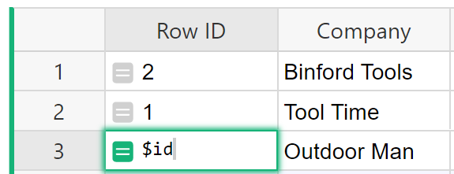*</span>
{: .screenshot-half }

**[Custom Product Builder](https://templates.getgrist.com/gZmzYoGdS6b1/Custom-Product-Builder){:target="\_blank"} template**

<span class="screenshot-large">*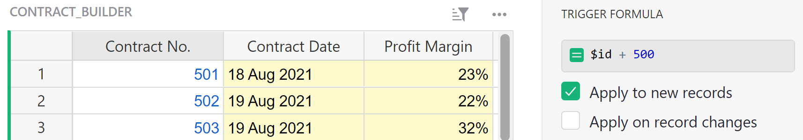*</span>

The formula used in the Contract No. column of the Contract Builder table is:
```
$id + 500
```
Here, we are using a trigger formula to create a unique Contract Number when a record is created.

**[Class Enrollment](https://templates.getgrist.com/doc/afterschool-program){:target="\_blank"} template**

<span class="screenshot-large">*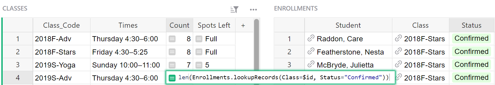*</span>

The formula used in the Count column of the Classes table is:
```
len(Enrollments.lookupRecords(Class=$id, Status="Confirmed"))
```
This is refered to as a Reverse Lookup. We can use the row id to match a record in another table where a reference column is used. LookupRecords follows the format `[Table_Name].lookupRecords([A]=$[B])`. `[Table_Name]` is the name of the table you want to lookup data in. `[A]` is the column in the table being looked up (named at the beginning of the formula) and `[B]` is the column in the current table / the table you are entering the formula in. Lookup Records creates a list of records that match the criteria listed. `len()` counts how many records are in that list.

Here, we are looking up records from the Enrollments table where the record called out in the Class column (our reference column) has the same row ID as the row in the table you are entering the formula. Additionally, the value in the Status column of the Enrollments table is `Confirmed`. We'll walk through this.

The table we are looking up records in is the Enrollments table. Our criteria comes from the Class column and the Status column.The criteria for Status is straightforward; the value must be `Confirmed` in order to be included in our list of records. Class is a bit more complicated. As we see in the screenshot below, Class is a reference column that pulls data from the Classes table. Here, the Class column shows `2018F-Stars`.

<span class="screenshot-large">**</span>

A reference column points to the <em>entire</em> record, not just the value you see here in the Class column. Using the configuration panel on the right hand side of the screen, you can pick any column from the originating table to show. For this example, the Class column shows the value from the Class Code column of the Classes table but it points to the entire record where the class code is `2018F-Stars`. 

<span class="screenshot-large">*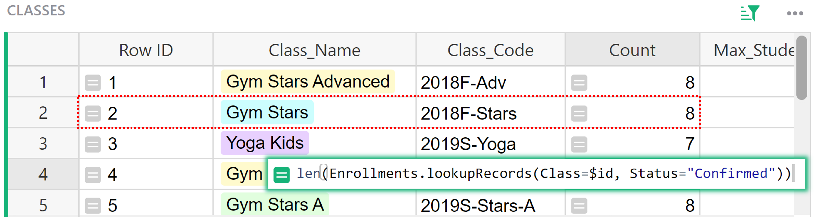*</span>

As you can see in this screenshot, the Row ID for this particular record is `2` and because we are calculating the Count for the row with `Row ID = 2`, it will count all records in the Enrollment table where Class shows `2018F-Stars` and Status is `Confirmed`. 

**[Restaurant Custom Orders](https://templates.getgrist.com/e4gEm7dt4cgB/Restaurant-Custom-Orders){:target="\_blank"} template**

<span class="screenshot-large">*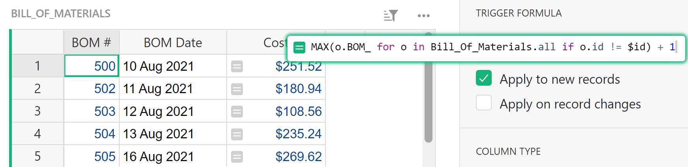*</span>

The trigger formula used in the BOM # column of the Bill of Materials table is:
```
MAX(o.BOM_ for o in Bill_Of_Materials.all if o.id != $id) + 1
```
First, we'll walk through the formula inside the parenthesis then work outwards.

Here, `o` is a variable representing each record in our table. `o.BOM_` represents the BOM # for each record and `o.id` represents the row ID for each record. This is a `for` loop that makes a list of the BOM # for each record in the table Bill of Materials when the record ID does not equal the ID of this row.

`MAX()` finds the maximum BOM # in the list then `+ 1` to get our final value. 

This is a trigger formula that only applies to new records. When a new record is created, the formula finds the highest BOM # in the table then adds 1 so we have a unique BOM # for the new record.

</details>
</section>


<span></span><section class="cheat-sheet">
#### Removing Duplicates From a List

You can remove duplicates from a list with help from Python's [set()](https://docs.python.org/3/tutorial/datastructures.html#sets){:target="\_blank"} method.

<span></span><details><summary>
#### Example of Removing Duplicates from a List
</summary>

**Community Example: [Removing Duplicates From a List](https://public.getgrist.com/3pZUMdP2bJx6/1957/p/3){:target="\_blank"}**

<span class="screenshot-large">*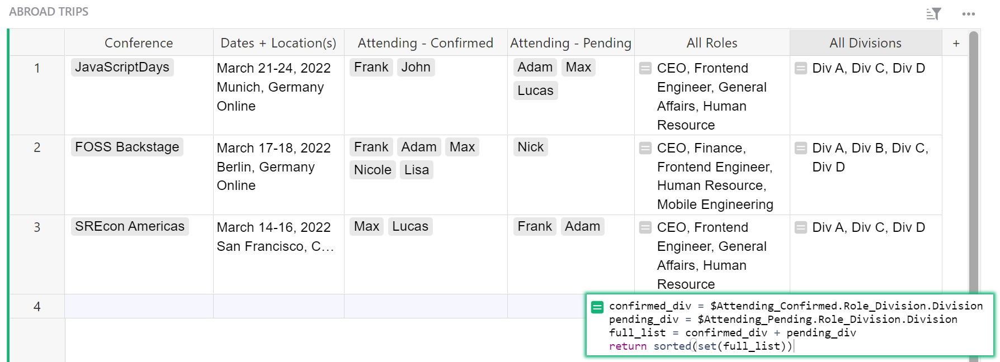*</span>

The formula in the All Divisions column of the Abroad Trips table is:
```
confirmed_div = $Attending_Confirmed.Role_Division.Division
pending_div = $Attending_Pending.Role_Division.Division
full_list = confirmed_div + pending_div
return sorted(set(full_list))
```
We will walk through this one line at a time.

Attending-Confirmed is a Reference List column that pulls data from the EMPLOYEES table. `$Attending_Confirmed.Role_Division` pulls the value from the Role Division column of the EMPLOYEES table. The Role Division column in the EMPLOYEES table is a reference column itself, which points to a record in the Divisions table. [Chaining](references-lookups.md#chaining) allows us to specify what information we want from this record. In this case, we want the Division. We expand our formula to `$Attending_Confirmed.Role_Division.Division`. The Division is found for each employee listed in the Attending-Confirmed column, creating a list. We assign this list of divisions to the variable `confirmed_div`.

Attending-Pending is also a Reference List column that pulls data from the EMPLOYEES table. `$Attending_Pending.Role_Division.Division` does the same as above except now we pull the division for each employee in the Attending-Pending column. We assign this list to the variable `pending_div`.

We create a list of all divisions by adding the two lists together and assigning this combined list to the variable `full_list`.

`return sorted(set(full_list))` first uses Python's [set()](https://docs.python.org/3/tutorial/datastructures.html#sets){:target="\_blank"} method to create a list with no duplicate divisions. We then use the [sorted()](https://docs.python.org/3/library/functions.html#sorted){:target="\_blank"} method to return our set of divisions, sorted alphabetically.

Note that the formula above can be simplified even further to:
```
sorted(
  set($Attending_Confirmed.Role_Division.Division) |
  set($Attending_Pending.Role_Division.Division)
)
```

<span class="screenshot-large">*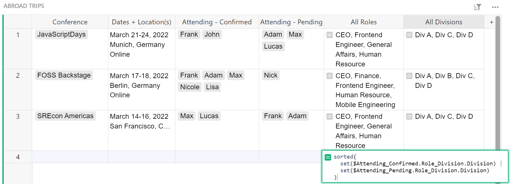*</span>

</details>
</section>


<span></span><section class="cheat-sheet">
#### Setting Default Values for New Records

You can set default values for when a new record is created and save yourself the trouble of having to fill in the same fields with the same values time after time.

**Read about it in the Community:** [Default values on the widget](https://community.getgrist.com/t/default-values-on-the-widget/689/4){:target="\_blank"}

</section>

## Working with dates and times

<span></span><section class="cheat-sheet">
#### Automatic Date, Time and Author Stamps

You can automatically add the date or time a record was created or updated as well as who made the change.

<span></span><details><summary>
#### Examples of Automatic Date, Time and Author Stamps
</summary>
**[Grant Application Tracker](https://templates.getgrist.com/sC5CAW41bVZU/Grant-Application-Tracker){:target="\_blank"} template**

<span class="screenshot-large">*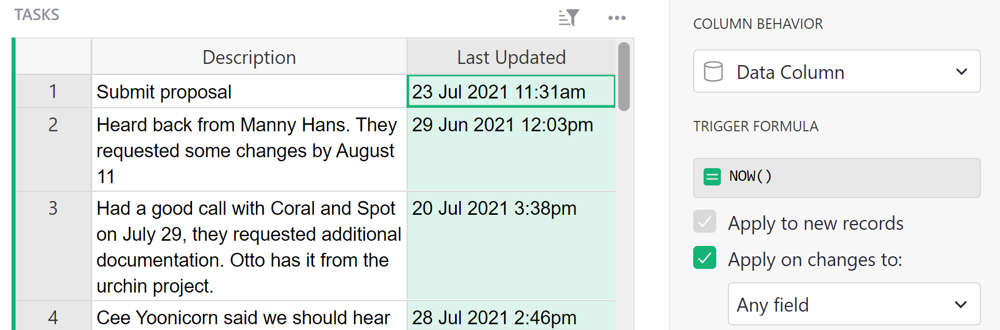*</span>

The formula used in the Last Updated column of the Tasks table is:
```
NOW()
```
This is a [trigger formula](formulas.md#trigger-formulas) that triggers when a change is made to any field for this record. When a change is made, this formula runs its calculation. `NOW()` calculates the current time and date for the [time zone](dates.md#time-zones) selected. 

<span class="screenshot-large">*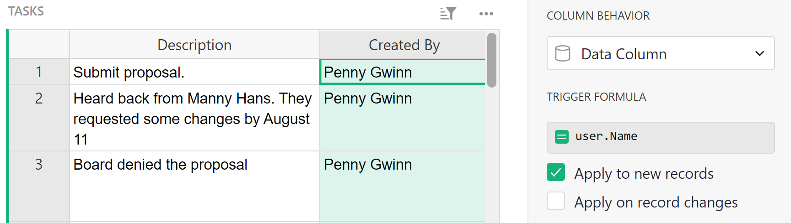*</span>

The formula used in the Created By column of the Tasks table is:
```
user.Name
```
This is a [trigger formula](formulas.md#trigger-formulas) that triggers when a new record is created. When the record is created, this formula runs its calculation. `user.Name` looks up the user account that is logged into Grist and returns the name associated with that account. 

</details>

<span></span><details><summary>
#### Troubleshooting Errors
</summary>
If the time value in your datetime column is not calculating, check your formula. If `TODAY()` is used in DateTime, the time will always show 12:00am as you see below. `NOW()` is used for DateTime columns. `TODAY()` is used for Date.

<span class="screenshot-large">*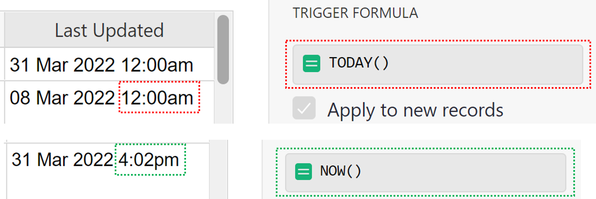*</span>

<span></span><div class="deflist">

- `#AttributeError`

    You have likely entered `user.name` but the formula is `user.Name`. Keep an eye on capitalization!

- `#NameError`

    You may have entered `username` or `userName`. The correct formula is `user.Name`. 

Another possibility is that this was entered in as a Formula column rather than a trigger formula column. Convert it to a trigger formula and this should resolve the problem.

</details>
</section>


<span></span><section class="cheat-sheet">
#### Filtering Data within a Specified Amount of Time

Using the [`DATEADD()`](functions.md#dateadd) function and [comparision operators](#comparing-values), you can determine if a date falls within a specific range then apply a filter.

<span></span><details><summary>
#### Example Filtering Data that 'Falls in 1 Month Range`
</summary>

**Community Example:** [Filtering Data Within a 1-Month Range](https://public.getgrist.com/4zxVeFtGNt7n/1844){:target="\_blank"}

<span class="screenshot-large">*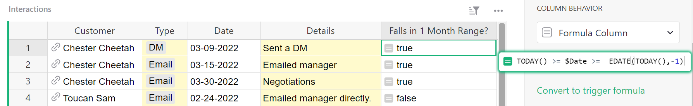*</span>
The formula used in the Falls in 1 Month Range? column of the Interactions table is:
```
TODAY() >= $Date >=  DATEADD(TODAY(),months=-1)
```
[`TODAY()`](functions.md#today) returns the current date. 

`$Date` is the name of a column in our table, which is a [Date](col-types.md#date-columns) type column.

[`DATEADD(start_date, days=0, months=0, years=0, weeks=0)`](functions.md#dateadd) returns the date that is the given number of days, months, years, or weeks before or after the `start_date`. In this example, it returns the date that is one month prior to the start date, `TODAY()`.

This formula is true if the date value in the Date column falls between `TODAY()` and our `DATEADD()` date which is one month ago. If the date value in the Date column does not fall between these two dates, the formula returns false.

We can use this column to filter our data. If we only want to see interactions that fall within the 1 Month Range, we would filter to only include `true` values. If we want to see interactions that fall outside of the 1 Month Range, we would filter to only include `false` values.

<span class="screenshot-large">*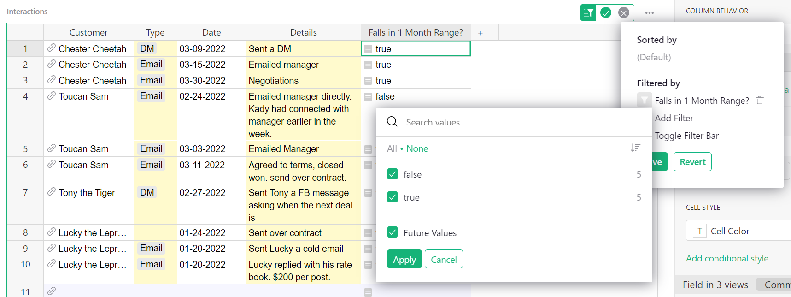*</span>

</details>

<span></span><details><summary>
#### Troubleshooting Errors
</summary>

<span></span><div class="deflist">

- `#TypeError`:

    <span class="screenshot-large">*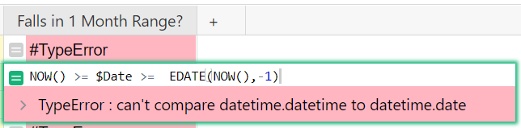*</span>

    Because `$Date` is a [Date](col-types.md#date-columns) type column, `TODAY()` must be used in formulas comparing dates. [`NOW()`](functions.md#now) is a DateTime formula that should only be used with other DateTime values. For example, if the `$Date` column was a [DateTime](col-types.md#datetime-columns) type column, `NOW()` would need to be used rather than `TODAY()` because it includes the time component.

    `NOW()` is date and time. `TODAY()` is only date.
</div>

</details>
