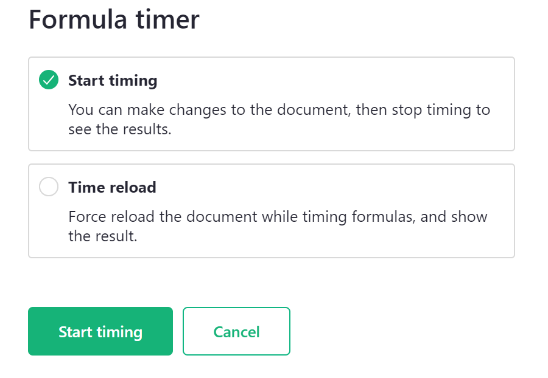

Formula timer
=========

Grist has a built-in formula timer that will measure the time it takes to evaluate each formula in a document. This helps diagnose which formulas are responsible for slow performance when a document is first opened, or when a document responds to changes.

Grist's formula timer can be found on the 'Document Settings' page, under 'Data Engine'.

Select 'Start timing' to begin.

**

On the next screen, you will have two choices, 'Start timing' and 'Time reload'.

**
{: .screenshot-half }

**Start timing**

'Start timing' allows you to make changes to the document then stop timing to see the results. This is useful if you want to test specific formulas. You can make a change that affects that formula then come back and click 'Stop timing' to see the result.

**
{: .screenshot-half }

**Time reload**

'Time reload' forces a reload of the document while timing formulas and shows the result. This will show timing results for all formulas across the entire document.

## Results

Results are displayed in a table format.

!!! warning "⚠️ Results Table"
    The Formula Timer results table is not saved anywhere in the document. If you click away from this page, you will need to run the formula timer again to retrieve the table.

Sort the **Total Time** column from Z > A so the formulas that take the longest time to run are listed first.

**

The table specifies the **Table ID** and **Column ID** containing each formula. Review the formulas with the highest total time to see how they can be improved.

If your document is experiencing slowness due to formula calculations, you'll see **Total Times** greater than 1 second. 

**

Need guidance on how to improve a formula? Post to our [Community Forum](https://community.getgrist.com/)!
