Formulas
=========

Grist has a powerful data engine to calculate the cells of your
tables using formulas. It even has an [AI Formula Assistant](ai-assistant.md) to help write formulas. If you've used spreadsheets before, or
database expressions, you'll be on familiar territory - but there are
some wrinkles you'll want to know about, so hang around.

Let's start with a classic use of spreadsheets.  Suppose you have
a list of products you've ordered, the quantity you ordered,
and the unit price of each.  You've made a column to show
the quantity times the unit price, but want the computer to do
that part for you.

<span class="screenshot-large">*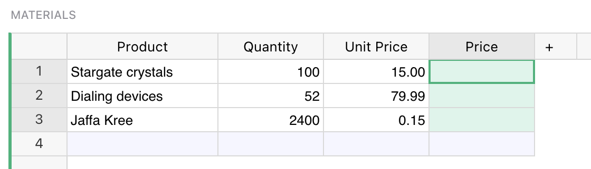*</span>
{: .screenshot-half }

Just select a cell in the column you want to fill, and hit <code class="keys">**=**</code> key to
tell Grist you want to enter a formula, rather than a value.

<span class="screenshot-large">*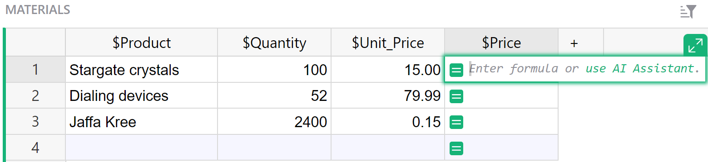*</span>
{: .screenshot-half }

Did you notice, when you did that, the labels of the columns changed
a little?  "Product" became "$Product", and "Unit Price"
became "$Unit\_Price".  This is Grist telling you how to
refer to those columns in your formula.  Just type `$Quantity * $Unit_Price`{: .formula }.
You'll find an auto-complete feature ready to help you.
Or if you don't like typing, click on the Quantity column, type the
multiplication symbol, and then click on the Unit Price column.
Your formula should look like this:

<span class="screenshot-large">*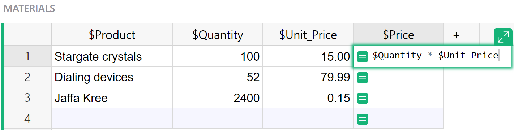*</span>
{: .screenshot-half }

To control the column ID, like "$Unit\_Price", that's used in formulas, see
[Renaming columns](col-types.md#renaming-columns).

Press <code class="keys">*Enter*</code>, and your formula is applied to all cells in the column.

<span class="screenshot-large">*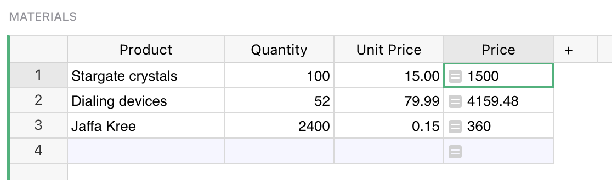*</span>
{: .screenshot-half }

If you've worked with spreadsheets before, you may be surprised
that you don't need to specify row numbers, like `B1 * C1`.
In Grist, a single formula applies to a whole column.
You don't have to worry about filling it in for all rows,
and can refer to values in the same row without fuss.

You can format numeric columns to look better by [setting column
type](col-types.md#specifying-a-type) to `Numeric`, and selecting suitable formatting options:

<span class="screenshot-large">*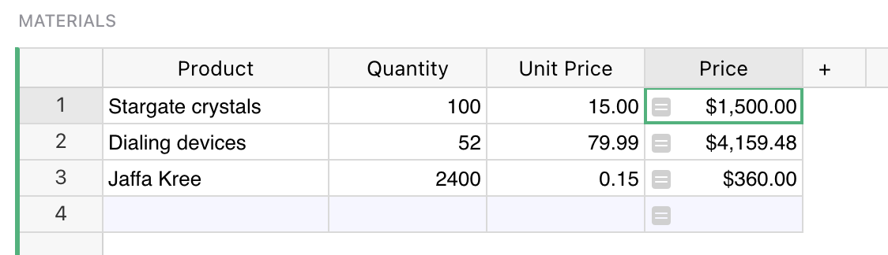*</span>
{: .screenshot-half }

## Column behavior

When we provide a formula for a column we tell Grist to update its value on every change
in a document. We can no longer type a value into the cell, because its value is
determined purely by the formula.

A formula column is one of three possible column behaviors, which you can control using
the `COLUMN BEHAVIOR` section in the creator panel:

- `Data column` maintains data, which you can manually update or clear, or optionally
calculate using [trigger formulas](formulas.md#trigger-formulas).
- `Formula column` always reflects the result of formula calculation, and is kept
up-to-date by Grist.
- `Empty column` is a state for a new column. Typing any value into it will turn it into a
Data Column, while typing in a formula will turn it into a Formula Column

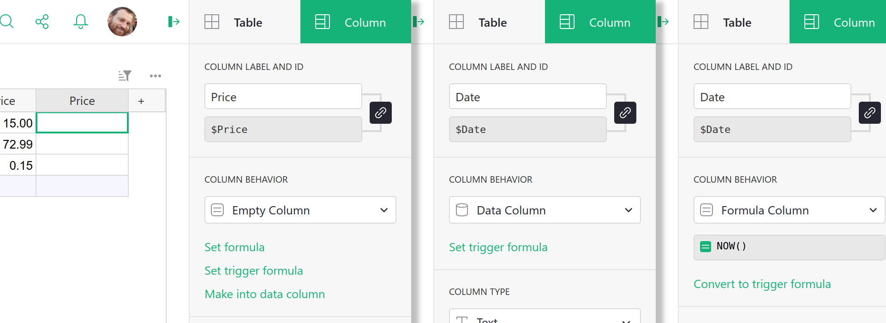

Using the `COLUMN BEHAVIOR` section, you can manually change the column behavior. The most
common options are available as green action buttons at the bottom, and other options are
available under the behavior menu. Depending on the current column behavior, those are:

- `Set formula` action converts an empty column to a formula column.
- `Set trigger formula` or `Convert to trigger formula` action sets a trigger on a column
(more on triggers in the next [Trigger formulas section](formulas.md#trigger-formulas) ).
- `Make into data column` action converts an empty column to a regular data column.
- `Convert column to data` converts a formula column to regular data column (you can read
more about this feature in the 
[Freeze a formula column section](formulas.md#freeze-a-formula-column) ).
- `Clear and make into formula` clears all the data in a column and converts it to a
formula column. (We say "clear" as a reminder that existing data in the column will be
lost. They'll be replaced by the calculation results from the formula.)
- `Clear and reset` clears all data and completely resets the column to its initial `Empty
Column` state.


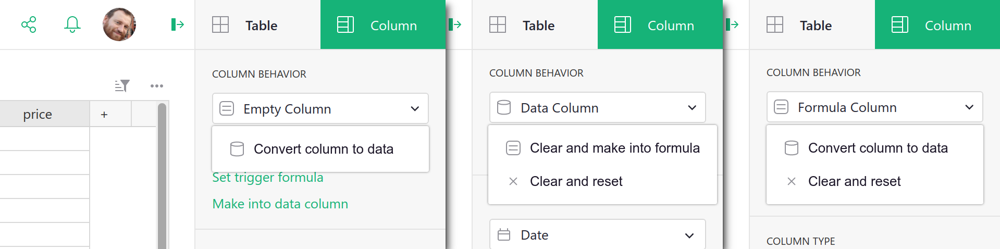

## Python

Grist formulas are written in Python, the most popular language for data science.
The entirety of [Python's standard library](https://docs.python.org/3/library/) is available
to you. For those with a spreadsheet background, we've also added a suite of Excel-like
functions, with all-uppercase names. Here's the [full list of functions](functions.md).
Grist documents may use Python 2 or Python 3, see our [Python guide](python.md)
for details.

## Formulas that operate over many rows

If you are a spreadsheet user, you may find yourself wanting to have
some special rows at the end of your table that have formulas
different to the rest.  In Grist, we'd like you to consider adding a
widget to your page instead.  For common use cases, [Summary
tables](summary-tables.md) may be exactly what you need.  Or if you
want to set things up yourself, you can add an extra table widget like
this (see [Page widgets](page-widgets.md) for details):


This is just another table, giving us a place to put formulas outside
of the structure of the Materials table.  For example, if we wanted
to count how many products there are in that table, we could use this
formula:

```py
len(Materials.all)
```

Every table in your document is available by its name in formulas,
as a [UserTable](functions.md#usertable).  This formula uses
the [all](functions.md#all) method to access the rows of the table, but
doesn't do anything with them but count them.

Here's a formula to compute the average price, using the Excel-like function
[AVERAGE](functions.md#average):

```py
AVERAGE(Materials.all.Price)
```

The [all](functions.md#all) method returns a [RecordSet](functions.md#recordset),
which supports iterating over individual columns this way.  Equivalently,
we could use a Python [list comprehension](https://docs.python.org/3/tutorial/datastructures.html#list-comprehensions):

```py
AVERAGE(material.Price for material in Materials.all)
```

If you are not familiar with Python, it is worth following
a tutorial.  There are thousands online, including this
[official one](https://docs.python.org/3/tutorial/index.html).
Python will be useful to you for all sorts of data work, not just Grist.

List comprehension is useful once we're doing anything nuanced.  For example,
here's a formula to list the names of products with a quantity greater than 80:

```py
[m.Product for m in Materials.all if m.Quantity > 80]
```

This is a list comprehension, but now with a conditional.  The result is a list,
which is rendered as text in a cell.

Python can help in other ways in your search for rows.  For example, here's a formula
to find the name of the product with the highest quantity:

```py
max(Materials.all, key=lambda m: m.Quantity).Product
```

Formulas are case-sensitive, with Excel-like functions being all-caps (`MAX`), and
regular Python generally all lowercase (`max`).

For exact matches, there is a shortcut to avoid iteration called
[lookupRecords](functions.md#lookuprecords), or
[lookupOne](functions.md#lookupone) for single matches.
Just pass the the values of columns you require to be matched.
For example, here is a formula to look up the product name of a material
with a quantity of 52:

```py
Materials.lookupOne(Quantity=52).Product
```

For very large tables, it is wise to use lookups as much as you can, rather
than iterating through rows.

Returning to our example document, you can now see how we calculated the
`Total Spent`, `Average Quantity`, and `Most Ordered Product` columns:

Column | Formula
--- | ---
Total Spent | `SUM(Materials.all.Price)`
Average Quantity | `AVERAGE(Materials.all.Quantity)`
Most Ordered Product | `max(Materials.all, key=lambda m: m.Quantity).Product`

Separating out calculations like this from the body of your data
can take some getting used to, but working this way can help
keep your document more organized.  And it brings other advantages.
For example we could switch the formatting of the summary widget
via the side panel:

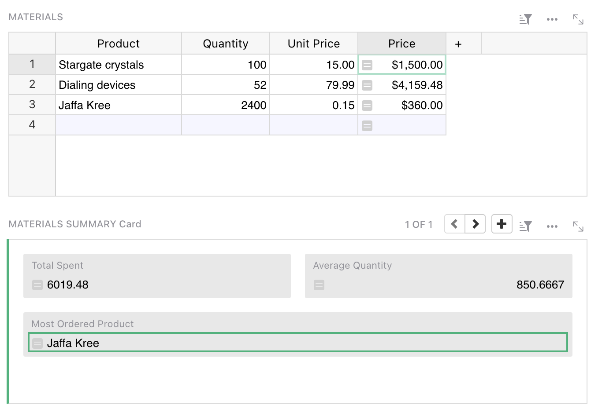

## Varying formula by row

Having a formula apply to all rows is convenient and reduces the changes of mistakes.

If you need to have a column change its behavior on different rows, it is possible using a
conditional in the formula. For example, here is a replacement for
the `Materials.Price` formula that ignores the price and shows zero for products whose name ends
in "(Sample)":

```
if $Product.endswith("(Sample)"):
  return 0
else:
  return $Quantity * $Unit_Price
```

## Code viewer

Once you have a lot of formulas, or if you have been invited to a document
and want to get an overview of its formulas, there is a code viewer
available with a pure Python summary of the document.

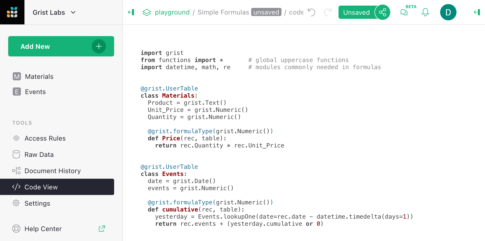

## Special values available in formulas

For those familiar with Python, here are the extra values available to
you in Grist:

 * `rec` is the current row.  The `$column` syntax is shorthand for
   `rec.column`.  The `rec` variable is of type [Record](functions.md#record).
 * `table` is the current table, and is of type [UserTable](functions.md#usertable).
 * Tables in your document are available by their name, and are also of
   type [UserTable](functions.md#usertable).
 * Many extra spreadsheet functions are available, see the full
   [function list](functions.md).

If your table or column has a space in its name, or other characters
that are awkward in Python, those characters are replaced with an
underscore.  Auto-complete may help you if you're not sure.  You
can also control the "ids" of columns and tables in the right side panel.

## Freeze a formula column

If you'd like to save the output of your formula as plain values, you can simply change
column behavior from `Formula Column` to `Data Column`. First open the column options in
the side panel:

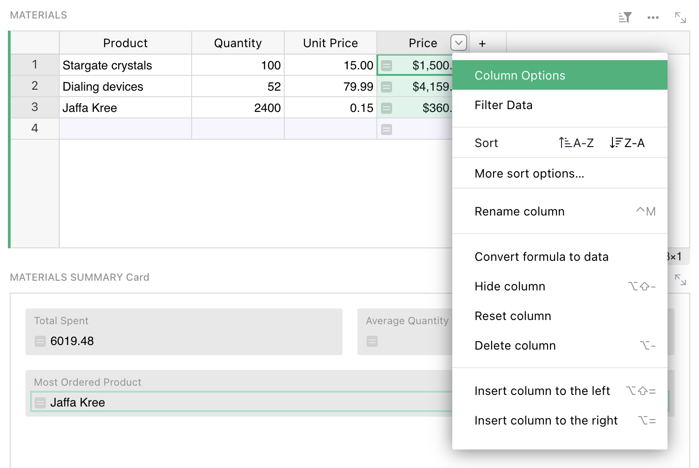

Now click on the `Formula Column` and select `Convert column to data` option.

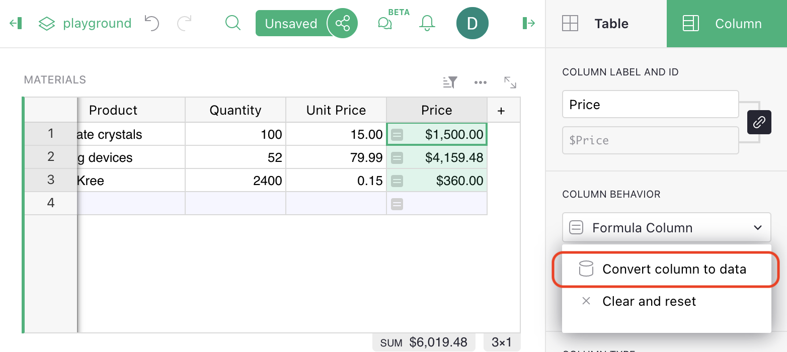

Notice that there is no ``=`` sign in the column cells any more, showing that it
is no longer a formula.  The cells will no longer change if other cells they used
to depend on change.

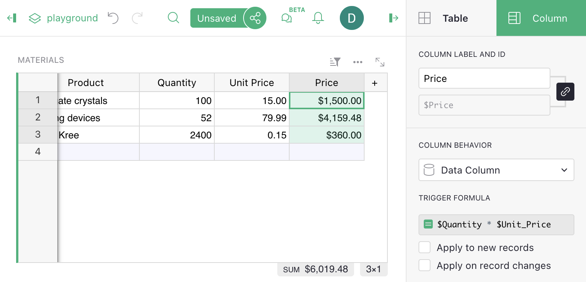

The original formula is saved but stays inactive. It may come useful
again if you wish to convert the column back to a formula column, or
use it as a 
[Trigger Formula](formulas.md#trigger-formulas).

The side panel has lots of other handy settings, such as cell formatting
(number of digits after decimal point, color, etc).  The options apply
just as much to formula columns as to regular columns.

## Lookups

Grist functions [lookupOne](functions.md#lookupone) and
[lookupRecords](functions.md#lookuprecords) are useful for enumerating
subsets of your data.  For example, suppose we added a `Category`
column to our `Materials` table, and wished to list all products belonging
to a specific category.  We can do this using `TABLE.lookupRecords`, where `TABLE` is the table of
interest, and supplying it with the column values
to match.  For example, `Materials.lookupRecords(Category='Ship')`{: .formula}, as here:

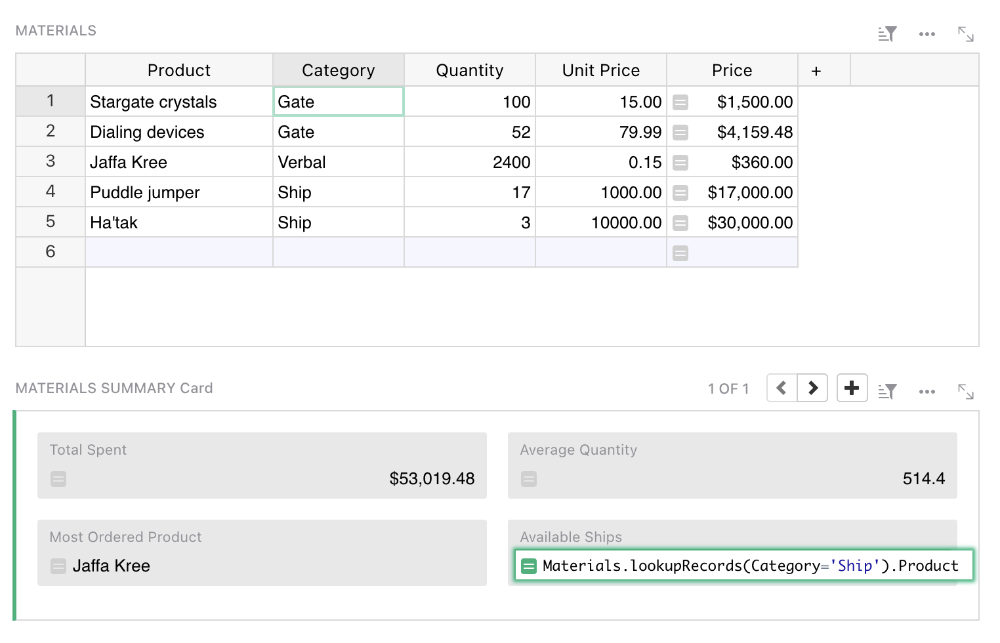

If you are following on, see [Adding a field](widget-card.md#adding-a-field)
for details of how to add a new field to a card.  If you care about the order
of results, `lookupRecords` takes an optional `sort_by` parameter.  For example,
we could use this formula to sort by the product name itself:

```py
Materials.lookupRecords(Category='Ship', sort_by='Product').Product
```

If you want to sort by multiple columns, remember that you can create a hidden
formula column that combines data in any way you like, and then sort by that.

The order of records returned by `lookupRecords` may not match the order of rows
you see in a table.  To get that order, use `sort_by='manualSort'`.  This is an
internal column that is updated with the manually established sort order
of rows.

If you find yourself doing a lot of look-ups, please consider
whether [Summary tables](summary-tables.md) and
[Summary formulas](summary-tables.md#summary-formulas) might be
what you are looking for.

## Recursion

Lookups are handy for recursive formulas.  Suppose we have a table counting how many
events we have per day, and want to add a cumulative sum of those event counts.
One way to do that is with a formula like this:

```py
yesterday = Events.lookupOne(date=$date - datetime.timedelta(days=1))
$events + (yesterday.cumulative or 0)
```


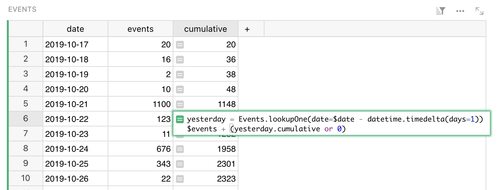


For clarity, we've split this formula into two lines.  The first line
makes a variable pointing to the row of the day before.  The second
line computes the value we want in the cell.  Python note: the value
of the last line is automatically returned (you could prefix it with
`return` if you like).

Notice the `yesterday.cumulative or 0`. For the earliest row in the
table, there will be no yesterday.  In this case, `lookupOne` returns
a special empty record, for which `yesterday.cumulative` will be
`None`.

If you'd like to simplify this formula, or find yourself using the
same lookup in multiple formulas, it would be worth making
`yesterday` a [reference column](col-refs.md).  Simply add
a reference column, and give a formula for it that matches how
we defined `yesterday` here.

To actually enter this formula in a cell, you'd use
<code class="keys">*Shift* + *Enter*</code> to divide the lines.

## Trigger Formulas

Formula columns are great for calculated values -- those determined by
other data in the document. It may also be useful to store independent 
data in a column, but still use a formula to calculate it in some
situations. This is exactly what Trigger Formulas offer. It is a
very powerful feature that allows you to create a
[Timestamp](timestamps.md) or [Authorship](authorship.md) column,
recalculate your data based on
a [set of conditions](examples/2021-07-auto-stamps.md) that you decide
, clean data when a new value is entered, or provide sensible default
value for a column.

To create a Trigger Formula column, you first need to open the creator panel and 
click on the `Set trigger formula` action. If you want to convert an existing formula, use
the `Convert to trigger formula` action available in the `COLUMN BEHAVIOR` section.


To control when the formula is evaluated, use the two checkbox options 
below:

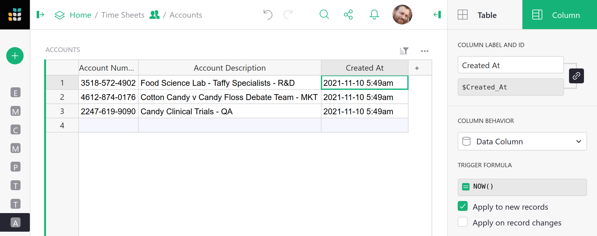

- `Apply to new records` triggers the formula only when a new record is 
created (a default cell value).
- `Apply on record changes` triggers the formula when a record is updated.

Applying to new records is self-explanatory, the formula will be evaluated
only once when you add a new record. It is a perfect solution to provide 
default values to the empty cells. Second option allows you to fine grain 
the conditions and specify which columns, when updated, will trigger the 
evaluation:

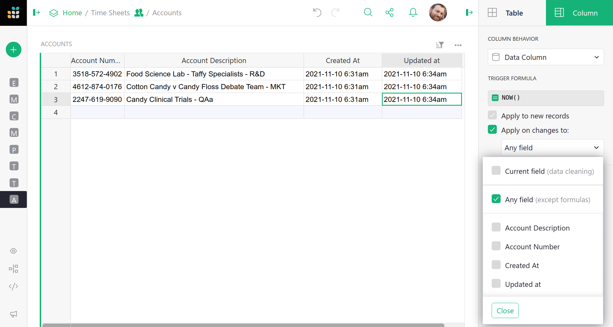

You probably noticed the first option `Current field`. At first glance, you
probably wonder: "Why would I want to trigger the column on its own 
change?". This option allows you to react to a value that is being entered 
into the column, just before it is saved!

In the formula editor, you have access to two variables that are not 
available to regular formulas:

- `value` which is the value that a user wants to enter,
- `user` which represents a user object that is making the change (you will also
see this in the [Access rules](access-rules.md) section).

This allows you to make your application even smarter, track when a record
[was updated](timestamps.md), or see who made the last [change to a row](authorship.md).
Simple examples:

1. Ensure that the value in a column is always written in capital letters:
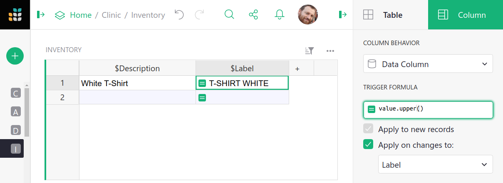 
With the trigger formula of `value.upper()`{: .formula}, the value typed into
this column will be converted to upper case automatically.  

2. Format a value that the user enters to sanitize the data before saving:
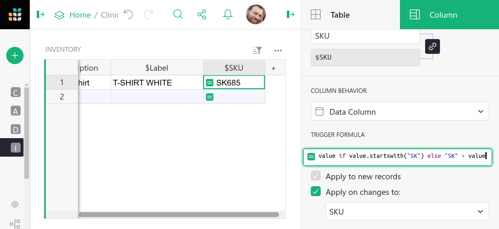
With the formula like `value if value.startswith("SK") else "SK" + value`{: .formula},
the value typed into this column will always be prefixed with "SK".

3. Overwrite a default value from a referenced table:
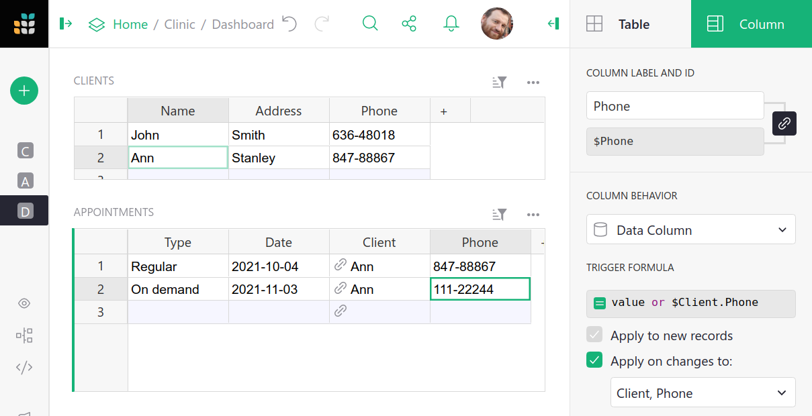
You can use a formula like `value or $Client.Phone`{: .formula}, to provide a default
value from a referenced table, but still allow the user to type a new one.

In each of these examples, when the user tries to modify a cell, Grist (before
updating the record) will evaluate the formula and store its result in the column
instead of the value provided by the user. 

For a detailed, real-life example read our [guide](examples/2021-07-auto-stamps.md)
on how to create time and user stamps.

For more information on formulas and trigger formulas, check out our webinar [Trigger Formulas v. Formulas](https://youtu.be/0qVDPZd2w9I).
