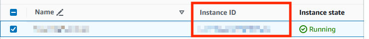
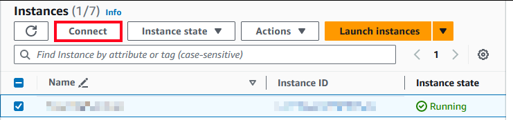

AWS Marketplace {: .tag-core .tag-ee }
============

[Grist on the AWS Marketplace](https://aws.amazon.com/marketplace/pp/prodview-kkchmamumozhq) has what you need to run a self-hosted Grist instance with minimal setup, and is based on [`grist-omnibus`](https://github.com/gristlabs/grist-omnibus). Below are the complete configuration steps, including authentication via OpenID.

## First run setup

After deploying the instance, Grist should be instantly available through the HTTP protocol on an autogenerated domain such as `ec2-3-94-254-105.compute-1.amazonaws.com` (labeled `Public IPv4 DNS` by AWS).

Default credentials:

* email: admin@example.getgrist.com
* password: [instance-id]\*

\* Instance ID can be found on the EC2 page in the AWS Console:

### How to log in to the Grist instance

During deployment, you should have been asked about creating or using key pairs. You can use this pair to log in via SSH from your terminal/bash. The default user for the Grist EC2 instance is named “ubuntu”, and you can log in to `ubuntu@[ec2-instance-public-ip]`.

**Note:** You need to use the `*.pem` file you received while generating key pairs on AWS. Details about connecting via SSH can be found in the following places: 

* Windows: [https://learn.microsoft.com/en-us/windows/terminal/tutorials/ssh](https://learn.microsoft.com/en-us/windows/terminal/tutorials/ssh)
* Linux: [https://www.ssh.com/academy/ssh/command](https://www.ssh.com/academy/ssh/command)
* macOS: [https://www.servermania.com/kb/articles/ssh-mac](https://www.servermania.com/kb/articles/ssh-mac)

If you don’t want to connect via SSH, AWS provides the option to connect from within the AWS console using the “Connect” button:

## Custom domain and SSL setup for HTTPS access

Custom domains are required for secure access to Grist. If you already have an SSL certificate, you can use your own (as described in the [`grist-omnibus` README](https://github.com/gristlabs/grist-omnibus/)). If not, Grist can generate a certificate from Let’s Encrypt. For that, a valid domain and email must be configured:

1. Point the domain to the IP address of the Grist EC2 instance. If you don't use the [Elastic IP service](https://docs.aws.amazon.com/AWSEC2/latest/UserGuide/elastic-ip-addresses-eip.html), the instance can have a different public IPv4 address each time it's started.
2. Log in to the Grist EC2 instance.
3. Set the URL parameter in the `grist/gristParameters` file. You need administrator privileges to perform this action, so you can open an editor by running `sudo nano grist/gristParameters`.
4. Run the `restartGrist` script with `sudo ~/grist/restartGrist`.

Once the above steps are completed, you should be able to access Grist on your custom domain.

## Authentication setup

We support Google or Microsoft as OpenID providers. For configuring other authentication providers, please refer to the [dex documentation](https://dexidp.io/docs/getting-started/).

To configure Grist authentication with Google or Microsoft, you must have an application registered with the corresponding provider:

* Microsoft: [https://learn.microsoft.com/en-us/power-pages/security/authentication/openid-settings](https://learn.microsoft.com/en-us/power-pages/security/authentication/openid-settings)
* Google: [https://support.google.com/cloud/answer/6158849?hl=en](https://support.google.com/cloud/answer/6158849?hl=en)

Once you have your client ID and secret, you’ll need to pass them to the `gristParameters` file inside the Grist EC2 instance:

1. Log in to the Grist EC2 instance.
2. Open `~/grist/gristParameters`.
3. Update the `CLIENT_ID` and `CLIENT_SECRET` sections for the relevant provider(s).
    * If you’re using only one provider, leave the second section commented out. 
4. Update `ADMIN_EMAIL` in the same file. It should correspond to the email you will use to log in via your authentication provider. For example: `ADMIN_EMAIL=frank@your-organization.com`
    * If you want to change your team’s name, update `TEAM_NAME` in the same file. 
5. Run `restartGrist` with the clean flag using `sudo ~/grist/restartGrist clean` to clear old login data. **Important:** This will delete all Grist documents!

Once the above has been configured, you should be able to log in with your Google/Microsoft credentials.

## Running Grist in a separate VPC

`grist-omnibus` is designed to work on each account-default VPC. To make it run on a custom VPC, you’ll need to properly configure all VPC elements. For more information on this configuration, read [here](https://docs.aws.amazon.com/vpc/latest/userguide/what-is-amazon-vpc.html). To run Grist on a VPC, the following must be properly set up: 

* Assigning a public DNS name to the Grist EC2 instance is allowed.
* The VPC can be accessed from the internet (allowing internet gateway and routing tables to handle traffic).
* A security group connection from ports 22 (SSH for configuration), 80 (HTTP connection) and 433 (HTTPS connection) is allowed.

## Updating `grist-omnibus`

The packaged version of `grist-omnibus` will auto-update before each launch. To update `grist-omnibus` manually, restart the Grist EC2 instance or log in via SSH and call `sudo ~/grist/restartGrist`.

There are currently no plans to support the Grist AWS Marketplace environment outside of `grist-omnibus`.

## Other important information 

* The Grist EC2 instance should have the “Persistent store” option checked.
* Grist stores all the data in the `~/grist-persist` directory. Deleting this folder will result in a loss of all data from all documents. 
* Do not delete `~/grist-persist/acme.json`, as it contains a private key from Let’s Encrypt. Deleting it too often can result in Let’s Encrypt denying issuing further certificates from your domain.
