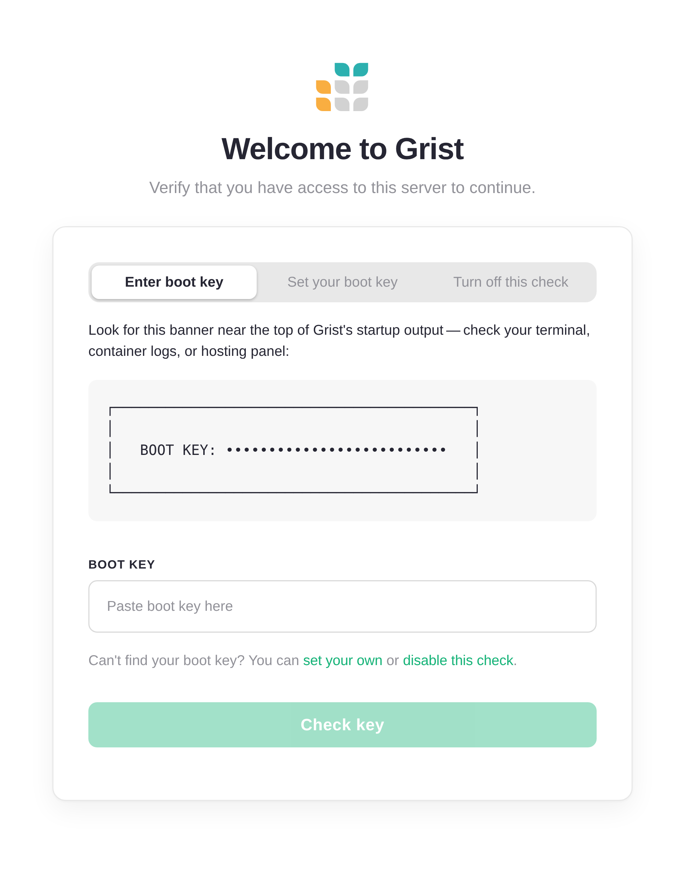
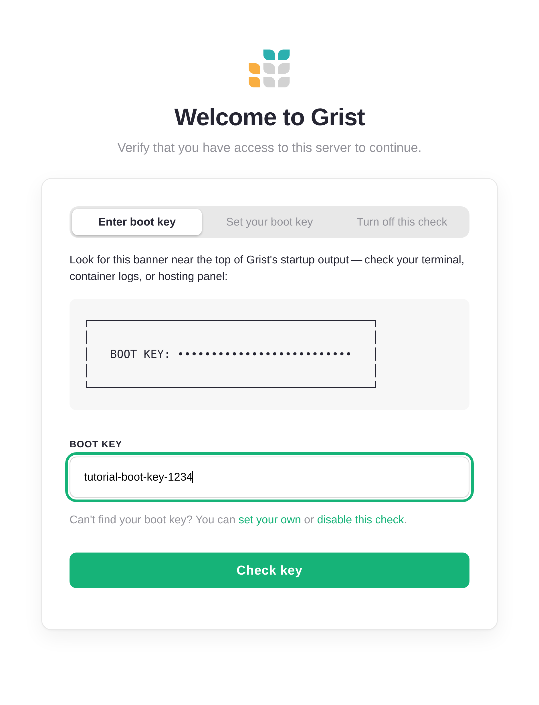
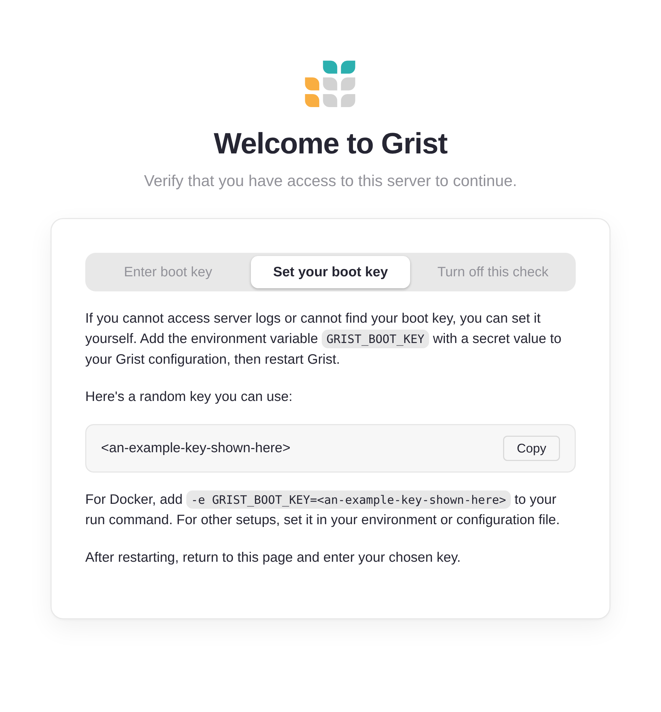
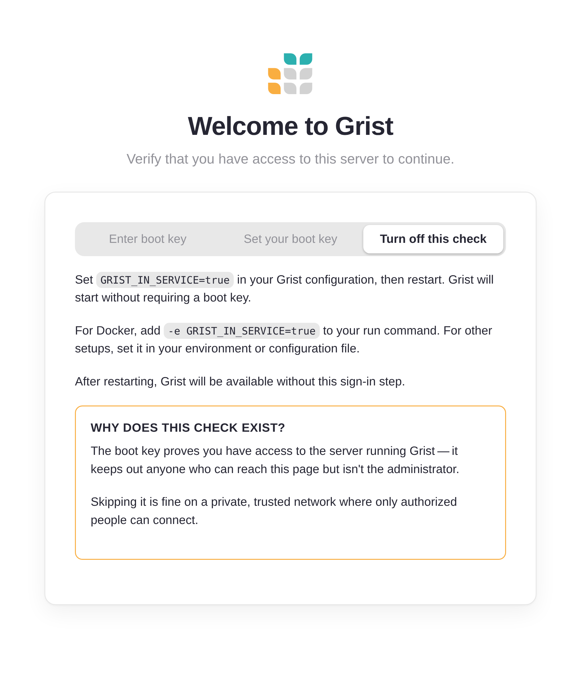
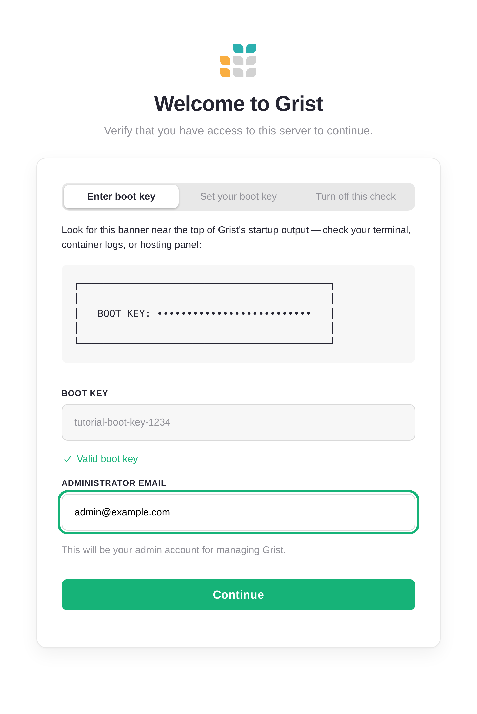
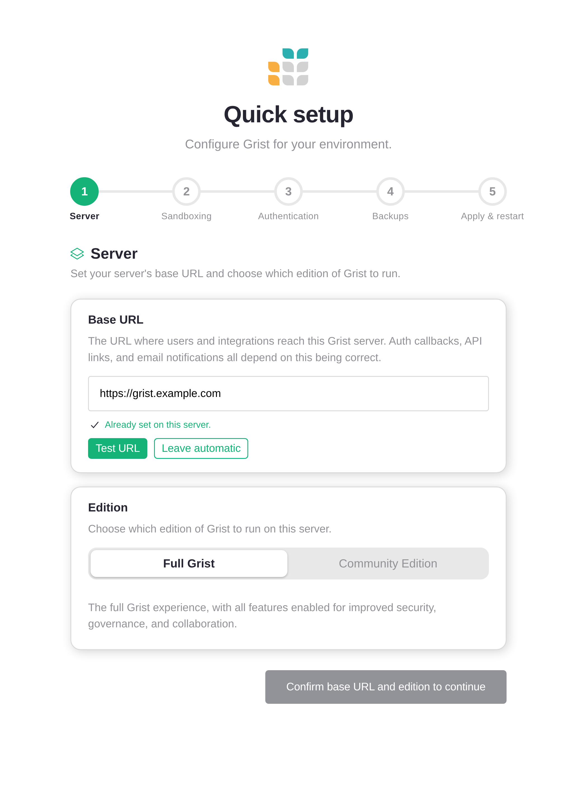
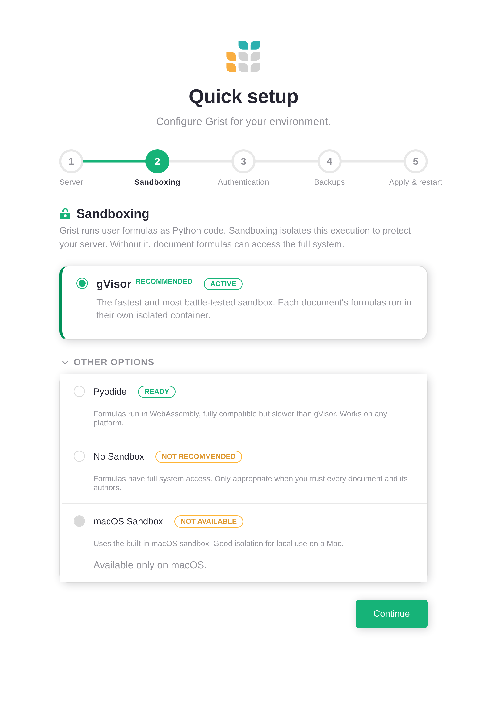
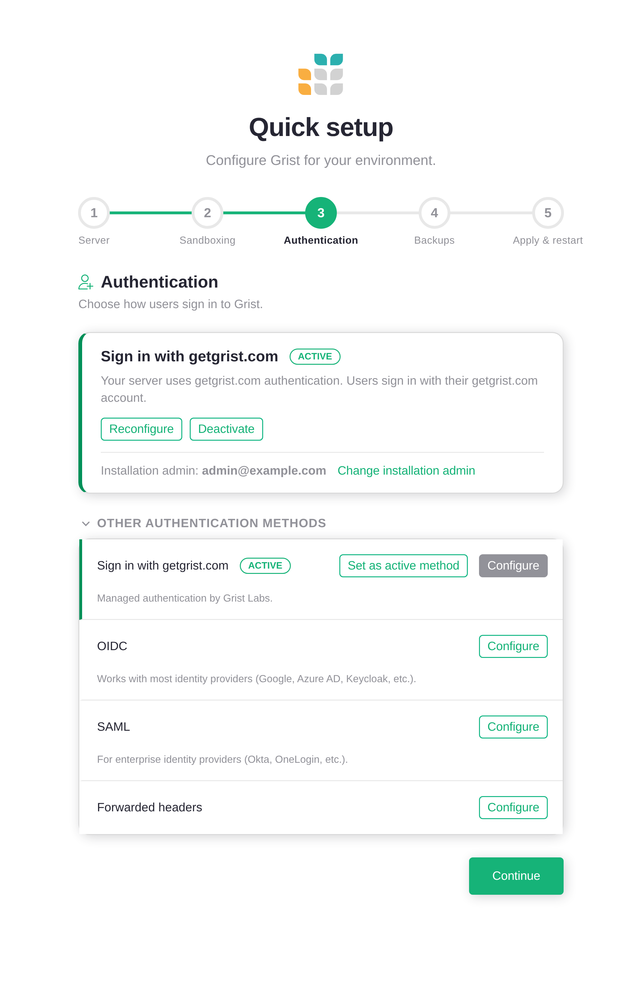
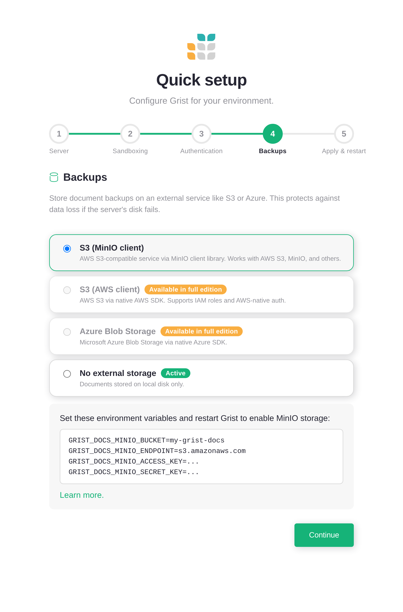
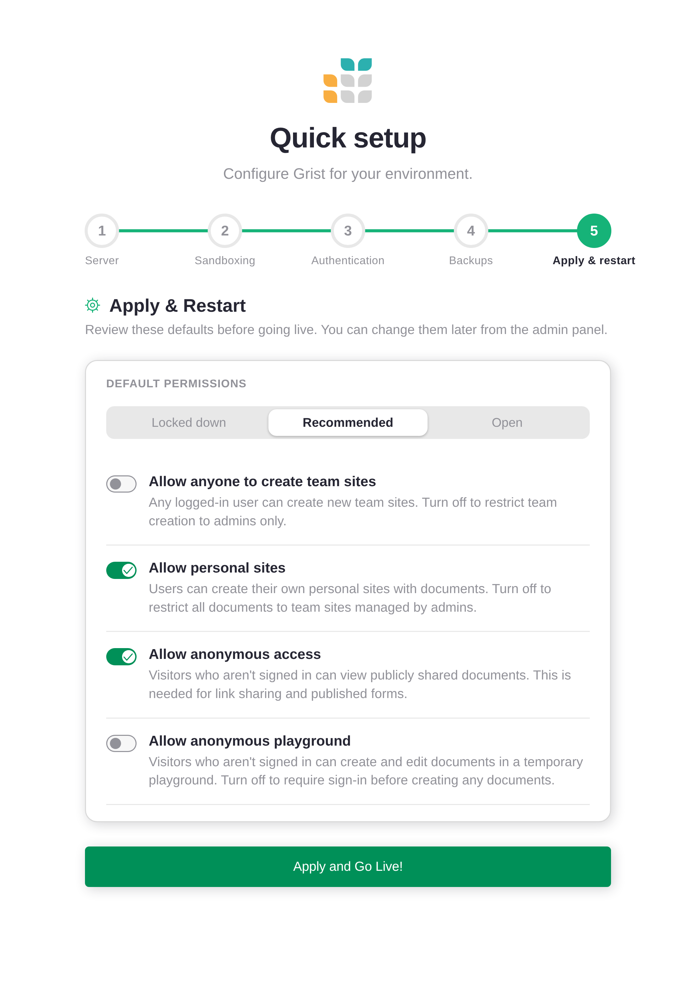

# First-run setup {: .tag-core .tag-ee }

The first time you open a fresh, self-hosted Grist server in a browser, you
don't go straight to a spreadsheet. Grist asks two questions first: are you
really the operator of this server (the **boot login** page), and how would
you like it configured (the **Quick setup** wizard)?

This page walks through both. Most administrators only see them once,
though both stay reachable later if you need them. See
[Coming back later](#coming-back-later).

## The welcome screen

Open a fresh Grist install in a browser and you'll land on the welcome page.
No sign-in form, no documents, just a card asking for a *boot key*.



It only appears once. Grist wants proof that whoever is reaching the web
app also has access to the machine running it, not just anyone who happens to
find the URL. The boot key is that proof.

Grist prints the key into its own startup output. Check your terminal,
container logs, or hosting panel for a banner that looks like this:

```
┌──────────────────────────────────────────┐
│                                          │
│   BOOT KEY: ••••••••••••••••••••••••••   │
│                                          │
│   Use this key at /boot to sign in.      │
│                                          │
└──────────────────────────────────────────┘
```

Paste that key into the field and click **Check key**.



### Set your own boot key

Can't see the logs? Maybe Grist is running on a hosting provider that hides
them, or in a container you didn't start yourself. Switch to the
**Set your boot key** tab.



Set the environment variable `GRIST_BOOT_KEY` to a secret value of your
choice, restart Grist, then return to this page and use your new key. For
Docker, that means adding `-e GRIST_BOOT_KEY=<your-secret>` to your run
command.

### Turn off the boot check

If your server lives on a private, trusted network where only authorized
people can reach it, the boot check is overkill. Switch to the
**Turn off this check** tab.



Set `GRIST_IN_SERVICE=true` and restart. Grist skips the check entirely.

!!! note "Why the check exists"

    The boot key proves you have access to the server running Grist. It
    keeps out anyone who can reach this page but isn't the administrator.
    Skipping it is fine on a private, trusted network.

## Set the administrator email

Once Grist accepts your boot key, it asks one more thing: what email address
should belong to the administrator account?



This email becomes the owner of the installation. If `GRIST_ADMIN_EMAIL`
was set when Grist started, you'll see it pre-filled and can adjust it. If
not, type the one you'll sign in with.

Click **Continue**. Grist hands you off to the Quick setup wizard.

## Quick setup

The wizard runs you through the handful of decisions Grist needs to make
before it can open for business. Each step has sensible defaults, so you
can mostly click through, but it's worth a look. Every setting here can
also be changed later from the [Admin Panel](../admin-panel.md).



### Step 1: Server

Two settings: the **base URL** Grist should use for itself, and which
**edition** to run.

The base URL matters more than it looks. Auth callbacks, share links, and
email notifications all build their URLs from it. If you're behind a
reverse proxy or HTTPS terminator, set it to the public URL users will
type, not the internal one. Click **Test URL** to have Grist sanity-check
the value.

The edition toggle picks between the licensed full edition of Grist and the
free Grist Community edition. See [Self-hosted Grist](../self-managed.md)
for the difference.

### Step 2: Sandboxing

Grist runs user-written Python formulas. Without a sandbox, those formulas
can read and write anything the Grist process can. So on any server that
hosts documents from more than one author, you want a sandbox on.



The wizard probes the host and grays out anything that isn't available. On
Linux, **gVisor** is the recommended choice. **Pyodide** runs formulas in
WebAssembly: slower, but portable.

!!! tip "Already set in the environment?"

    If `GRIST_SANDBOX_FLAVOR` is already set when Grist starts, the wizard
    shows the current value and locks the field. To change it, edit your
    environment and restart.

### Step 3: Authentication

This is the step that matters most for a public-facing server. By default a
fresh Grist has no authentication. Anyone who reaches it can read and edit
documents.



Open **Other authentication methods** and configure one. See
[Authentication overview](authentication-overview.md) for the full list and
guidance on which to pick:

  - [Sign in with getgrist.com](sign-in-with-grist.md): managed auth by
    Grist Labs. Quickest to set up.
  - [OIDC](oidc.md): works with Google, Okta, Auth0, Keycloak, and most
    other identity providers.
  - [SAML](saml.md): for enterprise SSO.
  - [Forwarded headers](forwarded-headers.md): when an upstream proxy
    already authenticated the user.
  - [GristConnect](grist-connect.md): for sites that already speak
    DiscourseConnect.

If you really do want an open server, say, a personal install on your
laptop, check the *I understand this server has no authentication* box and
the wizard will let you proceed.

### Step 4: Backups

Grist documents are SQLite files on disk. If the disk fails, they're gone.
Hooking up external object storage gives you off-host backups automatically.



You can pick S3, an S3-compatible service like MinIO, or Azure Blob Storage,
or skip this step and configure it later from the
[Admin Panel](../admin-panel.md). See
[Cloud storage](cloud-storage.md) for the full setup details.

### Step 5: Apply and restart

The last step shows four install-wide permission switches and three presets.



The presets do most of the thinking:

  - **Locked down**: only admins create sites, no anonymous access. Pick
    this for a single-team, behind-the-firewall install.
  - **Recommended**: personal sites and anonymous viewing on, team-site
    creation off, no anonymous playground. This is the default.
  - **Open**: everything on. Useful for a public, low-stakes server (and
    not much else).

The toggles, in plain English:

  - **Allow anyone to create team sites.** If on, any signed-in user can
    spin up a new team site. Most installs want this off so admins control
    the team list. Backed by `GRIST_ORG_CREATION_ANYONE`.
  - **Allow personal sites.** Each user gets their own private workspace.
    Off means every document lives in an admin-managed team site. Backed
    by `GRIST_PERSONAL_ORGS`.
  - **Allow anonymous access.** Required for public link sharing and
    published forms. Off means users have to sign in before they see
    anything. Backed by `GRIST_FORCE_LOGIN` (inverted).
  - **Allow anonymous playground.** Lets unauthenticated visitors poke at
    a throwaway document. Off if you'd rather not advertise that
    affordance. Backed by `GRIST_ANON_PLAYGROUND`.

## Going live

Click **Apply and Go Live!** Grist saves your choices, restarts itself, and
switches into service. From here on out, visiting the server takes you to
the home screen instead of the setup wizard.

You can revisit any of these settings later from the
[Admin Panel](../admin-panel.md). Nothing you picked here is permanent:
the wizard is a starting point, not a contract.

## Coming back later

The Quick setup wizard stays in the [Admin Panel](../admin-panel.md)
sidebar, under **Settings → Quick setup**. Open the Admin Panel any
time to step back through it.

The boot login page is also still available. Sign out if you're signed
in, open the [Admin Panel](../admin-panel.md), and click
**Sign in with boot key**. This requires `GRIST_BOOT_KEY` to still be
set in your environment.
