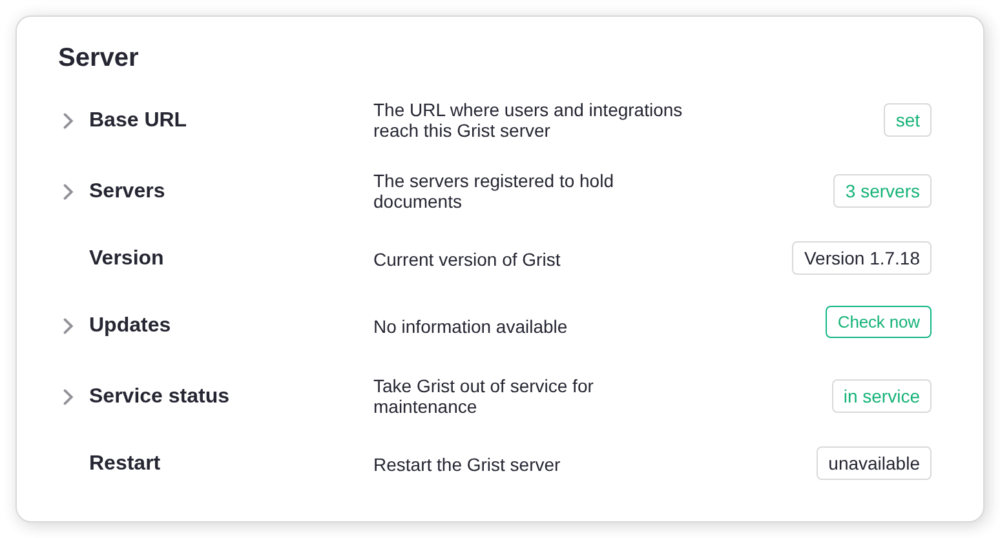
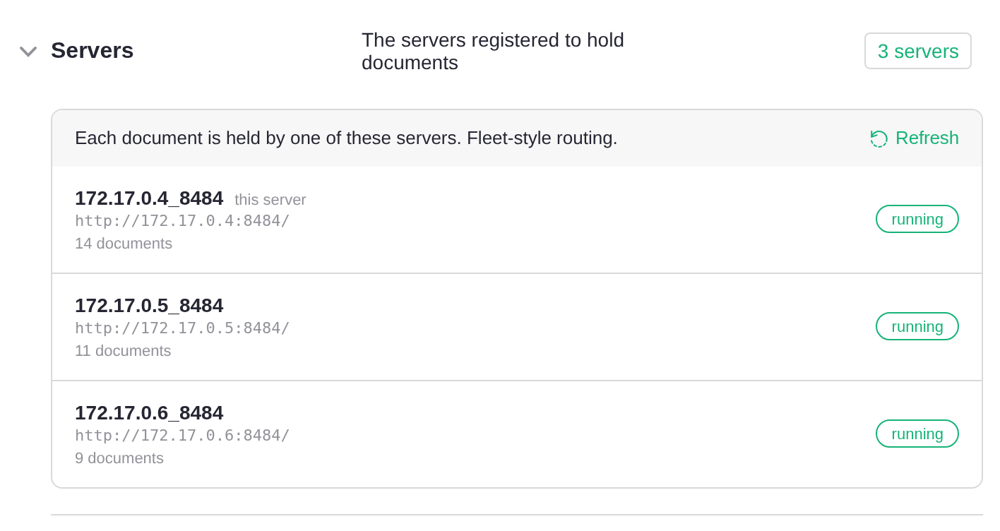
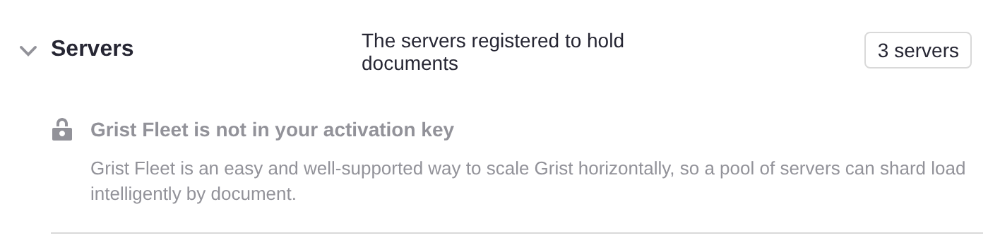
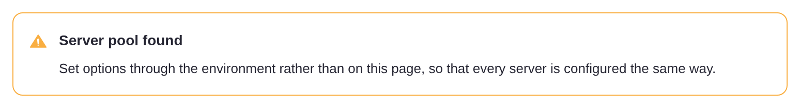
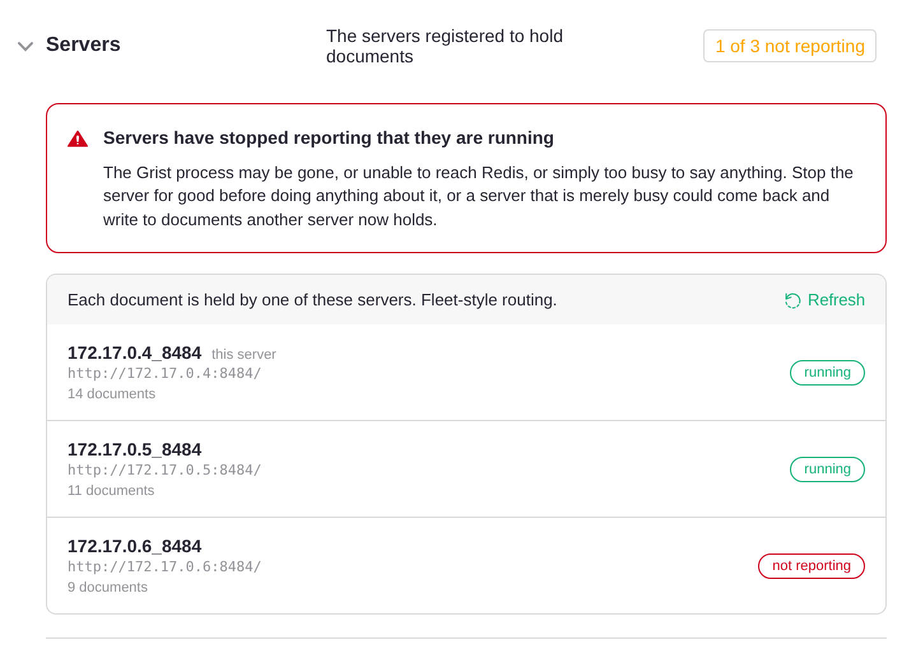

# Grist Fleet {: .tag-ee }

[TOC]

Grist Fleet lets you run several Grist servers as a single installation. Every
server in a fleet is identical: the same image, the same configuration, and the
same job. Any server can accept any request, so you can stick a fleet of them
behind a standard load balancer and they'll sort themselves out.

A Grist document is still served by exactly one server at a time. It is an open
SQLite file with a live Python sandbox attached. What Fleet changes is how
clients reach that server. When a request for a document arrives at a server
that doesn't hold that document, the server transparently proxies it to the
server that does. The browser never knows the difference, so nothing has to keep
track of which server holds which document.

This gives you:

  * **Growth by cloning.** To add capacity, start another server with the same
    configuration. There are no separate server roles to provision.
  * **An easy setup path.** If you already have traffic routed to a Grist
    server, you can add more without changing routing. Then, when you're ready,
    add a standard load balancer in front: plain round-robin will do, with no
    sticky sessions and no per-server routing rules.
  * **Smoother upgrades.** Restart one server at a time. Clients see a
    brief reconnect rather than an outage.
  * **Redundancy.** Servers may be added and removed freely. If a server goes
    away, its documents are reassigned to a live server and loaded from shared
    storage.

## Scaling Grist horizontally without fuss

Fleet is aimed at teams who have been running Grist on a single server for a
while and now want to scale out, or who want the assurance that they can when
the time comes. Whether it helps depends on how concentrated your load is.

**Fleet spreads load across documents.** Each document is held by one server, so
as you add servers your documents are divided between them. A heavy document
then slows down the one server holding it rather than your whole installation. If
your load is spread over many documents, and a few busy ones are currently
making Grist sluggish for everyone, that is the problem Fleet solves.

**Fleet does not make an individual document faster**, except by removing
contention. If nearly all of your load is one large, busy document, adding
servers will not help much. That document still sits on a single server, and the
rest of the fleet will be idle; all it gains is a server it no longer shares
with everything else. A faster server, or profiling and optimizing the document
itself, are the answers here.

Fleet buys operational simplicity, and it has costs:

**An extra hop.** A client that lands on a server which does not hold its
document is proxied through that server for the life of the connection. Within a
datacenter the added latency is negligible, but the proxying server does spend
file descriptors and memory on the piped sockets.

**No dedicated home servers.** Every server serves both landing pages and
documents. A server busy recalculating a heavy document will also be slower at
serving landing pages and API calls for whichever users happen to land on it.
Grist's own hosted architecture separates these roles onto different machines to
avoid exactly this; a fleet of identical servers does not.

You can separate them whenever you want to, with one setting. Give the servers
users arrive at `GRIST_SERVERS=home,static`, and the rest `GRIST_SERVERS=docs`.
Everything else stays as it is, `GRIST_FLEET` included, and documents are still
proxied, so the servers holding them still need no public address of their own.

If you are planning a large deployment from the outset rather than growing an
existing one, [talk to us](https://www.getgrist.com/contact/), since a
hand-organized multi-tier deployment may suit you better.

## What you need

### An activation key with Fleet enabled

Fleet is a feature of the full edition of Grist, and it must be **specifically
enabled on your activation key**. This is not something you can switch on
yourself: an ordinary full-edition activation key does not include it, and it is
not part of the 30-day trial. [Contact us](https://www.getgrist.com/contact/) to
have Fleet added to your key.

### Shared services

Multiple servers must share state that a single-server installation usually
keeps to itself. All three of the following are required, and every server must
point at the same one:

| Component | What Grist uses it for | Single-server default |
|---|---|---|
| PostgreSQL | The [home database](../self-managed.md#what-is-a-home-database): users, orgs, permissions, document metadata | SQLite on local disk |
| Redis | Document assignment between servers, sessions, permits | In memory, with sessions in SQLite on local disk |
| S3-compatible storage or Azure | [Document storage](cloud-storage.md) | Local disk |

If you are moving an existing single-server installation to a fleet, migrate to
these first, one at a time, and confirm the installation is healthy on a single
server before adding a second.

### A network the servers share

Servers must be able to reach one another directly, not only through the address
your users arrive at. The official Docker images listen on every interface,
which is what this needs. If not using them, set `GRIST_HOST=0.0.0.0`.

Traffic between servers is plain `http`, as is usual inside a VPC or a container
network.

## Setting up

### Configure every server

Set up each server as you would a single server using the
[shared services](#shared-services) above. Then give every server these same
settings:

```sh
GRIST_FLEET=true
GRIST_ACTIVATION=<activation-key-with-fleet>
APP_HOME_URL=https://grist.example.com
```

  * `GRIST_FLEET` turns Fleet on.
  * `GRIST_ACTIVATION` is your activation key, which must have Fleet enabled.
    `GRIST_ACTIVATION_FILE` works too.
  * `APP_HOME_URL` is the address your users arrive at.

Nothing is set per server: no names, no addresses, no roles, and no list of the
other servers. Each server works out a name and an address for itself and finds
the others through Redis.

### Where users arrive

`APP_HOME_URL` can lead to one of the servers to begin with, with the rest behind
it. A load balancer in front is recommended, but it does not have to come first:
add one whenever you are ready and have `APP_HOME_URL` lead there instead, and
nothing else changes. See [Adding a load balancer](#adding-a-load-balancer).

### Settings to avoid

Some settings are harmless on a single server but could cause problems across several.

**`GRIST_DISABLE_S3`.** Without external document storage, documents exist only
on the local disk of whichever server last held them, and cannot be picked up by
another server.

**`APP_DOC_URL`.** This gives a server a public address of its own, which a
fleet has no use for: clients are proxied on from whichever server they reach.
Setting it alongside `GRIST_FLEET` stops the server at startup rather than
sending server-to-server traffic back out through the front door.

**A setting customized on one server but not the others.** Every server serves
every user, so a difference between them shows up as behavior that changes from
one page load to the next. `GRIST_SESSION_SECRET` is the sharp case: a session
cookie signed with one value is not accepted by a server holding another, so
users are sent back to sign in as they move around the fleet. The Admin Panel is
no help here: some of its settings apply only to the server you are talking to,
and others are picked up by the rest only when they restart. Configure a fleet
through each server's environment instead.

**The same `GRIST_DOC_WORKER_ID` on more than one server.** A server's name is
how the fleet decides which server holds a document. Two servers answering to
one name can end up opening the same document at once, each with its own copy of
it in memory. Nothing detects this, so it shows up as edits going missing.
Copying an entire environment between servers is the usual way it happens; the
same goes for `APP_DOC_INTERNAL_URL`, which names a server too. Leave both unset
unless you have a reason not to, and Grist will give each server a name of its
own.

### Keeping internal traffic inside your network

Servers also make some requests to Grist's own API. By default they send them to
`APP_HOME_URL`, the public address your users arrive at, so that traffic leaves
your network and comes back in. To keep it inside, set `APP_HOME_INTERNAL_URL` on
every server to an internal address that reaches Grist:

```sh
APP_HOME_INTERNAL_URL=http://grist-internal:8484
```

Any server in the fleet can answer these requests, so the address can be a single
server's, such as `http://grist1:8484`. An internal load balancer in front of all
of them is better, since those requests then do not depend on one server being up.

## Monitoring the servers

The [Admin Panel](../admin-panel.md) shows the servers making up your fleet.
Open the **Installation** page and look at the **Server** card. Once a second
server has joined, a **Servers** section appears there, just below **Base URL**,
showing how many servers Grist knows about.

<span class="screenshot-large">**</span>
{: .screenshot-half }

Click it to see the list. Each entry shows the name a server goes by, the
address it publishes to the others, and how many documents it is holding. The
server you are talking to is marked *this server*.

<span class="screenshot-large">**</span>
{: .screenshot-half }

The line above the list says how documents reach these servers. *Fleet-style
routing* means they are proxied between servers, as described on this page.

Each server is marked with its state:

  * **running**: it has said within the last few seconds that it is running.
  * **draining**: registered and keeping the documents it holds, but taking no
    new ones. Normal while a server is shutting down.
  * **not reporting**: it has not said it is running for far longer than it
    should. See [A server is not reporting](#a-server-is-not-reporting).

The list is read when the page loads and is not kept up to date after that. Press
**Refresh** to see servers that have joined or stopped since.

Listing the servers requires an activation key that includes Fleet. Without one
you still see how many servers there are, along with a note that your key does
not include Fleet.

<span class="screenshot-large">**</span>
{: .screenshot-half }

Whenever there is more than one server, a reminder also appears at the top of
the page to configure servers through the environment.

<span class="screenshot-large">**</span>
{: .screenshot-half }

### From a script

`GET /api/admin/servers` returns the same list as the panel, for monitoring or
scripts. It needs an [installation admin](../admin-panel.md)'s API key, and an
activation key that includes Fleet; without Fleet it answers `403`.

```
curl -H "Authorization: Bearer <api-key>" https://grist.example.com/api/admin/servers
```

```json
{
  "kind": "fleet",
  "serverCount": 3,
  "selfRegistered": true,
  "servers": [
    {
      "id": "172.17.0.4_8484",
      "internalUrl": "http://172.17.0.4:8484/",
      "available": true,
      "alive": true,
      "documentCount": 14,
      "self": true
    },
    ...
  ],
  "fleet": { "included": true, "active": true }
}
```

For each server, `alive` is false when it is **not reporting**, and `available`
is false while it is **draining**.

## Running a fleet

### Adding and removing servers

**Adding a server.** Start a new server with the same configuration as the
others. It registers itself in Redis, and new documents will be assigned to it.
Documents already open elsewhere stay where they are until they are closed and
reopened.

**Removing a server.** Stop it. Its documents are released and picked up by
other servers when next opened.

### Rolling upgrades

Restart one server at a time, waiting for each to come back before moving to the
next. Clients using a document on the restarting server reconnect, and the
document is picked up by a live server and loaded from shared storage.

Without a load balancer, restarting the server your users arrive at interrupts
everyone until it is back, so leave that one until last. A
[load balancer](#adding-a-load-balancer) makes the whole upgrade invisible.

### When a server fails

Connections to the documents a failed server held break, and clients reconnect
automatically, backing off between attempts. The reconnection reaches a live
server, which finds the document still assigned to the failed one, fails to reach
it, and releases the assignment. The next attempt assigns the document to a live
server, which loads it from shared storage. Users see a few seconds of
interruption, and since Grist replays messages missed while disconnected,
connected clients do not lose edits.

Grist releases a document this way only when reaching its server fails outright:
the connection is refused, or the address no longer resolves. A request that
simply times out frees nothing, since a server that says nothing may be stalled
rather than dead, and Grist cannot tell the two apart. So if a machine vanishes
without refusing connections, its documents stay assigned to it and cannot be
opened, and the Admin Panel shows it as
[**not reporting**](#a-server-is-not-reporting). Start a server at that address
again: a server takes its name from its address, so the new one picks up the
documents the old one was holding.

Without a load balancer, the server your users arrive at is the exception: while
it is down, nobody can reach the installation. See
[Adding a load balancer](#adding-a-load-balancer).

## Adding a load balancer

A load balancer is the recommended arrangement. Pointing your users at one server
works, and is a fine place to start, but it has two costs. The server your users
arrive at handles every landing page and proxies every document it does not
hold, so it is the busiest member of the fleet; and if it stops, the
installation is unreachable even though the other servers are running.

A load balancer solves both, by spreading arrivals over the fleet and by not
sending traffic to a server that has stopped answering. Plain round-robin is
what Fleet is for: you do not need sticky sessions, and you do not need to route
on the document ID. Point `APP_HOME_URL` at the load balancer rather than at a
member. (DNS round-robin over the members sits between the two arrangements:
arrivals are spread, but clients keep trying an address that no longer answers.)

There are a couple of things to get right.

**Forward WebSocket upgrades.** Grist's live collaboration runs over WebSockets,
with Engine.IO long polling as a fallback. Both need to pass through.

**Clear the `x-grist-proxied` header on incoming client requests.** Grist sets
this header internally to guard against forwarding loops. A client sending it
achieves nothing, so this is optional defense in depth.

Here is an nginx configuration covering both. `grist1`, `grist2` and `grist3`
are the hostnames of your Grist servers: container names, DNS names or IP
addresses, whatever your network uses to reach them. (`grist_fleet` is just
nginx's name for the group, and can be anything.)

```nginx
map $http_upgrade $connection_upgrade {
    default upgrade;
    ""      close;
}

upstream grist_fleet {
    server grist1:8484;
    server grist2:8484;
    server grist3:8484;
}

server {
    listen 80;

    location / {
        proxy_pass http://grist_fleet;
        proxy_http_version 1.1;

        # Clear the loop guard; Grist sets it itself when forwarding.
        proxy_set_header x-grist-proxied "";

        # Required: WebSocket upgrade and the long-polling fallback.
        proxy_set_header Upgrade $http_upgrade;
        proxy_set_header Connection $connection_upgrade;

        proxy_set_header Host $host;
        proxy_set_header X-Forwarded-For $proxy_add_x_forwarded_for;
        proxy_set_header X-Forwarded-Proto $scheme;
    }
}
```

Note that nginx resolves upstream hostnames once, when it loads its
configuration. If you restart a server and it comes back with a different IP
address, as containers routinely do, nginx will quietly stop sending it
traffic until nginx itself is reloaded.

## Troubleshooting

### A server is not reporting

When a server goes quiet, the **Servers** section in the Admin Panel
([Monitoring the servers](#monitoring-the-servers)) says so before you open it,
as in *1 of 3 not reporting*. Opening it explains what that can mean, above the
list.

<span class="screenshot-large">**</span>
{: .screenshot-half }

The process may be gone, unable to reach Redis, or just too busy to report. Its
documents cannot be opened while it holds them. See
[When a server fails](#when-a-server-fails) for how they are freed.

### Documents on one server won't open

If documents will not open while one particular server holds them, even though
the Admin Panel's **Servers** section shows that server as **running**, the
address that server published is usually not one the others can use.

Each server works this out for itself, so there is normally nothing to set. Given
`GRIST_HOST=0.0.0.0`, as in the official Docker images, it listens on every
interface and advertises the address it reaches Redis on, on the grounds that
every member of the fleet reaches the same Redis. It takes its name from that
address, which is why servers appear as `172.17.0.4_8484` and the like.

Two things go wrong with that. **There may be nothing to advertise:** with
`GRIST_HOST` unset, a server listens on `localhost` alone, where nothing else can
reach it. It says so at startup, though on the official Docker images you will
only see this with `DEBUG=1` set:

```
DocWorker grist1_8484 has no address peers can reach, so published
http://localhost:8484/. Set GRIST_HOST=0.0.0.0 to listen on every interface,
or APP_DOC_INTERNAL_URL to name an address.
```

**Or the address may be the wrong one:** where Redis is reached over loopback,
because it runs on the same machine, or through something alongside the server,
such as a proxy adding TLS or a service mesh, the address picked up belongs to
that neighbor rather than to the server itself.

Either way, name the address yourself:

```
# The URL at which other servers can reach this one. Not public; this is
# server-to-server traffic inside your network.
APP_DOC_INTERNAL_URL=http://grist1:8484

# A name for this server, distinct from every other. Derived from the URL
# above when left unset.
GRIST_DOC_WORKER_ID=grist1
```

Naming an address also settles the server's name: left to itself, the name
follows the address, so a server that comes back at a different address comes
back under a different name. Internal URLs must use `http://`, not `https://`:
server-to-server proxy connections do not currently support TLS.

### Checking that Fleet is on

In the Admin Panel, open the **Servers** section on the **Installation** page's
**Server** card (see [Monitoring the servers](#monitoring-the-servers)). Above
the list, *Fleet-style routing* means documents are being proxied between
servers. *Worker-pool routing* means they are not, usually because `GRIST_FLEET`
is not set on the server you are talking to. If the activation key does not
include Fleet, the section says so instead of listing the servers.

Where you have no admin panel to hand, the logs answer the same question. On
startup, each server logs whether Fleet is available to it:

```
WebSocket proxy (Grist fleet) available on this server
```

or, if the activation key does not grant Fleet:

```
WebSocket proxy (Grist fleet) unavailable - no valid activation key for Grist Fleet loaded
```

The official Docker images run quietly by default and suppress this line. Set
`DEBUG=1` to see it.

The check happens the first time it is needed rather than at startup, so a
server can come up with Fleet dormant and switch it on moments later once the
activation key has been read. Seeing the "available" line a little after startup
is normal.

`DEBUG=1` also shows how each server identified itself to the others:

```
== docWorkerId: 172.17.0.4_8484
== docWorkerInternalUrl: http://172.17.0.4:8484/
== docWorkerAddressSource: redis
```

`docWorkerAddressSource` says where the address came from: `redis` for the
address the server reaches Redis on, `GRIST_HOST` where that named a single
address, `APP_DOC_INTERNAL_URL` where you gave one outright, and `none` where
nothing did, which is the case described in
[Documents on one server won't open](#documents-on-one-server-wont-open).
Check that each server has a different `docWorkerId`, and that the internal URLs
are addresses the other servers can actually reach.
