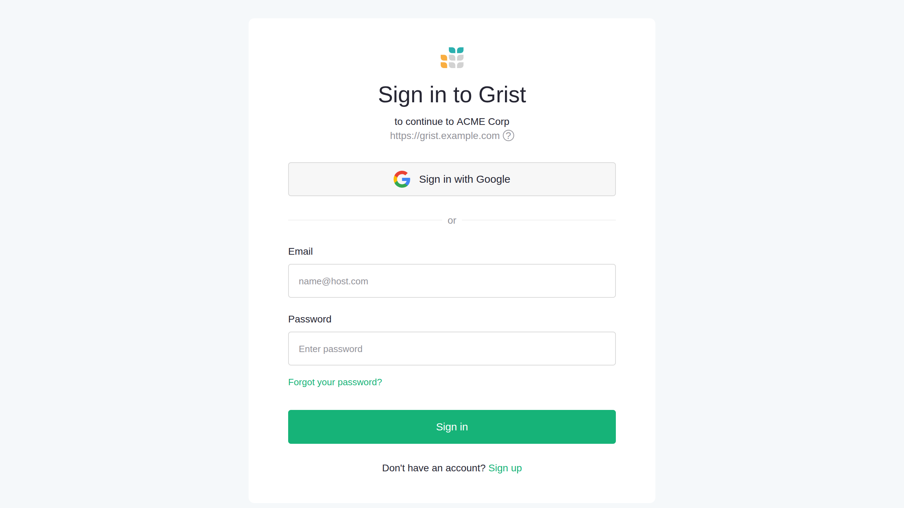
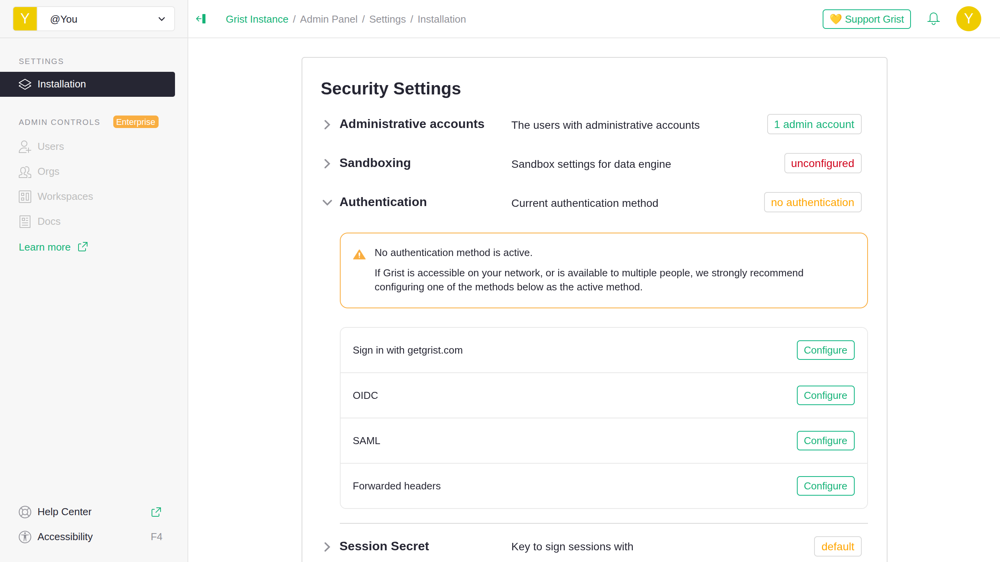
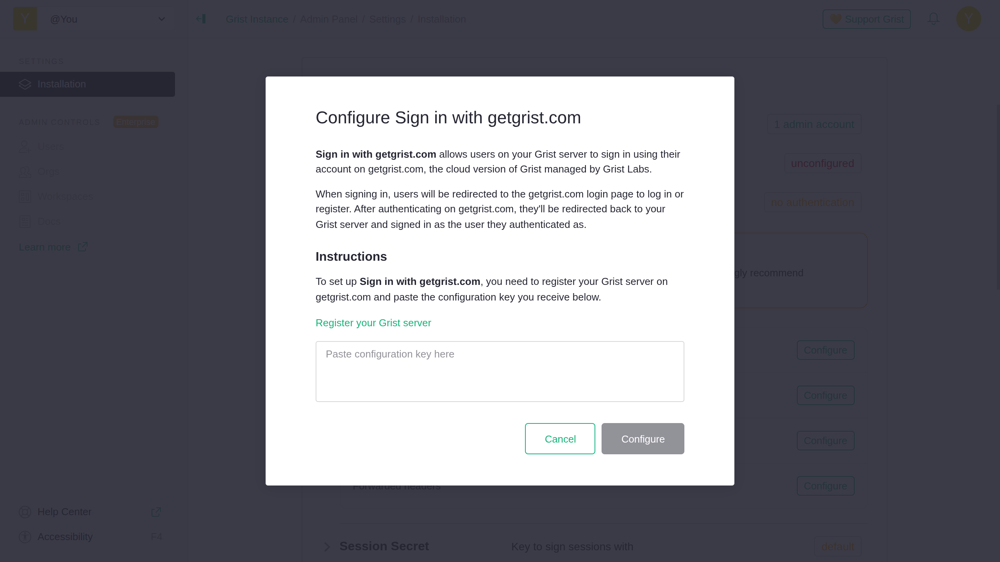
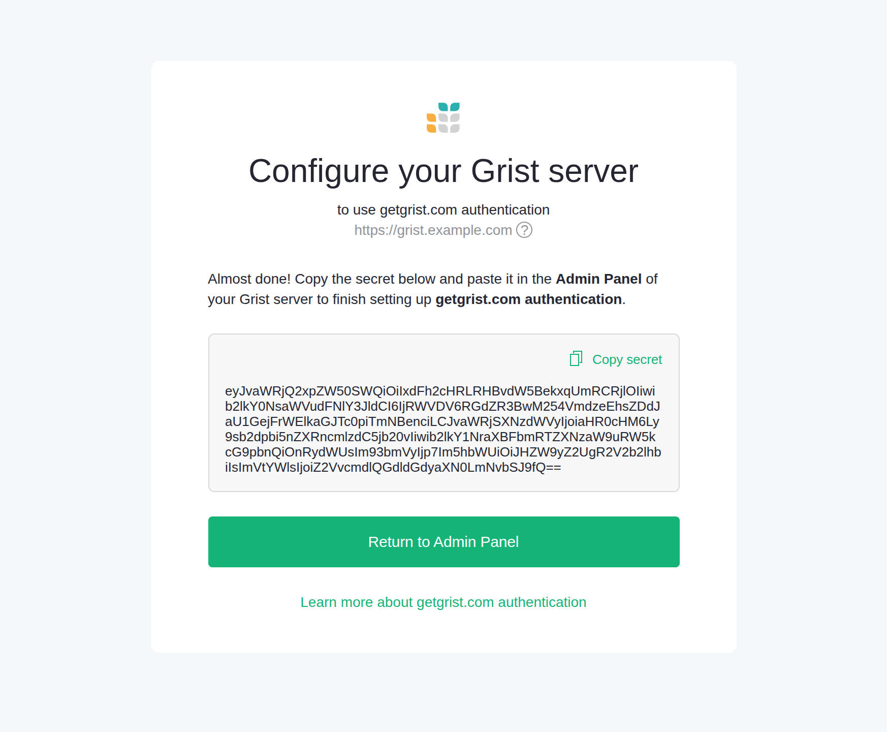
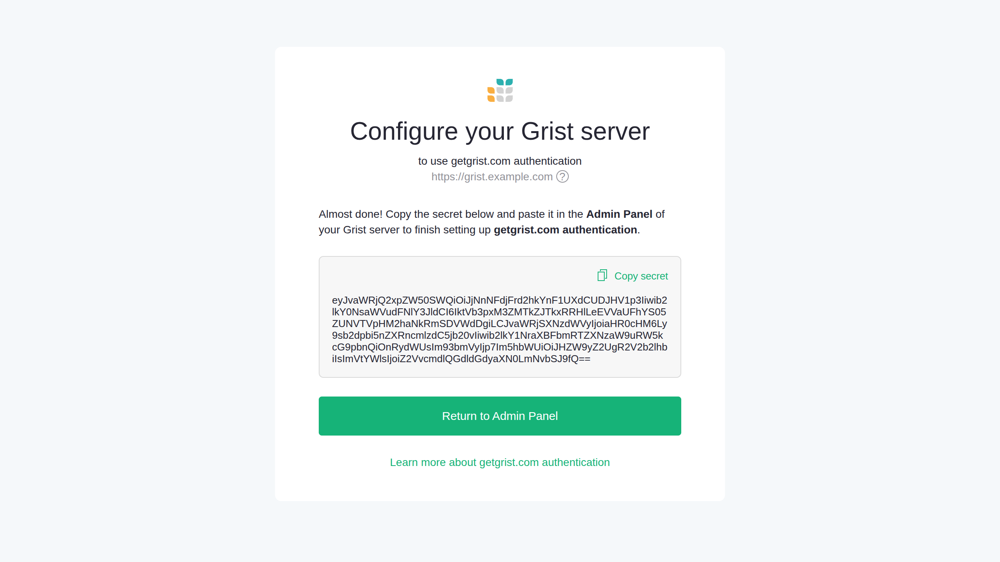
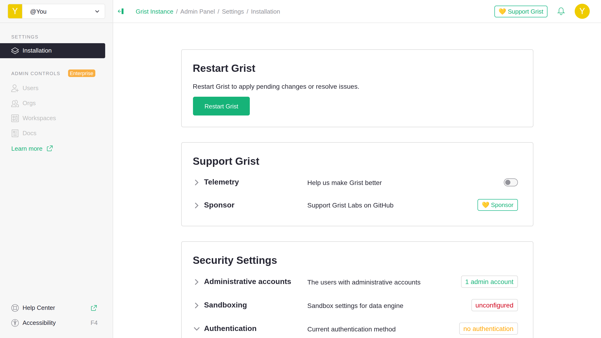

# Sign in with getgrist.com {: .tag-core .tag-ee }

Sign in with getgrist.com allows users on your Grist server to sign in using their account on getgrist.com, which is the cloud version of Grist managed by Grist Labs.

If you don’t already have an existing login solution to integrate with Grist, getgrist.com authentication is the simplest way to get authentication up and running. User registration and authentication are fully handled by Grist Labs, with no other external dependencies or services required.

## How it works

getgrist.com authentication is built on the industry-standard OAuth 2.0 and OpenID Connect (OIDC) protocols. When signing in, users will be redirected to the getgrist.com sign-in page to log in or register.

**
{: .screenshot-half }

After authenticating using their getgrist.com credentials, they'll be redirected back to your Grist server and signed in with the same credentials.

## Setting up getgrist.com authentication

### Prerequisites

To set up getgrist.com authentication, you must:

* have [administrator access](../../self-managed/#what-is-the-administrative-account) on your Grist installation.
* have [an account on getgrist.com](https://login.getgrist.com/signup).

### Step 1: Open authentication settings

To begin setting up getgrist.com authentication, you need to navigate to your Grist server's authentication settings. To get to authentication settings:

1. Sign in to your Grist installation as an administrator.
2. Navigate to the [**Admin Panel**](https://support.getgrist.com/admin-panel/).
3. Under "Security Settings", click "Authentication".

**
{: .screenshot-half }

### Step 2: Register your Grist server

You should see a list of available authentication methods, including "Sign in with getgrist.com". Before you can use getgrist.com authentication, you must first register your Grist server. To register your server:

1. Under "Sign in with getgrist.com", click "Configure".
2. Click "Register your Grist server".

**
{: .screenshot-half }

You'll be redirected to the registration page at https://login.getgrist.com/oauth2/register. If you're not already signed in on getgrist.com, you'll need to log in with your getgrist.com credentials before you can see the page. To continue registering your server:

1. Confirm that the email shown under "Owner" is for the getgrist.com account you want to register the server under:
    * To change the owner, click the email and select a different account on the following page.
2. Under "Server name", fill in the name you want shown on the login page to users signing in to your server.
3. Confirm that the URL shown under "Server URL" is for your Grist server.
4. Click "Register".

**
{: .screenshot-half }

On the next page, you'll be asked to copy a secret to your Grist server. Click "Copy secret" to copy it to your clipboard. You'll need it for the next step.

**
{: .screenshot-half }

### Step 3: Configure getgrist.com authentication

Now that you've registered your Grist server on getgrist.com, you can finish configuring getgrist.com authentication as the new authentication method. To finish configuring getgrist.com authentication:

1. Return to the Admin Panel.
2. Under "Sign in with getgrist.com", click "Configure".
3. Paste the secret you copied from [**step 2**](#step-2-register-your-grist-server).
4. Click "Configure".

If you are configuring authentication for the first time, getgrist.com authentication will automatically be set as the active method on server restart. Otherwise, you need to set getgrist.com authentication as the active method. To set it as the active method:

1. Under "Sign in with getgrist.com", click "Set as active method".
2. Click "Confirm".

!!!warning "**Changing authentication may affect your access**"
    If you are not able to sign in to an account on getgrist.com with an email that matches your current Grist user's email, you may lose access to that account, including any documents owned by it.

    When the authentication method is changing, you will see a warning in the Admin Panel titled "Authentication change may affect your access". You may click "Change admin user" in the warning to [set a new installation admin](../../self-managed/#what-is-the-administrative-account) when the authentication change takes effect on server restart.

    For example, if you've been using Grist as you@example.com but will be signing in as john@example.com on getgrist.com, you should change the admin email to "john@example.com" and check the option to replace "you@example.com" with the new email throughout Grist.

### Step 4: Restart your Grist server

To start using getgrist.com authentication, you must restart your Grist server. To restart your Grist server, click 'Restart Grist' at the top of the Admin Panel.

**
{: .screenshot-half }

Depending on how you installed Grist, restarting from the Admin Panel may be unavailable. In that case, you must restart your Grist server manually. Refer to the documentation for how you installed Grist for instructions on how to manually restart your Grist server.

### Step 5: Test getgrist.com authentication

Your Grist server should now be using getgrist.com authentication. To check that it works:

1. Click the "Sign in" button from any page on your Grist server.
2. Confirm that you are redirected to a page on https://login.getgrist.com asking you to log in or select an account:
    * The page should display the name and URL of your Grist server.
3. Sign in using your getgrist.com credentials.
4. Confirm that you are asked to authorize sharing your name and email with your Grist server.
5. Click "Authorize".
6. Confirm that you are redirected back to your server URL and signed in with your getgrist.com credentials.

Congratulations, you've successfully set up getgrist.com authentication!
