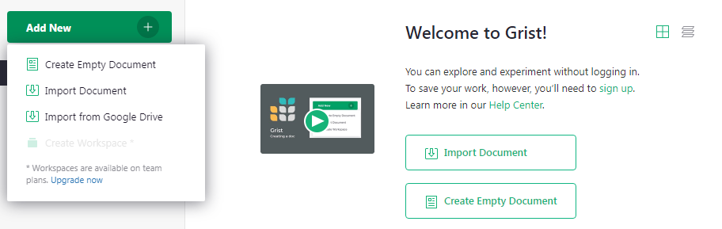

# How to create a custom CRM {: data-toc-label='Intro' }

Grist is as easy to use as a spreadsheet, but gives you new powers when data doesn't fit in a
simple grid.

A good example is keeping track of contacts and our conversations with them. For a
business, this could be customers, sales leads, or job candidates. For an individual, it could be
companies they have applied to in a job search.

In this tutorial, we'll explain the "Lightweight CRM" example, which you can use as a template for
your own contacts, and then show how to build it from scratch. You'll learn how to:

- Add tables
- Link data
- Set column types
- Create custom layouts

## Exploring the example

Open the document [Lightweight CRM](https://templates.getgrist.com/doc/lightweight-crm){: target="\_blank"}, found in
Examples & Templates in your [Grist home page](https://docs.getgrist.com/).

- You'll see the "Contacts" page, listing contacts on the left of the screen.

- Click on any contact to select it. The two sections on the right show the details and the
  history of interactions with the selected contact.

How does this compare to a spreadsheet? These screenshots show the Lightweight CRM example on the
left, and a regular spreadsheet with the same data on the right.

<div class="container-fluid">
  <div class="row">
    <div class="col-md-6">
      <div id="carousel-grist" class="carousel slide" data-interval="false">
        <!-- Indicators -->
        <ol class="carousel-indicators">
          <li data-target="#carousel-grist" data-slide-to="0" class="active"></li>
          <li data-target="#carousel-grist" data-slide-to="1"></li>
          <li data-target="#carousel-grist" data-slide-to="2"></li>
        </ol>

        <!-- Wrapper for slides -->
        <div class="carousel-inner" role="listbox">
          <div class="item active">
            
          </div>
          <div class="item">
            
          </div>
          <div class="item">
            
          </div>
        </div>

        <!-- Controls -->
        <a class="left carousel-control" href="#carousel-grist" role="button" data-slide="prev">
          <span class="glyphicon glyphicon-chevron-left" aria-hidden="true"></span>
          <span class="sr-only">Previous</span>
        </a>
        <a class="right carousel-control" href="#carousel-grist" role="button" data-slide="next">
          <span class="glyphicon glyphicon-chevron-right" aria-hidden="true"></span>
          <span class="sr-only">Next</span>
        </a>
      </div>
    </div>
    <div class="col-md-6">
      <div id="carousel-spreadsheet" class="carousel slide" data-interval="false">
        <!-- Indicators -->
        <ol class="carousel-indicators">
          <li data-target="#carousel-spreadsheet" data-slide-to="0" class="active"></li>
          <li data-target="#carousel-spreadsheet" data-slide-to="1"></li>
          <li data-target="#carousel-spreadsheet" data-slide-to="2"></li>
        </ol>

        <!-- Wrapper for slides -->
        <div class="carousel-inner" role="listbox">
          <div class="item active">
            
          </div>
          <div class="item">
            
          </div>
          <div class="item">
            
          </div>
        </div>

        <!-- Controls -->
        <a class="left carousel-control" href="#carousel-spreadsheet" role="button" data-slide="prev">
          <span class="glyphicon glyphicon-chevron-left" aria-hidden="true"></span>
          <span class="sr-only">Previous</span>
        </a>
        <a class="right carousel-control" href="#carousel-spreadsheet" role="button" data-slide="next">
          <span class="glyphicon glyphicon-chevron-right" aria-hidden="true"></span>
          <span class="sr-only">Next</span>
        </a>
      </div>
    </div>
  </div>
</div>

&nbsp;

The difficulty is in the history of notes for a contact. In a two-dimensional grid, you have few
options for where to include multiple notes. If you include them as multiple columns, it quickly
makes the spreadsheet unwieldy and difficult to navigate.

Grist feels more like an application, but it's still as versatile as a spreadsheet.

The "Lightweight CRM" example can be used immediately as-is (with the sample data),
or as a template (just the structure without the data). Here are a few more points on using it as a CRM:

- To add a new contact, click the blank row at the bottom of the contacts list, then fill in the
  blank "CONTACTS Card" section that shows on the right.

- To add a new conversation, select a contact, then click the blank line at the end of the
  Interactions table. You can enter today's date using the shortcut
  <code class="keys">*⌘* + **;** (semicolon)</code> (Mac) or <code class="keys">*Ctrl* + **;**
  (semicolon)</code> (Windows). Then select the type of interaction using
  auto-complete, and type in your notes.

- You can add To-Do items for a contact: in the Interactions list, select "To-Do" in the "Type"
  column as a special type of interaction. Think of the associated date as the due date for this
  task.

- The Contacts table shows the list of coming up To-Do items, sorted by their due date.

- If you use Gmail, the handy "Gmail search" link in the "CONTACTS Card" section will open a
  browser window with the Gmail search results for this contact's email address.

You can use this example as a template for your own contacts. With the "Lightweight CRM" example open,
click the "Save Copy" button in in the top bar, then mark the "As Template" checkbox.
You'll get an empty document with the same layout, and can start filling it in with your own data.
If you aren't signed in, you will need to sign in to make a copy of the example.

## Creating your own

The rest of this tutorial will show you how to create such a document on your own. It's a great
exercise that will teach you some of the key features of Grist.

To start, we'll import a file with sample contacts from the Grist home page. First, save this file
to your desktop: [lightweight-crm-contacts.csv](./unlocalized-assets/lightweight-crm-contacts.csv). Then click the "Add
New" button on the top left of your Grist home page, click "Import document", and select the file
on your desktop.



You'll see a table of contacts with sample data. Note that in Grist, columns have names.


Rename this table to "Contacts" by clicking its name in the top bar, and typing the new name.


That's all you need for a simple table of contacts. You can add rows here, or add new columns to
associate more data with each contact.

## Adding another table

For our next step, we want to be able to select a contact, and see the list of conversations with
that contact. These conversations should be a new table of data. The cue is that it has a
different number of rows from the table of contacts.

Create the new table using the green "Add New" button on the top left of your screen, and click
"Add Empty Table" in the menu.


This table will represent interactions with our contacts, so let's rename it "Interactions" by
clicking its default name ("Table1") on top of the screen, as before.


It's a good idea to give meaningful names to columns. In this case, for each interaction, we need
to know which Contact it refers to, the date, type, and conversation notes. To rename a column, click
its header to select the column, and click the header again to edit its name. You can hit the Tab key to continue
to renaming the next column.


Finally, hit the "+" button to the right of the last column to create one more column, and name it "Notes".


## Linking data records

Every record in this table will belong to a particular contact. You set it up by turning the
"Contact" column into a reference to the table "Contacts". Using the triangle in the header of the
column "Contact", open the menu and select "Column Options".


In the right panel, use the "Column Type" dropdown to select "Reference", then under "Data from
table", select "Contacts".


Each cell in this column will hold a pointer to a *row* in the "Contacts" table[^foreign-key].
While it refers to an entire row, it's useful to see some particular identifier of that row,
so under "Show column", select "Company". You'll see this in action shortly.

[^foreign-key]: In the database world, this kind of reference or pointer is known as a "foreign key".


## Setting other types

In Grist, every column has a type. Often, the default of Text or Numeric is correct. For our
"Date" column, a better type is Date. Click any cell in the "Date" column, and in the right panel,
click into the "Column Type" dropdown and select "Date". If you'd like, you can
also choose a different date format right below the type.


Now, if you click on a cell in the "Date" column and hit Enter, you have a convenient date picker.

Another useful column type for us is "Choice". Our interactions will be either "Phone", "Email", or
"In-person", and it's useful to list these options. Click into the "Type" column, and in the
right panel, set "Column Type" to "Choice".


You'll see "Choice Values" textbox below. Click it, and enter your choices there, one per line:
"Phone", "Email", "In-person".


Now, if you click on a cell in the "Type" column and hit Enter, you can now choose from among the
choices you set, or start typing and use auto-complete.


## Linking tables visually

The next step is to link the two tables visually. Open the "Contacts" page, click the "Add New"
button on top of the left panel, then "Add Widget to Page".
Select widget "Table" and data "Interactions". In the "Select By"
dropdown at the bottom of the dialog, select "CONTACTS".


This means that choosing a contact will display only the interactions with that
contact. Click "Add to Page" to finish.


Next, let's select a contact in the table on the left (let's use "Douglas LLC" in the fourth row) and add some notes for it. Type
in a date (hint: the shortcut <code class="keys">*⌘* + **;** (semicolon)</code>
on Mac or <code class="keys">*Ctrl* + **;** (semicolon)</code> on Windows
inserts today's date), select a type, and enter a note. As soon as
that row is created, the "Contact" column is automatically filled with "Douglas LLC", thanks to
the sections being linked.


The note we added is shown only when "Douglas LLC" is selected. We can add more notes for "Douglas
LLC", or add notes for any of the other contacts.

We can now hide the "Contact" column in the "Interactions" table: using the menu in the column's
header, select "Hide Column". Because the tables are linked, we already see who the notes are for.


For longer notes to be convenient, resize the "Notes" column by dragging the right edge of its
header. To wrap long notes, open the Column Options, and click the line-wrapping icon.


## Customizing layout

Once you have multiple tables on one screen, the layout of the screen may become an issue. Having
many columns in the Contacts table may no longer be convenient. It's better to lay it out like
a custom application: select a contact from a list on the left and see that contact's details and
interactions.

This can be done by using "Add Widget to Page" again. This time, we'll select the widget "Card" for the table "Contacts", and
for "Select By" will again use "CONTACTS".


You can move the resulting sections around to create a convenient layout. Move your mouse to the
top left of each section until you see a "drag handle" icon. Use that icon to drag each section
into the desired spot relative to other sections.


You can also resize sections by moving the mouse between them to find a dotted line. Drag this
line to resize.

Note how the same personal data is now shown in two places on the screen. These are not copies of
data, but different presentations of the same data. Changing the data in one place will change it
in the other.

## Customizing fields

At this point, we may do some cleanup: hide unneeded columns in the main "Contacts" table and
rearrange fields in the Card widget.

A quick way to hide columns is using the right panel. Using the three-dot menu on the top right
of the "Contacts" table, select "Widget options". In the panel that opens, find a list of "Visible
columns". Move the mouse over each column to reveal the "eye" icon. Click it to hide all columns
except "Company".


To customize the Card widget, click it. The right panel will show the relevant options. You can
select a different Theme, e.g. "Compact".


To rearrange fields, click "Edit Layout" in the right panel. You can now drag-and-drop fields in
the card, resize them, or remove them. Click "Save" once you are done.


In a few short steps, we have gone from a clunky, unwieldy spreadsheet to a concise, elegant
record of your interactions in a simple, effective custom application.

## To-Do Tasks for Contacts

The "Lightweight CRM" example has another trick up its sleeve. The "Type" column in the
interactions table has an extra choice, "To-Do". After you talk to a contact, you can add an extra
note about what you need to do for the next conversation, and the date when it's due.

The "Contacts" table makes these To-Do items visible, and sortable by due date. This way you can
see at a glance what's coming up next.

If you are interested in the details of setting it up, expand the section below.
For your first introduction to Grist, you are welcome to skip it.

## <a style="color: inherit; text-decoration: none" data-toggle="collapse" href="#todo-tasks" role="button" aria-expanded="false" aria-controls="todo-tasks">&gt; Setting up To-Do tasks</a> {: data-toc-label='' }

<div class="collapse" id="todo-tasks" markdown="1">

To set up To-Do items as in the example, select Column Options for the "Type" column in the
Interactions table, and add another choice ("To-Do") to the list of choices:


Let's pick our contact "Douglas LLC" and add a To-Do item:


In the "Contacts" table, add two new columns:


Rename them to "Due" and "To-Do Items".


Both columns are calculated using formulas. Grist has great support for formulas, allowing
full Python syntax and many Excel functions. In Grist, a formula always applies to the entire
column of data. To enter a formula, click on a cell in the "Due" column, and hit "=" key:


In this formula, we want to look up all Interactions for the current Contact whose Type is
"To-Do", then select the one with the earliest Date. Using Python syntax, the formula is:

```python
items = Interactions.lookupRecords(Contact=$id, Type="To-Do")
return min(items.Date) if items else None
```

Paste it in, or type in. When typing in multi-line formulas, use `Shift+Enter` to add new lines, and
`Enter` to save.

It's also a good time to change the column type to "Date". Open Column Options, and select
"Date" for the type. You can choose the Date Format directly below the type.


For the "To-Do Items", enter a formula similarly. In case of multiple To-Do items, this formula
will concatenate them, separated by line breaks. Click into the "To-Do Items" column, hit "=" to
start typing the formula, and enter

```python
items = Interactions.lookupRecords(Contact=$id, Type="To-Do")
return "\n".join(items.Notes)
```

Now the To-Do item we entered earlier is visible in the main Contacts table.

Note that the values in these columns are read-only, since they are calculated. To change the due
date, find the To-Do item in the Interactions table where you created it.


### Sorting tables {: data-toc-label='' }

We'll want contacts with To-Do items to show up first, in order of the Due date. Click the
triangle in the header of the "Due" column, and select "Sort A-Z".


By default, sorting settings are not saved. The highlighted green button in the top right of the
"Contacts" table reminds us of that. To keep this sort order when you reopen the document, save it by
clicking that green button and selecting "Save". You can also save by clicking the green check mark, to the right of the filter icon.


</div>

## Other features

Grist has more great features, some of which are used in the "Lightweight CRM" example
document. To read more about those, follow the links to their documentation.

- Any text column may be shown as a [hyperlink](https://support.getgrist.com/col-types/#hyperlinks).
Lightweight CRM example uses it twice: for the "website" field, and for a formula-constructed hyperlink
to a [Gmail search](https://community.getgrist.com/t/pull-up-gmail-history-for-a-particular-contact/517) page
for the given contact's email. The latter is handy if you use Gmail.

- Grist supports [attachments](https://support.getgrist.com/col-types/#attachment-columns_). In the
example, there is an "Attachments" field for each contact that may be used to store an image of a
business card, for example.

In an actual business, you'll need more. Specialized CRM products have tons of features. Their
problem is complexity: trying to satisfy the needs of many different clients makes for a
complicated product to use. The beauty of Grist is that you can start simple and add only the
level of complexity you need, and nothing more.

Other tutorials show how to model more complex data, analyze and chart data, and more.
