<iframe width="560" height="315" src="https://www.youtube.com/embed/F5m_je0QKvs?rel=0" frameborder="0" allow="accelerometer; autoplay; encrypted-media; gyroscope; picture-in-picture" allowfullscreen></iframe>

## Linking Page Widgets

One big reason for placing more than one widget on a page is that widgets can be linked. When
linked, selecting a record in one widget will cause another widget to update and show only the
data related to the selected record. 

For example, let’s say you have a table of `Departments` in a company, and a table of
`Employees`, with each employee tied to some department. You can have one Table widget listing
departments and serving as a selector for a second Table widget listing employees:

  <!-- Indicators -->
  <ol class="carousel-indicators">
    <li data-target="#carousel-ex1" data-slide-to="0" class="active"></li>
    <li data-target="#carousel-ex1" data-slide-to="1"></li>
    <li data-target="#carousel-ex1" data-slide-to="2"></li>
  </ol>

  <!-- Wrapper for slides -->
  

    

      
    

    

      
    

    

      
    

  

  <!-- Controls -->
  <a class="left carousel-control" href="#carousel-ex1" role="button" data-slide="prev">
    
    Previous
  </a>
  <a class="right carousel-control" href="#carousel-ex1" role="button" data-slide="next">
    
    Next
  </a>

&nbsp;

To create this, first create a page with a Table widget for `Departments` data, as described in
[Page widgets](page-widgets.md#widget-picker). Then in the "Add New" menu, select the "Add Widget to
Page" option to add another Table widget for `Employees` data. In the widget picker, use the "Select
By" dropdown and choose the "DEPARTMENTS" widget added in the first step.

*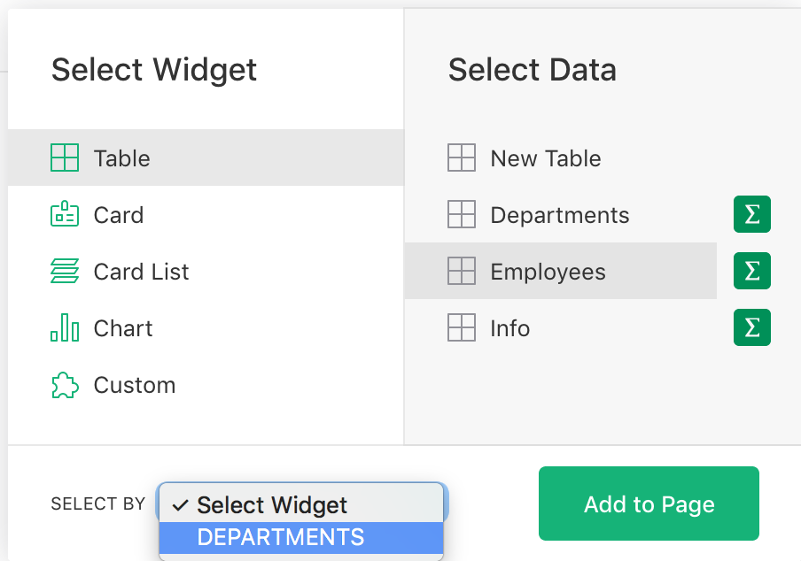*
{: .screenshot-half }

That’s all it takes: now selecting a department in the first table will cause the second table to
show only the employees in that department. Note that this relies on the `Employees` table having a
column of type `Reference` with the target table of `Departments`. See [Reference
columns](col-refs.md).

## Types of linking {: data-toc-label='' }

Linking widgets only works when there is a relationship between records in the underlying
data. There are several kinds of relationships supported.

## Same-record linking

Most directly you can link two widgets which show data from the same underlying table, usually
linking a Table to a Card. This allows you to select a record in the Table widget and see more
details of that record in the linked Card widget.

For example, you can add a Card of `Employees` data and link it to an existing Table widget
"EMPLOYEES":

*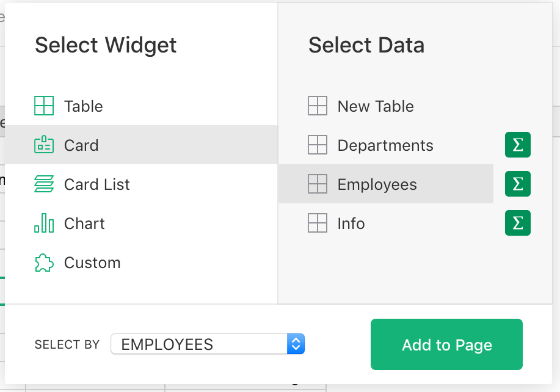*
{: .screenshot-half }

When you select a record in the table, the new "EMPLOYEES Card" widget shows a card for the
selected record.

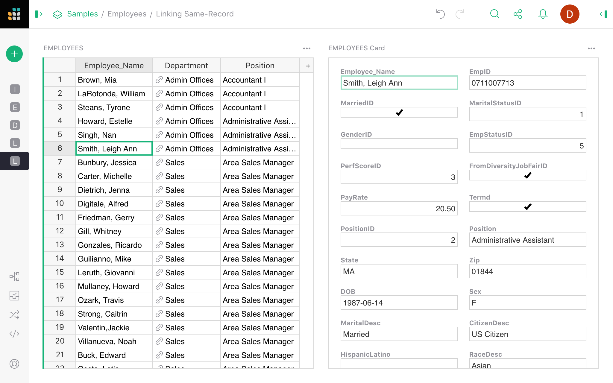

For another example of such linking, see the "Lightweight CRM" document in "Examples &amp; Templates"
and the [Customizing Layout](lightweight-crm.md#customizing-layout) section in the associated
tutorial.

## Filter linking

As in the Employee-Department example, when one table has a reference to another (i.e. a column of
type "Reference"), the second table can serve as a selector for the first. Essentially, selecting
a record can automatically filter another widget to show only those records that refer to the
selected record.

In the example shown earlier, the `Employees` table has a "Reference" column pointing to the
`Departments` table, so a list of departments can serve as a selector for employees. When a
department is selected, only the employees in that department will be shown.

The "Lightweight CRM" document in "Examples &amp; Templates" provides another example, where
selecting a contact shows only the conversations with that contact. It's also described in the
[tutorial](lightweight-crm.md#linking-tables-visually).

When the target of linking is a Chart widget, you get dynamic charts that reflect data associated
with the selected record. For example, you could link a pie chart to a department
to show the sum of salaries for each job position in the selected department.

  <!-- Indicators -->
  <ol class="carousel-indicators">
    <li data-target="#carousel-ex2" data-slide-to="0" class="active"></li>
    <li data-target="#carousel-ex2" data-slide-to="1"></li>
    <li data-target="#carousel-ex2" data-slide-to="2"></li>
  </ol>

  <!-- Wrapper for slides -->
  

    

      
    

    

      
    

    

      
    

  

  <!-- Controls -->
  <a class="left carousel-control" href="#carousel-ex2" role="button" data-slide="prev">
    
    Previous
  </a>
  <a class="right carousel-control" href="#carousel-ex2" role="button" data-slide="next">
    
    Next
  </a>

&nbsp;

## Indirect linking

Whenever a table `A` has a reference to `B`, `A` can be used in place of `B` as the source of
linking. Instead of considering the currently selected record in `A`, linking will consider the
referenced record in `B` as the selection.

For instance, a Table widget showing `Employees` can serve as a selector for a Card widget showing
data from `Departments`, using the fact that an employee record contains a "Department" reference.
In the widget picker, if you select data from `Departments`, you'll see a "Select By" option
"EMPLOYEES • Department":

*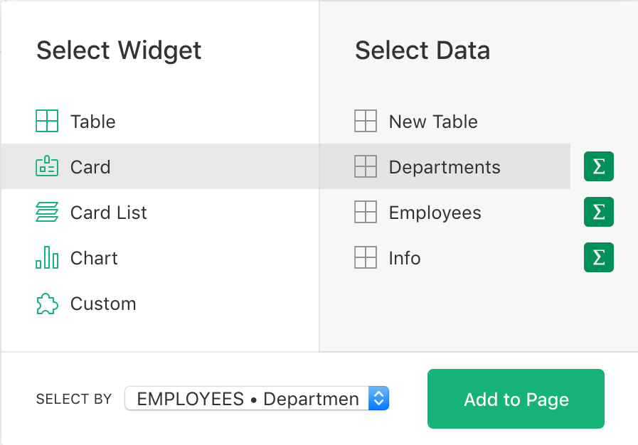*
{: .screenshot-half }

When you select an employee, you'll see the details of that employee's department.

*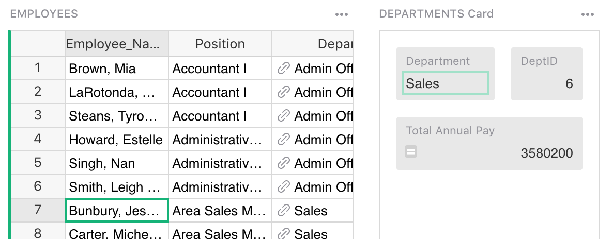*
{: .screenshot-half }

## Multiple reference columns

When a table that's the target of linking has multiple reference columns, you may need to choose
which one to use for linking.

For instance, a `Flight` record might have fields 'DepartureAirport' and 'ArrivalAirport', each of
which is a Reference to the table `Airports`. When you select an airport in a table, you can have
a choice whether to show all flights departing from this airport or all flights arriving to it.
The "Select By" widget will show both options to choose from:

*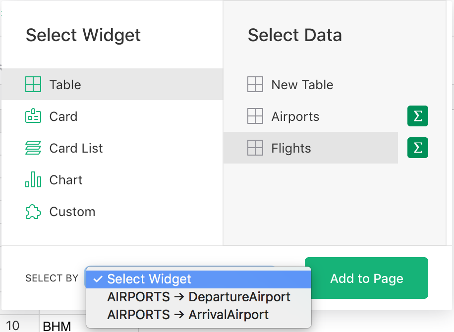*
{: .screenshot-half }

## Linking summary tables

When widgets display summarized data, as described in [Summary tables](summary-tables.md), they can also be linked to the underlying data, data that references the underlying data, and to other summary tables.

For example, you can summarize the table `Employees` by job position, and include the count of
employees for each position, the average salary, or other summary data. You can also link the
`Employees` table to it, so that selecting a position shows all employees in that position.

*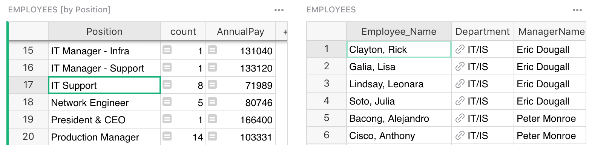*
{: .screenshot-half }

Furthermore, you can link another summary table. For instance, you can summarize employees by position *and*
gender, and link that to the summary by position. When selecting a job position, you can then see a summary by gender for that position.
This is also convenient with charts.

*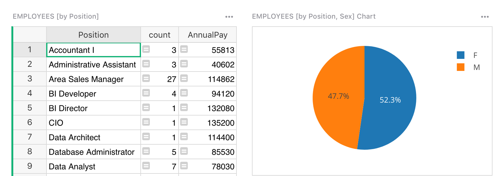*
{: .screenshot-half }

In this example, you see a pie chart with the average salary for men vs women for the selected job
position. As you click different positions, the pie chart updates to reflect the selected one.

More examples of such linking can be found in the [Analyze and
visualize](investment-research.md#dynamic-charts) tutorial.

Lastly, tables that reference a summary table’s underlying data may now be linked to the summary table itself. In the image below, the Champion Dog's table has a [reference column](col-types.md#reference-columns) to the Breeder table. The Breeder table is being summarized in the top right widget by the "Country" column. Because Champion Dog references Breeder, you may add a widget of Champion Dogs that selects by a summary table of Breeder data.

*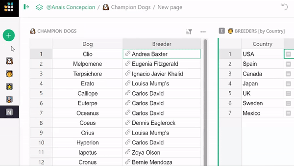*

## Changing link settings

After a widget is added, you can view and change its link settings from the right panel. One way
to get to it is to click on the three-dots icon on the top right of the widget, and click on the "Data
selection" menu option:

*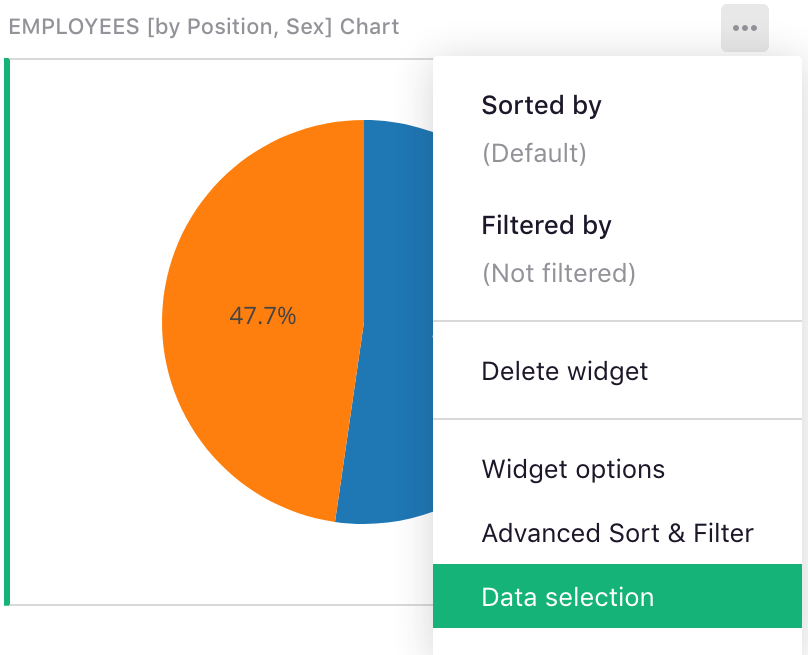*
{: .screenshot-half }

This opens the side panel, which shows what data is shown, and which widget, if
any, serves as its selector.

*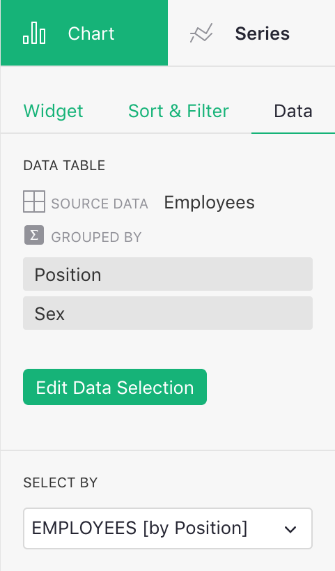*
{: .screenshot-half }

You can change the "Select By" setting here, or click the green "Edit Data Selection" button, and change
it in the widget picker dialog.
