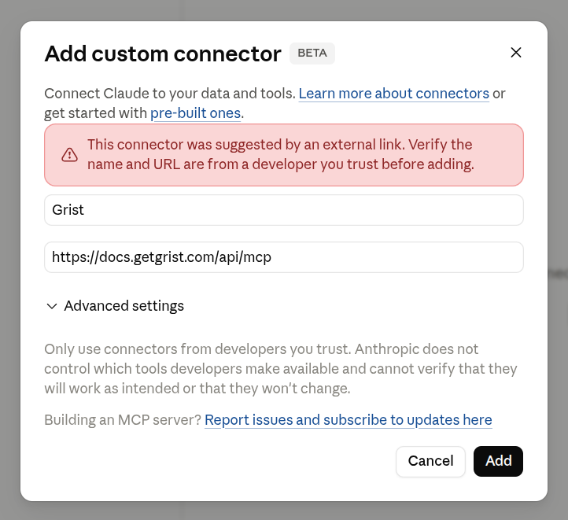
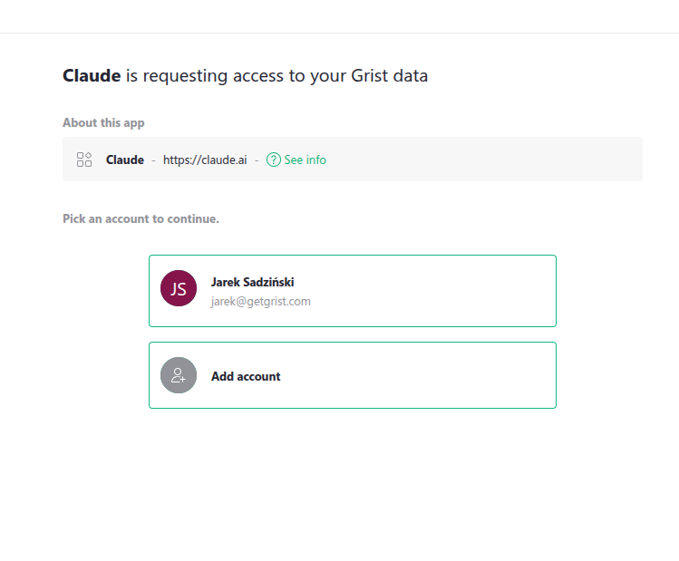
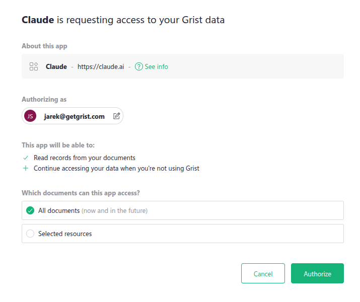
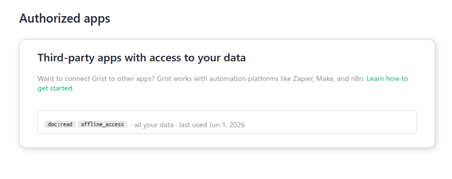
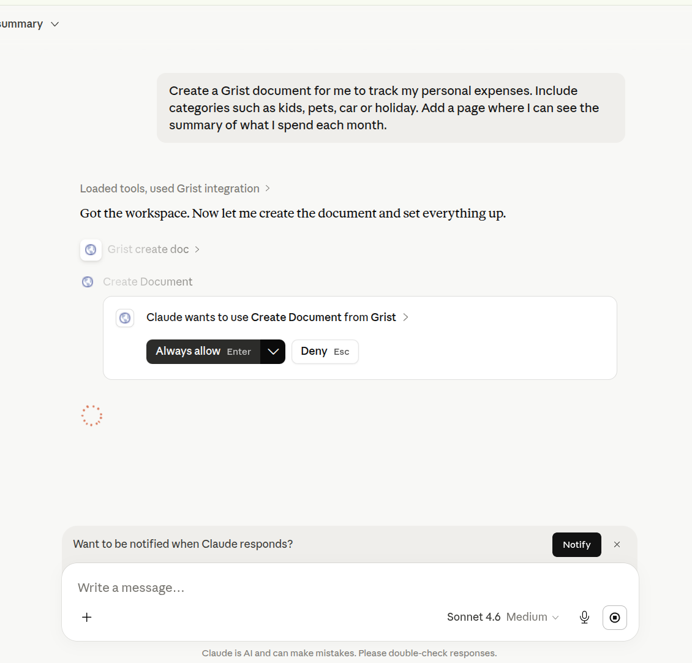
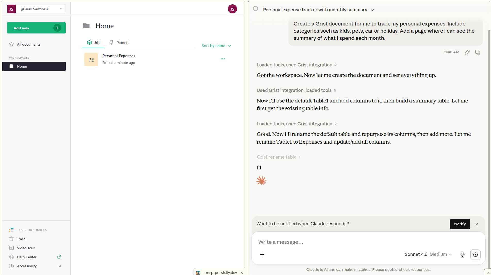
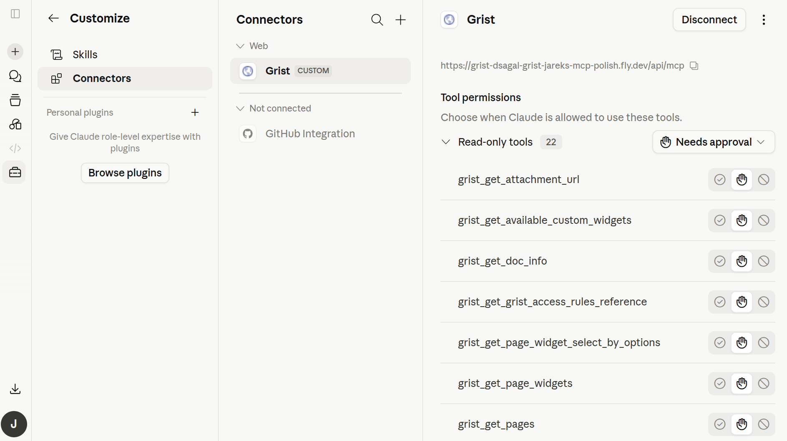

Model Context Protocol (MCP) is a standard that lets AI clients access external data. Grist's MCP
server lets Claude and other MCP clients work with your team sites and documents: list and search
tables, read and query rows, add or update rows, and create new documents and tables.

If you want a formula-and-data helper inside Grist itself, see [AI Assistant](assistant.md).

## Setting up the MCP server

### Prerequisites

To use Grist's MCP server you need:

* A Grist account on any plan, including a free personal site.
* A Claude account on a plan that supports custom connectors.
* A modern browser to complete the sign-in.

The connector works in Claude.ai (web), Claude Desktop, Claude Code, and Cowork.

!!! note "Note" 
    The MCP server is available on Grist SaaS (getgrist.com) today. Self-hosted Grist support is on the roadmap.

There are two ways to connect Grist to Claude: Install from the Claude directory (recommended once
the connector is published – see note below), or add it as a custom connector by URL.

### Install from the Claude directory

!!! warning "Listing pending review" 
    The directory listing is pending Anthropic review. Until it goes live, use the custom connector method below.

To add connect the Grist MCP server to your Claude account:

1. In Claude.ai or Claude Desktop, open 'Settings' → 'Connectors'.
2. Browse the directory or search for 'Grist'.
3. On the Grist listing, click 'Connect'.
4. Sign in with your usual Grist credentials (Google or email).
5. Review the permissions and click 'Allow' on the consent screen.

### Add as a custom connector

Grist exposes a single, universal MCP URL. The same URL works for every user and every team site,
because the OAuth bearer token identifies you.

**MCP URL:** `https://docs.getgrist.com/api/mcp`

!!! note "Note" 
    Use this single URL for every team site and your personal site. You do not need a different URL per team site.

Use [Connect Grist to
Claude](https://claude.ai/customize/connectors?modal=add-custom-connector&connectorName=Grist&connectorUrl=https%3A%2F%2Fdocs.getgrist.com%2Fapi%2Fmcp){:target="_blank"}
to open Claude's 'Add custom connector' dialog with the name and URL pre-filled. Click 'Add',
then continue with the sign-in and consent steps below.

Or add it by hand:

1. In Claude.ai or Claude Desktop, open 'Settings' → 'Connectors'.
2. Click 'Add custom connector' and paste the URL above.
3. Sign in with your usual Grist credentials (Google or email).
4. Review the permissions and click 'Allow' on the consent screen.

** 
{: .screenshot-half }

### Permissions Grist requests

After you click 'Add', Claude redirects you to Grist to sign in.

**
{: .screenshot-half }

Grist's consent screen then asks Claude for a set of OAuth scopes. Each scope has a label, and the
underlying scope name is shown in parentheses.

* **Identify you** (`openid`, `email`, `profile`): confirm who you are, and pass your name and email
  to Claude so it can show your account.
* **Stay signed in** (`offline_access`): issue a refresh token so the connector continues to work
  without prompting you to sign in again.
* **Read documents** (`doc:read`): list and query tables, records, columns, and attachments.
* **Modify records** (`doc:write`): add, update, and remove rows.
* **Modify schema** (`doc.schema:write`): add, rename, or remove tables and columns.
* **Download documents** (`doc:download`): export full documents as CSV or Excel.
* **Manage webhooks** (`doc:webhooks`): create, read, update, and delete document webhooks.

You can decline any of the document scopes (`doc:*`). If a tool needs a permission you did not
grant, the call fails. To grant a missing scope, reconnect Grist from Claude's connector settings.

### Choosing which resources Claude can access

** 
{: .screenshot-half }

The same consent screen also asks which Grist resources Claude can reach. You have two options:

* **All documents (now and in the future).** Claude can see and act on every team site, workspace,
  and document your account has access to, including ones you create later. This is the default.
* **Selected resources.** Pick specific team sites, workspaces, or documents. You can mix levels,
  for example a whole workspace plus a single document from elsewhere. Up to 50 resources per
  connection.

Selecting a parent grants access to everything inside it. If you select a workspace, you do not need
to also select the documents inside it.

You can change this selection later from the 'Authorized apps' page in your Grist account
settings, without disconnecting Claude. Changes can take up to an hour to propagate to
already-connected apps. To apply them immediately, disconnect and reconnect Grist from Claude's
connector settings.

** 
{: .screenshot-half }

## Available tools

Grist's MCP server exposes a set of tools that wrap the [Grist REST API](rest-api.md), grouped into
five categories.

!!! note "Note" 
    Every tool name is prefixed with `grist_` when called (so `list_docs` is `grist_list_docs`). The prefix is omitted below for readability.

### Discovery

Find what you have access to.

* `list_orgs` lists your team sites.
* `list_workspaces` lists workspaces inside a team site.
* `list_docs` lists documents inside a workspace.
* `get_doc_info` returns metadata about a single document.
* `list_snapshots` lists the snapshots of a document, with their `snapshotId` and `lastModified` timestamp. Requires `doc:read` scope and viewer-level access.
* `help` returns a short overview Claude can use to plan its work.

Try asking:

* "What Grist documents do I have?"
* "Show me everything in my Marketing team site."

### Reading data

Query and inspect document content.

* `query_document` runs a natural-language or SQL-style query across the tables in a document.
* `list_records` returns rows from a single table.
* `get_tables` and `get_table_columns` describe a document's structure.

Try asking:

* "How many open deals are in my CRM?"
* "List contacts I haven't talked to in 90 days."
* "What's total revenue by client this quarter in my Invoices document?"

### Writing data

Modify records.

* `add_records` appends new rows.
* `update_records` modifies existing rows by row id.
* `remove_records` deletes rows.

Try asking:

* "Add a new client called Acme Corp to my CRM with the email ops@acme.com."
* "Mark task #42 as done in my Project Tracker."
* "Remove every row in Tickets where Status is 'Archived'."

### Managing documents and schema

Create and reshape documents.

* `create_doc` makes a new document in a workspace.
* `create_table` and `add_table_column` extend the schema.
* `update_table_column` changes column type, formula, or label.

Other tools: `add_table`, `rename_table`, `remove_table`, `remove_table_column`.

Try asking:

* "Start a new document for tracking my expenses."
* "Add a Priority column to Tasks with options Low, Medium, High."
* "Rename the Notes column to Comments in my CRM."

### Pages and widgets

Build and edit the pages and widgets that make up a document's layout.

* `get_pages` lists the pages in a document.
* `add_page_widget` adds a widget to a page (Table, Card, Card List, Chart, Calendar, Custom, and so
  on).
* `update_page_widget` changes a widget's title, table, view configuration, or layout.

Other tools: `update_page`, `remove_page`, `get_page_widgets`, `remove_page_widget`,
`get_page_widget_select_by_options`, `set_page_widget_select_by`, `get_available_custom_widgets`.

Try asking:

* "Add a chart page to my Sales document showing revenue by month."
* "Put a Card View of Contacts on the Overview page."
* "Remove the Internal Notes page from my Project Tracker."

## Examples

When Claude calls a Grist tool, it asks for your approval the first time. You can choose 'Always
allow' to skip the prompt for that tool on future calls.

** 
{: .screenshot-half }

You can use the Grist MCP server to:

* **Query structured data in plain language:** "In my CRM document, who has an open task due in the
  next 7 days?"
* **Bulk-update records:** "In my Deliveries document, update all dates to follow ISO 8601
  formatting."
* **Start a document from scratch:** "Create a new document called 'Reviewer Sandbox' with a Sample
  table that has the properly-typed columns: Name, Value, Created."

After Claude finishes, the new or updated document appears in Grist alongside the conversation.

** 
{: .screenshot-half}

## Data handling

When you call a Grist tool from Claude, the data that the tool returns is sent to Anthropic so the
model can use it in its response. Only the data the tool returns leaves Grist – nothing is read
pre-emptively.

* Transport is HTTPS/TLS end-to-end.
* The MCP server holds no data of its own. Every request is authenticated against your existing
  Grist account and access rules.
* The OAuth token is scoped to the permissions you granted at connect time. You can revoke it any
  time from Grist's account settings.

!!! warning "Warning" 
    Treat the connector like sharing a document with a colleague. Anything you ask Claude to read or write will be visible to Anthropic.

See the [Grist Privacy Policy](https://www.getgrist.com/privacy/){:target="_blank"} for details.

## FAQ

### What does the Grist MCP server cost?

Pricing for the Grist MCP server has not been announced. This page will be updated once upon announcement.

On the Claude side, custom connectors require a paid Claude plan.

### How does the MCP server handle my data?

See the [Data handling](#data-handling) section above.

### Can I have multiple Grist connectors in Claude?

Yes, through the [custom connector path](#add-as-a-custom-connector). The Claude directory listing supports only a single
connection, but Claude's 'Add custom connector' flow does not prevent you from adding the same URL
more than once. Add Grist again with a different connector name to keep a separate connection (for
example, signed in as a different Grist account).

### How do I connect with a different Grist account?

Two options:

1. Disconnect Grist from Claude's connector settings, then reconnect. When the consent screen
  appears, sign in with the other account.
2. Add Grist as a custom connector a second time under a different name, and sign in with the other
  account during the consent step. Both connections then live side-by-side in Claude.

### Can I connect Claude to my self-hosted Grist?

Not yet. The MCP server is available on Grist SaaS (getgrist.com) today. Self-hosted Grist support
is on the roadmap.

### Why am I seeing a "missing scope" error?

The connector tried to use a permission you did not grant when you first signed in. For example, if
you only granted read access, write tools like `add_records` will refuse to run.

To fix it, disconnect Grist in Claude's connector settings and reconnect. When you reconnect,
approve the permissions you want to allow. From the connector settings page you can also see every
Grist tool Claude has access to and adjust which ones require approval.

**
{: .screenshot-half }

### Why am I seeing a "doc not found" error?

Usually one of:

* The document was deleted, moved, or renamed.
* You do not have access to the document with the account you authorized Claude under.
* You are asking Claude to look in a different team site than the one the document lives in.

First, check which Grist account you used when you connected Claude. If you have several Grist
accounts (for example, a personal one and a work one), the document might live under a different
account. Open [docs.getgrist.com](https://docs.getgrist.com), confirm the document exists under the
account you used to connect, and check that you have at least view access.

If you are not sure which account is connected, the quickest fix is to disconnect Grist in Claude's
connector settings and reconnect, signing in with the right account this time.

If the document is in a different team site, ask Claude to list your team sites first with
`list_orgs`.
