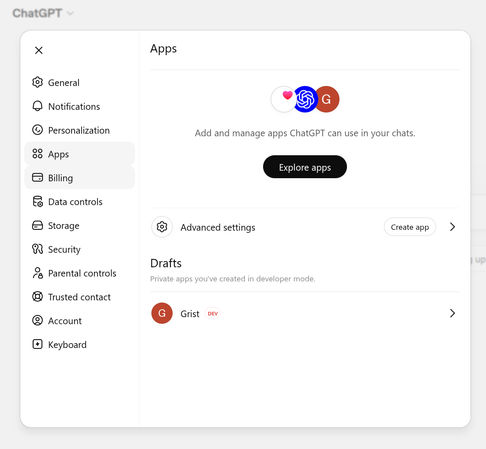
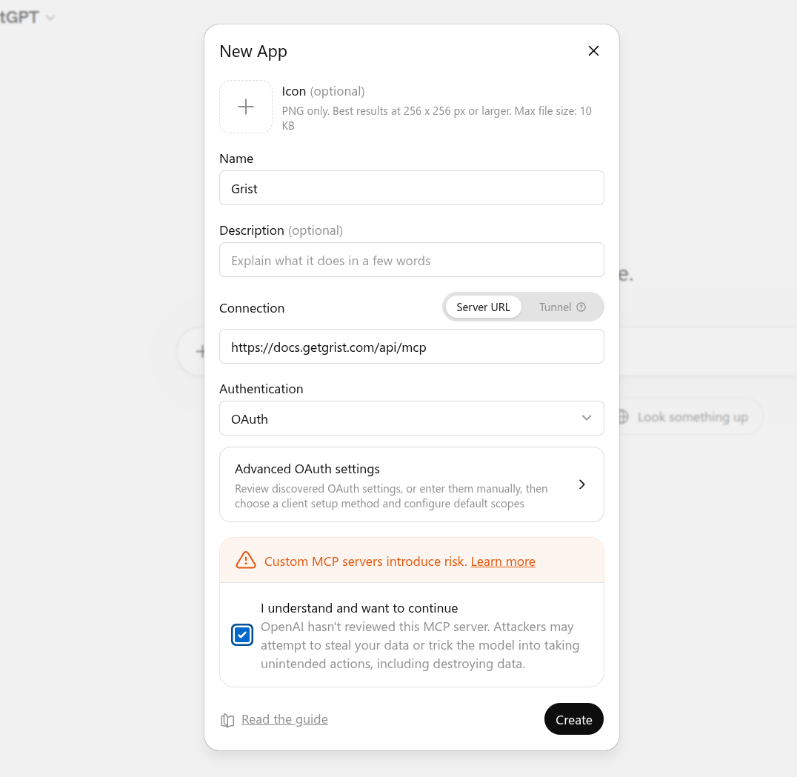

Model Context Protocol (MCP) is an open standard that lets AI assistants access external data. Any
MCP-aware tool (such as Claude or ChatGPT) can use Grist's MCP server to work with your team sites
and documents: list and search tables, read and query rows, add or update rows, and create new
documents and tables.

For Grist's built-in AI assistant, see [AI Assistant](assistant.md).

## Setting up the MCP server

The Grist MCP server is available on [Hosted Grist](#hosted-grist) and on the full edition of [self-hosted Grist](#self-hosted-grist).

### Hosted Grist

On Hosted Grist (getgrist.com) the MCP server is already turned on, with nothing to set up. It is
available to every Grist account on all plans, though this may change in the future.

### Self-hosted Grist

On the full edition of self-hosted Grist, the MCP server is off by default. Turn it on by setting
this environment variable on your instance:

```
GRIST_MCP_ENABLED=true
```

!!! note "Want to try the full edition?"
    You can try the full edition of Grist free for 30 days.
    [Learn how to turn it on](self-managed.md#how-do-i-enable-the-full-edition-of-grist).

    Individuals and small companies may qualify for a free activation key for the full
    edition. See the
    [activation key FAQ](https://www.getgrist.com/free-grist-activation-key-faq/){:target="_blank"}.

This is enough for clients that authenticate with a Grist [API key](rest-api.md#authentication): the
user supplies their key in an `Authorization` header and connects, with nothing more to set up on
your side. AI assistants
such as Claude.ai, Claude Desktop, and ChatGPT sign in interactively instead, and need a couple
more settings.

#### Interactive sign-in (Claude, ChatGPT, and similar)

Assistants like Claude and ChatGPT sign you in through Grist rather than taking an API key. They
authenticate through Grist's built-in OIDC server, which you turn on with:

```
GRIST_ENABLE_OIDC_SERVER=true
```

These assistants register themselves automatically using CIMD (Client ID Metadata Documents).
Allow them by listing the hosts you trust them to come from:

```
GRIST_OIDC_CIMD_ALLOWED_HOSTS=claude.ai,chatgpt.com
```

Once you set both variables, users can connect any assistant on your list.

!!! note "Clients that do not support CIMD"
    Some assistants cannot register themselves through CIMD. For these, set up an
    [OAuth app](oauth-apps.md) in Grist and use it with a client of your choice.

## Connecting your MCP client

Point your client at Grist's MCP server URL:

* **Hosted Grist:** `https://docs.getgrist.com/api/mcp`, one URL for every team site and your
  personal site.
* **Self-hosted Grist:** `https://<your-grist-host>/api/mcp`, [your own host](self-managed.md#how-do-i-run-grist-on-a-server);
  covers every team site and personal site on that instance.

Clients can authenticate in several ways: API keys, service accounts, registered
[OAuth apps](oauth-apps.md), and CIMD (Client ID Metadata Documents), the preferred
standard that lets a client register itself automatically from a metadata URL instead of being set
up in advance.

### Connection examples

These walk through Claude and ChatGPT. Other clients follow the same custom-connector flow.

**Claude.ai or Claude Desktop**

!!! warning "Directory listing pending review"
    The Grist listing in the Claude directory is still under Anthropic review and is not active
    yet. Until it goes live, use the special 'Connect Grist to Claude' link.

The 'Connect Grist to Claude' link opens Claude's 'Add custom connector' dialog with the Grist
name and MCP URL pre-filled, so you only need to confirm the dialog and sign in:

<span class="screenshot-full">[Connect Grist to Claude](https://claude.ai/customize/connectors?modal=add-custom-connector&connectorName=Grist&connectorUrl=https%3A%2F%2Fdocs.getgrist.com%2Fapi%2Fmcp){:target="_blank"}</span>
{: .screenshot-half }

After clicking the link:

1. In the 'Add custom connector' dialog, click 'Add'.
2. Sign in with your usual Grist credentials (Google or email).
3. Review the permissions and click 'Allow' on the consent screen.

<span class="screenshot-full">**</span>
{: .screenshot-half }

**ChatGPT**

!!! note "Developer mode required"
    Adding a custom MCP server in ChatGPT needs developer mode. Turn it on under
    **Settings > Apps > Advanced settings**.

1. In ChatGPT, open **Settings > Apps**. Under **Advanced settings**, click **Create app**.

    <span class="screenshot-full">**</span>
    {: .screenshot-half }

2. Fill in the **New App** form:

    * **Name:** `Grist`. The icon and description are optional.
    * **Connection:** keep **Server URL** selected and enter `https://docs.getgrist.com/api/mcp`,
      or `https://<your-grist-host>/api/mcp` for self-hosted Grist.
    * **Authentication:** choose **OAuth**.
    * Tick **I understand and want to continue** to accept the custom-server warning.

    <span class="screenshot-full">**</span>
    {: .screenshot-half }

3. Click **Create**. ChatGPT opens a browser window for you to sign in to Grist and approve the
   permissions on the consent screen.

**Terminal apps (Claude Code, Gemini CLI, and similar)**

Most terminal-based assistants add an MCP server with a single command. For Claude Code:

```sh
claude mcp add --transport http grist https://docs.getgrist.com/api/mcp
```

Other tools, such as Gemini CLI, use a similar command. Check your tool's documentation for the
exact syntax. On first use, the tool opens a browser for you to sign in to Grist and approve the
necessary permissions.

### Overview of Grist-requested permissions

Before you can use the connector, your client sends you to Grist to sign in. Grist shows which app
is asking for access (Claude in this example, with its name and URL) and lets you pick the account
to continue with, or add another account.

<span class="screenshot-full">**</span>
{: .screenshot-half }

Grist's consent screen then asks your MCP client for a set of access scopes. Each scope has a label,
and the underlying scope name is shown in parentheses.

* **Identify you** (`openid`, `email`, `profile`): confirm who you are, and pass your name and email
  to the client so it can show your account.
* **Read your profile** (`user.profile:read`): let the `get_user_profile` tool look up your name and
  email, so the client can confirm which Grist account it is connected as.
* **Stay signed in** (`offline_access`): keep the connection working without asking you to sign in
  again, including when the client acts on your behalf while you are away, such as during a
  scheduled run.
* **Read documents** (`doc:read`): list and query tables, records, columns, and attachments.
* **Modify records** (`doc:write`): add, update, and remove rows.
* **Modify schema** (`doc.schema:write`): add, rename, or remove tables and columns.
* **Download documents** (`doc:download`): download documents in full. Not used by any
  MCP tool currently.
* **Manage webhooks** (`doc:webhooks`): create, read, update, and delete document webhooks.

A client does not have to ask for every permission up front. It can request only what it needs at
first, such as read-only access, and you approve that on the consent screen. If a tool later needs
more, some clients ask you to approve the extra permission then and there, and carry on once you
do. If yours does not, reconnect Grist from your client's connector settings and approve the wider
access.

### Choosing which resources your MCP client can access

<span class="screenshot-full">**</span>
{: .screenshot-half }

The same consent screen also asks which Grist resources the client can reach. You have two options:

* **All documents (now and in the future).** The client can see and act on every team site,
  workspace, and document your account has access to, including ones you create later. This is the
  default.
* **Selected resources.** Pick specific team sites, workspaces, or documents. You can mix levels,
  for example a whole workspace plus a single document from elsewhere.

Selecting a parent grants access to everything inside it. If you select a workspace, you do not need
to also select the documents inside it.

You can change this selection later from the ['Authorized apps' page](connected-apps.md#managing-authorized-apps) in your Grist account
settings, without disconnecting the client. A change can take up to an hour to reach clients you
have already connected, such as Claude or ChatGPT. To apply it right away, disconnect and reconnect
Grist from that client's connector settings.

[Learn more about connected apps](connected-apps.md).

<span class="screenshot-full">**</span>
{: .screenshot-half }

## Available tools

Grist's MCP server exposes a set of tools for working with your documents, grouped into a few
categories. The tools act on your behalf, so they can only reach what your account can reach. The
permissions you grant on the consent screen narrow this further, so you can limit what the connector
is allowed to do.

!!! note "Note"
    Every tool name is prefixed with `grist_` when called (so `list_docs` is `grist_list_docs`). The prefix is omitted in this list for readability.

### Discovery

Find what you have access to.

* `list_orgs` lists your team sites.
* `list_workspaces` lists workspaces inside a team site.
* `list_docs` lists documents inside a workspace.
* `get_doc_info` returns metadata about a single document.
* `get_user_profile` returns the name and email of the account you are connected as.
* `help` returns a short overview of what the server can do.

Try asking:

* "What Grist documents do I have?"
* "Show me everything in my Marketing team site."

### Reading data

Query and inspect document content.

* `query_document` runs a natural-language or SQL-style query across the tables in a document.
* `list_records` returns rows from a single table.
* `get_tables` and `get_table_columns` describe a document's structure.
* `list_snapshots` lists older saved versions of a document.
* `get_grist_access_rules_reference` explains how a document's access rules work.

Try asking:

* "How many open deals are in my CRM?"
* "List contacts I haven't talked to in 90 days."
* "What's total revenue by client this quarter in my Invoices document?"

### Writing data

Modify records.

* `add_records` appends new rows.
* `update_records` modifies existing rows by row id.
* `remove_records` deletes rows.

Try asking:

* "Add a new client called Acme Corp to my CRM with the email ops@acme.com."
* "Mark task #42 as done in my Project Tracker."
* "Remove every row in Tickets where Status is 'Archived'."

### Managing documents and schema

Create and reshape documents.

* `create_doc` makes a new document in a workspace.
* `create_table` and `add_table_column` extend the schema.
* `update_table_column` changes column type, formula, or label.

Other tools: `rename_table`, `remove_table`, `remove_table_column`.

Try asking:

* "Start a new document for tracking my expenses."
* "Add a Priority column to Tasks with options Low, Medium, High."
* "Rename the Notes column to Comments in my CRM."

### Pages and widgets

Manage a document's pages and widgets.

* `get_pages` lists the pages in a document.
* `add_page_widget` adds a widget to a page (Table, Card, Card List, Chart, Calendar, Custom, and so
  on).
* `update_page_widget` changes a widget's title, table, view configuration, or layout.

Other tools: `update_page`, `remove_page`, `get_page_widgets`, `remove_page_widget`,
`get_page_widget_select_by_options`, `set_page_widget_select_by`, `get_available_custom_widgets`.

Try asking:

* "Add a chart page to my Sales document showing revenue by month."
* "Put a Card View of Contacts on the Overview page."
* "Remove the Internal Notes page from my Project Tracker."

### Attachments

Work with files stored in a document.

* `list_attachments` lists the files in a document, with their name, size, and type.
* `get_attachment_url` gives a short-lived link to download one file.

Try asking:

* "What files are attached in my Expenses document?"
* "Give me a download link for the receipt in my Expenses document."

## Example prompts

These examples use Claude.ai. The first time Claude calls a Grist tool, it asks for your approval.
You can choose 'Always allow' to skip the prompt for that tool on future calls.

<span class="screenshot-full">**</span>
{: .screenshot-half }

You can use the Grist MCP server to:

* **Query structured data in plain language:** "In my CRM document, who has an open task due in the
  next 7 days?"
* **Bulk-update records:** "In my Deliveries document, update all dates to follow ISO 8601
  formatting."
* **Start a document from scratch:** "Create a new document called 'Reviewer Sandbox' with a Sample
  table that has the properly-typed columns: Name, Value, Created."

Once the assistant finishes, the new or updated document is ready to open in Grist.

## Data handling

When you call a Grist tool from your MCP client, the data that the tool returns is sent to that
client's AI provider so the model can use it in its response.

* Transport is HTTPS/TLS end-to-end.
* The MCP server holds no data of its own. Every request is authenticated against your existing
  Grist account and access rules.
* The OAuth token is scoped to the permissions you granted upon connection. You can revoke it any
  time from Grist's account settings.

!!! warning "Warning"
    Treat the connector like sharing a document with a colleague. Anything you ask the client to read or write will be visible to its AI provider.

See the [Grist Privacy Policy](https://www.getgrist.com/privacy/){:target="_blank"} for details.

## FAQ

### What does the Grist MCP server cost?

The Grist MCP server is currently available to all Grist users at no extra cost, on Hosted Grist and
on the full edition of self-hosted Grist, across all plans. This may change in the future.

Your MCP client may have its own requirements (for example, some clients only allow custom
connectors on a paid plan). This depends on the provider, so check their pricing page for details.

### How does the MCP server handle my data?

See the [Data handling](#data-handling) section.

### Can I have multiple Grist connectors?

Yes. Most MCP clients let you add the same MCP server more than once under different connector
names, so you can keep separate connections (for example, signed in as different Grist accounts). In
Claude, the directory listing supports only a single connection, but the
[custom connector path](#connection-examples) does not stop you from adding the same URL again under
a different name.

### How do I connect with a different Grist account?

Two options, available in most clients:

1. Disconnect Grist from your client's connector settings, then reconnect. When the consent screen
  appears, sign in with the other account.
2. Add Grist as a custom connector a second time under a different name, and sign in with the other
  account during the consent step. Both connections then live side-by-side.

### Can I connect my self-hosted Grist?

Yes, as long as you are running the
[full edition](./self-managed.md#how-do-i-enable-the-full-edition-of-grist) of Grist. Self-hosted
Grist exposes the same MCP endpoint at your own host: `https://<your-grist-host>/api/mcp`. Add that
URL to your MCP client the same way you would add any other MCP server, then sign in with your Grist
account. See [Self-hosted Grist](#self-hosted-grist) for turning on the server, and
[Connecting your MCP client](#connecting-your-mcp-client) for the connection steps.

### Why am I seeing a "missing scope" error?

A tool tried to use a permission the connection does not have. For example, if you only approved
read access, write tools like `add_records` will refuse to run.

Some clients ask you to approve the missing permission right away, after which the tool runs. If
yours does not, disconnect Grist in the client's connector settings and reconnect, approving the
access you want to allow. From the connector settings page you can also see every Grist tool the
client has access to and adjust which ones require approval.

<span class="screenshot-full">**</span>
{: .screenshot-half }

### Why am I seeing a "doc not found" error?

Usually one of:

* The document was deleted, moved, or renamed.
* You do not have access to the document with the account you authorized your client under.
* You are asking your client to look in a different team site than the one the document lives in.

First, check which Grist account you used when you connected. If you are not sure, ask the AI
something like "which Grist account am I logged in as?" and it will report the connected account's
name and email. If you have several Grist accounts (for example, a personal one and a work
one), the document might live under a different account. Open [docs.getgrist.com](https://docs.getgrist.com), confirm the document
exists under the account you used to connect, and check that you have at least view access.

If you are not sure which account is connected, the quickest fix is to disconnect Grist in your
client's connector settings and reconnect, signing in with the right account this time.

If the document is in a different team site, ask the AI to list your team sites first with
`list_orgs`.
